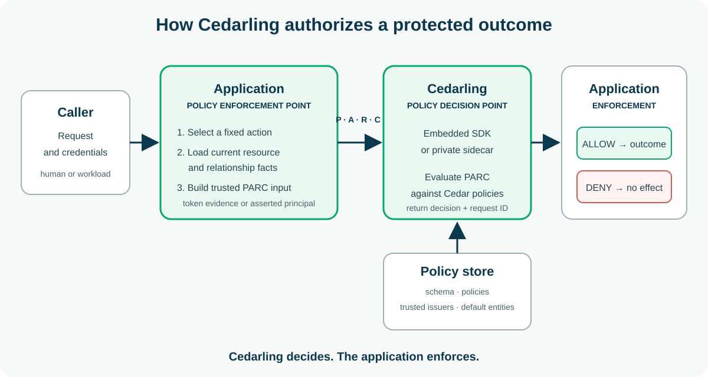

# Cedarling Tutorials

<p align="center">
  <a href="https://cedarling.dev">Cedarling.dev</a> ·
  <a href="https://cedarling.dev/learn">Tutorials</a> ·
  <a href="https://cedarling.dev/playground">Playground</a> ·
  <a href="https://docs.jans.io/stable/cedarling/">Documentation</a> ·
  <a href="https://github.com/JanssenProject/jans/tree/main/jans-cedarling">Source</a>
</p>

Fifteen independently runnable projects for learning how to integrate
[Cedarling](https://docs.jans.io/stable/cedarling/) into production-shaped
Node.js applications, most with React interfaces. Each project isolates one
authorization problem and owns its application, learner guide, dependencies,
configuration, and tests.

The applications currently mark their protected boundaries with compact
`FAKE ALLOW` traces. Their architecture diagrams show where the Cedarling
decision point is integrated during the corresponding tutorial.

## How Cedarling works

The application remains the policy enforcement point: it maps each protected
entry point to a fixed action, loads current business facts, and sends a
Principal, Action, Resource, and Context request to Cedarling. Cedarling
evaluates that request against its policy store and returns a decision; the
application releases data or performs an effect only after `ALLOW`.



Cedarling may be embedded in the application or reached through a private
sidecar. In both deployments, Cedarling decides and the application enforces;
`DENY` or evaluation failure produces no protected outcome.

## Tutorial catalog

The publication column records whether a project has a public Cedarling.dev
tutorial and matching source release. No project has been published yet.

| Project                                                                                            | Stack                                                     | Teaching objective                                                                                                                | Publication   |
| -------------------------------------------------------------------------------------------------- | --------------------------------------------------------- | --------------------------------------------------------------------------------------------------------------------------------- | ------------- |
| [P1 - Protecting a Node.js REST API with Cedarling](./p1-task-manager/)                            | Node.js, Fastify, React, SQLite                           | Authorize tenant-scoped task reads and mutations at the API effect boundary.                                                      | Not published |
| [P2 - Preventing Cross-Tenant RAG Data Leaks with Cedarling](./p2-tenantrag/)                      | Node.js, Fastify, Orama, Voyage, OpenRouter               | Authorize corpus search and every document before its text reaches generation.                                                    | Not published |
| [P3 - Cataloging and Authorizing MCP Capabilities with Cedarling](./p3-mcp-capability-governance/) | Node.js, MCP, Express, OpenRouter                         | Bind discovered MCP tools, resources, and prompts to policy-backed capability decisions.                                          | Not published |
| [P4 - Securing Editorial Publishing with Cedarling](./p4-editorial-publishing/)                    | Node.js, Next.js App Router, SQLite, React                | Bind editorial approval to the exact revision and current reviewer authority.                                                     | Not published |
| [P5 - Protecting Sensitive Fields and Data Exports with Cedarling](./p5-dataguard/)                | Node.js, Hono, React, SQLite                              | Authorize rows, fields, aggregates, export creation, revocation, and downloads independently.                                     | Not published |
| [P6 - Reauthorizing Offline Field Inspections with Cedarling](./p6-field-inspection/)              | Node.js, Fastify, React, SQLite, IndexedDB                | Reauthorize queued field inspections from current assignment facts after reconnect.                                               | Not published |
| [P7 - Securing Real-Time Collaborative Documents with Cedarling](./p7-collaborative-docs/)         | Node.js, Fastify, React, SQLite, native SSE               | Reauthorize document reads, edits, comments, sharing, and live invalidation delivery.                                             | Not published |
| [P8 - Securing File Sharing and Blocking Path Traversal with Cedarling](./p8-cedarfile/)           | Node.js, Express, React, SQLite                           | Separate policy-backed file access from native path and storage safety.                                                           | Not published |
| [P9 - Securing Realtime Chat Rooms and Events with Cedarling](./p9-cedarrealtime/)                 | Node.js, Express, Socket.IO, React, SQLite                | Reauthorize room entry, replay, delivery, reconnect, and moderation events.                                                       | Not published |
| [P10 - Authorizing Warehouse Workloads with Cedarling](./p10-warehouse-workloads/)                 | Node.js, Fastify, React, SQLite, OAuth Client Credentials | Authorize machine identities against transfer relationships and current warehouse state.                                          | Not published |
| [P11 - Securing Active-Tenant Switching in a SaaS Workspace with Cedarling](./p11-saas-workspace/) | Node.js, React Router Framework Mode, Express, PostgreSQL | Resolve authority from the active tenant and current membership, invitation, or support scope.                                    | Not published |
| [P12 - Governing Employee Record Access with Cedarling](./p12-hr-access-governance/)               | Node.js, Express, React, SQLite                           | Enforce employee-specific grants, separation of duties, and field-level HR access.                                                | Not published |
| [P13 - Protecting Grade Publication and Guardian Access with Cedarling](./p13-student-records/)    | Node.js, Express, React, SQLite                           | Authorize grade drafts, publication, student results, and narrower guardian views.                                                | Not published |
| [P14 - Governing an AI Scheduling Assistant with Cedarling](./p14-ai-scheduling-assistant/)        | Node.js, Fastify, React, SQLite                           | Treat assistant-selected tools as untrusted intent and authorize each scheduling effect from current relationships and resources. | Not published |
| [P15 - Authorizing a Multi-Party Marketplace Refund with Cedarling](./p15-marketplace/)            | Node.js, Express, React, SQLite                           | Authorize buyer, seller, support, and fraud projections and refund actions.                                                       | Not published |

## Choose a project

Start with [P1](./p1-task-manager/) for the core browser-to-API authorization
flow. Then choose a project by business scenario or teaching objective; the
projects are independently runnable rather than cumulative prerequisites.

Every project README uses the same learner-oriented structure:

- **Architecture** identifies the policy enforcement point and Cedarling
  decision point.
- **Prerequisites** lists the exact runtime, service, and credential needs.
- **Run** gives Docker and native instructions where they apply.
- **Exercise** explains the business flow and authorization problem.
- **Commands** lists the supported project scripts.
- **Verify** records the project-owned quality gates.

## Run a project

Common prerequisites are Git plus either Docker Desktop or Docker Engine with
Compose. Native development uses Node.js 24.21 or newer within 24.x and pnpm 10. Project-specific
services and provider credentials are listed in each project README.

### Windows tutorial hostnames

On Windows, check the tutorial hostnames from the repository root:

```bash
node shared/host check
```

If the check fails, open a terminal as Administrator, then install and verify
the loopback mappings:

```bash
node shared/host install
node shared/host check
```

Remove only the managed mappings with `node shared/host remove`. Linux and
macOS do not need this compatibility step, and Docker keeps using its existing
network aliases.

Fourteen projects include a Docker Compose path. From the chosen project
directory, first satisfy any credential requirements listed in its README, then
run:

```bash
docker compose up --build
```

P3 is intentionally native because its learner experience is an interactive
terminal MCP client. Follow its README for the exact startup sequence. For any
project's native path, install its locked dependencies and follow its README;
some projects also require provider credentials, PostgreSQL, or the shared
tutorial identity provider.

For native development, each project README states whether its `pnpm dev`
command supervises the shared identity provider or whether you should run the
provider separately. When separate startup is required, prepare it from the
repository root in another terminal:

```bash
pnpm --dir shared/identity-provider install --frozen-lockfile
pnpm --dir shared/identity-provider run setup
pnpm --dir shared/identity-provider dev
```

The project setup synchronizes its registered OAuth client into a private
`.env` without overwriting project-only settings. Never commit generated
credentials or local data.

## Repository structure

```text
pN-project-name/
  README.md       # architecture, exercise, commands, and verification
  package.json    # project-owned lifecycle and quality scripts
  pnpm-lock.yaml  # project-owned dependency lock
  src/ or app/    # application source
  compose.yaml    # one-command stack, except P3
shared/
  identity-provider/  # local tutorial OpenID Provider
```

Projects do not share a pnpm workspace or root lockfile. Each application and
the shared identity provider are separate packages with their own dependencies,
tests, and build output.

## Quality and maintenance

Run checks from the package that owns the code:

```bash
pnpm install --frozen-lockfile
pnpm check
pnpm audit --audit-level low
```

When a project lists `pnpm test:e2e` separately in its **Verify** section, run
that integration gate in addition to `pnpm check`.

## License

Licensed under the [Apache License 2.0](./LICENSE).
