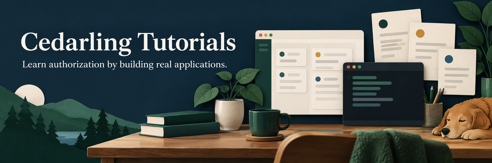

# Cedarling Tutorials



<p align="center">
  <a href="#start-with-a-task-manager">Start here</a> ·
  <a href="#find-your-next-project">Explore the projects</a> ·
  <a href="https://cedarling.dev/playground">Try the playground</a> ·
  <a href="https://docs.jans.io/stable/cedarling/">Cedarling docs</a>
</p>

Learn to turn business rules into authorization policies with **Cedarling**.
Explore fifteen runnable Node.js applications, most with React interfaces:
task boards, AI assistants, shared documents, file sharing, and more.

Each project gives you a working application, sample users or workloads, an
exercise, and tests. Start with P1 to learn the core pattern, or choose an
application that matches what you build. The projects run independently;
you do not need to complete them in order.

> [!NOTE]
> This checkout contains the tutorial starting applications. Marked authorization
> checks currently return `FAKE ALLOW`; the tutorials replace them with Cedarling
> decisions. Use these applications locally with sample data, not as production
> deployments.

## Start with a task manager

[P1](./p1-task-manager/) is a small React task board backed by a Node.js API.
It introduces a practical question: **who can read or change a task?**

With Git and Docker Desktop, or Docker Engine with Compose, installed:

```bash
git clone https://github.com/GluuFederation/cedarling-tutorials.git
cd cedarling-tutorials/p1-task-manager
docker compose up --build
```

Open **<http://localhost:17001>**. The stack starts both the application and its
identity provider; you do not need to configure hostnames or install Node.js
on your computer for this Docker quick start.

1. Sign in as **Mina**, the tenant owner, and explore the task board.
2. Compare access with **Alex**, a contributor, and **Sam**, a user from another tenant.
3. Follow P1's [Exercise](./p1-task-manager/README.md#exercise) to identify the
   rules that Cedarling will enforce.

To stop, press `Ctrl+C`, then run `docker compose down` in the same directory.
This keeps the project's stored data for your next session.

Prefer working directly with Node.js? Follow P1's
[native instructions](./p1-task-manager/README.md#run).

## Find your next project

Choose a familiar application, then explore the authorization problem behind it.
Each project title opens its own setup guide, architecture, exercise, and commands.
The publication column will link to the written tutorial when it is published
on [Cedarling.dev](https://cedarling.dev/learn).

| Project                                                                                            | Stack                                                     | What you'll learn                                                                         | Publication   |
| -------------------------------------------------------------------------------------------------- | --------------------------------------------------------- | ----------------------------------------------------------------------------------------- | ------------- |
| [P1 - Protecting a Node.js REST API with Cedarling](./p1-task-manager/)                            | Node.js, Fastify, React, SQLite                           | Keep tenants' tasks separate and control who can read or change them.                     | Not published |
| [P2 - Preventing Cross-Tenant RAG Data Leaks with Cedarling](./p2-tenantrag/)                      | Node.js, Fastify, Orama, Voyage, OpenRouter               | Check access to search results before documents reach AI generation.                      | Not published |
| [P3 - Authorizing MCP Incident Operations with Cedarling](./p3-mcp-capability-governance/)         | Node.js, MCP, Express, OpenRouter                         | Control an assistant's access to incident tools, runbooks, and triage prompts.            | Not published |
| [P4 - Securing Editorial Publishing with Cedarling](./p4-editorial-publishing/)                    | Node.js, Next.js App Router, React, SQLite                | Tie publishing approval to the reviewed revision and current reviewer authority.          | Not published |
| [P5 - Protecting Sensitive Fields and Data Exports with Cedarling](./p5-dataguard/)                | Node.js, Hono, React, SQLite                              | Protect individual records, sensitive fields, aggregates, and data exports.               | Not published |
| [P6 - Reauthorizing Offline Field Inspections with Cedarling](./p6-field-inspection/)              | Node.js, Fastify, React, SQLite, IndexedDB                | Check current assignments before accepting work saved while offline.                      | Not published |
| [P7 - Securing Real-Time Collaborative Documents with Cedarling](./p7-collaborative-docs/)         | Node.js, Fastify, React, SQLite, SSE                      | Apply changing permissions to document edits, comments, sharing, and live updates.        | Not published |
| [P8 - Securing File Sharing and Blocking Path Traversal with Cedarling](./p8-cedarfile/)           | Node.js, Express, React, SQLite                           | Combine file-access decisions with application-owned filesystem safeguards.               | Not published |
| [P9 - Securing Realtime Chat Rooms and Events with Cedarling](./p9-cedarrealtime/)                 | Node.js, Express, Socket.IO, React, SQLite                | Recheck access when people join, reconnect, receive messages, or moderate a room.         | Not published |
| [P10 - Authorizing Warehouse Workloads with Cedarling](./p10-warehouse-workloads/)                 | Node.js, Fastify, React, SQLite, OAuth Client Credentials | Authorize machine-to-machine transfers using warehouse relationships and current state.   | Not published |
| [P11 - Securing Active-Tenant Switching in a SaaS Workspace with Cedarling](./p11-saas-workspace/) | Node.js, React Router Framework Mode, Express, PostgreSQL | Reevaluate access as users switch tenants, accept invitations, or receive support access. | Not published |
| [P12 - Governing Employee Record Access with Cedarling](./p12-hr-access-governance/)               | Node.js, Express, React, SQLite                           | Grant and revoke employee-record access while separating requesters from approvers.       | Not published |
| [P13 - Protecting Grade Publication and Guardian Access with Cedarling](./p13-student-records/)    | Node.js, Express, React, SQLite                           | Separate grade editing, publication, student access, and guardian access.                 | Not published |
| [P14 - Governing an AI Scheduling Assistant with Cedarling](./p14-ai-scheduling-assistant/)        | Node.js, Fastify, React, SQLite                           | Authorize each scheduling action an assistant proposes before it changes anything.        | Not published |
| [P15 - Authorizing a Multi-Party Marketplace Refund with Cedarling](./p15-marketplace/)            | Node.js, Express, React, SQLite                           | Give buyers, sellers, support, and fraud reviewers the right views and refund actions.    | Not published |

## Run the projects your way

### With Docker

All fifteen projects include a Compose stack. Read the chosen project's
**Prerequisites**, enter its directory, then run `docker compose up --build`.
P2 needs Voyage and OpenRouter credentials. P3's interactive chat runs in a
host terminal and needs Node.js, pnpm, and an OpenRouter key even when its
services run in Docker.

### With Node.js

Use **Node.js 24.21 or newer within 24.x** and **pnpm 10**. Follow the project's
**Run** section for dependency installation, setup, and startup. P11 also needs
PostgreSQL: use the Compose-managed default or your own local database.

On macOS or Linux with nvm, run `nvm install` and `nvm use` from this repository;
`.nvmrc` selects Node.js 24.21.0. Other Node.js managers can select the same
version. Check `node --version` in the terminal used to run pnpm.

Each project generates its private application configuration in `.env` and its
identity-provider configuration in `.local/idp/.env`. Some development commands
start both processes; others use a separate identity-provider terminal.

### Local addresses and isolation

The same `localhost` addresses work in native and Docker mode. Project **PN**
uses application port **17000 + N** and identity-provider port **18000 + N**:
P1 uses `17001` / `18001`, and P15 uses `17015` / `18015`.
Each project README gives its exact URL; P3 exposes an MCP service rather than a web interface.

You can run different projects together. Stop a project's Docker stack before
running that same project natively. Each project runs its own identity provider
from shared source code, with separate registrations and cookie names.

These stacks assume a trusted local machine. Ports do not isolate browser
cookies, and a project's Docker application services share its IdP's network
namespace. Never commit generated credentials or local data.

## Explore and verify the code

Each `pN-project-name/` directory owns its source, dependencies, lockfile,
configuration, and tests. Shared identity-provider code lives in
[`shared/identity-provider/`](./shared/identity-provider/). Install dependencies
inside the package you are working on; there is no root pnpm workspace.

From that package directory:

```bash
pnpm install --frozen-lockfile
pnpm check
pnpm audit --audit-level low
```

`pnpm check` runs the package's quality checks. Also run `pnpm test:e2e` when
listed separately in the project's **Verify** section.

## Keep learning

- [Cedarling Playground](https://cedarling.dev/playground) — experiment in your browser.
- [Cedarling Learn](https://cedarling.dev/learn) — read the published learning material.
- [Cedarling documentation](https://docs.jans.io/stable/cedarling/) — explore configuration and reference guides.
- [Cedarling source](https://github.com/JanssenProject/jans/tree/main/jans-cedarling) — explore the engine behind the tutorials.

## License

[Apache License 2.0](./LICENSE).
