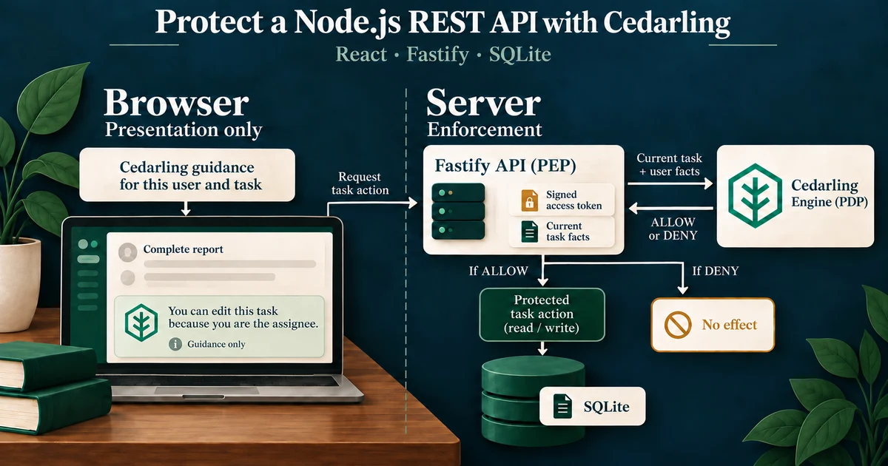
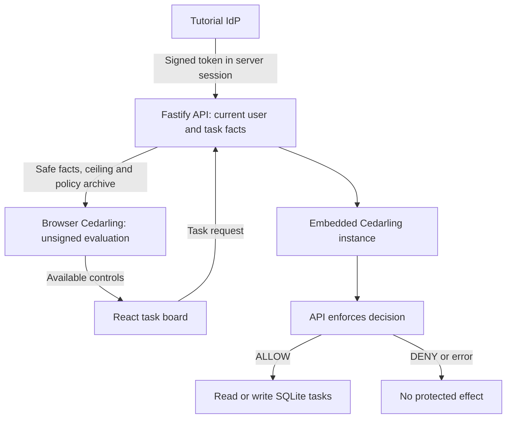

# P1 - Protecting a Node.js REST API with Cedarling



P1 is a multi-tenant task manager. Its Node.js API asks Cedarling before reading
or changing a task. The browser evaluates the same policy release to hide
unavailable controls; the server checks every protected request.

The application handles authentication, sessions, request integrity, validation,
tenant-scoped lists, and optimistic concurrency. Follow the
[tutorial](docs/tutorials.md) to add authorization to the [starting application](https://github.com/GluuFederation/cedarling-tutorials/tree/21b0832be4b31271320df992d04e9d97667d0e38/p1-task-manager).

The [tutorial helper](../shared/tools/step/README.md) copies the files
needed at each integration step.

## Architecture



## Prerequisites

- To run with Docker: Docker Desktop or Docker Engine with Compose.
- For native development and checks: Node.js 24.21 or newer within 24.x and pnpm 10.

The commands work from PowerShell, macOS terminals, and Ubuntu shells.

## Run

From `p1-task-manager/`, start the application and its own IdP:

```bash
docker compose up --build
```

Open <http://localhost:17001>. The issuer is <http://localhost:18001>. Stop the stack with `Ctrl+C`, then `docker compose down`.

For native development, run from this project directory:

```bash
pnpm --dir ../shared/identity-provider install --frozen-lockfile
pnpm install --frozen-lockfile
pnpm dev
```

`pnpm dev` prepares configuration and policies, starts this project's IdP,
and watches the browser and server together. Setup keeps the listen port aligned
with the registered application URL without resetting data.

For compiled startup, run `pnpm run setup`, `pnpm --dir ../shared/identity-provider build`,
and `pnpm build`. Keep `node --env-file=.local/idp/.env ../shared/identity-provider/dist/main.js`
running in another terminal, then run `pnpm start`.
Setup, build, and development startup validate the readable `policy-store/` source and create the ignored `.local/policy-store.cjar` archive used by the Cedarling integration.
After editing policies, restart `pnpm dev` or rebuild before `pnpm start`.
The policy store trusts only issuer `http://localhost:18001` and audience
`http://localhost:17001/api`; setup and startup reject different values.

## Exercise

Choose an account below. The sign-in page prefills its username; enter it if
needed and use any non-empty password, such as `cedarling-is-awesome`.
These credentials are for the local tutorial IdP only.

- Alex can view and edit his assigned Tenant A task, but cannot create one.
- Mina can create tasks in Tenant A and manage tasks she owns.
- Sam can view and edit his own Tenant B task, but cannot access Tenant A tasks.

Try the [direct API request](docs/tutorials.md#retry-alexs-request-then-edit-his-assigned-task)
as Alex: creating a task returns `403 forbidden`. He can still edit his assigned
task. Compare these responses with the visible controls.

To restore native fixtures, stop the app and IdP, run `pnpm reset`, then
`pnpm dev` and sign in again. Reset deletes this project's `.data` directory,
including tasks, sessions, and stored policy artifacts; configuration is preserved.
Docker uses separate volumes. To reset that stack, run
`docker compose down --volumes`, then `docker compose up --build`. This removes
the stack's application data and generated configuration, so sign in again.

## Commands

| Command          | Purpose                                                       |
| ---------------- | ------------------------------------------------------------- |
| `pnpm run setup` | Create configuration and the local policy archive             |
| `pnpm dev`       | Start the IdP and watch the browser and server                |
| `pnpm start`     | Run the built server                                          |
| `pnpm reset`     | Restore synthetic local data                                  |
| `pnpm test:e2e`  | Build and test real browser/IdP authorization                 |
| `pnpm check`     | Run formatting, lint, types, tests, build, and browser checks |

## Verify

```bash
pnpm exec playwright install chromium
pnpm check
pnpm audit --audit-level low
```

On Linux, use `pnpm exec playwright install --with-deps chromium` if browser
system libraries are missing. Browser checks use temporary credentials and data;
stop this project's running instances first so its ports are free.
