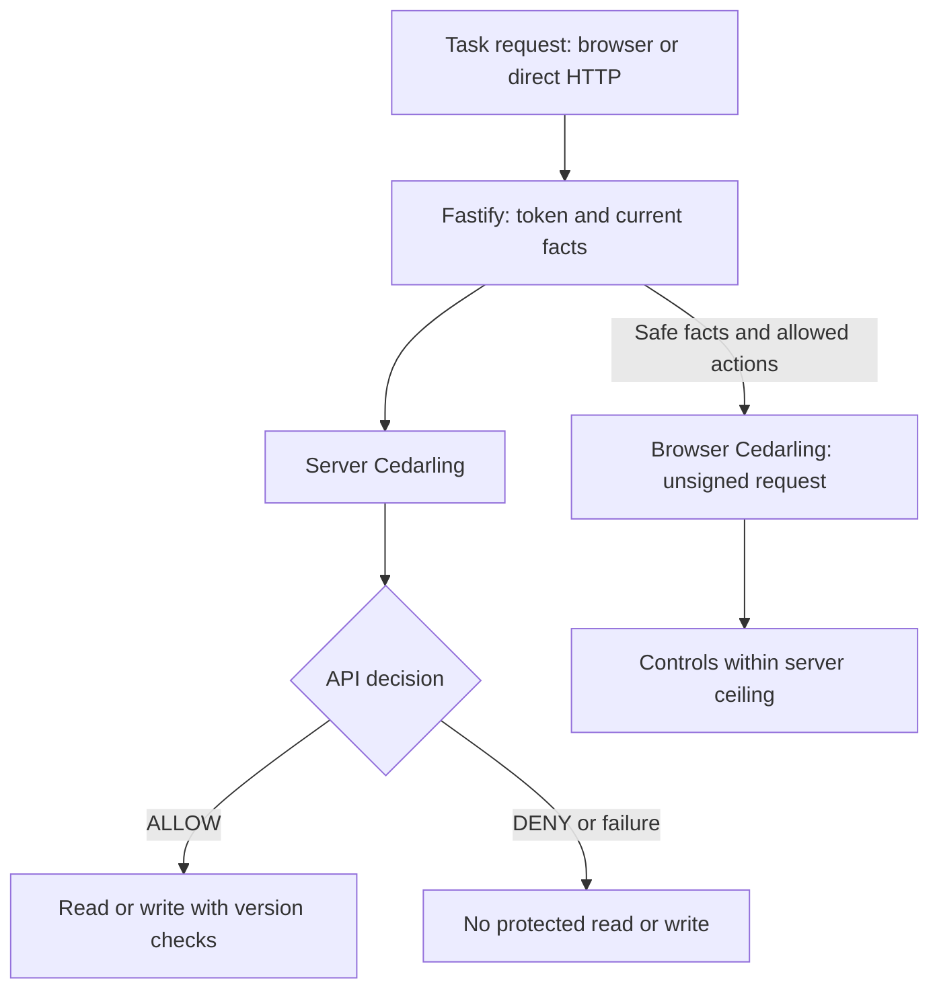

# Protect a Node.js REST API with Cedarling

Hello! In this tutorial, we'll add Cedarling to a task manager built with React
and Node.js. The app already handles sign-in. Our next step is to check what
each user is allowed to do.

Alex needs to edit his assigned tasks. Creating work for the team is Mina's job.
Our starting task manager lets Alex do both, even though he has only a
contributor role. We'll reproduce that creation request, then block it while
keeping his assigned-task edits working.

We'll also keep each tenant's tasks separate and check who owns or is assigned
to a task before allowing reads and edits. Creation, assignment, completion, and
deletion have additional role, ownership, or assurance requirements. A new
assignee must belong to the same tenant. The API will check these rules using
validated access tokens and current database facts. Browser decisions will guide
the controls; direct API requests will face the same server checks.

## Build the integration or try the finished app

- To build the integration, start with [Start the baseline app](#start-the-baseline-app). We'll add policies and server enforcement, then browser controls.
- To try the finished app, clone and run the [finished project on main](https://github.com/GluuFederation/cedarling-tutorials/tree/main/p1-task-manager) using its README, then go to [Check allowed and denied operations](#check-allowed-and-denied-operations). This version should already deny the operation we'll reproduce in the baseline.

If you're building from the starting project, open each **Required step** section
and complete its instructions before continuing. These sections contain the files
and changes we'll need.

<details>
<summary>What you'll need</summary>

- For the coding steps: Git, Node.js 24.21+ within 24.x, and pnpm 10.17.1. The project supplies its own tutorial identity provider.
- Docker with Compose is optional for running the baseline or finished example. Use native Node.js while working through the coding steps.
- Familiarity with basic TypeScript, HTTP requests, sessions, and access tokens.
- New to Cedarling? [Read the short introduction](https://cedarling.dev/learn/what-is-cedarling) when you need it.

</details>

At each copying step, open the linked file on GitHub, choose **Raw**, and copy
its full contents into the stated destination in your baseline checkout. The
short examples explain the parts we'll focus on. Create missing parent
directories first. Code paths and commands are
relative to `p1-task-manager/`; repository-level `shared/` files go one directory
above it.

## Meet the task manager and its users

The application uses React, a Fastify Node.js API, and SQLite. Its bundled IdP
uses the Node.js `oidc-provider` package for sign-in and issuing tokens. After
verifying the OIDC login, the API uses the token issuer and user identifier
(subject) to find a local user. SQLite supplies that user's current role,
tenant, and assurance level; those facts do not come from browser input or
token claims.[^1]

Assurance expresses confidence in how a user authenticated. In this lab, levels
1 and 2 are preset database values so we can try an assurance rule.
Signing in does not perform multi-factor authentication or prove that an
assurance standard has been met. We'll use three sample accounts:

- **Alex** is a Tenant A contributor with assurance level 1. He works on assigned tasks.
- **Mina** has the Tenant A owner role and assurance level 2. She manages her team's work.
- **Sam** is a Tenant B external user with assurance level 1. His work must stay separate from Tenant A.


_Each decision depends on the user's facts and the action and resource involved.
A role or tenant label alone doesn't settle it._

Cedarling is the policy decision point (PDP). The API handlers are the policy
enforcement points (PEPs): they act on Cedarling's decisions. The browser also
evaluates rules to show the right controls, but the server checks permission
again before releasing data or changing a task.

## Try the app before adding Cedarling

Let's first see what Alex can do without those permission checks. We'll send
a creation request directly to the API, then keep it for comparison after integration.

### Start the baseline app

Use a separate checkout so the exercise does not change an existing database:

```bash
git clone https://github.com/GluuFederation/cedarling-tutorials.git cedarling-p1
cd cedarling-p1
git switch --detach 21b0832be4b31271320df992d04e9d97667d0e38
cd p1-task-manager
```

With Docker, start the application and its own identity provider:

```bash
docker compose up --build
```

For Node.js startup at this commit, use two terminals. In the first:

```bash
pnpm --dir ../shared/identity-provider install --frozen-lockfile
pnpm --dir ../shared/identity-provider build
pnpm install --frozen-lockfile
pnpm run setup
node --env-file=.local/idp/.env ../shared/identity-provider/dist/main.js
```

In a second terminal, from the same project directory:

```bash
pnpm dev
```

Open `http://localhost:17001`; the IdP runs at `http://localhost:18001`.
Use one startup method at a time. Sign in as **Alex**. The development IdP
usually prefills `alex`; enter it if the field is empty. Use any non-empty
password, such as `cedarling-is-awesome`, then approve access.

### Create a task as Alex

With Alex signed in, open developer tools on the task manager page and run this
in the console:

```js
const session = await fetch("/api/session").then((r) => r.json());
const response = await fetch("/api/tasks", {
  method: "POST",
  headers: {
    "content-type": "application/json",
    "x-csrf-token": session.csrfToken,
  },
  body: JSON.stringify({
    title: "Unauthorized creation",
    description: "Must not be saved",
  }),
});
console.log(response.status, await response.json());
```

The application returns **201** and saves the task. Reload to see it.
Authentication and CSRF checks passed for Alex's session, but nothing checked
whether he may create a task.

Keep a capture of the response and saved task. Stop the application before
changing code. For native execution, stop its second terminal but keep the IdP
running. For Docker, use `Ctrl+C`, then `docker compose down`; this keeps
its data volume. The coding steps below use native startup;
if you started with Docker, install dependencies and start the native IdP using
the first-terminal commands above before continuing.

## Where should we check permission?

Alex's task was saved, so let's find the point that should have stopped it. Open the baseline's
[`src/server/app.ts`](https://github.com/GluuFederation/cedarling-tutorials/blob/21b0832be4b31271320df992d04e9d97667d0e38/p1-task-manager/src/server/app.ts)
and find `POST /api/tasks`. It authenticates the session, checks request
integrity, validates the input, then calls `database.createTask()`. None of
those checks asks whether Alex is allowed to create a task.

We'll ask Cedarling before that database write. It will evaluate
`Create` for the current user and tenant; the route must wait for `ALLOW`
before saving the task. The existing `task.create` label names the operation;
it doesn't make a permission decision.

Keep authentication, CSRF, input validation, and stale-write checks alongside
authorization. Before editing the route, we'll define the
permissions for each operation.

## Decide who can do what

We know where the check belongs. Now we'll define what it should allow, starting
with creation and extending the rules to the other task operations.

### List the rules for each task action

Every operation requires the user's current tenant to match the resource tenant.
For existing tasks, "related" means the user owns the task or is its assignee.

| Capability      | Action                                                                                                                                                                                              | Resource | Additional conditions                                                     |
| --------------- | --------------------------------------------------------------------------------------------------------------------------------------------------------------------------------------------------- | -------- | ------------------------------------------------------------------------- |
| `task.view`     | [`View`](https://github.com/GluuFederation/cedarling-tutorials/blob/main/p1-task-manager/policy-store/policies/server-access.cedar#L8 "server-view-related-task")                 | `Task`   | Related user                                                              |
| `task.create`   | [`Create`](https://github.com/GluuFederation/cedarling-tutorials/blob/main/p1-task-manager/policy-store/policies/server-access.cedar#L33 "server-owner-create-task")              | `Tenant` | Owner role, assurance at least 2                                          |
| `task.edit`     | [`Edit`](https://github.com/GluuFederation/cedarling-tutorials/blob/main/p1-task-manager/policy-store/policies/server-access.cedar#L58 "server-edit-related-task")                | `Task`   | Related user                                                              |
| `task.assign`   | [`Assign`](https://github.com/GluuFederation/cedarling-tutorials/blob/main/p1-task-manager/policy-store/policies/server-access.cedar#L83 "server-owner-assign-task")              | `Task`   | Task owner, owner role, assurance at least 2, assignee in the same tenant |
| `task.complete` | [`Complete`](https://github.com/GluuFederation/cedarling-tutorials/blob/main/p1-task-manager/policy-store/policies/server-access.cedar#L111 "server-owner-complete-related-task") | `Task`   | Related user, owner role, assurance at least 2                            |
| `task.delete`   | [`Delete`](https://github.com/GluuFederation/cedarling-tutorials/blob/main/p1-task-manager/policy-store/policies/server-access.cedar#L138 "server-owner-delete-task")             | `Task`   | Task owner, owner role, assurance at least 2                              |

The complete action identifier is, for example, `Task::Action::"Create"`.
Creation targets `Task::Tenant`: the tenant exists before the new task does.[^2]
The rule combines role, tenant, and task relationships.[^3]
An owner role is a tenant role; a task owner is the user in the task's
`ownerId`. These are different facts, and some operations require both.

### Create the policy-store files

Let's create a `policy-store/` directory at the project root using Cedarling's
[directory-based format](https://docs.jans.io/stable/cedarling/reference/cedarling-policy-store/#2-new-directory-based-format):

```text
policy-store/
  metadata.json
  schema.cedarschema
  policies/
    server-access.cedar
    browser-shadow-access.cedar
  trusted-issuers/
    tutorial-idp.json
```

<details>
<summary>Required step: Create the five policy-store files</summary>

Create each file at the path shown above and copy its complete linked contents:

- [`metadata.json`](https://github.com/GluuFederation/cedarling-tutorials/blob/main/p1-task-manager/policy-store/metadata.json) identifies the policy store and version.
- [`schema.cedarschema`](https://github.com/GluuFederation/cedarling-tutorials/blob/main/p1-task-manager/policy-store/schema.cedarschema) defines actions, entities, and request context.
- [`trusted-issuers/tutorial-idp.json`](https://github.com/GluuFederation/cedarling-tutorials/blob/main/p1-task-manager/policy-store/trusted-issuers/tutorial-idp.json) defines the trusted token mapping.
- [`policies/server-access.cedar`](https://github.com/GluuFederation/cedarling-tutorials/blob/main/p1-task-manager/policy-store/policies/server-access.cedar) holds the six server permission rules.
- [`policies/browser-shadow-access.cedar`](https://github.com/GluuFederation/cedarling-tutorials/blob/main/p1-task-manager/policy-store/policies/browser-shadow-access.cedar) holds the matching browser guidance rules.

</details>

We'll look at the schema, issuer mapping, and `Create` policy from those files next.

`metadata.json` records the store's stable ID, name, Cedar version, and policy
version `1.0.0`. The version identifies the reviewed rules; the generated
archive's SHA-256 hash identifies the exact file. `schema.cedarschema` defines the
request types the policies accept. The two policy files hold server and browser
rules in the same store. P1 supplies current facts with each request, so it needs
no default entities, templates, or custom issuers.[^4]

| Design question                     | P1 answer                                                                              |
| ----------------------------------- | -------------------------------------------------------------------------------------- |
| Where does identity come from?      | Signed access token on server; safe user fields sent to browser                        |
| Which token mapping is trusted?     | `P1TaskManager::Access_token` from P1's IdP                                            |
| Who is the browser principal?       | `Task::User`: ID, tenant, role, assurance                                              |
| Which task relationships matter?    | `Task::Task`: `tenant_id`, `owner_id`, optional `assignee_id`                          |
| What contains a new task?           | `Task::Tenant`: `tenant_id`                                                            |
| Which request facts change?         | Boundary, current user, proposed assignee's current tenant                             |
| What else must the schema describe? | Access-token attributes/tags, trusted-issuer URL, generated token context, six actions |

Server multi-issuer requests supply tokens rather than a principal entity.
`Task::Any` is an empty type for Cedar's action principal declaration, not another
user record or role. Browser requests use `Task::User`.

In the `Task` namespace, `RequestContext` declares the `boundary`, current user,
optional proposed-assignee tenant, and Cedarling token context. Each of the six
`action` declarations specifies its resource type. For example, `Create` uses
a `Tenant`:

```cedar
// policy-store/schema.cedarschema
action "Create" appliesTo {
  principal: [Any, User],
  resource: [Tenant],
  context: RequestContext
};
```

The `P1TaskManager` namespace describes the trusted issuer and the access-token
entity Cedarling builds from the signed JWT. Policies read its validated claims
through `context.tokens`.

`trusted-issuers/tutorial-idp.json` describes the tokens Cedarling will trust:

```json
{
  "name": "P1TaskManager",
  "description": "Shared Cedarling tutorial identity provider",
  "openid_configuration_endpoint": "http://localhost:18001/.well-known/openid-configuration",
  "token_metadata": {
    "access_token": {
      "trusted": true,
      "entity_type_name": "P1TaskManager::Access_token",
      "token_id": "jti",
      "required_claims": ["iss", "sub", "aud", "jti", "exp", "scope"]
    }
  }
}
```

This file sets the IdP discovery endpoint, trusts access tokens mapped to
`P1TaskManager::Access_token`, and requires the listed claims. OIDC already
validates the ID token during authentication. For authorization, we use
the access token intended for `http://localhost:17001/api`. Each server policy
matches its `sub` to the current database user and requires the action's OAuth
scope. Requesting a scope during login doesn't grant permission to perform the
operation; the policy must allow it too.

### Set the conditions for `Create`

With the request types and trusted issuer defined, we can express the creation
rule. In `policies/server-access.cedar`, the `Create` policy matches the token's subject
to the current database user and checks its audience and scope. It also requires
a matching tenant, the owner role, and the required assurance level:

```cedar
// policy-store/policies/server-access.cedar
@id("server-owner-create-task")
permit(
  principal,
  action == Task::Action::"Create",
  resource is Task::Tenant
) when {
  context.boundary == "server" &&
  context has user &&
  context has tokens &&
  context.tokens has p1taskmanager_access_token &&
  context.tokens.p1taskmanager_access_token.hasTag("sub") &&
  context.tokens.p1taskmanager_access_token.getTag("sub").contains(context.user.subject) &&
  context.tokens.p1taskmanager_access_token.hasTag("aud") &&
  context.tokens.p1taskmanager_access_token.getTag("aud").contains("http://localhost:17001/api") &&
  context.tokens.p1taskmanager_access_token has scope &&
  (context.tokens.p1taskmanager_access_token.scope == "task.create" ||
    context.tokens.p1taskmanager_access_token.scope like "task.create *" ||
    context.tokens.p1taskmanager_access_token.scope like "* task.create" ||
    context.tokens.p1taskmanager_access_token.scope like "* task.create *") &&
  context.user.tenant_id == resource.tenant_id &&
  context.user.role == "owner" &&
  context.user.assurance_level >= 2
};
```

For Alex's Tenant A creation request, the tenant check passes. His
role is `contributor` and his assurance level is `1`, so both the owner and
assurance conditions fail. Mina belongs to the same tenant with role `owner`
and assurance level `2`, so she meets those conditions. Her request must also
pass the token subject, audience, and scope checks above.

`p1taskmanager_access_token` is Cedarling's generated token-context key, not
another namespace. Policies read dynamic `sub` and `aud` claims as tags. Scope
is a space-separated list of permissions. This rule accepts `task.create` as
one complete entry, wherever it appears in that list. It doesn't
mistake `task.create.extra` for the same permission.

`policies/server-access.cedar` contains one `permit` per protected API action.
All six check the signed token's subject and API audience against trusted server
facts, require the action's exact scope, and check the tenant match. The remaining
conditions follow the capability table. Each rule has a distinct `@id` that
identifies it in decision logs.

<details>
<summary>What changes in the browser policies?</summary>

`policies/browser-shadow-access.cedar` has the same six actions and resource
types, but its rules use `context.boundary == "browser"` and the safe
`Task::User` principal built from user fields sent by the server. They check tenant, role,
assurance, and task relationships without reading JWTs. For example,
`browser-owner-create-task` shows `Create` only to a user with the owner role
and assurance of at least 2 in the selected tenant.

</details>

No matching `permit` means `DENY`. See the
[Cedar policy syntax](https://docs.cedarpolicy.com/policies/syntax-policy.html).

### Map each operation to a permission check

Each server request uses the authenticated session token and freshly loaded
database facts. The route selects the action; the browser cannot supply trusted
role, owner, or tenant values.

| Boundary             | Resource and context                                         | Protected effect                             |
| -------------------- | ------------------------------------------------------------ | -------------------------------------------- |
| `View` (list/detail) | Current task and user                                        | Return only allowed task data                |
| `Create`             | Current user's tenant and user                               | Insert with server-selected owner and tenant |
| `Edit`               | Current task and user                                        | Update fields at the expected version        |
| `Assign`             | Task/user plus proposed assignee's database tenant           | Change assignee at the expected version      |
| `Complete`           | Current task and user                                        | Complete at the expected version             |
| `Delete`             | Current task and user                                        | Delete at the expected version               |
| Browser controls     | Server-supplied user, task/tenant versions, browser boundary | Show controls within the server ceiling      |

Denied task operations return the same **404** as an absent task. Denied creation
returns **403**. If required authorization is unavailable, return **503**, never `ALLOW`.
CSRF, input validation, session refresh, and stale-write **409** checks stay in
the application.

## Add Cedarling to the app

The policies now describe the permissions. Let's connect them to the API first
and prove that Alex cannot create a task. Then we'll update the browser controls.



### Install Cedarling and build the policy archive

From `p1-task-manager/`:

```bash
pnpm add --save-exact @janssenproject/cedarling_wasm@0.0.468 fflate@0.8.3
pnpm add --save-dev --save-exact @cedar-policy/cedar-wasm@4.12.0
```

The Cedar package checks source syntax; the Cedarling SDK makes application
decisions. The examples follow the
[pinned SDK README](https://www.npmjs.com/package/@janssenproject/cedarling_wasm/v/0.0.468).

We'll use a shared builder to validate the policy files and package them for Cedarling.

<details>
<summary>Required step: Create the shared archive builder</summary>

Create these files in the repository-level `shared/` directory and copy their
complete linked contents:

- [`shared/policy-store.mjs`](https://github.com/GluuFederation/cedarling-tutorials/blob/main/shared/policy-store.mjs) validates and packages the policy store.
- [`shared/policy-store.d.mts`](https://github.com/GluuFederation/cedarling-tutorials/blob/main/shared/policy-store.d.mts) supplies the builder's TypeScript declarations.

</details>

The builder validates source paths, JSON, schema/policy syntax, and policy IDs,
then creates `.local/policy-store.cjar`, a ZIP-format archive ignored by Git:

```bash
node ../shared/policy-store.mjs
```

The builder should create `.local/policy-store.cjar` and print
`Built policy store 1.0.0 | sha256 ...` without validation errors.
Keep `policy-store/` in Git. Rebuild and restart after policy edits.

### Create one Cedarling instance for the server

With the archive built, we'll load it once and connect the decisions to all six
server operations. Copy the complete files together so their imports and types agree.

<details>
<summary>Required step: Update server authorization and its shared types</summary>

Replace these existing files with their complete linked contents:

- [`src/server/authorization-trace.ts`](https://github.com/GluuFederation/cedarling-tutorials/blob/main/p1-task-manager/src/server/authorization-trace.ts) loads Cedarling, builds requests, and records decisions.
- [`src/server/app.ts`](https://github.com/GluuFederation/cedarling-tutorials/blob/main/p1-task-manager/src/server/app.ts) enforces decisions in routes and serves browser permission data.
- [`src/server/main.ts`](https://github.com/GluuFederation/cedarling-tutorials/blob/main/p1-task-manager/src/server/main.ts) starts and closes the server's Cedarling instance.
- [`src/server/config.ts`](https://github.com/GluuFederation/cedarling-tutorials/blob/main/p1-task-manager/src/server/config.ts) supplies server configuration.
- [`tsconfig.server.json`](https://github.com/GluuFederation/cedarling-tutorials/blob/main/p1-task-manager/tsconfig.server.json) includes the shared types in the server build.

Create [`src/shared/authorization.ts`](https://github.com/GluuFederation/cedarling-tutorials/blob/main/p1-task-manager/src/shared/authorization.ts)
and copy its full contents for the shared actions, resources, and permission
envelope types. Remove `src/server/capabilities.ts`, which it replaces.

</details>

`createServerAuthorization()` loads the archive relative to `options.projectRoot`.
It registers the archive and initializes Cedarling:

```ts
// src/server/authorization-trace.ts
import { readFile } from "node:fs/promises";
import path from "node:path";
import { initFromArchiveBytes } from "@janssenproject/cedarling_wasm";

const archiveName = "policy-store.cjar";
const archive = new Uint8Array(
  await readFile(path.join(options.projectRoot, ".local", archiveName)),
);
const cedarling = await initFromArchiveBytes(
  {
    CEDARLING_APPLICATION_NAME: "P1 Task Manager server",
    CEDARLING_LOG_TYPE: "memory",
    CEDARLING_LOG_TTL: 300,
    CEDARLING_JWT_SIG_VALIDATION: "enabled",
    CEDARLING_JWT_SIGNATURE_ALGORITHMS_SUPPORTED: ["RS256"],
    CEDARLING_STRICT_SCHEMA_VALIDATION: "enabled",
    CEDARLING_TRUSTED_ISSUER_LOADER_TYPE: "SYNC",
  },
  archive,
);
```

Start the IdP first. The initialization code requires `loadedTrustedIssuersCount()`
to be at least one before serving requests. `src/server/main.ts` owns the instance,
passes its authorization functions to `buildApp()`, and arranges for `shutDown()`
when the app closes. With strict schema validation, an invalid model prevents startup.

### Check permission before saving a task

Now let's follow a creation request through the code we copied. Inside
`createServerAuthorization()`'s returned
`authorize(requestId, session, target)` function, `session` is trusted server
state and `target` describes the action and resource. This expanded `Create`
request shows what `tokenSet(session)` and `requestItem(session, target)` produce:

```ts
// src/server/authorization-trace.ts
const result = await cedarling.authorizeMultiIssuer(
  JSON.stringify({
    tokens: [
      {
        mapping: "P1TaskManager::Access_token",
        payload: session.tokens.accessToken,
      },
    ],
    action: 'Task::Action::"Create"',
    resource: {
      cedar_entity_mapping: {
        entity_type: "Task::Tenant",
        id: session.user.tenantId,
      },
      tenant_id: session.user.tenantId,
    },
    context: {
      boundary: "server",
      user: {
        id: session.user.id,
        subject: session.user.subject,
        tenant_id: session.user.tenantId,
        role: session.user.role,
        assurance_level: session.user.assuranceLevel,
      },
    },
  }),
);
for (const log of cedarling.getLogsByRequestId(result.request_id)) {
  console.info(JSON.stringify(log, null, 2));
}
if (result.response.diagnostics.errors.length > 0) {
  throw new Error("Cedarling returned policy evaluation errors");
}
return result.decision;
```

`authorizeMultiIssuer()` expects a JSON string; `JSON.stringify()` converts the
request object to that format.[^5] We use `JSON.stringify(log, null, 2)` for a
different reason: it makes nested decision logs readable in the console. For
production, review those logs and send them to access-controlled audit storage,
such as Jans Lock Server, rather than relying on console output.

The module also logs `authorization.context`, linking the Fastify request ID,
user, capability, and Cedarling request ID. It leaves Cedarling's own records
unchanged. Unexpected errors produce one `authorization.failed` record with
limited fields, without raw error messages or tokens.

In the updated `POST /api/tasks` handler, authentication, CSRF, and input checks
come first. These lines in `src/server/app.ts` then wait for authorization
before writing:

```ts
// src/server/app.ts
if (
  !(await authorize(
    session,
    { capability: capabilities.create, tenantId: session.user.tenantId },
    reply,
    403,
  ))
)
  return;
const task = database.createTask(
  session.user,
  parsed.data.title,
  parsed.data.description,
);
return reply.code(201).send({
  task,
});
```

This route's `authorize()` helper calls the Cedarling-backed authorization
function above. It sends 403 for a denied decision or 503 for an exception,
returning `undefined` in either case. The handler then exits before
`database.createTask()`; only an allowed request reaches the write and its 201
response. Existing-task routes reload the task and check their action before
returning data or changing it.

List and control-preview checks use `authorizeMultiIssuerBatch()` with shared
`tokens` and an `items` array of action/resource/context requests. The batch
handler checks `item.is_ok` before `item.unwrap()` and rejects diagnostic errors.
A successful item with `decision: false` is a valid denial, not a runtime error.
The API matches results to submitted items in order and returns only allowed
list rows.

### Test task creation as Alex and Mina

Keep the native IdP running. In the application terminal, run:

```bash
pnpm exec vite build
pnpm exec tsc -p tsconfig.server.json
pnpm start
```

On startup, you should see the policy version and SHA-256. `/health` should
return `{ "status": "ok" }`. Sign in as Alex, reload, and repeat the original
`Create` request: expect **403**, with no new task. In a separate Mina session,
the same request with a valid title returns **201**. The baseline-created
task may still exist. We haven't changed the browser buttons yet, so they still
offer operations the API now denies. We'll fix that next.

### Show the actions each user can take

The API now protects task creation. Let's make the controls reflect those
permissions too.

<details>
<summary>Required step: Update browser authorization and controls</summary>

Replace these existing files with their complete linked contents:

- [`src/web/authorization-trace.ts`](https://github.com/GluuFederation/cedarling-tutorials/blob/main/p1-task-manager/src/web/authorization-trace.ts) checks the archive and evaluates browser permissions.
- [`src/web/api.ts`](https://github.com/GluuFederation/cedarling-tutorials/blob/main/p1-task-manager/src/web/api.ts) fetches tasks and their authorization envelope.
- [`src/web/types.ts`](https://github.com/GluuFederation/cedarling-tutorials/blob/main/p1-task-manager/src/web/types.ts) connects browser data to the shared types.
- [`src/web/App.tsx`](https://github.com/GluuFederation/cedarling-tutorials/blob/main/p1-task-manager/src/web/App.tsx) updates controls as permissions or task versions change.
- [`tsconfig.web.json`](https://github.com/GluuFederation/cedarling-tutorials/blob/main/p1-task-manager/tsconfig.web.json) includes shared types in browser checks.

</details>

The server returns a list of actions it currently allows: its **decision ceiling**.
For Alex, that includes editing his assigned brief, but not creating a task.
Browser Cedarling can remove actions from this list, but cannot add permission to create.

An **authorization envelope** carries that list, task data, safe user fields,
policy ID/version/SHA-256/archive URL, subject epoch, resource
versions, evaluation time, and expiry. The exact archive is served at
`/policy-store/<sha256>.cjar`. OAuth tokens and session IDs stay on the server.

The subject epoch is a value used to detect changes in the user or their
permissions. A change in user or role requires the browser to refresh its controls.

In `src/web/authorization-trace.ts`, the loader fetches the archive from the
app's origin and checks its SHA-256 hash. It then passes the verified `bytes` to
Cedarling:

```ts
// src/web/authorization-trace.ts
const cedarling = await initFromArchiveBytes(
  {
    CEDARLING_APPLICATION_NAME: "P1 Task Manager browser",
    CEDARLING_LOG_TYPE: "memory",
    CEDARLING_LOG_TTL: 300,
    CEDARLING_JWT_SIG_VALIDATION: "disabled",
    CEDARLING_JWT_STATUS_VALIDATION: "disabled",
    CEDARLING_STRICT_SCHEMA_VALIDATION: "enabled",
  },
  bytes,
);
```

Both JWT checks are disabled only in this unsigned browser instance. It receives
no JWTs and needs no IdP discovery; the server's validation remains enabled.

The browser builds `principal` as `Task::User` from user facts checked against
`envelope.uiPrincipal`. Each item uses the shared action mapping, the resource
fields sent by the server, and `context: { boundary: "browser" }`. Assignment
also supplies the assignee's tenant from the server. The browser evaluates these requests together:

```ts
// src/web/authorization-trace.ts
const batch = await cedarling.authorizeUnsignedBatch(
  JSON.stringify({ principal, items }),
);
```

The browser checks each item's success and diagnostics. It enables a control
only when both the server ceiling and browser decision allow it. `App.tsx` uses
these results instead of maintaining a separate role-to-permission table.

The UI clears controls and refreshes when the envelope expires, the subject
changes, or a version no longer matches. If browser evaluation fails while the
envelope is current, it uses the server ceiling and logs a warning. An evaluation
failure isn't a `DENY` decision. The server still checks every attempted
operation again.

Stop only the API, then run:

```bash
pnpm exec tsc --noEmit -p tsconfig.web.json
pnpm exec vite build
pnpm start
```

After restarting, Alex should no longer see the **New task** button but should
still be able to edit his assigned brief. Mina can create, and browser logs
show unsigned Cedarling decisions. Alex's direct
`Create` request still returns **403**.

## Update startup and Docker builds

We have checked the API and browser separately. Let's finish by making native
startup and Docker builds prepare the same policy archive automatically.

<details>
<summary>Required step: Update setup, development startup, and Docker packaging</summary>

Replace these existing files with their complete linked contents:

- [`scripts/setup.mjs`](https://github.com/GluuFederation/cedarling-tutorials/blob/main/p1-task-manager/scripts/setup.mjs) prepares configuration and builds the archive.
- [`scripts/dev.mjs`](https://github.com/GluuFederation/cedarling-tutorials/blob/main/p1-task-manager/scripts/dev.mjs) starts the IdP, browser watcher, and API together.
- [`Dockerfile`](https://github.com/GluuFederation/cedarling-tutorials/blob/main/p1-task-manager/Dockerfile) builds and includes the policy archive in the image.
- [`shared/dev-supervisor.mjs`](https://github.com/GluuFederation/cedarling-tutorials/blob/main/shared/dev-supervisor.mjs), at repository root, manages development processes and readiness checks.

</details>

Update only these two entries in
[`package.json`](https://github.com/GluuFederation/cedarling-tutorials/blob/main/p1-task-manager/package.json)'s existing `scripts` object;
retain the other scripts and installed dependencies:

```json
{
  "scripts": {
    "build": "node ../shared/policy-store.mjs && vite build && tsc -p tsconfig.server.json",
    "dev": "node scripts/dev.mjs"
  }
}
```

Run `pnpm build` to produce the archive, browser bundle, and compiled server.
Stop both native terminals before switching to the supervisor or Docker.
Keep the configured issuer and API audience consistent with the policy store.
The completed `scripts/dev.mjs` prepares the project and starts its IdP,
browser watcher, and API together. With dependencies installed, run `pnpm dev`;
Docker still uses `docker compose up --build`. We no longer need the baseline's
two-terminal startup.

<details>
<summary>Troubleshooting startup and request errors</summary>

- Occupied ports: stop the other P1 checkout or startup method; native and Docker use the same ports.
- Issuer loading: start the IdP first at `http://localhost:18001`; keep the API audience at `http://localhost:17001/api`.
- Policy validation: check the named source file, complete contents, and unique policy IDs before rebuilding.
- Stale write (409): fetch the current task version instead of resending an old version.
- Browser WASM or discovery errors: use the copied browser authorization and server files; only the unsigned browser instance disables JWT checks.

</details>

## Check allowed and denied operations

Both startup paths now load the integration. We'll repeat Alex's original request
with fresh data, then check the remaining actions and their decision logs.

### Retry Alex's request, then edit his assigned task

<details>
<summary>If needed: Reset the sample data in this checkout</summary>

Stop the exercise services first. For native execution, run `pnpm reset`, then
`pnpm dev` from this checkout's `p1-task-manager/`. Reset removes `.data`,
including SQLite tasks, sessions, and stored policy artifacts; it preserves
`.env` and `.local/idp/.env`. Startup recreates fixtures. Sign in again.

For this checkout's Docker stack, run `docker compose down --volumes`, then
`docker compose up --build`. This deletes its data and generated app/IdP
configuration volumes. Do not use either reset against data you want to keep.

</details>

Use fresh exercise data for the integrated run. Sign in as Alex and repeat the
same console request used before integration. It returns **403** with
`{"error":"forbidden"}`; reloading shows no new task. A hidden **New task** button alone
would not prove this: the direct request bypasses the interface.

Open **Prepare launch brief**, edit its title, and select **Save changes**. It
succeeds because Alex is assigned this Tenant A task.

Can Alex also `Complete` that task? Compare its policy with `Edit` before
checking the matrix.

With the original sample data, check every row in this table:

| Operation  | Alex, Tenant A                                   | Mina, Tenant A                                  | Sam, Tenant B                      |
| ---------- | ------------------------------------------------ | ----------------------------------------------- | ---------------------------------- |
| `View`     | `ALLOW` assigned brief; `DENY` unassigned review | `ALLOW` owned A tasks                           | `ALLOW` own B task; `DENY` A tasks |
| `Create`   | `DENY`                                           | `ALLOW` in A                                    | `DENY`                             |
| `Edit`     | `ALLOW` assigned brief                           | `ALLOW` owned A tasks                           | `ALLOW` own B task; `DENY` A tasks |
| `Assign`   | `DENY`                                           | `ALLOW` owned task to A user; `DENY` B assignee | `DENY`                             |
| `Complete` | `DENY`                                           | `ALLOW` related A task                          | `DENY`                             |
| `Delete`   | `DENY`                                           | `ALLOW` owned A task                            | `DENY`                             |

Sign in separately as each person. Changes affect later requests: deleting a
task makes it absent, and submitting an old version causes 409. Keep these
workflow checks separate from permission denials.

### Read the decision logs

We've checked the responses; the logs let us connect them to the policies.
Formatted JSON keeps nested reasons readable. Match the
application record's `cedarlingRequestId` to Cedarling's `request_id`. One HTTP
request can produce several decisions, each with its own Cedarling ID.

Alex's denied creation request produces these Cedarling log fields:

```json
{
  "log_kind": "Decision",
  "action": "Task::Action::\"Create\"",
  "resource": "Task::Tenant::\"tenant-a\"",
  "decision": "DENY",
  "principal": [],
  "diagnostics": { "reason": [], "errors": [] }
}
```

We've shown only selected fields; keep the full log format. IDs and timestamps
will vary. `principal: []` is expected because this multi-issuer request uses tokens
as identity evidence. This `DENY` has no determining policy: no `permit` matched
and no `forbid` applied. An empty `reason` doesn't tell us which condition
failed.[^6]

For the allowed edit, expand `diagnostics.reason` and find the
`server-edit-related-task` policy annotation. Policy-store ID/version identify
the rules; startup SHA-256 identifies their archive bytes. `batch_id` groups
decisions evaluated together.

Browser logs show a label such as
`P1 browser | ALLOW | Task::Action::"Edit"` and an expandable Cedarling log object.
These record browser evaluation, not server permission. A fallback warning means
the UI used the current server ceiling instead.

Capture only sample exercise data. Don't publish tokens, cookies, CSRF values,
or session objects. Cedarling logs contain identifiers too, so review captures
before sharing them.

### Test stale permissions and authorization failures

The finished project's tests also cover permissions that change while a request
is pending. Run them in a separate checkout, which includes the integration
tests alongside the runtime code. Stop P1 services to free ports 17001 and
18001, then use a separate directory for the finished example:

```bash
git clone --branch main https://github.com/GluuFederation/cedarling-tutorials.git cedarling-p1-finished
cd cedarling-p1-finished/p1-task-manager
pnpm --dir ../shared/identity-provider install --frozen-lockfile
pnpm install --frozen-lockfile
pnpm exec playwright install chromium
pnpm check
```

On Linux, missing browser libraries may require
`pnpm exec playwright install --with-deps chromium`. The check includes formatting,
lint, types, unit tests, build, and real browser/IdP verification with disposable data.

These tests exercise actual Cedarling policies for token, scope, tenant, and
relationship failures. They check that logs stay readable and linked by request ID without
token payloads, and that unavailable authorization returns 503 without changing
protected data.

Browser checks cover stale envelopes and fallback to a current server ceiling.
They also repeat the unauthorized direct `Create` request with the real IdP and
browser Cedarling instance.[^7]

A runtime failure needs its own error event, distinct from a policy denial, and
must stop the protected operation. Stopping the IdP alone won't reliably simulate
a PDP failure because signing keys and valid tokens may already be cached.

<details>
<summary>Warning: Before deploying this application</summary>

Local HTTP and the bundled IdP's sample passwords are for learning only.
Production needs real authentication and assurance, HTTPS, protected secrets,
reviewed policy delivery, and rules for who can read logs and how long to keep them. This local
development IdP and console output are not a production identity or audit system.

Use a configured OIDC/OAuth issuer, such as [Jans Auth](https://docs.jans.io/stable/janssen-server/planning/use-cases/),
Gluu, Auth0, or Okta, rather than deploying the tutorial IdP.

For a production stack, consider Agama Lab Policy Designer for policy authoring,
Jans Auth for issuing tokens, and Lock Server for centralized decision logs.
See [Cedarling production solutions](https://cedarling.dev/solutions).

These steps were prepared on Ubuntu 24.04+. Native project checks also run in CI
on macOS and Windows. If a platform-specific step fails,
[open an issue](https://github.com/GluuFederation/cedarling-tutorials/issues).

For further reference, use the official
[Cedar policy syntax](https://docs.cedarpolicy.com/policies/syntax-policy.html) and
[Cedar schema syntax](https://docs.cedarpolicy.com/schema/human-readable-schema.html).

</details>

## What we've learned

We started with Alex creating tasks meant to be created by Mina. We've now
blocked that request while keeping his assigned-task edits working. The API
checks the token and current tenant, role, assurance, and task relationships
before each protected read or write. Browser decisions guide the controls
within the server's allowed actions; they cannot grant API permission.

To use this in your own app, choose one operation and find where the server
returns or changes its data. Load trusted facts there, ask Cedarling, and let
the operation proceed only after an allowed decision. Check both a denied
request and legitimate work, including requests that bypass the interface.

In [P2](https://cedarling.dev/learn/prevent-cross-tenant-rag-data-leaks-with-cedarling),
we'll apply that order to retrieval, checking the corpus and documents before
their text reaches an AI model.

[^1]: The bundled IdP's [`provider.ts`](https://github.com/GluuFederation/cedarling-tutorials/blob/main/shared/identity-provider/src/provider.ts) configures sign-in and tokens; [`accounts.ts`](https://github.com/GluuFederation/cedarling-tutorials/blob/main/shared/identity-provider/src/accounts.ts) supplies identity claims. P1's login callback in [`app.ts`](https://github.com/GluuFederation/cedarling-tutorials/blob/main/p1-task-manager/src/server/app.ts) maps the verified issuer and subject to a local user. [`database.ts`](https://github.com/GluuFederation/cedarling-tutorials/blob/main/p1-task-manager/src/server/database.ts) seeds and loads the role, tenant, and assurance values used here.

[^2]: Cedar recommends authorizing creation against an existing resource container because the new resource does not yet exist. Here, the tenant is that container. See [Cedar's resource-container guidance](https://docs.cedarpolicy.com/bestpractices/bp-resources-containers.html).

[^3]: RBAC means role-based access control; ReBAC means relationship-based access control. P1 also checks tenant and assurance attributes, so neither label alone describes its decision.

[^4]: [Default entities](https://docs.jans.io/stable/cedarling/reference/cedarling-policy-store/#default-entities) are shared across requests. P1 loads its changing users and tasks for each decision; it has no reusable policy slots or non-JWT issuer to configure.

[^5]: The pinned [`cedarling_wasm` JavaScript API](https://www.npmjs.com/package/@janssenproject/cedarling_wasm/v/0.0.468) accepts a JSON-string request for token-based and unsigned authorization. Converting to JSON does not make browser-supplied facts trustworthy.

[^6]: Cedar returns an empty list of determining policies when no policy permits or forbids the request. A matched `forbid` would instead appear as a determining policy. See [How Cedar authorization works](https://docs.cedarpolicy.com/auth/authorization.html).

[^7]: Full verification examples: [`test/policy-store.test.ts`](https://github.com/GluuFederation/cedarling-tutorials/blob/main/p1-task-manager/test/policy-store.test.ts), [`test/app.test.ts`](https://github.com/GluuFederation/cedarling-tutorials/blob/main/p1-task-manager/test/app.test.ts), [`test/browser-authorization.test.ts`](https://github.com/GluuFederation/cedarling-tutorials/blob/main/p1-task-manager/test/browser-authorization.test.ts), and [`e2e/task-authorization.e2e.ts`](https://github.com/GluuFederation/cedarling-tutorials/blob/main/p1-task-manager/e2e/task-authorization.e2e.ts).
