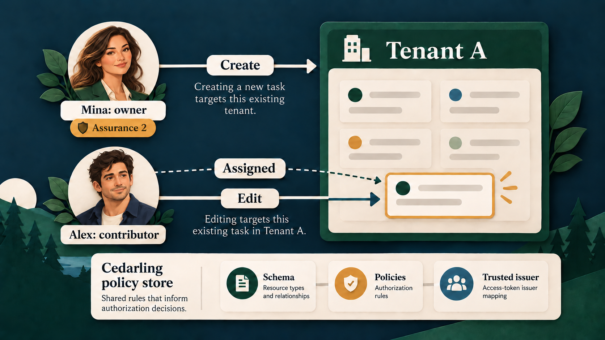
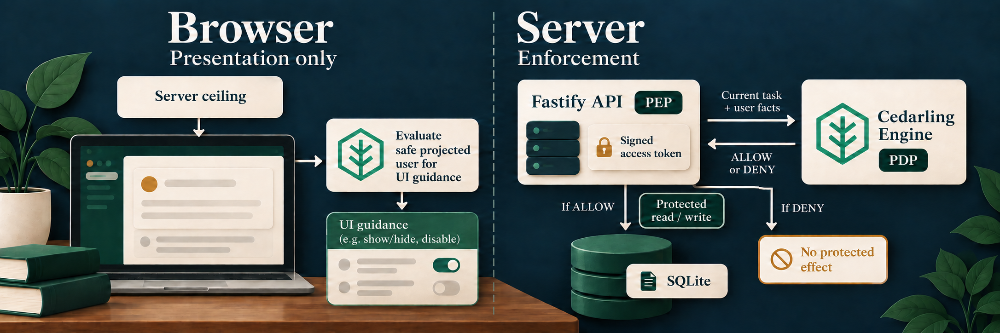
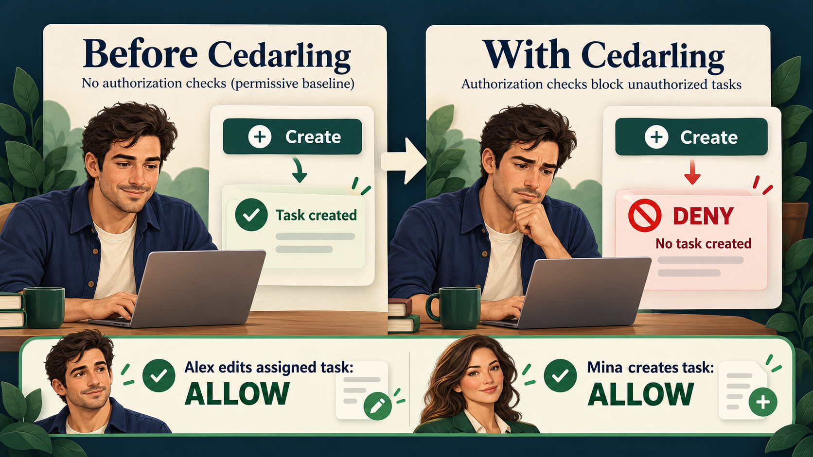
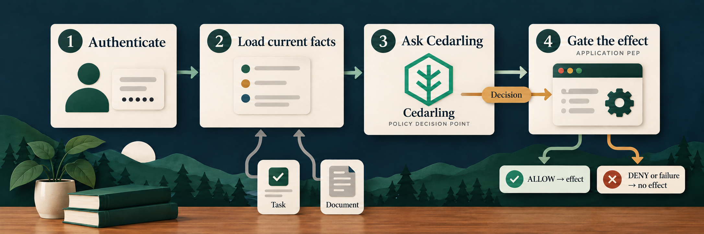

# Protect a Node.js REST API with Cedarling

<details>
<summary>Project source and prerequisites</summary>

- [Complete P1 project](https://github.com/GluuFederation/cedarling-tutorials/tree/p1-task-manager-v1.0.0/p1-task-manager) and [starting checkpoint](https://github.com/GluuFederation/cedarling-tutorials/tree/21b0832be4b31271320df992d04e9d97667d0e38/p1-task-manager).
- Install Docker with Compose, or Node.js 24.21+ within 24.x and pnpm 10.17.1. The project supplies its own tutorial identity provider.
- Local HTTP and the bundled IdP are for learning only. Production requires HTTPS and a configured OIDC/OAuth issuer, such as [Jans Auth](https://docs.jans.io/stable/janssen-server/planning/use-cases/), Gluu, Auth0, or Okta.
- I prepared these steps on Ubuntu 24.04+. Native project checks also run in CI on macOS and Windows. If a platform-specific step fails, [open an issue](https://github.com/GluuFederation/cedarling-tutorials/issues).
- New to Cedarling? [Read the short introduction](https://cedarling.dev/learn/what-is-cedarling) when you need it.
- Keep the official [Cedar policy syntax](https://docs.cedarpolicy.com/policies/syntax-policy.html) and [Cedar schema syntax](https://docs.cedarpolicy.com/schema/human-readable-schema.html) references handy for the policy-store steps.

</details>

Paths to application code below are relative to `p1-task-manager/`.

## What are we going to secure?

Signing in tells a task manager who you are. It does not answer whether you may
create work, edit another person's task, or read another organization's data.
I'll show how to describe those decisions in Cedar policies and enforce them
with Cedarling.

The application uses React, a Fastify Node.js API, and SQLite:

- **Alex** is a Tenant A contributor with assurance level 1. He works on assigned tasks.
- **Mina** is a Tenant A owner with assurance level 2. She manages her team's work.
- **Sam** is a Tenant B external user with assurance level 1. His work must stay separate from Tenant A.


_Meet the three users. A role or tenant label introduces a person; the current
action and resource determine each authorization result._

Assurance is a database fact in this tutorial. Selecting Mina demonstrates the
rule; it is not a real multi-factor authentication ceremony.

Our first problem: Alex can create a task even though creation belongs to an
assured owner. We will stop that operation while preserving his ability to edit
an assigned task.

```text
Tutorial IdP -- signed access token --> Node.js session
                                             |
React -- request --> Fastify API (PEP) <-- current user/task -- SQLite
                            |
                   Cedarling instance (PDP) <-- policy store
                            |
                   ALLOW --> protected read/write
                   DENY  --> no protected effect

API -- safe facts + decision ceiling + policy archive --> React
                Cedarling browser PDP --> visible controls
```

The **PDP** decides; the **PEP** enforces. Cedarling is the policy decision point.
The API handlers enforce its decisions. The browser evaluates presentation rules,
but the server decides again before releasing data or changing a task.

## See what happens without authorization


_The illustration shows the starting application's gap. The request in this
section provides the actual baseline evidence._

### Run the starting application

Use a separate checkout so the exercise does not change an existing database:

```bash
git clone https://github.com/GluuFederation/cedarling-tutorials.git cedarling-p1
cd cedarling-p1
git switch --detach 21b0832be4b31271320df992d04e9d97667d0e38
cd p1-task-manager
```

With Docker, start the application and its own identity provider:

```bash
docker compose up --build
```

Alternatively, use Node.js 24.21 or newer within 24.x and pnpm 10.17.1.
At this starting commit, native startup uses two terminals. In the first:

```bash
pnpm --dir ../shared/identity-provider install --frozen-lockfile
pnpm --dir ../shared/identity-provider build
pnpm install --frozen-lockfile
pnpm run setup
node --env-file=.local/idp/.env ../shared/identity-provider/dist/main.js
```

In a second terminal, from the same project directory:

```bash
pnpm dev
```

Open `http://localhost:17001`; the IdP runs at `http://localhost:18001`.
Use one startup method at a time. Sign in as **Alex**. The development IdP
usually prefills `alex`; enter it if the field is empty. Use any non-empty
password, such as `cedarling-is-awesome`, then approve access.

### Show the missing authorization check

Open developer tools on the task manager page and run this in the console:

```js
const session = await fetch("/api/session").then((r) => r.json());
const response = await fetch("/api/tasks", {
  method: "POST",
  headers: {
    "content-type": "application/json",
    "x-csrf-token": session.csrfToken,
  },
  body: JSON.stringify({
    title: "Unauthorized creation",
    description: "Must not be saved",
  }),
});
console.log(response.status, await response.json());
```

The application returns **201** and saves the task. Reload to see it.
Authentication and CSRF protection worked: this really is Alex's session. The
missing decision is whether Alex may create work.

Keep a capture of the response and saved task. Stop the application before
changing code. For Docker, use `Ctrl+C`, then `docker compose down`; this keeps
its data volume.

## Prepare the existing application for authorization

No separate feature needs adding before Cedarling. The starting application
already authenticates the session, checks CSRF and input, and uses task versions
to reject stale writes. Locate the point where its Create route goes straight
from those checks to a database write:[^6]

```ts
// src/server/app.ts (starting checkpoint)
const task = database.createTask(
  session.user,
  parsed.data.title,
  parsed.data.description,
);
```

The route's capability metadata names `task.create`; it does not authorize the
write. The baseline's `FAKE ALLOW` list trace is diagnostic, not a decision for
Create. Make no source change yet: keep the existing safeguards, then add a
fresh Cedarling decision before each protected read or effect in the steps
below.

## Who should be allowed to do what?



_Create targets the existing tenant; Edit targets a current task.[^1] The policy
store defines the vocabulary and rules used for both decisions._

### Turn the business rules into capabilities

Every operation requires the user's current tenant to match the resource tenant.
For existing tasks, “related” means the user owns the task or is its assignee.

| Capability      | Action     | Resource | Additional conditions                                                     |
| --------------- | ---------- | -------- | ------------------------------------------------------------------------- |
| `task.view`     | `View`     | Task     | Related user                                                              |
| `task.create`   | `Create`   | Tenant   | Owner role, assurance at least 2                                          |
| `task.edit`     | `Edit`     | Task     | Related user                                                              |
| `task.assign`   | `Assign`   | Task     | Task owner, owner role, assurance at least 2, assignee in the same tenant |
| `task.complete` | `Complete` | Task     | Related user, owner role, assurance at least 2                            |
| `task.delete`   | `Delete`   | Task     | Task owner, owner role, assurance at least 2                              |

The complete action identifier is, for example, `Task::Action::"Create"`.
Creation targets `Task::Tenant`: the tenant exists before the new task does.[^1]
The rule combines the user's role with current tenant and task relationships.[^2]

### Design the policy store

Create the readable source using Cedarling's
[directory-based format](https://docs.jans.io/stable/cedarling/reference/cedarling-policy-store/#2-new-directory-based-format):

```text
policy-store/
  metadata.json
  schema.cedarschema
  policies/
    server-access.cedar
    browser-shadow-access.cedar
  trusted-issuers/
    tutorial-idp.json
```

Create the five files shown above.[^7] The Create example below is complete;
the linked policy files contain the other five actions and the browser rules.

`metadata.json` gives this store its stable ID, name, Cedar version, and policy
version `1.0.0`. The version identifies a reviewed set of rules; the generated
archive's SHA-256 identifies its exact bytes. `schema.cedarschema` declares the
types of requests the policies may evaluate. The two policy files separate
server enforcement from browser guidance within the same store. Current facts
arrive in requests, so P1 needs no default entities, templates, or custom
issuers.[^3]

| Design question                     | P1 answer                                                                              |
| ----------------------------------- | -------------------------------------------------------------------------------------- |
| Where does identity come from?      | Server-held signed access token; server-projected user in the browser                  |
| Which token mapping is trusted?     | `P1TaskManager::Access_token` from P1's IdP                                            |
| Who is the browser principal?       | `Task::User`: ID, tenant, role, assurance                                              |
| Which task relationships matter?    | `Task::Task`: `tenant_id`, `owner_id`, optional `assignee_id`                          |
| What contains a new task?           | `Task::Tenant`: `tenant_id`                                                            |
| Which request facts change?         | Boundary, current user, proposed assignee's current tenant                             |
| What else must the schema describe? | Access-token attributes/tags, trusted-issuer URL, generated token context, six actions |

Server multi-issuer requests supply tokens rather than a principal entity.
`Task::Any` is an empty schema type satisfying Cedar's action principal
declaration. It is not another user record or an authorization role. Browser
requests use `Task::User`. In the `Task` namespace, `Task` carries the current
task's tenant, owner, and optional assignee; `Tenant` is the existing Create
target. `RequestContext` declares the `boundary`, current user, optional
proposed-assignee tenant, and Cedarling token context. The six `action`
declarations pair each business operation with its valid resource type. For
example, the schema makes Create a decision about a `Tenant`:

```cedar
// policy-store/schema.cedarschema
action "Create" appliesTo {
  principal: [Any, User],
  resource: [Tenant],
  context: RequestContext
};
```

The `P1TaskManager` namespace describes the trusted issuer and access-token
entity that Cedarling builds from signed JWT evidence. The policy can then
read the token's validated claims in `context.tokens`.

Configure `trusted-issuers/tutorial-idp.json`:

```json
{
  "name": "P1TaskManager",
  "description": "Shared Cedarling tutorial identity provider",
  "openid_configuration_endpoint": "http://localhost:18001/.well-known/openid-configuration",
  "token_metadata": {
    "access_token": {
      "trusted": true,
      "entity_type_name": "P1TaskManager::Access_token",
      "token_id": "jti",
      "required_claims": ["iss", "sub", "aud", "jti", "exp", "scope"]
    }
  }
}
```

This file names the IdP discovery endpoint, marks the access token trusted,
maps it to `P1TaskManager::Access_token`, and requires the listed claims. OIDC
already validates the ID token during authentication. Authorization uses
the access token intended for `http://localhost:17001/api`. Each server policy
binds its `sub` to the current database user and requires the action's OAuth
scope. Requesting scopes during login does not itself grant a business operation.

### Write the Create rule

In `policies/server-access.cedar`, the complete Create policy is:

```cedar
// policy-store/policies/server-access.cedar
@id("server-owner-create-task")
permit(
  principal,
  action == Task::Action::"Create",
  resource is Task::Tenant
) when {
  context.boundary == "server" &&
  context has user &&
  context has tokens &&
  context.tokens has p1taskmanager_access_token &&
  context.tokens.p1taskmanager_access_token.hasTag("sub") &&
  context.tokens.p1taskmanager_access_token.getTag("sub").contains(context.user.subject) &&
  context.tokens.p1taskmanager_access_token.hasTag("aud") &&
  context.tokens.p1taskmanager_access_token.getTag("aud").contains("http://localhost:17001/api") &&
  context.tokens.p1taskmanager_access_token has scope &&
  (context.tokens.p1taskmanager_access_token.scope == "task.create" ||
    context.tokens.p1taskmanager_access_token.scope like "task.create *" ||
    context.tokens.p1taskmanager_access_token.scope like "* task.create" ||
    context.tokens.p1taskmanager_access_token.scope like "* task.create *") &&
  context.user.tenant_id == resource.tenant_id &&
  context.user.role == "owner" &&
  context.user.assurance_level >= 2
};
```

`p1taskmanager_access_token` is Cedarling's generated token-context key, not
another namespace. Dynamic `sub` and `aud` claims are accessed as tags. Scope
is a space-separated list of permissions. This rule accepts `task.create` as
one complete entry—whether it is alone, first, middle, or last—and does not
mistake `task.create.extra` for the same permission.

`policies/server-access.cedar` contains one permit per protected API action.
All six bind the signed token subject and API audience to trusted server facts,
require that action's exact scope, and require a tenant match. Their remaining
conditions follow the capability table: View and Edit allow the owner or
assignee; Assign requires the assured owner and a same-tenant assignee;
Complete requires an assured related owner; Delete requires the assured task
owner. Each rule has a distinct `@id` so its contribution is visible in logs.

<details>
<summary>How the browser policy file differs</summary>

`policies/browser-shadow-access.cedar` has the same six actions and resource
types, but its rules use `context.boundary == "browser"` and the safe
`Task::User` principal projected by the server. They check tenant, role,
assurance, and task relationships without reading JWTs. For example,
`browser-owner-create-task` shows Create only to an assured owner in the
selected tenant. The server-provided decision ceiling and a fresh server
decision still control every protected API effect.

</details>

No matching permit means DENY. See the
[Cedar policy syntax](https://docs.cedarpolicy.com/policies/syntax-policy.html).

### Design the requests and their enforcement points

Each server request uses the authenticated session token and freshly loaded
database facts. The route selects the action; the browser cannot supply trusted
role, owner, or tenant values.

| Boundary         | Resource and context                                    | Protected effect                             |
| ---------------- | ------------------------------------------------------- | -------------------------------------------- |
| List / detail    | Current task and user                                   | Return only allowed task data                |
| Create           | Current user's tenant and user                          | Insert with server-selected owner and tenant |
| Edit             | Current task and user                                   | Update fields at the expected version        |
| Assign           | Task/user plus proposed assignee's database tenant      | Change assignee at the expected version      |
| Complete         | Current task and user                                   | Complete at the expected version             |
| Delete           | Current task and user                                   | Delete at the expected version               |
| Browser controls | Projected user, versioned task/tenant, browser boundary | Show controls within the server ceiling      |

Denied task operations return the same **404** as an absent task. Denied creation
returns **403**. Unavailable required authorization returns **503**, not ALLOW.
CSRF, input validation, session refresh, and stale-write **409** checks stay in
the application.

## Enforce the rules with Cedarling



_Browser guidance shapes the interface. The API keeps the signed token and
current facts, asks Cedarling, and gates the protected effect._

### Install and package the store

From `p1-task-manager/`:

```bash
pnpm add --save-exact @janssenproject/cedarling_wasm@0.0.468 fflate@0.8.3
pnpm add --save-dev --save-exact @cedar-policy/cedar-wasm@4.12.0
```

The Cedar package checks source syntax; the Cedarling SDK makes application
decisions. The examples follow the
[pinned SDK README](https://www.npmjs.com/package/@janssenproject/cedarling_wasm/v/0.0.468).

Add the integration's repository-level `shared/policy-store.mjs` builder and
`shared/policy-store.d.mts` declaration.[^8] These are not in the starting commit.
The builder validates source paths, JSON, schema/policy syntax, and policy IDs,
then creates the ignored ZIP-format `.local/policy-store.cjar`:

```bash
node ../shared/policy-store.mjs
```

Keep `policy-store/` readable in Git. Rebuild and restart after policy edits.

### Initialize once on the server

In `src/server/authorization-trace.ts`, initialize Cedarling from the archive.
This excerpt omits the surrounding artifact registration; the completed
function resolves the archive relative to `options.projectRoot`:

```ts
// src/server/authorization-trace.ts
import { readFile } from "node:fs/promises";
import path from "node:path";
import { initFromArchiveBytes } from "@janssenproject/cedarling_wasm";

const archiveName = "policy-store.cjar";
const archive = new Uint8Array(
  await readFile(path.join(options.projectRoot, ".local", archiveName)),
);
const cedarling = await initFromArchiveBytes(
  {
    CEDARLING_APPLICATION_NAME: "P1 Task Manager server",
    CEDARLING_LOG_TYPE: "memory",
    CEDARLING_LOG_TTL: 300,
    CEDARLING_JWT_SIG_VALIDATION: "enabled",
    CEDARLING_JWT_SIGNATURE_ALGORITHMS_SUPPORTED: ["RS256"],
    CEDARLING_STRICT_SCHEMA_VALIDATION: "enabled",
    CEDARLING_TRUSTED_ISSUER_LOADER_TYPE: "SYNC",
  },
  archive,
);
```

The IdP must run first. Require `loadedTrustedIssuersCount()` to be at least one before serving requests. `src/server/main.ts` owns this instance, passes the authorization functions to `buildApp()`, and calls `shutDown()` on application closure. Strict schema validation makes an invalid loaded model a startup error.[^9]

### Ask Cedarling for a signed decision before the write

Inside the server authorization function, `session` is trusted server state.
The following expanded Create request illustrates the shape produced by
`tokenSet(session)` and `requestItem(session, target)` in the completed file:

```ts
// src/server/authorization-trace.ts
const result = await cedarling.authorizeMultiIssuer(
  JSON.stringify({
    tokens: [
      {
        mapping: "P1TaskManager::Access_token",
        payload: session.tokens.accessToken,
      },
    ],
    action: 'Task::Action::"Create"',
    resource: {
      cedar_entity_mapping: {
        entity_type: "Task::Tenant",
        id: session.user.tenantId,
      },
      tenant_id: session.user.tenantId,
    },
    context: {
      boundary: "server",
      user: {
        id: session.user.id,
        subject: session.user.subject,
        tenant_id: session.user.tenantId,
        role: session.user.role,
        assurance_level: session.user.assuranceLevel,
      },
    },
  }),
);
for (const log of cedarling.getLogsByRequestId(result.request_id)) {
  console.info(JSON.stringify(log, null, 2));
}
if (result.response.diagnostics.errors.length > 0) {
  throw new Error("Cedarling returned policy evaluation errors");
}
return result.decision;
```

`authorizeMultiIssuer()` takes a JSON string, so `JSON.stringify()` serializes
the request object into the format this Cedarling JavaScript method expects.[^4]
The `JSON.stringify(log, null, 2)` call is different: it prints nested decision
evidence legibly in this local lab. In production, send reviewed, access-
controlled decision logs to centralized audit storage such as Jans Lock Server
instead of relying on a console.

The module also emits `authorization.context`, linking the Fastify request ID,
actor, capability, and Cedarling request ID. Native Cedarling records remain
unchanged. Unexpected errors produce one bounded `authorization.failed` record;
arbitrary exception messages and raw tokens are not printed.

In `src/server/app.ts`, run this after authentication and validation, but before `database.createTask()`. The route helper maps false to 403 and an exception to 503. Existing-task routes reload their resource and use their own action before reading or mutating it. Replace permissive traces rather than leaving unguarded effects alongside Cedarling calls.

For lists and control previews, call `authorizeMultiIssuerBatch()` with shared
`tokens` and an `items` array of action/resource/context requests. Check
`item.is_ok` before `item.unwrap()` and reject diagnostic errors. A successful
item with `decision: false` is a valid denial, not a runtime error. Associate
results with submitted items in order and return only allowed list rows.

### Add browser guidance without transferring authority

Return an authorization envelope beside task data: safe user projection, server decision ceiling, policy ID/version/SHA-256/archive URL, subject epoch, resource versions, evaluation time, and expiry. Serve the exact archive at `/policy-store/<sha256>.cjar`. OAuth tokens and session IDs stay on the server.

In `src/web/authorization-trace.ts`, fetch that same-origin archive and verify
its digest before initialization:

```ts
// src/web/authorization-trace.ts
const cedarling = await initFromArchiveBytes(
  {
    CEDARLING_APPLICATION_NAME: "P1 Task Manager browser",
    CEDARLING_LOG_TYPE: "memory",
    CEDARLING_LOG_TTL: 300,
    CEDARLING_JWT_SIG_VALIDATION: "disabled",
    CEDARLING_JWT_STATUS_VALIDATION: "disabled",
    CEDARLING_STRICT_SCHEMA_VALIDATION: "enabled",
  },
  bytes,
);
```

Both JWT checks are disabled only in this unsigned browser instance. It receives
no JWTs and needs no IdP discovery; the server's validation remains enabled.

Build `principal` as `Task::User` from `envelope.uiPrincipal`. Each item uses the
shared action mapping, the projected resource, and
`context: { boundary: "browser" }`. Assignment also supplies the projected
assignee tenant. Evaluate them together:

```ts
// src/web/authorization-trace.ts
const batch = await cedarling.authorizeUnsignedBatch(
  JSON.stringify({ principal, items }),
);
```

Check item success and diagnostics. A control is enabled only when **server
ceiling AND browser decision** allow it. `App.tsx` consumes these results, not a
parallel role-to-permission table.

An expired envelope, changed subject, or mismatched version clears controls and
causes a refresh. When browser evaluation fails with a current envelope, retain
the server ceiling and warn. This is not a fabricated DENY; every attempted
effect still requires a fresh server decision.

The shared action names and envelope types belong in
`src/shared/authorization.ts`; move their callers from the baseline's
`src/server/capabilities.ts` and remove that old file. Connect the browser
authorization function to the API client, response types, and React controls
without adding another permission table.[^10]

## Finish the runnable integration

The decisions now guard the task manager. Complete its startup paths so each
one builds and loads the same policy archive: call the shared builder during
`scripts/setup.mjs` and before the application build, then include the archive
in the Docker image.[^11] The build script in `package.json` is:

```json
{
  "scripts": {
    "build": "node ../shared/policy-store.mjs && vite build && tsc -p tsconfig.server.json"
  }
}
```

Keep the configured issuer and API audience aligned with the policy store.
The completed `scripts/dev.mjs` prepares the project and starts its IdP,
browser watcher, and API together. With dependencies installed, run `pnpm dev`;
Docker still uses `docker compose up --build`. The baseline's two-terminal
instructions no longer apply to this completed development script.

## Verify that the right operations succeed



_These are the expected outcomes. Repeat the requests and inspect the real
responses and Cedarling logs below to prove them._

### Repeat the original request and a legitimate operation

Use fresh exercise data for the integrated run. Sign in as Alex and repeat the
same console request used before integration. It returns **403** with
`{"error":"forbidden"}`; reloading shows no new task. A hidden Create button alone
would not prove this: the direct request bypasses the interface.

Open **Prepare launch brief**, edit its title, and select **Save changes**. It
succeeds because Alex is assigned this Tenant A task. Authorization must preserve
legitimate work.

On the original seed data, check the complete matrix:

| Operation | Alex, Tenant A                               | Mina, Tenant A                              | Sam, Tenant B                  |
| --------- | -------------------------------------------- | ------------------------------------------- | ------------------------------ |
| View      | ALLOW assigned brief; DENY unassigned review | ALLOW owned A tasks                         | ALLOW own B task; DENY A tasks |
| Create    | DENY                                         | ALLOW in A                                  | DENY                           |
| Edit      | ALLOW assigned brief                         | ALLOW owned A tasks                         | ALLOW own B task; DENY A tasks |
| Assign    | DENY                                         | ALLOW owned task to A user; DENY B assignee | DENY                           |
| Complete  | DENY                                         | ALLOW related A task                        | DENY                           |
| Delete    | DENY                                         | ALLOW owned A task                          | DENY                           |

Sign in separately as each person. State changes affect later observations:
deleting a task makes it absent, while submitting an old version causes 409.
Test domain conditions separately from policy denials.

### Explain the decision evidence

Server logs use formatted JSON so nested reasons are visible. The small
application record's `cedarlingRequestId` matches a native `request_id`. One HTTP
request can produce several decisions, each with its own Cedarling ID.

The denied Alex creation contains these native fields:

```json
{
  "log_kind": "Decision",
  "action": "Task::Action::\"Create\"",
  "resource": "Task::Tenant::\"tenant-a\"",
  "decision": "DENY",
  "principal": [],
  "diagnostics": { "reason": [], "errors": [] }
}
```

This is a selected-field excerpt, not a replacement log format. IDs and timestamps
vary. `principal: []` is expected for this multi-issuer request: token evidence
represents identity. This DENY has no determining policy: no permit matched and
no forbid applied. The empty `reason` does not identify which condition failed.[^5]
Compare the Create rule with trusted facts to explain Alex's missing owner role
and assurance.

For the legitimate edit, expand `diagnostics.reason` and find the
`server-edit-related-task` policy annotation. Policy-store ID/version identify
the rules; startup SHA-256 identifies their archive bytes. `batch_id` groups
decisions evaluated together.

Browser logs show a label such as
`P1 browser | ALLOW | Task::Action::"Edit"` and an expandable native object.
They prove browser evaluation, not server permission. A fallback warning means
the UI used the current server ceiling instead.

Record only synthetic evidence. Do not publish tokens, cookies, CSRF values, or
session objects. Native logs contain identifiers, so review captures before use.

### Prove stale and unavailable decisions stay safe

Stop P1 services to free ports 17001 and 18001, then run:

```bash
pnpm exec playwright install chromium
pnpm check
```

On Linux, missing browser libraries may require
`pnpm exec playwright install --with-deps chromium`. The check includes formatting,
lint, types, unit tests, build, and real browser/IdP verification with disposable data.

- `test/policy-store.test.ts` evaluates actual Cedarling rules, including token,
  scope, tenant, and relationship failures. It checks readable, correlated logs
  without token payloads.
- `test/app.test.ts` injects unavailable authorization and proves 503 responses
  preserve protected state. `test/browser-authorization.test.ts` checks stale
  envelopes and the current-server-ceiling fallback.
- `e2e/task-authorization.e2e.ts` uses the real IdP and browser Cedarling
  instance, then repeats the unauthorized direct Create request.[^12]

A runtime failure is not a policy denial. Keep its separate error event and
fail closed on the server. Stopping only the IdP is not a reliable PDP-failure
simulation: signing keys and valid tokens may already be cached.

## Apply the pattern to your own application



_Use the same sequence around any effect your application must protect._

Reuse this sequence: authenticate, load current facts, select a fixed business
action, ask Cedarling, then gate the effect. Browser decisions improve the
experience without becoming the authority over server data.

Follow `policy-store/`, the two `authorization-trace.ts` files, and the tests
in the [completed P1 project](https://github.com/GluuFederation/cedarling-tutorials/tree/p1-task-manager-v1.0.0/p1-task-manager)
to trace each rule to a protected effect.

Production needs real authentication and assurance, HTTPS, protected secrets,
reviewed policy distribution, and appropriate log access/retention. This local
development IdP and console output are not a production identity or audit system.

For a production stack, consider Agama Lab Policy Designer for policy authoring,
Jans Auth for token issuance, and Lock Server for centralized decision logs.
See [Cedarling production solutions](https://cedarling.dev/solutions).

Next, P2 applies the same approach to retrieval: authorize the corpus and
candidate documents before loading protected text or sending it to an AI model.

---

[^1]: Cedar recommends authorizing creation against an existing resource container because the new resource does not yet exist. Here, the tenant is that container. See [Cedar's resource-container guidance](https://docs.cedarpolicy.com/bestpractices/bp-resources-containers.html).

[^2]: RBAC names role-based access control; ReBAC names relationship-based access control. P1's concrete rule also checks tenant and assurance attributes, so neither label alone describes its decision.

[^3]: [Default entities](https://docs.jans.io/stable/cedarling/reference/cedarling-policy-store/#default-entities) are shared across requests. P1 loads its changing users and tasks for each decision; it has no reusable policy slots or non-JWT issuer to configure.

[^4]: The pinned [`cedarling_wasm` JavaScript API](https://www.npmjs.com/package/@janssenproject/cedarling_wasm/v/0.0.468) accepts a JSON-string request for token-based and unsigned authorization. Serialization does not make browser-supplied facts trustworthy.

[^5]: Cedar returns an empty list of determining policies when no policy permits or forbids the request. A matched `forbid` would instead appear as a determining policy. See [How Cedar authorization works](https://docs.cedarpolicy.com/auth/authorization.html).

[^6]: Starting-checkpoint source: [`src/server/app.ts`](https://github.com/GluuFederation/cedarling-tutorials/blob/21b0832be4b31271320df992d04e9d97667d0e38/p1-task-manager/src/server/app.ts) contains the direct Create write; [`src/server/authorization-trace.ts`](https://github.com/GluuFederation/cedarling-tutorials/blob/21b0832be4b31271320df992d04e9d97667d0e38/p1-task-manager/src/server/authorization-trace.ts) contains the fake list trace.

[^7]: Complete tagged policy-store source: [`metadata.json`](https://github.com/GluuFederation/cedarling-tutorials/blob/p1-task-manager-v1.0.0/p1-task-manager/policy-store/metadata.json), [`schema.cedarschema`](https://github.com/GluuFederation/cedarling-tutorials/blob/p1-task-manager-v1.0.0/p1-task-manager/policy-store/schema.cedarschema), [`tutorial-idp.json`](https://github.com/GluuFederation/cedarling-tutorials/blob/p1-task-manager-v1.0.0/p1-task-manager/policy-store/trusted-issuers/tutorial-idp.json), [`server-access.cedar`](https://github.com/GluuFederation/cedarling-tutorials/blob/p1-task-manager-v1.0.0/p1-task-manager/policy-store/policies/server-access.cedar), and [`browser-shadow-access.cedar`](https://github.com/GluuFederation/cedarling-tutorials/blob/p1-task-manager-v1.0.0/p1-task-manager/policy-store/policies/browser-shadow-access.cedar).

[^8]: Add the repository-level [`shared/policy-store.mjs`](https://github.com/GluuFederation/cedarling-tutorials/blob/p1-task-manager-v1.0.0/shared/policy-store.mjs) and [`shared/policy-store.d.mts`](https://github.com/GluuFederation/cedarling-tutorials/blob/p1-task-manager-v1.0.0/shared/policy-store.d.mts), one level above `p1-task-manager/`.

[^9]: Complete server integration: [`src/server/authorization-trace.ts`](https://github.com/GluuFederation/cedarling-tutorials/blob/p1-task-manager-v1.0.0/p1-task-manager/src/server/authorization-trace.ts), [`src/server/app.ts`](https://github.com/GluuFederation/cedarling-tutorials/blob/p1-task-manager-v1.0.0/p1-task-manager/src/server/app.ts), and [`src/server/main.ts`](https://github.com/GluuFederation/cedarling-tutorials/blob/p1-task-manager-v1.0.0/p1-task-manager/src/server/main.ts).

[^10]: Complete shared and browser integration: [`src/shared/authorization.ts`](https://github.com/GluuFederation/cedarling-tutorials/blob/p1-task-manager-v1.0.0/p1-task-manager/src/shared/authorization.ts), [`src/web/authorization-trace.ts`](https://github.com/GluuFederation/cedarling-tutorials/blob/p1-task-manager-v1.0.0/p1-task-manager/src/web/authorization-trace.ts), [`src/web/api.ts`](https://github.com/GluuFederation/cedarling-tutorials/blob/p1-task-manager-v1.0.0/p1-task-manager/src/web/api.ts), [`src/web/types.ts`](https://github.com/GluuFederation/cedarling-tutorials/blob/p1-task-manager-v1.0.0/p1-task-manager/src/web/types.ts), and [`src/web/App.tsx`](https://github.com/GluuFederation/cedarling-tutorials/blob/p1-task-manager-v1.0.0/p1-task-manager/src/web/App.tsx).

[^11]: Completed startup and packaging files: [`scripts/setup.mjs`](https://github.com/GluuFederation/cedarling-tutorials/blob/p1-task-manager-v1.0.0/p1-task-manager/scripts/setup.mjs), [`package.json`](https://github.com/GluuFederation/cedarling-tutorials/blob/p1-task-manager-v1.0.0/p1-task-manager/package.json), [`Dockerfile`](https://github.com/GluuFederation/cedarling-tutorials/blob/p1-task-manager-v1.0.0/p1-task-manager/Dockerfile), [`src/server/config.ts`](https://github.com/GluuFederation/cedarling-tutorials/blob/p1-task-manager-v1.0.0/p1-task-manager/src/server/config.ts), [`scripts/dev.mjs`](https://github.com/GluuFederation/cedarling-tutorials/blob/p1-task-manager-v1.0.0/p1-task-manager/scripts/dev.mjs), and [`shared/dev-supervisor.mjs`](https://github.com/GluuFederation/cedarling-tutorials/blob/p1-task-manager-v1.0.0/shared/dev-supervisor.mjs).

[^12]: Full verification examples: [`test/policy-store.test.ts`](https://github.com/GluuFederation/cedarling-tutorials/blob/p1-task-manager-v1.0.0/p1-task-manager/test/policy-store.test.ts), [`test/app.test.ts`](https://github.com/GluuFederation/cedarling-tutorials/blob/p1-task-manager-v1.0.0/p1-task-manager/test/app.test.ts), [`test/browser-authorization.test.ts`](https://github.com/GluuFederation/cedarling-tutorials/blob/p1-task-manager-v1.0.0/p1-task-manager/test/browser-authorization.test.ts), and [`e2e/task-authorization.e2e.ts`](https://github.com/GluuFederation/cedarling-tutorials/blob/p1-task-manager-v1.0.0/p1-task-manager/e2e/task-authorization.e2e.ts).
