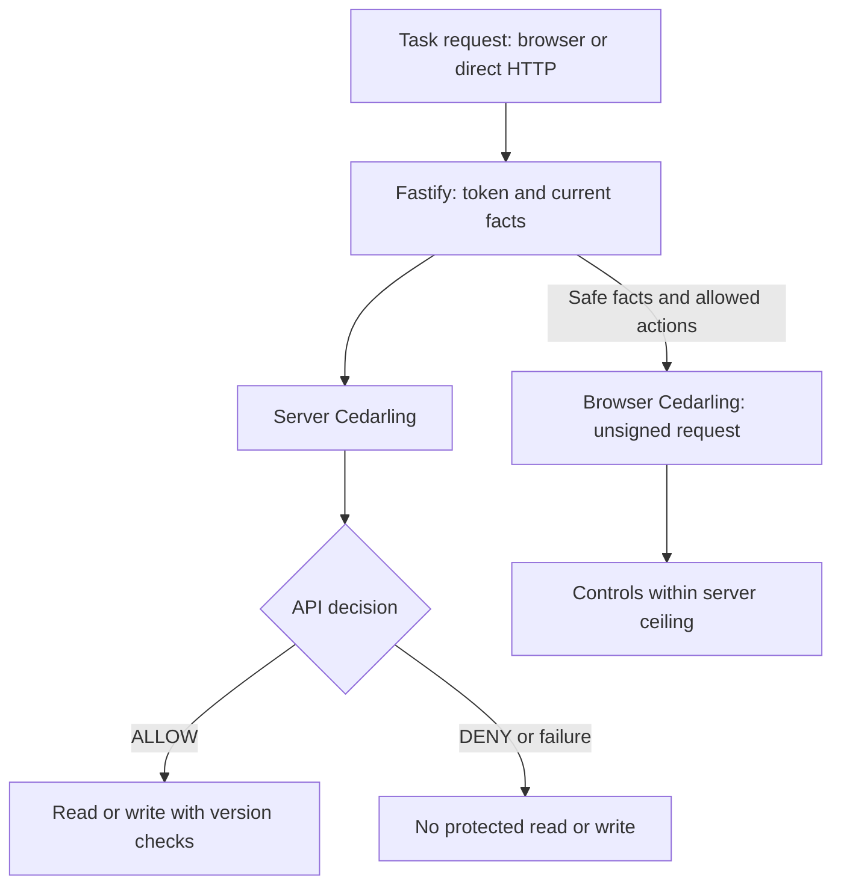

# Protect a Node.js REST API with Cedarling

Hello! In this tutorial, we'll add Cedarling to a task manager built with React
and Node.js. The app already handles sign-in. Our next step is to check what
each user is allowed to do.

Alex needs to edit his assigned tasks. Creating work for the team is Mina's job.
Our starting task manager lets Alex do both, even though he has only a
contributor role. We'll reproduce that creation request, then block it while
keeping his assigned-task edits working.

We'll also keep each tenant's tasks separate and check who owns or is assigned
to a task before allowing reads and edits. Creation, assignment, completion, and
deletion have additional role, ownership, or assurance requirements. A new
assignee must belong to the same tenant. We'll use
[Token-Based Access Control (TBAC)](https://docs.jans.io/stable/cedarling/#proof-based-authorization-token-based-access-control-tbac):
Cedarling validates the access token and evaluates it alongside current database
facts supplied by the API. Browser decisions will guide the controls; direct API
requests will face the same server checks.

## Start from the baseline or run the finished task manager

- To build the integration, use native Node.js and start with [Start the baseline app](#start-the-baseline-app). We'll add policies and server enforcement, then browser controls and their tests.
- To try the finished app, clone and run the [finished project on main](https://github.com/GluuFederation/cedarling-tutorials/tree/main/p1-task-manager) using its README, then go to [Check allowed and denied operations](#check-allowed-and-denied-operations). This version should already deny the operation we'll reproduce in the baseline.

If you're building from the starting project, open each **Required step** section
and complete its instructions before continuing. These sections contain the files
and changes we'll need.

<details>
<summary>Before you start</summary>

- For the coding steps: Git, Node.js 24.21+ within 24.x, and pnpm 10.17.1. The project supplies its own tutorial identity provider.
- Docker with Compose is optional for running the baseline or finished example. Use native Node.js while working through the coding steps.
- Familiarity with basic TypeScript, HTTP requests, sessions, and access tokens.
- New to Cedarling? [Read the short introduction](https://cedarling.dev/learn/what-is-cedarling) when you need it.

</details>

Run the commands from `p1-task-manager/`. Paths under `shared/` are relative to
the repository root.

## Meet the task manager and its users

The application uses React, a Fastify Node.js API, and SQLite. Its bundled IdP
uses the Node.js `oidc-provider` package for sign-in and issuing tokens. After
verifying the OIDC login, the API uses the token issuer and user identifier
(subject) to find a local user. SQLite supplies that user's current role,
tenant, and assurance level; those facts do not come from browser input or
token claims.[^1]

Assurance expresses confidence in how a user authenticated. In this lab, levels
1 and 2 are preset database values so we can try an assurance rule.
Signing in does not perform multi-factor authentication or prove that an
assurance standard has been met. We'll use three sample accounts:

- **Alex** is a Tenant A contributor with assurance level 1. He works on assigned tasks.
- **Mina** has the Tenant A owner role and assurance level 2. She manages her team's work.
- **Sam** is a Tenant B external user with assurance level 1. His work must stay separate from Tenant A.


_Mina and Alex work in Tenant A. Sam works in Tenant B with the `external` role;
the illustration labels him as a user._

Cedarling is the policy decision point (PDP). The API handlers are the policy
enforcement points (PEPs): they act on Cedarling's decisions. The browser also
evaluates rules to show the right controls, but the server checks permission
again before releasing data or changing a task.

## Try the app before adding Cedarling

Let's first see what Alex can do without those permission checks. We'll send
a creation request directly to the API, then keep it for comparison after integration.

### Start the baseline app

Use a separate checkout for P1. Keep it if you later follow another project;
start that tutorial in its own checkout so shared files and exercise data stay separate:

```bash
git clone https://github.com/GluuFederation/cedarling-tutorials.git cedarling-p1
cd cedarling-p1
git switch --detach 21b0832be4b31271320df992d04e9d97667d0e38
cd p1-task-manager

# Prepare the tutorial steps.
git restore --source=858d9a43cd47925d612ba292d0d35ba6b288952e --worktree -- ../shared/tools/step
node ../shared/tools/step/run.mjs p1 init --source 858d9a43cd47925d612ba292d0d35ba6b288952e
```

For the coding path, start Node.js in two terminals.[^7] In the first:

```bash
pnpm --dir ../shared/identity-provider install --frozen-lockfile
pnpm --dir ../shared/identity-provider build
pnpm install --frozen-lockfile
pnpm run setup
node --env-file=.local/idp/.env ../shared/identity-provider/dist/main.js
```

In a second terminal, from the same project directory:

```bash
pnpm dev
```

<details>
<summary>Optional: Run the starting app with Docker</summary>

Instead of the native commands above, run:

```bash
docker compose up --build
```

This starts the app and its IdP together. For Docker-only exploration, you can
skip the two helper commands in the cloning snippet. Run them before starting
the coding steps. Native and Docker execution use the same ports and keep
separate databases and sessions; run only one stack at a time.

</details>

Open `http://localhost:17001`; the IdP runs at `http://localhost:18001`.
Use one startup method at a time. Sign in as **Alex**. The development IdP
usually prefills `alex`; enter it if the field is empty. Use any non-empty
password, such as `cedarling-is-awesome`, then approve access.

### Create a task as Alex

With Alex signed in, open developer tools on the task manager page and run this
in the console:

```js
const session = await fetch("/api/session").then((r) => r.json());
const response = await fetch("/api/tasks", {
  method: "POST",
  headers: {
    "content-type": "application/json",
    "x-csrf-token": session.csrfToken,
  },
  body: JSON.stringify({
    title: "Unauthorized creation",
    description: "Must not be saved",
  }),
});
console.log(response.status, await response.json());
```

The application returns **201** and saves the task. Reload to see it.
Authentication and CSRF checks passed for Alex's session, but nothing checked
whether he may create a task.

Keep a capture of the response and saved task. Stop the application before
changing code. For native execution, stop its second terminal but keep the IdP
running.

<details>
<summary>If using Docker: Switch to native development</summary>

Stop the stack with `Ctrl+C`, then run `docker compose down` to keep its data
volume. Run the helper setup commands if you skipped them, then install
dependencies and start the native IdP using the first-terminal commands above.
Sign in again when the native app starts. Tasks created in Docker remain in
that stack's database.

</details>

## Where should we check permission?

Alex's task was saved, so let's find the point that should have stopped it. Open the baseline's
[`src/server/app.ts`](https://github.com/GluuFederation/cedarling-tutorials/blob/21b0832be4b31271320df992d04e9d97667d0e38/p1-task-manager/src/server/app.ts)
and find `POST /api/tasks`. It authenticates the session, checks request
integrity, validates the input, then calls `database.createTask()`. None of
those checks asks whether Alex is allowed to create a task.

We'll ask Cedarling before that database write. It will evaluate
`Create` for the current user and tenant; the route must wait for `ALLOW`
before saving the task. The existing `task.create` label names the operation;
it doesn't make a permission decision.

Keep authentication, CSRF, input validation, and stale-write checks alongside
authorization. Before editing the route, we'll define the
permissions for each operation.

## Decide who can do what

We know where the check belongs. Now we'll define what it should allow, starting
with creation and extending the rules to the other task operations.

### List the rules for each task action

Every operation requires the user's current tenant to match the resource tenant.
For existing tasks, "related" means the user owns the task or is its assignee.

| Capability      | Action                                                                                                                                                                            | Resource | Additional conditions                                                     |
| --------------- | --------------------------------------------------------------------------------------------------------------------------------------------------------------------------------- | -------- | ------------------------------------------------------------------------- |
| `task.view`     | [`View`](https://github.com/GluuFederation/cedarling-tutorials/blob/main/p1-task-manager/policy-store/policies/server-access.cedar#L8 "server-view-related-task")                 | `Task`   | Related user                                                              |
| `task.create`   | [`Create`](https://github.com/GluuFederation/cedarling-tutorials/blob/main/p1-task-manager/policy-store/policies/server-access.cedar#L33 "server-owner-create-task")              | `Tenant` | Owner role, assurance at least 2                                          |
| `task.edit`     | [`Edit`](https://github.com/GluuFederation/cedarling-tutorials/blob/main/p1-task-manager/policy-store/policies/server-access.cedar#L58 "server-edit-related-task")                | `Task`   | Related user                                                              |
| `task.assign`   | [`Assign`](https://github.com/GluuFederation/cedarling-tutorials/blob/main/p1-task-manager/policy-store/policies/server-access.cedar#L83 "server-owner-assign-task")              | `Task`   | Task owner, owner role, assurance at least 2, assignee in the same tenant |
| `task.complete` | [`Complete`](https://github.com/GluuFederation/cedarling-tutorials/blob/main/p1-task-manager/policy-store/policies/server-access.cedar#L111 "server-owner-complete-related-task") | `Task`   | Related user, owner role, assurance at least 2                            |
| `task.delete`   | [`Delete`](https://github.com/GluuFederation/cedarling-tutorials/blob/main/p1-task-manager/policy-store/policies/server-access.cedar#L138 "server-owner-delete-task")             | `Task`   | Task owner, owner role, assurance at least 2                              |

The complete action identifier is, for example, `Task::Action::"Create"`.
Creation targets `Task::Tenant`: the tenant exists before the new task does.[^2]
The rule combines role, tenant, and task relationships.[^3]
An owner role is a tenant role; a task owner is the user in the task's
`ownerId`. These are different facts, and some operations require both.

### Create the policy-store files

Keep the [Cedar policy syntax](https://docs.cedarpolicy.com/policies/syntax-policy.html)
and [Cedar schema syntax](https://docs.cedarpolicy.com/schema/human-readable-schema.html)
references handy while working on these files.

Let's create a `policy-store/` directory at the project root using Cedarling's
[directory-based format](https://docs.jans.io/stable/cedarling/reference/cedarling-policy-store/#2-new-directory-based-format):

```text
policy-store/
  metadata.json
  schema.cedarschema
  policies/
    server-access.cedar
    browser-shadow-access.cedar
  trusted-issuers/
    tutorial-idp.json
```

<details>
<summary>Required step: Create the five policy-store files</summary>

Run the first step, then read how these five files fit together:

```bash
node ../shared/tools/step/run.mjs p1 policy-store
```

- [`metadata.json`](https://github.com/GluuFederation/cedarling-tutorials/blob/main/p1-task-manager/policy-store/metadata.json) identifies the policy store and version.
- [`schema.cedarschema`](https://github.com/GluuFederation/cedarling-tutorials/blob/main/p1-task-manager/policy-store/schema.cedarschema) defines actions, entities, and request context.
- [`trusted-issuers/tutorial-idp.json`](https://github.com/GluuFederation/cedarling-tutorials/blob/main/p1-task-manager/policy-store/trusted-issuers/tutorial-idp.json) defines the trusted token mapping.
- [`policies/server-access.cedar`](https://github.com/GluuFederation/cedarling-tutorials/blob/main/p1-task-manager/policy-store/policies/server-access.cedar) holds the six server permission rules.
- [`policies/browser-shadow-access.cedar`](https://github.com/GluuFederation/cedarling-tutorials/blob/main/p1-task-manager/policy-store/policies/browser-shadow-access.cedar) holds the matching browser guidance rules.

</details>

We'll look at the schema, issuer mapping, and `Create` policy from those files next.

`metadata.json` records the store's stable ID, name, Cedar version, and policy
version `1.0.0`. The version identifies the reviewed rules; the generated
archive's SHA-256 hash identifies the exact file. `schema.cedarschema` defines the
request types the policies accept. The two policy files hold server and browser
rules in the same store. P1 supplies the current user and task facts with each
authorization request.[^4]

| Design question                     | P1 answer                                                                              |
| ----------------------------------- | -------------------------------------------------------------------------------------- |
| Where does identity come from?      | Signed access token on server; safe user fields sent to browser                        |
| Which token mapping is trusted?     | `P1TaskManager::Access_token` from P1's IdP                                            |
| Who is the browser principal?       | `Task::User`: ID, tenant, role, assurance                                              |
| Which task relationships matter?    | `Task::Task`: `tenant_id`, `owner_id`, optional `assignee_id`                          |
| What contains a new task?           | `Task::Tenant`: `tenant_id`                                                            |
| Which request facts change?         | Boundary, current user, proposed assignee's current tenant                             |
| What else must the schema describe? | Access-token attributes/tags, trusted-issuer URL, generated token context, six actions |

For a permission check, Cedar asks who is acting (`principal`), what they want
to do (`action`), and what they want to act on (`resource`). `context` holds
additional facts. Here, `Create` targets Tenant A, and the server supplies the
current user's role and assurance in `context.user`. Cedarling validates the
signed token and makes its claims available through `context.tokens`.

Server multi-issuer requests supply tokens rather than a principal entity.
`Task::Any` is an empty type used in Cedar's action principal declaration.
Browser requests use `Task::User`.

In the `Task` namespace, `RequestContext` declares the `boundary`, current user,
optional proposed-assignee tenant, and Cedarling token context. Each of the six
`action` declarations specifies its resource type. For example, `Create` uses
a `Tenant`:

```cedar
// policy-store/schema.cedarschema
namespace Task {
  // ... entity types, RequestContext, and other actions omitted.
  action "Create" appliesTo {
    principal: [Any, User],
    resource: [Tenant],
    context: RequestContext
  };
}
```

The `P1TaskManager` namespace describes the trusted issuer and the access-token
entity Cedarling builds from the signed JWT. Policies read its validated claims
through `context.tokens`.

`trusted-issuers/tutorial-idp.json` describes the tokens Cedarling will trust:

```json
{
  "name": "P1TaskManager",
  "description": "Shared Cedarling tutorial identity provider",
  "openid_configuration_endpoint": "http://localhost:18001/.well-known/openid-configuration",
  "token_metadata": {
    "access_token": {
      "trusted": true,
      "entity_type_name": "P1TaskManager::Access_token",
      "token_id": "jti",
      "required_claims": ["iss", "sub", "aud", "jti", "exp", "scope"]
    }
  }
}
```

This file sets the IdP discovery endpoint, trusts access tokens mapped to
`P1TaskManager::Access_token`, and requires the listed claims. OIDC already
validates the ID token during authentication. For authorization, we use
the access token intended for `http://localhost:17001/api`. Each server policy
matches its `sub` to the current database user and requires the action's OAuth
scope. Requesting a scope during login doesn't grant permission to perform the
operation; the policy must allow it too.

### Set the conditions for `Create`

With the request types and trusted issuer defined, we can express the creation
rule. In `policies/server-access.cedar`, the `Create` policy matches the token's subject
to the current database user and checks its audience and scope. It also requires
a matching tenant, the owner role, and the required assurance level:

```cedar
// policy-store/policies/server-access.cedar
@id("server-owner-create-task")
permit(
  principal,
  action == Task::Action::"Create",
  resource is Task::Tenant
) when {
  context.boundary == "server" &&
  context has user &&
  context has tokens &&
  context.tokens has p1taskmanager_access_token &&
  context.tokens.p1taskmanager_access_token.hasTag("sub") &&
  context.tokens.p1taskmanager_access_token.getTag("sub").contains(context.user.subject) &&
  context.tokens.p1taskmanager_access_token.hasTag("aud") &&
  context.tokens.p1taskmanager_access_token.getTag("aud").contains("http://localhost:17001/api") &&
  context.tokens.p1taskmanager_access_token has scope &&
  (context.tokens.p1taskmanager_access_token.scope == "task.create" ||
    context.tokens.p1taskmanager_access_token.scope like "task.create *" ||
    context.tokens.p1taskmanager_access_token.scope like "* task.create" ||
    context.tokens.p1taskmanager_access_token.scope like "* task.create *") &&
  context.user.tenant_id == resource.tenant_id &&
  context.user.role == "owner" &&
  context.user.assurance_level >= 2
};
```

For Alex's Tenant A creation request, the tenant check passes. His
role is `contributor` and his assurance level is `1`, so both the owner and
assurance conditions fail. Mina belongs to the same tenant with role `owner`
and assurance level `2`, so she meets those conditions. Her request must also
pass the token subject, audience, and scope checks above.

`p1taskmanager_access_token` is Cedarling's generated key in `context.tokens`.
Policies read the `sub` and `aud` claims as tags. The `scope` claim contains
space-separated permissions; this rule matches `task.create` as a whole entry
anywhere in that list.

`policies/server-access.cedar` contains one `permit` per protected API action.
All six check the signed token's subject and API audience against trusted server
facts, require the action's exact scope, and check the tenant match. The remaining
conditions follow the capability table. Each rule has a distinct `@id` that
identifies it in decision logs.

<details>
<summary>What changes in the browser policies?</summary>

`policies/browser-shadow-access.cedar` has the same six actions and resource
types, but its rules use `context.boundary == "browser"` and the safe
`Task::User` principal built from user fields sent by the server. They check tenant, role,
assurance, and task relationships without reading JWTs. For example,
`browser-owner-create-task` shows `Create` only to a user with the owner role
and assurance of at least 2 in the selected tenant.

</details>

No matching `permit` means `DENY`. See the
[Cedar policy syntax](https://docs.cedarpolicy.com/policies/syntax-policy.html).

### Map each operation to a permission check

Each server request uses the authenticated session token and freshly loaded
database facts. The route selects the action; the browser cannot supply trusted
role, owner, or tenant values.

| Boundary             | Resource and context                                         | Protected effect                             |
| -------------------- | ------------------------------------------------------------ | -------------------------------------------- |
| `View` (list/detail) | Current task and user                                        | Return only allowed task data                |
| `Create`             | Current user's tenant and user                               | Insert with server-selected owner and tenant |
| `Edit`               | Current task and user                                        | Update fields at the expected version        |
| `Assign`             | Task/user plus proposed assignee's database tenant           | Change assignee at the expected version      |
| `Complete`           | Current task and user                                        | Complete at the expected version             |
| `Delete`             | Current task and user                                        | Delete at the expected version               |
| Browser controls     | Server-supplied user, task/tenant versions, browser boundary | Show controls within the server ceiling      |

Denied task operations return the same **404** as an absent task. Denied creation
returns **403**. If required authorization is unavailable, return **503**, never `ALLOW`.
CSRF, input validation, session refresh, and stale-write **409** checks stay in
the application.

## Add Cedarling to the app

We'll connect the policies to the API first and check Alex's creation request.
The diagram follows a task request through Fastify's permission check, before
any protected read or write. It also shows how the browser uses safe facts and
allowed actions from the server to guide its controls.



### Install Cedarling and build the policy archive

From `p1-task-manager/`, install Cedarling and match the completed app's dependencies:

```bash
pnpm add --save-exact @janssenproject/cedarling_wasm@0.0.468 fflate@0.8.3
pnpm add --save-exact @fastify/static@10.1.5 @fastify/swagger@9.9.0
pnpm add --save-dev --save-exact @cedar-policy/cedar-wasm@4.12.0 @types/node@24.19.0
```

The Cedar package checks source syntax; the Cedarling SDK makes application
decisions. The examples follow the
[pinned SDK README](https://www.npmjs.com/package/@janssenproject/cedarling_wasm/v/0.0.468).

We'll use a shared builder to validate the policy files and package them for Cedarling.

<details>
<summary>Required step: Create the shared archive builder</summary>

Add the builder and its type declarations:

```bash
node ../shared/tools/step/run.mjs p1 archive-builder
```

- [`shared/policy-store.mjs`](https://github.com/GluuFederation/cedarling-tutorials/blob/main/shared/policy-store.mjs) validates and packages the policy store.
- [`shared/policy-store.d.mts`](https://github.com/GluuFederation/cedarling-tutorials/blob/main/shared/policy-store.d.mts) supplies the builder's TypeScript declarations.

</details>

The builder validates source paths, JSON, schema/policy syntax, and policy IDs,
then creates `.local/policy-store.cjar`, a ZIP-format archive ignored by Git:

```bash
node ../shared/policy-store.mjs
```

The builder should create `.local/policy-store.cjar` and print
`Built policy store 1.0.0 | sha256 ...` without validation errors.
Keep `policy-store/` in Git. Rebuild and restart after policy edits.

### Create one Cedarling instance for the server

With the archive built, we'll load it once and connect the decisions to all six
server operations. This step updates the server and its shared types together.

<details>
<summary>Required step: Update server authorization and its shared types</summary>

Run:

```bash
node ../shared/tools/step/run.mjs p1 server
```

The step updates these files:

- [`src/server/authorization-trace.ts`](https://github.com/GluuFederation/cedarling-tutorials/blob/main/p1-task-manager/src/server/authorization-trace.ts) loads Cedarling, builds requests, and records decisions.
- [`src/server/app.ts`](https://github.com/GluuFederation/cedarling-tutorials/blob/main/p1-task-manager/src/server/app.ts) enforces decisions in routes and serves browser permission data.
- [`src/server/main.ts`](https://github.com/GluuFederation/cedarling-tutorials/blob/main/p1-task-manager/src/server/main.ts) starts and closes the server's Cedarling instance.
- [`src/server/config.ts`](https://github.com/GluuFederation/cedarling-tutorials/blob/main/p1-task-manager/src/server/config.ts) supplies server configuration.
- [`tsconfig.server.json`](https://github.com/GluuFederation/cedarling-tutorials/blob/main/p1-task-manager/tsconfig.server.json) includes the shared types in the server build.

It also adds [`src/shared/authorization.ts`](https://github.com/GluuFederation/cedarling-tutorials/blob/main/p1-task-manager/src/shared/authorization.ts)
for shared actions, resources, and permission envelope types, and removes
`src/server/capabilities.ts`, which those types replace.

</details>

In `src/server/authorization-trace.ts`, `createServerAuthorization()` receives
the project and data directories from startup. It loads the archive relative to
`options.projectRoot`. The excerpt keeps initialization visible and omits
archive registration and the returned methods:

```ts
// src/server/authorization-trace.ts
import { readFile } from "node:fs/promises";
import path from "node:path";
import { initFromArchiveBytes } from "@janssenproject/cedarling_wasm";

const archiveName = "policy-store.cjar";
// ... other imports, types, and helpers omitted.

export async function createServerAuthorization(
  options: Readonly<{
    projectRoot: string;
    dataDirectory: string;
  }>,
): Promise<ServerAuthorization> {
  const archive = new Uint8Array(
    await readFile(path.join(options.projectRoot, ".local", archiveName)),
  );
  // ... calculate the digest, read metadata, and register the archive.
  const cedarling = await initFromArchiveBytes(
    {
      CEDARLING_APPLICATION_NAME: "P1 Task Manager server",
      CEDARLING_LOG_TYPE: "memory",
      CEDARLING_LOG_TTL: 300,
      CEDARLING_JWT_SIG_VALIDATION: "enabled",
      CEDARLING_JWT_SIGNATURE_ALGORITHMS_SUPPORTED: ["RS256"],
      CEDARLING_STRICT_SCHEMA_VALIDATION: "enabled",
      CEDARLING_TRUSTED_ISSUER_LOADER_TYPE: "SYNC",
    },
    archive,
  );
  if (cedarling.loadedTrustedIssuersCount() < 1) {
    await cedarling.shutDown();
    throw new Error("P1 requires at least one trusted issuer");
  }
  // ... build the policy descriptor and return authorization methods.
}
```

The policy store identifies the tutorial IdP as a trusted issuer. Start the IdP
before the API so Cedarling can fetch its configuration and signing keys. With
`SYNC` loading, initialization waits for configured issuers to load. The extra
count check rejects an archive with no trusted issuer definitions: Cedarling
can initialize that archive, but P1 needs an issuer for its signed-token decisions.

`src/server/main.ts` owns the instance,
passes its authorization functions to `buildApp()`, and awaits Cedarling and
database cleanup on shutdown. The executable then flushes its output and exits;
stalled cleanup has a four-second deadline. With strict schema validation, an
invalid model prevents startup.

### Check permission before saving a task

Now let's follow a creation request through the code we added. Inside
`createServerAuthorization()`'s returned
`authorize(requestId, session, target)` function, `session` is trusted server
state and `target` describes the action and resource. The nested function uses
helpers to build the request, records the decision, and rejects policy errors:

```ts
// src/server/authorization-trace.ts, inside createServerAuthorization()
async function authorize(
  requestId: string,
  session: Session,
  target: AuthorizationTarget,
): Promise<boolean> {
  try {
    const result = await cedarling.authorizeMultiIssuer(
      JSON.stringify({
        tokens: tokenSet(session),
        ...requestItem(session, target),
      }),
    );
    logDecision(requestId, session, target.capability, result.request_id);
    if (result.response.diagnostics.errors.length > 0)
      throw new Error("Cedarling returned policy evaluation errors");
    return result.decision;
  } catch (error) {
    logFailure(requestId, session, [target]);
    throw error;
  }
}
```

<details>
<summary>What does the Create request contain?</summary>

For creation in the user's tenant, the helpers above produce this request
object. Use it to inspect the fields passed by `authorize()`:

```ts
// src/server/authorization-trace.ts: request passed by authorize() for Create
({
  tokens: [
    {
      mapping: "P1TaskManager::Access_token",
      payload: session.tokens.accessToken,
    },
  ],
  action: 'Task::Action::"Create"',
  resource: {
    cedar_entity_mapping: {
      entity_type: "Task::Tenant",
      id: session.user.tenantId,
    },
    tenant_id: session.user.tenantId,
  },
  context: {
    boundary: "server",
    user: {
      id: session.user.id,
      subject: session.user.subject,
      tenant_id: session.user.tenantId,
      role: session.user.role,
      assurance_level: session.user.assuranceLevel,
    },
  },
});
```

</details>

`authorizeMultiIssuer()` expects a JSON string; `JSON.stringify()` converts the
request object to that format.[^5] We use `JSON.stringify(log, null, 2)` for a
different reason: it makes nested decision logs readable in the console.

The module also logs `authorization.context`, linking the Fastify request ID,
user, capability, and Cedarling request ID. It leaves Cedarling's own records
unchanged. Unexpected errors produce one `authorization.failed` record with
limited fields, without raw error messages or tokens.

In the updated `POST /api/tasks` handler, authentication, CSRF, and input checks
come first. Inside `buildApp()`, this handler waits for authorization before
writing; the earlier validation is omitted here:

```ts
// src/server/app.ts
// Inside buildApp():
app.post(
  "/api/tasks",
  { schema: apiSchema(capabilities.create) },
  async (request, reply) => {
    // ... authenticate session, check CSRF, and validate parsed input.
    if (
      !(await authorize(
        session,
        { capability: capabilities.create, tenantId: session.user.tenantId },
        reply,
        403,
      ))
    )
      return;
    const task = database.createTask(
      session.user,
      parsed.data.title,
      parsed.data.description,
    );
    return reply.code(201).send({ task });
  },
);
```

This route's `authorize()` helper calls the Cedarling-backed authorization
function above. It sends 403 for a denied decision or 503 for an exception,
returning `undefined` in either case. The handler then exits before
`database.createTask()`; only an allowed request reaches the write and its 201
response. Existing-task routes reload the task and check their action before
returning data or changing it.

List and control-preview checks use `authorizeMultiIssuerBatch()` with shared
`tokens` and an `items` array of action/resource/context requests. The batch
handler checks `item.is_ok` before `item.unwrap()` and rejects diagnostic errors.
A successful item with `decision: false` is a valid denial, not a runtime error.
The API matches results to submitted items in order and returns only allowed
list rows.

### Test task creation as Alex and Mina

Keep the native IdP running. In the application terminal, run:

```bash
pnpm exec vite build
pnpm exec tsc -p tsconfig.server.json
pnpm start
```

On startup, you should see the policy version and SHA-256. `/health` should
return `{ "status": "ok" }`. Sign in as Alex, reload, and repeat the original
`Create` request: expect **403**, with no new task. In a separate Mina session,
the same request with a valid title returns **201**. Use **Change account** to
sign out before switching users, or use separate browser profiles. Two ordinary
tabs share a session. Fetch a new CSRF token after signing in. The baseline-created
task may still exist. We haven't changed the browser buttons yet, so they still
offer operations the API now denies. We'll fix that next.

### Show the actions each user can take

The API now protects task creation. Let's make the controls reflect those
permissions too.

<details>
<summary>Required step: Update browser authorization and controls</summary>

Run:

```bash
node ../shared/tools/step/run.mjs p1 browser
```

This connects browser evaluation to the API client and React controls:

- [`src/web/authorization-trace.ts`](https://github.com/GluuFederation/cedarling-tutorials/blob/main/p1-task-manager/src/web/authorization-trace.ts) checks the archive and evaluates browser permissions.
- [`src/web/api.ts`](https://github.com/GluuFederation/cedarling-tutorials/blob/main/p1-task-manager/src/web/api.ts) fetches tasks and their authorization envelope.
- [`src/web/types.ts`](https://github.com/GluuFederation/cedarling-tutorials/blob/main/p1-task-manager/src/web/types.ts) connects browser data to the shared types.
- [`src/web/App.tsx`](https://github.com/GluuFederation/cedarling-tutorials/blob/main/p1-task-manager/src/web/App.tsx) updates controls as permissions or task versions change.
- [`tsconfig.web.json`](https://github.com/GluuFederation/cedarling-tutorials/blob/main/p1-task-manager/tsconfig.web.json) includes shared types in browser checks.

</details>

The server returns a list of actions it currently allows: its **decision ceiling**.
For Alex, that includes editing his assigned brief, but not creating a task.
Browser Cedarling can remove actions from this list, but cannot add permission to create.

An **authorization envelope** accompanies the task data in the API response.
It carries the allowed-action list, safe user fields,
policy ID/version/SHA-256/archive URL, subject epoch, resource
versions, evaluation time, and expiry. The exact archive is served at
`/policy-store/<sha256>.cjar`. OAuth tokens and session IDs stay on the server.

The subject epoch is a value used to detect changes in the user or their
permissions. A change in user or role requires the browser to refresh its controls.

In `src/web/authorization-trace.ts`, `loadPolicy()` fetches the archive from the
app's origin and checks its SHA-256 hash. Its asynchronous loader passes the
verified `bytes` to Cedarling:

```ts
// src/web/authorization-trace.ts
async function loadPolicy(
  policy: AuthorizationEnvelope["policy"],
): Promise<ActivePolicy> {
  // ... reuse an existing instance and validate the archive URL.
  const promise = (async () => {
    // ... fetch bytes and verify their SHA-256 against policy.sha256.
    const cedarling = await initFromArchiveBytes(
      {
        CEDARLING_APPLICATION_NAME: "P1 Task Manager browser",
        CEDARLING_LOG_TYPE: "memory",
        CEDARLING_LOG_TTL: 300,
        CEDARLING_JWT_SIG_VALIDATION: "disabled",
        CEDARLING_JWT_STATUS_VALIDATION: "disabled",
        CEDARLING_STRICT_SCHEMA_VALIDATION: "enabled",
      },
      bytes,
    );
    // ... store this instance and close the previous one.
    return active;
  })();
  // ... track the pending load, await promise, and clear pending state.
}
```

Both JWT checks are disabled only in this unsigned browser instance. It receives
no JWTs and needs no IdP discovery; the server's validation remains enabled.

The browser builds `principal` as `Task::User` from user facts checked against
`envelope.uiPrincipal`. Each item uses the shared action mapping, the resource
fields sent by the server, and `context: { boundary: "browser" }`. Assignment
also supplies the assignee's tenant from the server. Inside
`authorizePresentation()`, it evaluates these requests together:

```ts
// src/web/authorization-trace.ts, inside authorizePresentation()'s try block
const { cedarling } = await loadPolicy(envelope.policy);
// ... recheck envelope freshness after the asynchronous load.
const batch = await cedarling.authorizeUnsignedBatch(
  JSON.stringify({
    principal: {
      cedar_entity_mapping: { entity_type: "Task::User", id: user.id },
      id: user.id,
      tenant_id: user.tenantId,
      role: user.role,
      assurance_level: user.assuranceLevel,
    },
    items,
  }),
);
// ... check batch results and narrow the server ceiling.
```

The browser checks each item's success and diagnostics. It enables a control
only when both the server ceiling and browser decision allow it. `App.tsx` uses
these results instead of maintaining a separate role-to-permission table.

The UI clears controls and refreshes when the envelope expires, the subject
changes, or a version no longer matches. If browser evaluation fails while the
envelope is current, it uses the server ceiling and logs a warning. An evaluation
failure isn't a `DENY` decision. The server still checks every attempted
operation again.

Stop only the API, then run:

```bash
pnpm exec tsc --noEmit -p tsconfig.web.json
pnpm exec vite build
pnpm start
```

After restarting, Alex should no longer see the **New task** button but should
still be able to edit his assigned brief. Mina can create, and browser logs
show unsigned Cedarling decisions. Alex's direct
`Create` request still returns **403**.

## Update startup and Docker builds

We have checked the API and browser separately. Let's finish by making native
startup and Docker builds prepare the same policy archive automatically.

<details>
<summary>Required step: Update setup, development startup, and Docker packaging</summary>

Run:

```bash
node ../shared/tools/step/run.mjs p1 startup
```

This updates:

- [`scripts/setup.mjs`](https://github.com/GluuFederation/cedarling-tutorials/blob/main/p1-task-manager/scripts/setup.mjs) prepares configuration and builds the archive.
- [`scripts/dev.mjs`](https://github.com/GluuFederation/cedarling-tutorials/blob/main/p1-task-manager/scripts/dev.mjs) starts the IdP, browser watcher, and API together.
- [`Dockerfile`](https://github.com/GluuFederation/cedarling-tutorials/blob/main/p1-task-manager/Dockerfile) builds and includes the policy archive in the image.
- [`shared/dev-supervisor.mjs`](https://github.com/GluuFederation/cedarling-tutorials/blob/main/shared/dev-supervisor.mjs), at repository root, manages development processes and readiness checks.

The step also updates `package.json`'s `build` script to include the archive
builder and its `dev` script to use the supervisor. Other scripts and installed
dependencies are preserved.

</details>

Run `pnpm build` to produce the archive, browser bundle, and compiled server.
Stop both native terminals before starting the development supervisor.
Keep the configured issuer and API audience consistent with the policy store.
The completed `scripts/dev.mjs` prepares the project and starts its IdP,
browser watcher, and API together. With dependencies installed, run `pnpm dev`.

<details>
<summary>Optional: Run the integrated app with Docker</summary>

Stop the native stack first, then run:

```bash
docker compose up --build
```

Docker builds the policy archive from the same source files. It uses its own
data volumes; sign in again after switching.

</details>

<details>
<summary>Troubleshooting startup and request errors</summary>

- Occupied ports: stop the other P1 checkout or startup method; native and Docker use the same ports.
- Issuer loading: start the IdP first at `http://localhost:18001`; keep the API audience at `http://localhost:17001/api`.
- Policy validation: check the named source file, complete contents, and unique policy IDs before rebuilding.
- Stale write (409): fetch the current task version instead of resending an old version.
- Browser WASM or discovery errors: use the copied browser authorization and server files; only the unsigned browser instance disables JWT checks.

</details>

## Check allowed and denied operations

Both startup paths now load the integration. We'll repeat Alex's original request
with fresh data, then check the remaining actions and their decision logs.

### Retry Alex's request, then edit his assigned task

<details>
<summary>If needed: Reset the native sample data</summary>

Stop the exercise services first. For native execution, run `pnpm reset`, then
`pnpm dev` from this checkout's `p1-task-manager/`. Reset removes `.data`,
including SQLite tasks, sessions, and stored policy artifacts; it preserves
`.env` and `.local/idp/.env`. Startup recreates fixtures. Sign in again. Do not
reset data you want to keep.

</details>

<details>
<summary>If using Docker: Reset the sample data</summary>

For this checkout's Docker stack, run `docker compose down --volumes`, then
`docker compose up --build`. This deletes its data and generated app/IdP
configuration volumes. Do not reset data you want to keep. Sign in again afterward.

</details>

Use fresh exercise data for the integrated run. Sign in as Alex and repeat the
same console request used before integration. It returns **403** with
`{"error":"forbidden"}`; reloading shows no new task. A hidden **New task** button alone
would not prove this: the direct request bypasses the interface.

Open **Prepare launch brief**, edit its title, and select **Save changes**. It
succeeds because Alex is assigned this Tenant A task.

Can Alex also `Complete` that task? Compare its policy with `Edit` before
checking the matrix.

With the original sample data, check every row in this table:

| Operation  | Alex, Tenant A                                   | Mina, Tenant A                                  | Sam, Tenant B                      |
| ---------- | ------------------------------------------------ | ----------------------------------------------- | ---------------------------------- |
| `View`     | `ALLOW` assigned brief; `DENY` unassigned review | `ALLOW` owned A tasks                           | `ALLOW` own B task; `DENY` A tasks |
| `Create`   | `DENY`                                           | `ALLOW` in A                                    | `DENY`                             |
| `Edit`     | `ALLOW` assigned brief                           | `ALLOW` owned A tasks                           | `ALLOW` own B task; `DENY` A tasks |
| `Assign`   | `DENY`                                           | `ALLOW` owned task to A user; `DENY` B assignee | `DENY`                             |
| `Complete` | `DENY`                                           | `ALLOW` related A task                          | `DENY`                             |
| `Delete`   | `DENY`                                           | `ALLOW` owned A task                            | `DENY`                             |

Use a separate session for each person, or sign out between accounts. The
requests below let us exercise denied operations even when their controls are hidden.

<details>
<summary>Required step: Exercise the permission matrix through the API</summary>

Run these requests in the browser console on `http://localhost:17001` while
signed in as the account being checked. The sample records are:

| Task ID         | Tenant | Owner       | Assignee    |
| --------------- | ------ | ----------- | ----------- |
| `task-a-brief`  | A      | `user-mina` | `user-alex` |
| `task-a-review` | A      | `user-mina` | `user-mina` |
| `task-b-notes`  | B      | `user-sam`  | `user-sam`  |

Paste this helper once in each session. It gets that session's CSRF token for
writes and prints the response without printing credentials:

```js
// Browser console on the task manager page
async function taskRequest(method, path, body) {
  const sessionResponse = await fetch("/api/session");
  if (!sessionResponse.ok) throw new Error("Sign in before testing");
  const { csrfToken } = await sessionResponse.json();
  const response = await fetch(path, {
    method,
    headers:
      body === undefined
        ? {}
        : {
            "content-type": "application/json",
            "x-csrf-token": csrfToken,
          },
    body: body === undefined ? undefined : JSON.stringify(body),
  });
  const result = await response.json();
  console.log(response.status, result);
  return result;
}
```

For each account, use these calls to check `View`:

```js
await taskRequest("GET", "/api/tasks/task-a-brief");
await taskRequest("GET", "/api/tasks/task-a-review");
await taskRequest("GET", "/api/tasks/task-b-notes");
```

Alex sees only the brief, Mina sees both A tasks, and Sam sees only his B task.
Allowed reads return **200**; the other reads return **404**. Repeat the original
`Create` request for each account: Mina gets **201**, Alex and Sam get **403**.

For an allowed read, take the current `task.version` before every write. For
example, Alex can edit his brief with:

```js
var currentTask = (await taskRequest("GET", "/api/tasks/task-a-brief")).task;
await taskRequest("PATCH", "/api/tasks/task-a-brief", {
  title: "Updated launch brief",
  description: currentTask.description,
  version: currentTask.version,
});
```

Use the same pattern for Mina's A tasks and Sam's B task. These edits return
**200**. To check Sam's denied cross-tenant edit, send a valid body to
`/api/tasks/task-a-brief` while signed in as Sam. Use the version last read by
Alex or Mina; Sam cannot read that protected record. Expect **404**, then verify
as Mina that the title and version did not change.

For the remaining requests, set `var taskId = "task-a-brief"` (or
`"task-b-notes"` for Sam's own task) in the console. Before each write to a
readable task, run:

```js
var version = (await taskRequest("GET", "/api/tasks/" + taskId)).task.version;
```

For a task that this account cannot read, set `var version` to the version
obtained in an authorized session. Run the request shapes below one at a time,
following the account order afterward:

```js
await taskRequest("POST", `/api/tasks/${taskId}/assign`, {
  assigneeId: "user-alex",
  version,
});
await taskRequest("POST", `/api/tasks/${taskId}/complete`, { version });
await taskRequest("DELETE", `/api/tasks/${taskId}`, { version });
```

1. As Alex, use `taskId = "task-a-brief"` and its current version. `Assign`,
   `Complete`, and `Delete` each return **404**. Read the task again to confirm
   that it is unchanged.
2. As Sam, repeat those three requests for `task-b-notes`, which he can read.
   Each returns **404**. Repeat them against `task-a-brief` using its version
   from an authorized session; they also return **404**. Verify the A task as Mina.
3. As Mina, assign `task-a-brief` to `user-alex`: expect **200**. Read its new
   version, then try `assigneeId: "user-sam"`: expect **404** and no change.
4. Finish as Mina by completing `task-a-brief` (**200**), reading its new
   version, and deleting it (**200**). Do these last so earlier checks still
   have a task to inspect. A subsequent read returns **404** because it is now gone.

The API uses **404** for both denied and absent tasks. Confirm the record exists
with its owner before treating 404 as evidence of a permission check. A **409**
means an allowed write used an old version; **400** means the input is invalid.
Neither is an authorization denial. Reset the disposable sample data if you
want to repeat this sequence.

</details>

### Read the decision logs

We've checked the responses; the logs let us connect them to the policies.
Read server decisions in the running API terminal, or the application's Compose
output. Browser decisions appear in the browser's developer console.
Formatted JSON keeps nested reasons readable. Match the
application record's `cedarlingRequestId` to Cedarling's `request_id`. One HTTP
request can produce several decisions, each with its own Cedarling ID.

Alex's denied creation request produces these Cedarling log fields:

```json
{
  "log_kind": "Decision",
  "action": "Task::Action::\"Create\"",
  "resource": "Task::Tenant::\"tenant-a\"",
  "decision": "DENY",
  "principal": [],
  "diagnostics": { "reason": [], "errors": [] }
}
```

We've shown only selected fields; keep the full log format. IDs and timestamps
will vary. `principal: []` is expected because this multi-issuer request uses tokens
as identity evidence. This `DENY` has no determining policy: no `permit` matched
and no `forbid` applied. An empty `reason` doesn't tell us which condition
failed.[^6]

For the allowed edit, expand `diagnostics.reason` and find the
`server-edit-related-task` policy annotation. Policy-store ID/version identify
the rules; startup SHA-256 identifies their archive bytes. `batch_id` groups
decisions evaluated together.

Browser logs show a label such as
`P1 browser | ALLOW | Task::Action::"Edit"` and an expandable Cedarling log object.
These record browser evaluation, not server permission. A fallback warning means
the UI used the current server ceiling instead.

Capture only sample exercise data. Don't publish tokens, cookies, CSRF values,
or session objects. Cedarling logs contain identifiers too, so review captures
before sharing them.

### Test stale permissions and authorization failures

The manual requests checked our main workflow. We'll now add the integration's
tests to this same checkout, including cases that are awkward to reproduce by
hand: expired controls, delayed responses, and unavailable authorization.

<details>
<summary>Required step: Add the matching tests and check configuration</summary>

Add the checks and install their browser test runner:

```bash
node ../shared/tools/step/run.mjs p1 checks
pnpm add --save-dev --save-exact @playwright/test@1.63.0
```

The step updates the baseline's API, setup, and React tests:

- [`test/app.test.ts`](https://github.com/GluuFederation/cedarling-tutorials/blob/main/p1-task-manager/test/app.test.ts) checks route enforcement and failures with controlled authorization results.
- [`test/setup.test.ts`](https://github.com/GluuFederation/cedarling-tutorials/blob/main/p1-task-manager/test/setup.test.ts) checks configuration and archive preparation.
- [`test/web-app.test.tsx`](https://github.com/GluuFederation/cedarling-tutorials/blob/main/p1-task-manager/test/web-app.test.tsx) checks controls, expiry, and delayed responses.

It also adds these integration checks:

- [`test/policy-store.test.ts`](https://github.com/GluuFederation/cedarling-tutorials/blob/main/p1-task-manager/test/policy-store.test.ts) runs signed and unsigned requests through real Cedarling policies.
- [`test/browser-authorization.test.ts`](https://github.com/GluuFederation/cedarling-tutorials/blob/main/p1-task-manager/test/browser-authorization.test.ts) checks freshness and fallback with a controlled browser runtime.
- [`test/config.test.ts`](https://github.com/GluuFederation/cedarling-tutorials/blob/main/p1-task-manager/test/config.test.ts) checks the fixed issuer and audience configuration.
- [`test/server-lifecycle.test.ts`](https://github.com/GluuFederation/cedarling-tutorials/blob/main/p1-task-manager/test/server-lifecycle.test.ts) checks process shutdown with the pinned Cedarling package.
- [`e2e/task-authorization.e2e.ts`](https://github.com/GluuFederation/cedarling-tutorials/blob/main/p1-task-manager/e2e/task-authorization.e2e.ts) repeats sign-in and permission checks in Chromium with the real IdP.
- [`playwright.config.ts`](https://github.com/GluuFederation/cedarling-tutorials/blob/main/p1-task-manager/playwright.config.ts) selects that browser test and its startup helper.
- [`shared/browser-test-stack.mjs`](https://github.com/GluuFederation/cedarling-tutorials/blob/main/shared/browser-test-stack.mjs), at repository root, starts the test app and IdP with disposable data and closes them afterward.

The updated [`tsconfig.json`](https://github.com/GluuFederation/cedarling-tutorials/blob/main/p1-task-manager/tsconfig.json),
[`tsconfig.lint.json`](https://github.com/GluuFederation/cedarling-tutorials/blob/main/p1-task-manager/tsconfig.lint.json),
[`eslint.config.js`](https://github.com/GluuFederation/cedarling-tutorials/blob/main/p1-task-manager/eslint.config.js),
and [`.prettierignore`](https://github.com/GluuFederation/cedarling-tutorials/blob/main/p1-task-manager/.prettierignore)
include shared types, tests, and browser test configuration while ignoring
generated output. The step keeps the other baseline tests and adds browser
verification to the `check` and `test:e2e` package scripts.

</details>

In `test/policy-store.test.ts`, find `create a task as an assured owner`.
Compare Mina's token and owner/assurance facts with Alex's `contributor` role
and level 1 from our manual request. The policy tests also vary token scope,
tenant, and task relationships. Together, the tests check that decision logs
stay linked by request ID without token payloads, and that unavailable
authorization returns 503 without changing protected data.

Stop P1 and its IdP to free ports 17001 and 18001. From the same checkout's
`p1-task-manager/`, run:

```bash
pnpm exec playwright install chromium
pnpm format
pnpm check
```

On Linux, missing browser libraries may require
`pnpm exec playwright install --with-deps chromium`. The check includes formatting,
lint, types, unit tests, build, and real browser/IdP verification with disposable data.

The browser test also checks that the direct `Create` request is denied while
the real browser Cedarling instance evaluates controls. The full command must
pass in the checkout we've just assembled.

A runtime failure needs its own error event, distinct from a policy denial, and
must stop the protected operation. Stopping the IdP alone won't reliably simulate
a PDP failure because signing keys and valid tokens may already be cached.

<details>
<summary>Warning: Learning project only</summary>

This project is for learning only and is not intended for production use.
Local HTTP, the tutorial IdP, and seeded assurance values are learning fixtures.
Adapting the app requires a separate security and operational review, including
authentication, policy delivery, secret management, and log access and retention.

Optional components include Jans Auth for identity, Agama Lab Policy Designer
for policy authoring, and Lock Server for decision logs. See
[Cedarling production solutions](https://cedarling.dev/solutions).

</details>

## Recap: task permissions

We started with Alex creating tasks meant to be created by Mina. We've now
blocked that request while keeping his assigned-task edits working. The API
checks the token and current tenant, role, assurance, and task relationships
before each protected read or write. Browser decisions guide the controls
within the server's allowed actions; they cannot grant API permission.

To use this in your own app, choose one operation and find where the server
returns or changes its data. Load trusted facts there, ask Cedarling, and let
the operation proceed only after an allowed decision. Check both a denied
request and legitimate work, including requests that bypass the interface.

In [P2](https://cedarling.dev/learn/prevent-cross-tenant-rag-data-leaks-with-cedarling),
we'll apply that order to retrieval, checking the corpus and documents before
their text reaches an AI model.

[^1]: The bundled IdP's [`provider.ts`](https://github.com/GluuFederation/cedarling-tutorials/blob/main/shared/identity-provider/src/provider.ts) configures sign-in and tokens; [`accounts.ts`](https://github.com/GluuFederation/cedarling-tutorials/blob/main/shared/identity-provider/src/accounts.ts) supplies identity claims. P1's login callback in [`app.ts`](https://github.com/GluuFederation/cedarling-tutorials/blob/main/p1-task-manager/src/server/app.ts) maps the verified issuer and subject to a local user. [`database.ts`](https://github.com/GluuFederation/cedarling-tutorials/blob/main/p1-task-manager/src/server/database.ts) seeds and loads the role, tenant, and assurance values used here.

[^2]: Cedar recommends authorizing creation against an existing resource container because the new resource does not yet exist. Here, the tenant is that container. See [Cedar's resource-container guidance](https://docs.cedarpolicy.com/bestpractices/bp-resources-containers.html).

[^3]: RBAC means role-based access control; ReBAC means relationship-based access control. P1 also checks tenant and assurance attributes, so neither label alone describes its decision.

[^4]: [Default entities](https://docs.jans.io/stable/cedarling/reference/cedarling-policy-store/#default-entities) are shared across requests. P1 loads its changing users and tasks from the database for each decision.

[^5]: The pinned [`cedarling_wasm` JavaScript API](https://www.npmjs.com/package/@janssenproject/cedarling_wasm/v/0.0.468) accepts a JSON-string request for token-based and unsigned authorization. Converting to JSON does not make browser-supplied facts trustworthy.

[^6]: Cedar returns an empty list of determining policies when no policy permits or forbids the request. A matched `forbid` would instead appear as a determining policy. See [How Cedar authorization works](https://docs.cedarpolicy.com/auth/authorization.html).

[^7]: These steps were prepared on Ubuntu 24.04+. Native project checks also run in CI on macOS and Windows. If a platform-specific step fails, [open an issue](https://github.com/GluuFederation/cedarling-tutorials/issues).
