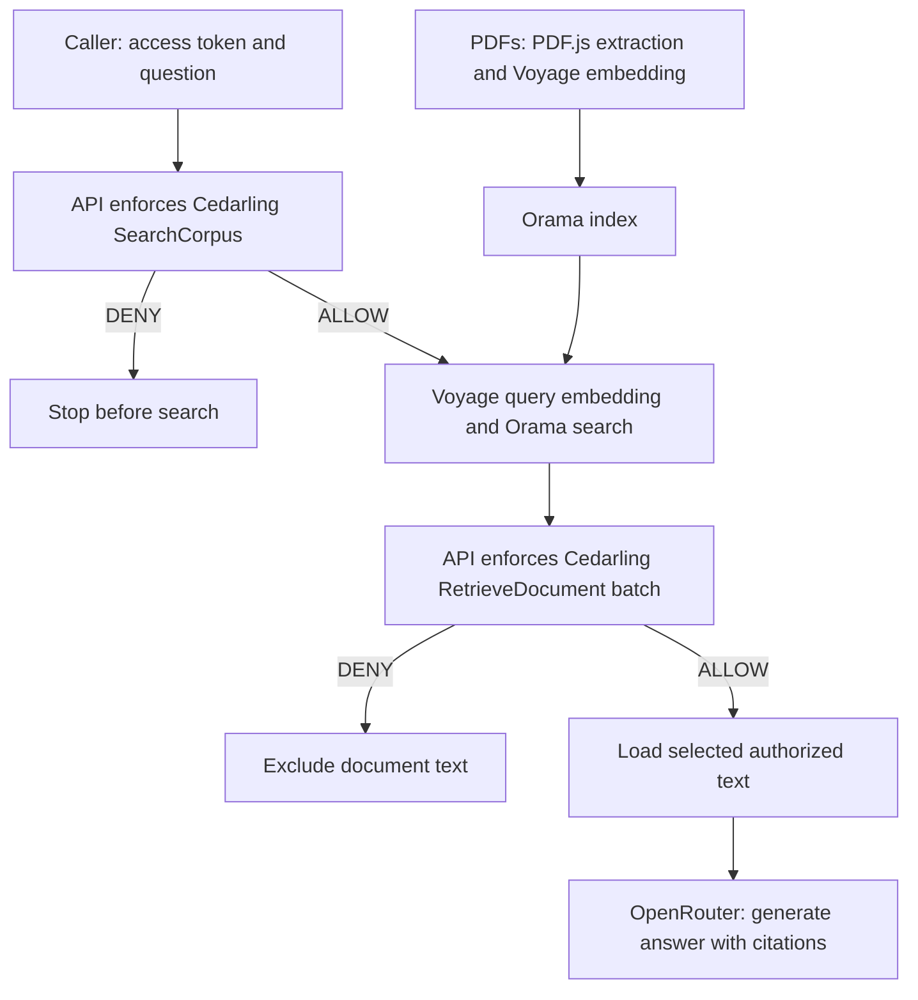

# P2 - Preventing Cross-Tenant RAG Data Leaks with Cedarling


P2 is a headless retrieval service that answers questions using synthetic PDFs.
Before searching, the server asks Cedarling whether the caller may use the
selected corpus. It then checks each candidate document before loading its text
for the model context.

Follow the [tutorial](docs/tutorials.md) to add these checks to the [starting
service](https://github.com/GluuFederation/cedarling-tutorials/tree/21b0832be4b31271320df992d04e9d97667d0e38/p2-tenantrag).

The tutorial uses a [step helper](../shared/tools/step/README.md)
to copy the required files from a pinned commit.

## Architecture



## Prerequisites

- Node.js 24.21 or newer within 24.x and pnpm 10, including for the sign-in CLI when running Docker.
- Docker Desktop or Docker Engine with Compose if using the Docker startup path.
- Voyage AI and OpenRouter API keys.

## Run

Work from `p2-tenantrag/`. Create a local `.env` with `P2_VOYAGE_API_KEY` and
`P2_OPENROUTER_API_KEY` before preparing the corpus or starting Docker.
`P2_OPENROUTER_MODEL` defaults to `openrouter/free`. To select another free
model, set its OpenRouter model ID in `.env`. A model that may incur charges
also requires `P2_OPENROUTER_ALLOW_PAID=true`; otherwise requests retain a
zero-price routing cap. The Voyage embedding model stays fixed, so changing
the OpenRouter answer model does not require rebuilding the corpus.

Native setup sends synthetic PDF chunks to Voyage for embedding and makes a small
OpenRouter generation check. During retrieval, Voyage receives your query;
OpenRouter receives the query and up to three authorized chunks. Provider calls consume account quota.

Install the host sign-in client dependencies, then start the Docker services:

```bash
pnpm install --frozen-lockfile
docker compose up --build
```

On its first start, Docker builds the missing corpus through Voyage, consuming
quota. Later starts reuse the saved index. It does not run the native setup's
OpenRouter generation check.

API: <http://localhost:17002>. The issuer is <http://localhost:18002>. Stop the stack with `Ctrl+C`, then `docker compose down`.

For native development, run from this project directory:

```bash
pnpm --dir ../shared/identity-provider install --frozen-lockfile
pnpm install --frozen-lockfile
pnpm run setup
pnpm dev
```

Run setup once to prepare the corpus; repeat it only to rebuild the corpus.
`pnpm dev` refreshes local configuration and policies, starts this
project's IdP, and watches the API. Native startup makes no AI-provider calls;
retrieval requests do. A missing corpus or provider key stops startup with an error.

After updating the PDFs, rebuild the index with `pnpm corpus:reset`, then restart.
For an existing Docker stack, use the rebuilt image and its persistent data volume:

```bash
docker compose build tenantrag
docker compose up -d identity-provider
docker compose run --rm --no-deps tenantrag node --env-file=/run/config/app.env dist/scripts/corpus-reset.js
docker compose up --build
```

Rebuilding consumes Voyage quota; startup rejects stale indexes instead of
silently reusing them.

For compiled startup after setup, run `pnpm --dir ../shared/identity-provider build`
and `pnpm build`. Keep `node --env-file=.local/idp/.env ../shared/identity-provider/dist/main.js`
running in another terminal, then run `pnpm start`.

## Exercise

Use these accounts to compare access to the same support documents:

- Ada (`ada`) is a Tenant A analyst with confidential-document access.
- Leo (`leo`) is a partner reviewer limited to Tenant A public evidence.
- Mallory (`mallory`) is a Tenant B analyst with no Tenant A access.

Run `pnpm auth ada` and complete sign-in. Use the prefilled username (or enter
`ada`) and any non-empty password, such as `cedarling-is-awesome`, for this local
tutorial IdP. Copy the printed access token into your HTTP client's bearer-token
field. Send this request (replace `<access-token>`):

```http
POST http://localhost:17002/v1/retrievals
Authorization: Bearer <access-token>
Content-Type: application/json

{
  "corpusId": "tenant-a-support",
  "query": "What customer steps and internal corrective actions followed Aster's 12 September support-search interruption?",
  "limit": 3
}
```

Repeat with `pnpm auth leo` or `pnpm auth mallory`. Ada can use Tenant A
public and confidential evidence, Leo receives only public Tenant A evidence,
and Mallory receives the same 404 status and error code for Tenant A as for an
unknown corpus. Response timing is not guaranteed to be identical.

The PDFs describe two fictional businesses: Aster (Tenant A) and Beacon
(Tenant B). Public documents are shared within their tenant, not across tenants.
Inspect `citations` to see which evidence reached the answer. Match `requestId`
to the server's JSON logs to follow the decisions and retrieval steps.

To test a whole-request denial, use Leo's token with the same POST URL and:

```json
{
  "corpusId": "tenant-b-support",
  "query": "Give the steps for the Recovery Procedures at Beacon Logistics?"
}
```

Expect **404 `corpus_not_found`**, before embedding, search, or generation.
Changing only `corpusId` to `tenant-a-support` permits Leo's search but excludes
confidential documents. The model is instructed to acknowledge
insufficient evidence; its wording is not an authorization decision.

If no authorized candidate evidence remains, the response is **200** with
`answer: null` and `citations: []`. A **503 `retrieval_unavailable`** instead
indicates a runtime or provider failure. Free-model availability varies; retry
the request or check `retrieval.failed` for the failing stage and provider reason.
The [log guide](docs/tutorials.md#read-the-retrieval-and-decision-logs) explains
correlation and error categories. `documentAuthorizationCount` counts evaluated
documents, including denials.

Document instructions cannot change the server's authorization inputs or corpus
filter. P2 controls evidence access; it does not filter generated answers or
guarantee that the model ignores instructions inside authorized evidence.

The policies are in `policy-store/`. Setup, build, and development startup
validate them and build the ignored `.local/policy-store.cjar` loaded by
Cedarling. Policy or runtime failures return `retrieval_unavailable` without
releasing protected text. See the [integration steps](docs/tutorials.md#put-cedarling-in-the-retrieval-path)
for token validation and request construction.
Restart `pnpm dev` or rebuild before `pnpm start` after changing policy source.

## Commands

| Command             | Purpose                                       |
| ------------------- | --------------------------------------------- |
| `pnpm run setup`    | Build the policy store and prepare the corpus |
| `pnpm auth`         | Authenticate a tutorial persona               |
| `pnpm corpus:reset` | Rebuild the deterministic vector corpus       |
| `pnpm dev`          | Start the IdP and watch the API               |
| `pnpm start`        | Run the built service                         |
| `pnpm test:e2e`     | Exercise the live retrieval boundaries        |
| `pnpm check`        | Run formatting, lint, types, tests, and build |

## Verify

```bash
pnpm check
pnpm audit --audit-level low
```

`pnpm check` needs no provider keys. To run `pnpm test:e2e`, first start the
IdP and application with a prepared corpus and both provider keys. Approve the
Ada, Leo, and Mallory device sign-ins when prompted. This live check consumes
provider quota and verifies evidence access rather than exact generated prose.
