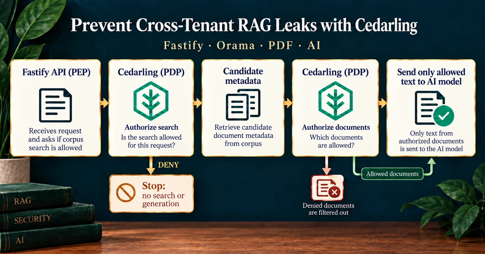

# P2 - Preventing Cross-Tenant RAG Data Leaks with Cedarling



P2 is a headless retrieval service that turns synthetic PDFs into answers. It
shows how Cedarling centralizes authorization at corpus search and protected
chunk access without mixing policy decisions with retrieval or generation.

The server authorizes the selected corpus before remote retrieval work and
authorizes every unique candidate document before loading protected text.

## Architecture

```text
Ada / Leo / Mallory ── Device Flow ──→ Tutorial IdP
          │
          └── retrieval request ──→ Node.js API (PEP)
                                         │
                                         ▼
                              Cedarling: authorize corpus
                                 │ DENY → stop
                                 └ ALLOW → Voyage query → Orama candidates
                                                        │
                                                        ▼
                                           Cedarling: authorize documents
                                              │ DENY → filter
                                              └ ALLOW → load text → OpenRouter

                    PDFs → PDF.js → Voyage embeddings → Orama index
```

## Prerequisites

- Docker Desktop or Docker Engine with Compose, or Node.js 24.21 or newer within 24.x and pnpm 10.
- Voyage AI and OpenRouter API keys.

## Run

Set `P2_VOYAGE_API_KEY` and `P2_OPENROUTER_API_KEY` in `.env` before preparing the corpus or starting Docker.
Setup embeds synthetic PDF chunks with Voyage and checks OpenRouter generation; requests also consume provider quota. Do not submit private queries.
`P2_OPENROUTER_MODEL` defaults to `openrouter/free`. To select another free
model, set its OpenRouter model ID in `.env`. A model that may incur charges
also requires `P2_OPENROUTER_ALLOW_PAID=true`; otherwise requests retain a
zero-price routing cap. The Voyage embedding model stays fixed, so changing
the OpenRouter answer model does not require rebuilding the corpus.

Setup sends synthetic PDF chunks to Voyage for embedding and makes a small
OpenRouter generation check. During retrieval, Voyage receives your query;
OpenRouter receives the query and up to three authorized chunks. Use synthetic
queries, not private data. Provider calls consume account quota.

Start the application and its own IdP:

```bash
docker compose up --build
```

API: <http://localhost:17002>. The issuer is <http://localhost:18002>. Stop the stack with `Ctrl+C`, then `docker compose down`.

For native development, run from this project directory:

```bash
pnpm --dir ../shared/identity-provider install --frozen-lockfile
pnpm install --frozen-lockfile
pnpm run setup
pnpm dev
```

Run setup once to prepare the corpus, or explicitly repeat it when you want to
rebuild it. `pnpm dev` refreshes local configuration and policies, starts this
project's IdP, and watches the API. Startup itself makes no AI-provider calls;
retrieval requests do. A missing corpus or provider key stops startup with an error.

After updating the PDFs, rebuild the index with `pnpm corpus:reset`, then restart.
For an existing Docker stack, use the rebuilt image and its persistent data volume:

```bash
docker compose build tenantrag
docker compose up -d identity-provider
docker compose run --rm --no-deps tenantrag node --env-file=/run/config/app.env dist/scripts/corpus-reset.js
docker compose up --build
```

Rebuilding consumes Voyage quota; startup rejects stale indexes instead of
silently reusing them.

For compiled startup after setup, run `pnpm --dir ../shared/identity-provider build`
and `pnpm build`. Keep `node --env-file=.local/idp/.env ../shared/identity-provider/dist/main.js`
running in another terminal, then run `pnpm start`.

## Exercise

The business workflow answers support questions from tenant-owned documents:

- **Ada (`ada`)** — Tenant A analyst with confidential-document access.
- **Leo (`leo`)** — Partner reviewer limited to Tenant A public evidence.
- **Mallory (`mallory`)** — Tenant B analyst with no Tenant A access.

Run `pnpm auth ada`, complete sign-in, and copy the printed access token into
your HTTP client's bearer-token field. Send this request (replace `<access-token>`):

```http
POST http://localhost:17002/v1/retrievals
Authorization: Bearer <access-token>
Content-Type: application/json

{
  "corpusId": "tenant-a-support",
  "query": "What customer steps and internal corrective actions followed Aster's 12 September support-search interruption?",
  "limit": 3
}
```

Repeat with `pnpm auth leo` and `pnpm auth mallory`. Ada can use Tenant A
public and confidential evidence, Leo receives only public Tenant A evidence,
and Mallory receives the same 404 status and error code for Tenant A as for an
unknown corpus. Response timing is not guaranteed to be identical.

The PDFs describe two fictional businesses: Aster (Tenant A) and Beacon
(Tenant B). Public documents are shared within their tenant, not across tenants.
Inspect the response's `citations` and match its `requestId` to the server's
JSON authorization context and retrieval summary; Cedarling's decision records
include the matching policy reasons and evaluation errors.

To test a whole-request denial, use Leo's token with the same POST URL and:

```json
{
  "corpusId": "tenant-b-support",
  "query": "Give the steps for the Recovery Procedures at Beacon Logistics?"
}
```

Expect **404 `corpus_not_found`**, before embedding, search, or generation.
Changing only `corpusId` to `tenant-a-support` permits Leo's search but excludes
confidential documents. Naming Beacon in the question does not change the selected
corpus or grant access to its documents. The model is instructed to acknowledge
insufficient evidence; its wording is not an authorization decision.

If no authorized candidate evidence remains, the response is **200** with
`answer: null` and `citations: []`. A **503 `retrieval_unavailable`** instead
indicates a runtime or provider failure. Match its `requestId` to
`retrieval.failed`: `stage` identifies the failed step; provider failures also
include `provider`, `reason`, and any available `httpStatus` or numeric
`providerCode`. Reasons distinguish HTTP rejection (`http_error`), a provider
error envelope (`provider_error`), timeout, network error, invalid response,
and empty answer. Keys, questions, evidence, and raw provider errors stay out of
these logs. In successful summaries, `documentAuthorizationCount` means
documents evaluated, not documents allowed.

Document instructions cannot change the server's authorization inputs or corpus
filter. P2 controls evidence access; it does not filter generated answers or
guarantee that the model ignores instructions inside authorized evidence.

The readable policy store is in `policy-store/`. Setup, build, and development startup validate it and build
the ignored `.local/policy-store.cjar` loaded by Cedarling. P2 uses the
`corpus.search` and `document.retrieve` scopes and direct multi-issuer SDK
calls against the fixed tutorial issuer and P2 API audience; policy or runtime
failures return `retrieval_unavailable` without releasing protected text.
Restart `pnpm dev` or rebuild before `pnpm start` after changing policy source.

## Commands

| Command             | Purpose                                       |
| ------------------- | --------------------------------------------- |
| `pnpm run setup`    | Build the policy store and prepare the corpus |
| `pnpm auth`         | Authenticate a tutorial persona               |
| `pnpm corpus:reset` | Rebuild the deterministic vector corpus       |
| `pnpm dev`          | Start the IdP and watch the API               |
| `pnpm start`        | Run the built service                         |
| `pnpm test:e2e`     | Exercise the live retrieval boundaries        |
| `pnpm check`        | Run formatting, lint, types, tests, and build |

## Verify

```bash
pnpm check
pnpm audit --audit-level low
```

`pnpm check` needs no provider keys. To run `pnpm test:e2e`, first start the
IdP and application with a prepared corpus and both provider keys. Approve the
Ada, Leo, and Mallory device sign-ins when prompted. This live check consumes
provider quota and verifies evidence access rather than exact generated prose.
