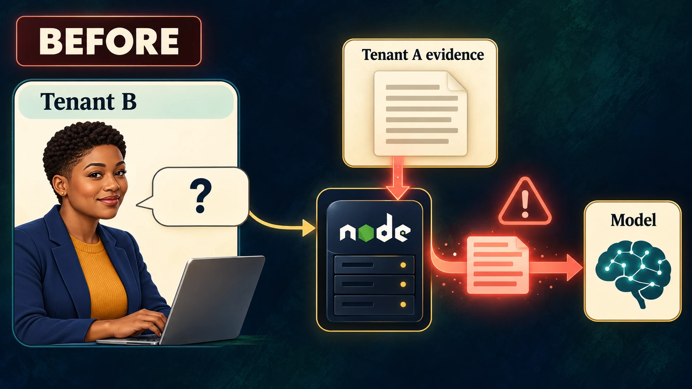
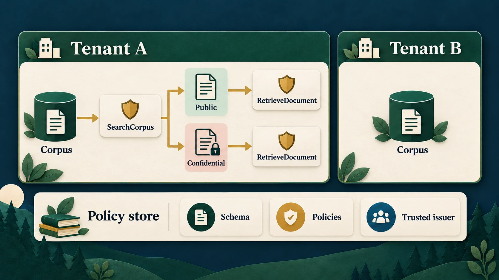
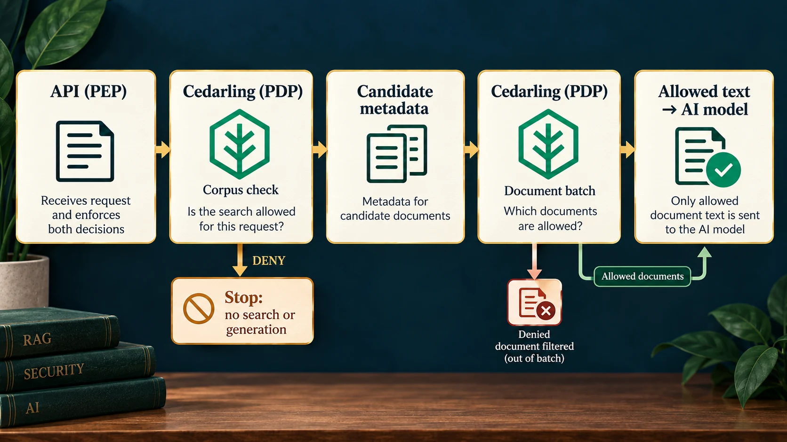
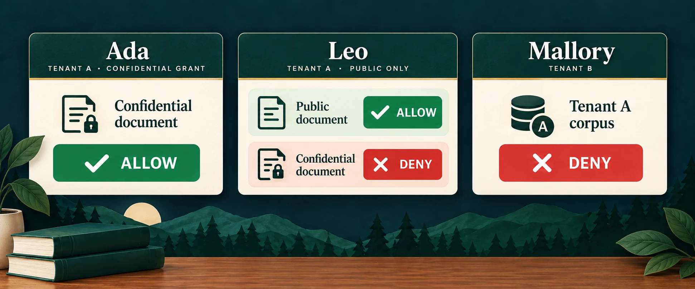
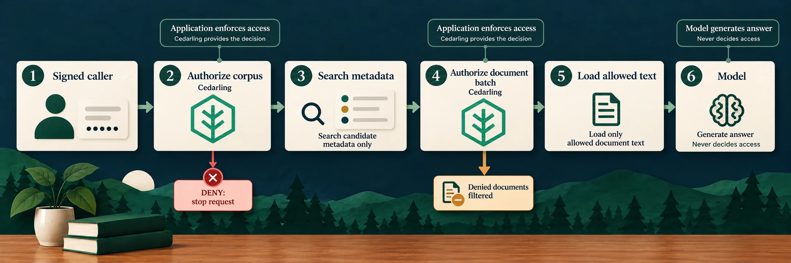

# Prevent Cross-Tenant RAG Leaks with Cedarling

<details>
<summary>Project source and prerequisites</summary>

- [Complete P2 project](https://github.com/GluuFederation/cedarling-tutorials/tree/p2-tenantrag-v1.0.0/p2-tenantrag) and [starting checkpoint](https://github.com/GluuFederation/cedarling-tutorials/tree/21b0832be4b31271320df992d04e9d97667d0e38/p2-tenantrag).
- Install Docker with Compose, or Node.js 24.21+ within 24.x and pnpm 10.17.1. Live retrieval also needs Voyage AI and OpenRouter API keys and consumes provider quota; use synthetic queries only.
- Local HTTP and the bundled IdP are for learning only. Production requires HTTPS and a configured OIDC/OAuth issuer, such as [Jans Auth](https://docs.jans.io/stable/janssen-server/planning/use-cases/), Gluu, Auth0, or Okta.
- I prepared these steps on Ubuntu 24.04+. Native project checks also run in CI on macOS and Windows. If a platform-specific step fails, [open an issue](https://github.com/GluuFederation/cedarling-tutorials/issues).
- New to Cedarling? [Read the short introduction](https://cedarling.dev/learn/what-is-cedarling) when you need it.
- Keep the official [Cedar policy syntax](https://docs.cedarpolicy.com/policies/syntax-policy.html) and [Cedar schema syntax](https://docs.cedarpolicy.com/schema/human-readable-schema.html) references handy for the policy-store steps.

</details>

Paths below are relative to `p2-tenantrag/` unless stated otherwise. Generated
answers and retrieval rankings can vary; the authorization decisions and cited
evidence are what we will verify.

## What are we going to protect?


_Ada has a confidential-document grant, Leo can use public Tenant A evidence, and Mallory belongs to Tenant B._

A support assistant can give a useful answer and still disclose information to
the wrong person. The problem starts before the answer: which documents were
sent to the model?

I'll trace that evidence path with you, then put a decision before each place
where protected text can enter it.

P2 is a Node.js API that searches synthetic PDFs and generates answers.
Voyage creates embeddings, Orama searches the vector index, and OpenRouter
provides generation. There is no browser application. We will protect two
operations: searching a tenant's corpus and loading each candidate document.

- **Ada** belongs to Tenant A and may read its public documents and the
  confidential document explicitly shared with her.[^1]
- **Leo** belongs to Tenant A but may read only its public documents.
- **Mallory** belongs to Tenant B and must not retrieve Tenant A's evidence.

“Public” means public within that tenant, not available to every caller.

```text
Caller -- access token + question --> Node.js API (PEP)
                                          |
                current corpus facts --> Cedarling: SearchCorpus
                                          |
                                        ALLOW
                                          v
                                Voyage query embedding
                                          |
                                Orama candidate metadata
                                          |
              current document facts --> Cedarling: RetrieveDocument batch
                                          |
                                 keep allowed documents
                                          v
                                  load selected text
                                          |
                                     OpenRouter
                                          |
                                    answer + citations
```

Cedarling is the policy decision point, or PDP. The retrieval service is the
policy enforcement point, or PEP: it controls whether execution reaches protected
text and generation. The model does not—and must never—decide access.

## Reproduce the leak before adding Cedarling



_In the baseline, authentication alone does not stop Mallory's cross-tenant retrieval._

### Start an isolated baseline

Use a separate checkout so the exercise does not change your existing data:

```bash
git clone https://github.com/GluuFederation/cedarling-tutorials.git cedarling-p2
cd cedarling-p2
git switch --detach 21b0832be4b31271320df992d04e9d97667d0e38
cd p2-tenantrag
```

Use Node.js 24.21 or newer within 24.x and pnpm 10.17.1 for host commands.
Put `P2_VOYAGE_API_KEY` and `P2_OPENROUTER_API_KEY` in the ignored project `.env`.
Keep their values out of source control and recordings.

For Docker, start the API and its IdP together:

```bash
docker compose up --build
```

For native baseline startup, use two terminals. In the first:

```bash
pnpm --dir ../shared/identity-provider install --frozen-lockfile
pnpm --dir ../shared/identity-provider build
pnpm install --frozen-lockfile
pnpm run setup
node --env-file=.local/idp/.env ../shared/identity-provider/dist/main.js
```

In the second, from `p2-tenantrag/`, run `pnpm dev`. Use one startup method at a
time. The API is `http://localhost:17002`; the IdP is `http://localhost:18002`.
With Docker, also install the project's host dependencies for the authentication
CLI using `pnpm install --frozen-lockfile`.

`pnpm run setup` builds the Orama corpus index from the synthetic PDFs as part
of native setup; the first Docker startup builds it automatically. No separate
`corpus:reset` is needed for a fresh checkout. Preparing the corpus sends PDF
chunks to Voyage, and native setup also checks generation. Retrieval calls
consume provider quota. Use fictional
questions: the embedding provider receives your question, and generation receives
the question and selected evidence. The baseline does not yet filter that evidence
by the caller's permissions.

### Ask for another tenant's evidence

In a free terminal, authenticate as Mallory:

```bash
pnpm auth mallory
```

Open the displayed verification URL. The development IdP usually prefills
`mallory`; enter it if the field is empty. Use any non-empty password, such as
`cedarling-is-awesome`, then approve access. Copy the printed token into your
HTTP client's bearer-token field. I use [Postman](https://learning.postman.com/docs/use/send-requests/create-requests/request-basics),
but any client that can send HTTP requests works:

```http
POST http://localhost:17002/v1/retrievals
Authorization: Bearer <access-token>
Content-Type: application/json

{
  "corpusId": "tenant-a-support",
  "query": "How should customer retrieval data be isolated?",
  "limit": 3
}
```

The baseline authenticates Mallory but permits the two retrieval boundaries. It
can load Tenant A text and send it to the model for her. Inspect returned citations,
not just the answer. The baseline `test/retrieval.test.ts` demonstrates the leak
with fixed candidates and a test generation client, independently of providers.

Capture the request and any returned Tenant A citations. A provider error proves
neither a leak nor a denial. Stop the baseline before applying the integration.
For Docker, use `Ctrl+C`, then `docker compose down`; keep its data volume.

## Prepare trusted retrieval facts

The starting service already authenticates callers, resolves corpus metadata,
searches candidate IDs, and loads document text. Its two marked authorization
seams are before query embedding and before loading candidate text, but both
currently omit per-caller authorization.[^3]

Before writing a rule about confidential readers, add the missing server-owned
facts. Map Ada and Leo to Tenant A and Mallory to Tenant B; give only Ada a
grant for the confidential Aster document. Carry that grant through the fixture
type, PDF metadata, and repository without taking it from the HTTP request:[^4]

```ts
// src/rag/fixtures.ts (confidential Aster document)
confidentialReaderSubjects: ["ada"],
```

Keep the existing corpus-indexing and provider setup. No document text should
be loaded to determine a grant; the next steps authorize from metadata first.

## Decide which evidence each caller may use



_The corpus rule gates search; the document rule gates which candidate text can be loaded._

### Design a readable policy store

Use the [directory-based policy-store format](https://docs.jans.io/stable/cedarling/reference/cedarling-policy-store/#2-new-directory-based-format):

```text
policy-store/
  metadata.json
  schema.cedarschema
  policies/
    server-access.cedar
  trusted-issuers/
    tutorial-idp.json
```

Create these four source files from the completed policy store.[^5]
The metadata identifies this store and version `1.0.0`. The schema defines the
request vocabulary. Both rules live in one policy file with distinct `@id`
annotations. Current document facts arrive in requests, so default entities and
templates are unnecessary.

| Design question                        | P2 answer                                                                                       |
| -------------------------------------- | ----------------------------------------------------------------------------------------------- |
| What represents identity?              | Signed access token mapped as `P2TenantRAG::Access_token`                                       |
| Which issuer and audience are trusted? | P2 IdP at `http://localhost:18002`; audience `http://localhost:17002/api`                       |
| What operations exist?                 | `RAG::Action::"SearchCorpus"` and `RAG::Action::"RetrieveDocument"`                             |
| What does search target?               | `RAG::Corpus` with corpus and tenant IDs                                                        |
| What does retrieval target?            | `RAG::Document` with corpus, tenant, classification, and confidential readers                   |
| Which context is required?             | Server boundary, authenticated subject, current user tenant, selected corpus ID                 |
| What permits access?                   | Required token binding and scope, matching tenant/corpus, and document access                   |
| What must deny?                        | Another tenant, missing scope, wrong identity binding, or confidential evidence without a grant |

The schema includes the token and issuer types Cedarling builds during JWT
processing. `RAG::Any` satisfies the action's principal-type declaration; it is
not another application user. Multi-issuer requests carry identity in `tokens`.

In `trusted-issuers/tutorial-idp.json`, set `openid_configuration_endpoint` to
`http://localhost:18002/.well-known/openid-configuration`. The trusted
`access_token` mapping uses `entity_type_name: "P2TenantRAG::Access_token"`,
`token_id: "jti"`, and required claims `iss`, `sub`, `aud`, `jti`, `exp`, and
`scope`.

### Write the document rule

This complete policy from `policies/server-access.cedar` binds verified token
claims to current application facts:

```cedar
// policy-store/policies/server-access.cedar
@id("server-retrieve-authorized-document")
permit(
  principal,
  action == RAG::Action::"RetrieveDocument",
  resource is RAG::Document
) when {
  context.boundary == "server" &&
  context has tokens &&
  context.tokens has p2tenantrag_access_token &&
  context.tokens.p2tenantrag_access_token.hasTag("sub") &&
  context.tokens.p2tenantrag_access_token.getTag("sub").contains(context.user.subject) &&
  context.tokens.p2tenantrag_access_token.hasTag("aud") &&
  context.tokens.p2tenantrag_access_token.getTag("aud").contains("http://localhost:17002/api") &&
  context.tokens.p2tenantrag_access_token has scope &&
  (context.tokens.p2tenantrag_access_token.scope == "document.retrieve" ||
   context.tokens.p2tenantrag_access_token.scope like "document.retrieve *" ||
   context.tokens.p2tenantrag_access_token.scope like "* document.retrieve" ||
   context.tokens.p2tenantrag_access_token.scope like "* document.retrieve *") &&
  context.selected_corpus_id == resource.corpus_id &&
  context.user.tenant_id == resource.tenant_id &&
  (resource.classification == "public" ||
    (resource.classification == "confidential" &&
      resource.confidential_reader_subjects.contains(context.user.subject)))
};
```

The context key `p2tenantrag_access_token` is generated by Cedarling. Dynamic
`sub` and `aud` claims use tags; `scope` stays a space-delimited string. Whole-name
matching prevents `document.retrieve.extra` from satisfying `document.retrieve`.

The companion `server-search-tenant-corpus` policy requires `corpus.search` with
the same token binding and matching corpus/tenant. It does not grant every
document in that corpus. No matching permit gives DENY; evaluation errors are
handled as failures.

This model combines a tenant boundary with a document-specific reader
relationship. Membership in a tenant alone does not confer access to every
confidential document.[^1]

### Place each decision before its effect

| Capability          | Identity            | Action             | Resource                       | Context                                        | Effect waiting for ALLOW               |
| ------------------- | ------------------- | ------------------ | ------------------------------ | ---------------------------------------------- | -------------------------------------- |
| `corpus.search`     | Caller access token | `SearchCorpus`     | Resolved corpus                | Current user, selected corpus, server boundary | Query embedding and vector search      |
| `document.retrieve` | Same token          | `RetrieveDocument` | Each unique candidate document | Same trusted context                           | Load text for generation and citations |

The route chooses actions; the repository supplies tenants, classification, and
reader grants. Neither the question nor model output supplies trusted facts.
Resolve candidate IDs and their relationships against repository metadata before
building document requests.

## Put Cedarling in the retrieval path



_A corpus DENY stops retrieval; a document DENY filters that document from the batch._

### Package and load the rules

Install the pinned dependencies from the project directory:

```bash
pnpm add --save-exact @janssenproject/cedarling_wasm@0.0.468 fflate@0.8.3
pnpm add --save-dev --save-exact @cedar-policy/cedar-wasm@4.12.0
```

Add the integration's repository-level `shared/policy-store.mjs` and
`shared/policy-store.d.mts`, which are absent from the starting commit. Run the
shared builder to create the archive:

```bash
node ../shared/policy-store.mjs
```

It validates source and generates ignored `.local/policy-store.cjar`. Docker
uses the same archive source. This helper packages policies; authorization
remains direct Cedarling calls.

In `src/authorization.ts`, initialize one server instance following the
[pinned SDK README](https://www.npmjs.com/package/@janssenproject/cedarling_wasm/v/0.0.468).
Here `policyStorePath` comes from server configuration; this excerpt omits the
surrounding lifecycle code:

```ts
// src/authorization.ts
import { readFile } from "node:fs/promises";
import { initFromArchiveBytes } from "@janssenproject/cedarling_wasm";

const archive = new Uint8Array(await readFile(policyStorePath));
const cedarling = await initFromArchiveBytes(
  {
    CEDARLING_APPLICATION_NAME: "P2 TenantRAG server",
    CEDARLING_LOG_TYPE: "memory",
    CEDARLING_LOG_TTL: 300,
    CEDARLING_JWT_SIG_VALIDATION: "enabled",
    CEDARLING_JWT_SIGNATURE_ALGORITHMS_SUPPORTED: ["RS256"],
    CEDARLING_STRICT_SCHEMA_VALIDATION: "enabled",
    CEDARLING_TRUSTED_ISSUER_LOADER_TYPE: "SYNC",
  },
  archive,
);
if (cedarling.loadedTrustedIssuersCount() < 1) {
  await cedarling.shutDown();
  throw new Error("P2 trusted issuer did not load");
}
```

Start the IdP first. Log the archive version and SHA-256 at startup and call
`shutDown()` on application closure. `src/runtime.ts` wires the authorization
functions into the retrieval service.

### Authorize the corpus

Inside the corpus authorization function, `principal` is the authenticated
caller, `profile` its repository access profile, and `corpus` the resolved record.
This expanded request shows what the completed `tokenSet()` and
`requestContext()` helpers provide:

```ts
// src/authorization.ts
const tokens = [
  { mapping: "P2TenantRAG::Access_token", payload: principal.accessToken },
];
const context = {
  boundary: "server",
  user: { subject: principal.id, tenant_id: profile.tenantId },
  selected_corpus_id: corpus.corpusId,
};
const result = await cedarling.authorizeMultiIssuer(
  JSON.stringify({
    tokens,
    action: 'RAG::Action::"SearchCorpus"',
    resource: {
      cedar_entity_mapping: {
        entity_type: "RAG::Corpus",
        id: corpus.corpusId,
      },
      corpus_id: corpus.corpusId,
      tenant_id: corpus.tenantId,
    },
    context,
  }),
);
for (const log of cedarling.getLogsByRequestId(result.request_id)) {
  console.info(JSON.stringify(log, null, 2));
}
if (result.response.diagnostics.errors.length > 0) {
  throw new Error("Cedarling returned policy evaluation errors");
}
return result.decision;
```

`authorizeMultiIssuer()` receives a JSON string, so `JSON.stringify()` turns
the request object into the format expected by the Cedarling JavaScript API.[^2]
The later `JSON.stringify(log, null, 2)` only formats nested log fields for this
local exercise.

In `src/rag/retrieval.ts`, call this before `voyage.embed()` and
`corpusSearch.search()`. False becomes `corpus_not_found`, like an unknown
corpus. An unavailable decision stops work with `retrieval_unavailable`.

### Batch document decisions before loading text

Deduplicate resolved candidate documents. In the document authorization function,
reuse the same token set and context and submit one item per document. This
excerpt expands the request assembled in `src/authorization.ts`:

```ts
// src/authorization.ts
const batch = await cedarling.authorizeMultiIssuerBatch(
  JSON.stringify({
    tokens,
    items: documents.map((document) => ({
      action: 'RAG::Action::"RetrieveDocument"',
      resource: {
        cedar_entity_mapping: {
          entity_type: "RAG::Document",
          id: document.documentId,
        },
        corpus_id: document.corpusId,
        tenant_id: document.tenantId,
        classification: document.classification,
        confidential_reader_subjects: document.confidentialReaderSubjects,
      },
      context,
    })),
  }),
);
```

Require `item.is_ok` before `item.unwrap()`, reject diagnostics errors, and collect
actual decisions in submitted order. Print native logs by each result's request
ID. A successful item can contain DENY. An incomplete batch is a failure, not
permission for unchecked documents.

The retrieval service forms an allowed-document set, filters candidates, and
selects at most the requested three chunks. Only then does it call
`repository.loadChunkText()` and generation. Build citations from those same
chunks, not all search candidates.[^6]

Keep the query bounds, server-selected corpus filter, input validation, and
provider timeouts. The integration also refreshes the synthetic PDFs; after
changing PDFs, rebuild the index with `pnpm corpus:reset` and restart. Rebuilding
consumes Voyage quota; do not rerun setup or reset just to retry a model response.

Restart after policy edits.

## Finish the runnable retrieval stack

With both authorization gates in place, connect archive creation to every
startup path. The completed build runs the shared builder before TypeScript;
Docker copies the generated archive into the API image.[^7]

```json
{
  "scripts": {
    "build": "node ../shared/policy-store.mjs && tsc -p tsconfig.build.json"
  }
}
```

Separate cheap preparation from provider-backed corpus setup: `scripts/prepare.ts`
synchronizes the local IdP/configuration and builds policies without using AI
quota. `scripts/preflight.ts` refuses startup if the corpus index is missing;
`scripts/dev.mjs` prepares configuration, then starts the IdP and API. It does
not rebuild the index. Run `pnpm run setup` once to build the corpus; it also
makes a provider smoke request. Then run `pnpm dev`. Repeat setup or
`pnpm corpus:reset` only when the PDF/index needs rebuilding; both consume
Voyage quota.[^8]

The baseline's two-terminal native startup no longer applies to the completed
development script.

## Prove the evidence boundary, not the model's wording



_An allowed corpus search does not grant every document inside that corpus._

### Repeat the denied request and legitimate work

Repeat Mallory's original request for `tenant-a-support`. Expect **404** with
`error: "corpus_not_found"`, before embedding, search, or generation. An unknown
corpus has the same status and error code, not a guarantee of identical timing.

Now authenticate as Ada, then Leo, and send:

```http
POST http://localhost:17002/v1/retrievals
Authorization: Bearer <access-token>
Content-Type: application/json

{
  "corpusId": "tenant-a-support",
  "query": "What customer steps and internal corrective actions followed Aster's 12 September support-search interruption?",
  "limit": 3
}
```

The integrated PDFs describe Aster in Tenant A and Beacon in Tenant B. Ada may
use Aster's confidential evidence; Leo may not. Ranking determines candidates,
so inspect actual document decisions and citations rather than assuming one
fixed answer or candidate order.

| Attempt                                  | Expected outcome                                  |
| ---------------------------------------- | ------------------------------------------------- |
| Mallory searches Tenant A                | Corpus DENY; 404; no remote retrieval work        |
| Ada retrieves candidate `a-confidential` | Document ALLOW                                    |
| Leo retrieves the same candidate         | Document DENY; its chunks never load              |
| Leo retrieves Tenant A public candidates | ALLOW; generation may use those chunks            |
| Leo selects `tenant-b-support`           | Corpus DENY, regardless of the question's wording |

A denied document does not deny the entire question. With no authorized candidate
chunks, expect **200**, `answer: null`, and `citations: []`, without generation.
A **503 `retrieval_unavailable`** is instead a runtime or provider failure.
With the free OpenRouter model router, availability and answer quality vary;
retry a 503 before treating it as an application defect. A terse answer such as
`"User Safety: safe"` is not the expected business answer and is not evidence
of authorization. Judge access by Cedarling decisions and citations, not the
model's wording. To try another model, set `P2_OPENROUTER_MODEL` in `.env`.
Paid routing requires both a paid model ID and
`P2_OPENROUTER_ALLOW_PAID=true`; use it only if you intend to spend your
OpenRouter credit. Adding credit alone leaves the configured
`openrouter/free` router unchanged.
Do not rerun `pnpm run setup` merely to retry generation: setup also rebuilds
the corpus using Voyage quota.

### Explain the logs

The response's `requestId` appears in `authorization.context`. Its
`cedarlingRequestId` matches a native `request_id`; document decisions also share
`batch_id`. For Leo's confidential-document attempt, the important native fields
look like this illustrative excerpt:

```json
{
  "log_kind": "Decision",
  "action": "RAG::Action::\"RetrieveDocument\"",
  "resource": "RAG::Document::\"a-confidential\"",
  "decision": "DENY",
  "principal": [],
  "diagnostics": { "reason": [], "errors": [] }
}
```

Token evidence explains the empty principal array. An empty reason with no errors
means no permit matched, not a list of failed conditions. Compare Leo's subject
with the policy's reader grant. An allowed document names
`server-retrieve-authorized-document` in its reasons.

`retrieval.completed` reports candidates, documents evaluated, chunks loaded,
and model. `documentAuthorizationCount` is not a count of allowed documents.
`retrieval.failed` names the failed stage; provider failures include bounded
provider details. Failure at `answer.generate` is not a Cedarling denial.
Capture only synthetic evidence and remove tokens and secrets from recordings.

### Check ordering and failures

From the completed project:

```bash
pnpm check
```

This runs formatting, lint, types, tests, and build without provider keys.
`test/policy-store.test.ts` evaluates real Cedarling rules with signed test
evidence. `test/retrieval.test.ts` proves ordering, denied-text exclusion, empty
results, and unavailable or incomplete decisions with deterministic provider
doubles. Those doubles are not an offline application mode.
`test/app.test.ts` checks request failures, including unsupported content types
returning `400 invalid_retrieval` before retrieval runs.

Start the integrated app and run `pnpm test:e2e`.
Approve the Ada, Leo, and Mallory sign-ins. This consumes provider quota and
checks evidence access, not identical generated prose. Record the same denied
attempt before and after integration, plus one successful authorized search.

## Reuse the pattern in your own service



_A denied corpus stops the question; a denied document is filtered while other allowed documents may continue._

Authorize the collection before expensive work, then authorize evidence before
loading content. Preserve this ordering wherever search results feed a model,
report, or another service.

Follow `src/authorization.ts`, `src/rag/retrieval.ts`, `src/rag/repository.ts`,
`policy-store/`, and the tests in the
[completed P2 project](https://github.com/GluuFederation/cedarling-tutorials/tree/p2-tenantrag-v1.0.0/p2-tenantrag).

Production needs real identity and entitlement sources, secure transport,
reviewed provider data handling, and protected logs. Setup embeds the synthetic
corpus as an ingestion operation, not a caller-authorized retrieval. P2 controls
evidence access, not model truthfulness or prompt-injection immunity: an
instruction-like public document remains ordinary authorized evidence.

For a production stack, consider Agama Lab Policy Designer for policy authoring,
Jans Auth for token issuance, and Lock Server for centralized decision logs.
See [Cedarling production solutions](https://cedarling.dev/solutions).

Next, P3 puts authorization at an MCP server, where a model can request a change
to incident state as well as information.

---

[^1]: P2's confidential-reader rule uses the current document's `confidential_reader_subjects` set. Ada's subject is listed; Leo's is not. The application supplies this relationship for each authorization request.

[^2]: The pinned [`cedarling_wasm` JavaScript API](https://www.npmjs.com/package/@janssenproject/cedarling_wasm/v/0.0.468) accepts a JSON-string request. Serialization changes the data format.

[^3]: Starting-checkpoint source: [`src/rag/retrieval.ts`](https://github.com/GluuFederation/cedarling-tutorials/blob/21b0832be4b31271320df992d04e9d97667d0e38/p2-tenantrag/src/rag/retrieval.ts) marks both permissive seams before embedding and text loading.

[^4]: Completed fact sources: [`src/rag/fixtures.ts`](https://github.com/GluuFederation/cedarling-tutorials/blob/p2-tenantrag-v1.0.0/p2-tenantrag/src/rag/fixtures.ts), [`src/rag/types.ts`](https://github.com/GluuFederation/cedarling-tutorials/blob/p2-tenantrag-v1.0.0/p2-tenantrag/src/rag/types.ts), [`src/rag/pdf.ts`](https://github.com/GluuFederation/cedarling-tutorials/blob/p2-tenantrag-v1.0.0/p2-tenantrag/src/rag/pdf.ts), and [`src/rag/repository.ts`](https://github.com/GluuFederation/cedarling-tutorials/blob/p2-tenantrag-v1.0.0/p2-tenantrag/src/rag/repository.ts).

[^5]: Complete tagged store: [`metadata.json`](https://github.com/GluuFederation/cedarling-tutorials/blob/p2-tenantrag-v1.0.0/p2-tenantrag/policy-store/metadata.json), [`schema.cedarschema`](https://github.com/GluuFederation/cedarling-tutorials/blob/p2-tenantrag-v1.0.0/p2-tenantrag/policy-store/schema.cedarschema), [`server-access.cedar`](https://github.com/GluuFederation/cedarling-tutorials/blob/p2-tenantrag-v1.0.0/p2-tenantrag/policy-store/policies/server-access.cedar), and [`tutorial-idp.json`](https://github.com/GluuFederation/cedarling-tutorials/blob/p2-tenantrag-v1.0.0/p2-tenantrag/policy-store/trusted-issuers/tutorial-idp.json).

[^6]: Complete enforcement source: [`src/authorization.ts`](https://github.com/GluuFederation/cedarling-tutorials/blob/p2-tenantrag-v1.0.0/p2-tenantrag/src/authorization.ts), [`src/rag/retrieval.ts`](https://github.com/GluuFederation/cedarling-tutorials/blob/p2-tenantrag-v1.0.0/p2-tenantrag/src/rag/retrieval.ts), and [`src/runtime.ts`](https://github.com/GluuFederation/cedarling-tutorials/blob/p2-tenantrag-v1.0.0/p2-tenantrag/src/runtime.ts).

[^7]: Archive build and Docker source: [`shared/policy-store.mjs`](https://github.com/GluuFederation/cedarling-tutorials/blob/p2-tenantrag-v1.0.0/shared/policy-store.mjs), [`shared/policy-store.d.mts`](https://github.com/GluuFederation/cedarling-tutorials/blob/p2-tenantrag-v1.0.0/shared/policy-store.d.mts), [`package.json`](https://github.com/GluuFederation/cedarling-tutorials/blob/p2-tenantrag-v1.0.0/p2-tenantrag/package.json), and [`Dockerfile`](https://github.com/GluuFederation/cedarling-tutorials/blob/p2-tenantrag-v1.0.0/p2-tenantrag/Dockerfile).

[^8]: Completed startup files: [`scripts/prepare.ts`](https://github.com/GluuFederation/cedarling-tutorials/blob/p2-tenantrag-v1.0.0/p2-tenantrag/scripts/prepare.ts), [`scripts/preflight.ts`](https://github.com/GluuFederation/cedarling-tutorials/blob/p2-tenantrag-v1.0.0/p2-tenantrag/scripts/preflight.ts), [`scripts/setup.ts`](https://github.com/GluuFederation/cedarling-tutorials/blob/p2-tenantrag-v1.0.0/p2-tenantrag/scripts/setup.ts), and [`scripts/dev.mjs`](https://github.com/GluuFederation/cedarling-tutorials/blob/p2-tenantrag-v1.0.0/p2-tenantrag/scripts/dev.mjs).
