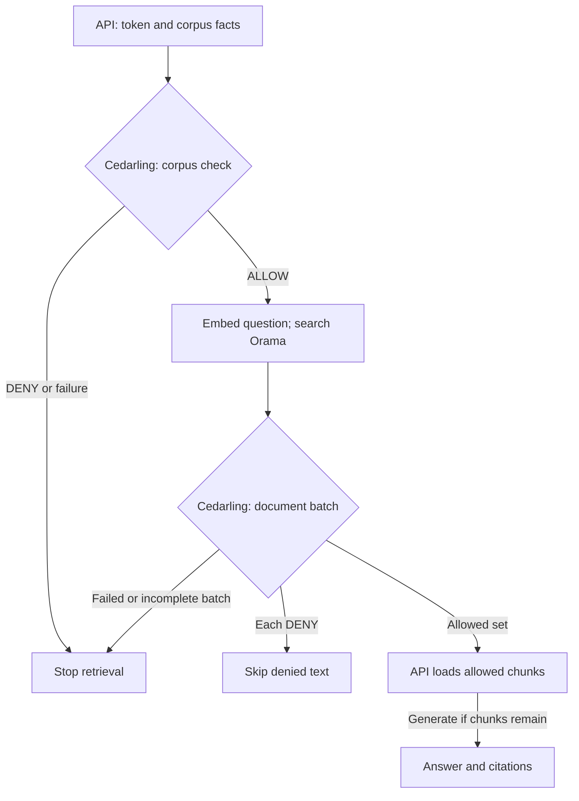

# Prevent Cross-Tenant RAG Leaks with Cedarling

Hi there! We've got a service that searches documents and uses an AI model to
answer questions. It serves people from different tenants, each with their own
documents and access rules. We'll use Cedarling to check which documents each
person may read.

In the starting service, Mallory can ask about Tenant A's support records despite
belonging to Tenant B. Even within Tenant A, Leo can retrieve confidential
documents reserved for Ada.

We'll close both gaps with Cedarling: check the caller's access to the selected
document collection (corpus) before embedding or searching. Then we'll check each
document's tenant, corpus, and permitted readers before selecting its text for
the answer. We'll follow Mallory's request through that change and compare Ada's
and Leo's results. Denied text will stay out of the answer model's input and
citations for that caller, while permitted documents remain available.
The model must never decide access.

## Build the retrieval checks or try the finished API

- To build the integration, use native Node.js and start with [Run the starting application](#run-the-starting-application). We'll add policies, retrieval checks, and tests to that checkout.
- To try the finished app, run the [finished project on main](https://github.com/GluuFederation/cedarling-tutorials/tree/main/p2-tenantrag) using its README, then go to [Check which documents each user can retrieve](#check-which-documents-each-user-can-retrieve). This version already uses Cedarling.

If you're building from the starting project, open each **Required step** section
and complete its instructions before continuing. These sections contain the files
and changes we'll need.

<details>
<summary>Before you start</summary>

- Git, Node.js 24.21+ within 24.x, and pnpm 10.17.1 for the coding steps.
- Docker with Compose is optional for the baseline or finished example; the intermediate coding steps use native Node.js.
- Voyage AI and OpenRouter API keys for live retrieval. Indexing and requests consume provider quota; use fictional data only.
- Familiarity with TypeScript, HTTP APIs, access tokens, and the basics of retrieval-augmented generation.
- New to Cedarling? [Read the short introduction](https://cedarling.dev/learn/what-is-cedarling) when you need it.
- Keep the [Cedar policy syntax](https://docs.cedarpolicy.com/policies/syntax-policy.html) and [Cedar schema syntax](https://docs.cedarpolicy.com/schema/human-readable-schema.html) references handy while editing policies.

</details>

Run the commands from `p2-tenantrag/`. Paths under `shared/` are relative to
the repository root.

## Meet the service and its users


_Ada can read a confidential document, Leo can use public Tenant A documents, and Mallory belongs to Tenant B._

P2 is a Node.js API that searches fictional PDFs and generates answers.
Voyage turns text into numeric vectors called embeddings. Orama searches those
vectors, and OpenRouter provides the answer model. We'll send requests with
Postman or curl, using an access token from the tutorial's sign-in flow.

- **Ada** belongs to Tenant A and may read its public documents and the
  confidential document explicitly shared with her.[^1]
- **Leo** belongs to Tenant A but may read only its public documents.
- **Mallory** belongs to Tenant B and must not retrieve Tenant A's documents.

"Public" means public within that tenant, not available to every caller.
The bundled Node.js `oidc-provider` handles sign-in and issues access tokens.
The API verifies a token, then looks up the caller's tenant in its repository;
the document metadata lists who may read confidential content.

We'll use [Token-Based Access Control (TBAC)](https://docs.jans.io/stable/cedarling/#proof-based-authorization-token-based-access-control-tbac):
Cedarling validates the caller's access token from the trusted IdP and evaluates
its claims alongside the tenant and document facts supplied by the API.

Cedarling is the policy decision point (PDP). The retrieval service enforces
its decisions as the policy enforcement point (PEP). It checks both corpus and
document access with the same embedded Cedarling instance.

## Reproduce the leak before adding Cedarling

Let's ask about Aster's support-search interruption as Mallory, who belongs to
another tenant. We'll inspect the citations as well as the answer to see which
documents the service supplied to generation.

### Run the starting application

Use a separate checkout for P2, including if you've already followed another
project. This keeps shared files and exercise data separate:

```bash
git clone https://github.com/GluuFederation/cedarling-tutorials.git cedarling-p2
cd cedarling-p2
git switch --detach 21b0832be4b31271320df992d04e9d97667d0e38
cd p2-tenantrag

# Prepare the tutorial steps.
git restore --source=5cd80ee94619a262fe30a4300deba0e529ae0c77 --worktree -- ../shared/tools/step
node ../shared/tools/step/run.mjs p2 init --source 5cd80ee94619a262fe30a4300deba0e529ae0c77
```

Put `P2_VOYAGE_API_KEY` and `P2_OPENROUTER_API_KEY` in the ignored project `.env`.
Keep their values out of source control and recordings.

For the coding path, start Node.js in two terminals.[^4] In the first:

```bash
pnpm --dir ../shared/identity-provider install --frozen-lockfile
pnpm --dir ../shared/identity-provider build
pnpm install --frozen-lockfile
pnpm run setup
node --env-file=.local/idp/.env ../shared/identity-provider/dist/main.js
```

In the second, from `p2-tenantrag/`, run `pnpm dev`.

<details>
<summary>Optional: Run the starting app with Docker</summary>

Instead of the native commands above, install the host dependencies for the
authentication CLI, then start the API and its IdP together:

```bash
pnpm install --frozen-lockfile
docker compose up --build
```

The first Docker startup builds its corpus index using Voyage; later starts
reuse it. Its index and IdP configuration live in Docker volumes, separate from
native execution. Both methods use the same ports; run only one at a time.

</details>

The API is `http://localhost:17002`; the IdP is `http://localhost:18002`.

`pnpm run setup` builds the Orama corpus index from the fictional PDFs for native
execution. No separate `corpus:reset` is needed for a fresh checkout. Preparing
the corpus sends PDF chunks to Voyage, and native setup also checks generation. Retrieval calls
consume provider quota. Use fictional questions: the embedding provider receives
your question, and generation receives
the question and selected evidence. The baseline does not yet filter that evidence
by the caller's permissions.

If setup fails only during its OpenRouter generation check, it has already saved
the index in `data/orama-index.json`. Keep that file, check the provider error,
and continue with the IdP and API startup commands above. The API validates the
index before serving requests. If it reports a missing or stale index, resolve
that indexing problem separately. Repeating setup to retry generation would
spend Voyage quota again.

### Ask for another tenant's evidence

In a free terminal, authenticate as Mallory:

```bash
pnpm auth mallory
```

Open the displayed verification URL, check that its device code matches the
terminal, and choose **Continue**. The development IdP usually prefills
`mallory`; enter it if the field is empty. Use any non-empty password, such as
`cedarling-is-awesome`, then approve access. Copy the printed token into your
HTTP client's bearer-token field. We'll use [Postman](https://learning.postman.com/docs/use/send-requests/create-requests/request-basics);
any client that sends HTTP requests works:

```http
POST http://localhost:17002/v1/retrievals
Authorization: Bearer <access-token>
Content-Type: application/json

{
  "corpusId": "tenant-a-support",
  "query": "What customer steps and internal corrective actions followed Aster's 12 September support-search interruption?",
  "limit": 3
}
```

The baseline authenticates Mallory but doesn't check whether she may search
Tenant A or read its documents. It can load their text and send it to the model
for her. Inspect the returned citations as well as the answer.

Capture the request and any Tenant A citations. A provider error proves neither
a leak nor a denial. Retry the same request after a temporary provider failure;
for persistent errors, see [the troubleshooting notes](#check-which-documents-each-user-can-retrieve).
Stop the baseline before editing.

<details>
<summary>If using Docker: Switch to native development</summary>

Stop the stack with `Ctrl+C`, then run `docker compose down` to keep its volumes.
Follow the native setup commands above for the coding steps. Native execution
needs its own corpus preparation, which consumes Voyage quota. Sign in again
after switching.

</details>

## Give the server the document permissions it needs

Mallory's request shows why checking sign-in is not enough. To add the missing
permission checks, open the baseline's
[`src/rag/retrieval.ts`](https://github.com/GluuFederation/cedarling-tutorials/blob/21b0832be4b31271320df992d04e9d97667d0e38/p2-tenantrag/src/rag/retrieval.ts).
It looks up the corpus before embedding the question and loads document metadata
before reading text. Those are the two places we'll ask Cedarling for a decision.
The confidential-document rule also needs a list of permitted readers.

We'll first make the document's reader permissions available to retrieval.

<details>
<summary>Required step: Update document metadata and index preparation</summary>

```bash
node ../shared/tools/step/run.mjs p2 metadata
```

Updated files:

- [`src/rag/fixtures.ts`](https://github.com/GluuFederation/cedarling-tutorials/blob/main/p2-tenantrag/src/rag/fixtures.ts) assigns users to tenants and adds confidential readers to documents.
- [`src/rag/types.ts`](https://github.com/GluuFederation/cedarling-tutorials/blob/main/p2-tenantrag/src/rag/types.ts) defines the permission metadata types.
- [`src/rag/pdf.ts`](https://github.com/GluuFederation/cedarling-tutorials/blob/main/p2-tenantrag/src/rag/pdf.ts) carries that metadata through PDF extraction.
- [`src/rag/repository.ts`](https://github.com/GluuFederation/cedarling-tutorials/blob/main/p2-tenantrag/src/rag/repository.ts) resolves current document and caller facts.
- [`src/rag/corpus.ts`](https://github.com/GluuFederation/cedarling-tutorials/blob/main/p2-tenantrag/src/rag/corpus.ts) binds the search index to its text and metadata.
- [`src/rag/setup.ts`](https://github.com/GluuFederation/cedarling-tutorials/blob/main/p2-tenantrag/src/rag/setup.ts) rebuilds and verifies the corpus.

</details>

These files add reader permissions to the document metadata without changing
the fictional PDF content. They map Ada and Leo to Tenant A and Mallory to Tenant B. Only Ada
may read the confidential Aster document:

```ts
// src/rag/fixtures.ts
export const fixtureDefinitions: readonly FixtureDefinition[] = [
  // ... other document entries omitted.
  {
    documentId: "a-confidential",
    pdfFileName: "a-confidential.pdf",
    title: "Aster Search Interruption Review",
    corpusId: "tenant-a-support",
    tenantId: "tenant-a",
    classification: "confidential",
    confidentialReaderSubjects: ["ada"],
    // ... page count, chunk count, and file hash omitted.
  },
  // ... remaining document entries omitted.
];
```

That permission comes from the server's sample data. At startup, PDF.js extracts
the PDFs and the repository holds their text and metadata in memory. During a
request, the document decision controls which chunks can leave that repository
for generation and citations.

The vector index stores chunk IDs, document IDs, corpus IDs, and embeddings.
Its digest binds those records to the source text and permission metadata, so
we'll rebuild it after adding the integration files.

## Decide which evidence each caller may use

The server can now supply tenant and reader facts. We'll use them in two rules:
one for searching a corpus, and another for loading each candidate document.

### Create the policy store

Let's create `policy-store/` at the project root, following the
[directory-based policy-store format](https://docs.jans.io/stable/cedarling/reference/cedarling-policy-store/#2-new-directory-based-format):

```text
policy-store/
  metadata.json
  schema.cedarschema
  policies/
    server-access.cedar
  trusted-issuers/
    tutorial-idp.json
```

<details>
<summary>Required step: Create the four policy-store files</summary>

```bash
node ../shared/tools/step/run.mjs p2 policy-store
```

New files:

- [`policy-store/metadata.json`](https://github.com/GluuFederation/cedarling-tutorials/blob/main/p2-tenantrag/policy-store/metadata.json) identifies the store and version.
- [`policy-store/schema.cedarschema`](https://github.com/GluuFederation/cedarling-tutorials/blob/main/p2-tenantrag/policy-store/schema.cedarschema) defines token, corpus, document, and context types.
- [`policy-store/policies/server-access.cedar`](https://github.com/GluuFederation/cedarling-tutorials/blob/main/p2-tenantrag/policy-store/policies/server-access.cedar) contains the corpus and document permission rules.
- [`policy-store/trusted-issuers/tutorial-idp.json`](https://github.com/GluuFederation/cedarling-tutorials/blob/main/p2-tenantrag/policy-store/trusted-issuers/tutorial-idp.json) maps tokens from P2's IdP.

</details>

The two rules have distinct `@id` annotations so we can identify them in
decision logs. Their requests need the following facts:

| Design question                        | P2 answer                                                                                       |
| -------------------------------------- | ----------------------------------------------------------------------------------------------- |
| What represents identity?              | Signed access token mapped as `P2TenantRAG::Access_token`                                       |
| Which issuer and audience are trusted? | P2 IdP at `http://localhost:18002`; audience `http://localhost:17002/api`                       |
| What operations exist?                 | `RAG::Action::"SearchCorpus"` and `RAG::Action::"RetrieveDocument"`                             |
| What does search target?               | `RAG::Corpus` with corpus and tenant IDs                                                        |
| What does retrieval target?            | `RAG::Document` with corpus, tenant, classification, and confidential readers                   |
| Which context is required?             | Server boundary, authenticated subject, current user tenant, selected corpus ID                 |
| What permits access?                   | Matching token identity and scope, tenant/corpus match, and document permission                 |
| What must deny?                        | Another tenant, missing scope, wrong token identity, or confidential content without permission |

The API supplies application facts in `context`; Cedarling adds the validated
token claims under `context.tokens`.

The schema includes the token and issuer types Cedarling builds during JWT
processing. `RAG::Any` is an empty type for the action's principal declaration;
requests through `authorizeMultiIssuer()` carry identity in `tokens`.

The copied `trusted-issuers/tutorial-idp.json` sets `openid_configuration_endpoint` to
`http://localhost:18002/.well-known/openid-configuration`. The trusted
`access_token` mapping uses `entity_type_name: "P2TenantRAG::Access_token"`,
`token_id: "jti"`, and required claims `iss`, `sub`, `aud`, `jti`, `exp`, and
`scope`.

### Check the tenant and document's readers

Let's follow the document rule, where Ada's and Leo's permissions differ.
It first checks token identity, audience, and scope, then the selected corpus
and tenant. Its final condition permits public documents or confidential ones
shared with the caller:

```cedar
// policy-store/policies/server-access.cedar
@id("server-retrieve-authorized-document")
permit(
  principal,
  action == RAG::Action::"RetrieveDocument",
  resource is RAG::Document
) when {
  context.boundary == "server" &&
  context has tokens &&
  context.tokens has p2tenantrag_access_token &&
  context.tokens.p2tenantrag_access_token.hasTag("sub") &&
  context.tokens.p2tenantrag_access_token.getTag("sub").contains(context.user.subject) &&
  context.tokens.p2tenantrag_access_token.hasTag("aud") &&
  context.tokens.p2tenantrag_access_token.getTag("aud").contains("http://localhost:17002/api") &&
  context.tokens.p2tenantrag_access_token has scope &&
  (context.tokens.p2tenantrag_access_token.scope == "document.retrieve" ||
   context.tokens.p2tenantrag_access_token.scope like "document.retrieve *" ||
   context.tokens.p2tenantrag_access_token.scope like "* document.retrieve" ||
   context.tokens.p2tenantrag_access_token.scope like "* document.retrieve *") &&
  context.selected_corpus_id == resource.corpus_id &&
  context.user.tenant_id == resource.tenant_id &&
  (resource.classification == "public" ||
    (resource.classification == "confidential" &&
      resource.confidential_reader_subjects.contains(context.user.subject)))
};
```

Ada and Leo have valid P2 tokens and belong to Tenant A. For `a-confidential`,
the tenant matches both users, but only Ada's subject appears in
`confidential_reader_subjects`. Leo fails that last condition. Mallory's Tenant
B account fails the tenant comparison even with a valid token.

Cedarling generates the context key `p2tenantrag_access_token`. The `sub`
and `aud` claims use tags. The `scope` claim contains space-separated permissions;
the rule matches `document.retrieve` as a whole entry anywhere in that list.

The other policy, `server-search-tenant-corpus`, requires `corpus.search` with
the same token checks and matching corpus/tenant. It does not grant access to every
document in that corpus. No matching permit gives DENY; evaluation errors are
handled as failures.

### Choose an action and resource for each check

| Capability          | Identity            | Action                                                                                                                                                                                 | Resource                       | Context                                        | Effect waiting for ALLOW               |
| ------------------- | ------------------- | -------------------------------------------------------------------------------------------------------------------------------------------------------------------------------------- | ------------------------------ | ---------------------------------------------- | -------------------------------------- |
| `corpus.search`     | Caller access token | [`SearchCorpus`](https://github.com/GluuFederation/cedarling-tutorials/blob/main/p2-tenantrag/policy-store/policies/server-access.cedar#L2 "server-search-tenant-corpus")              | Resolved corpus                | Current user, selected corpus, server boundary | Query embedding and vector search      |
| `document.retrieve` | Same token          | [`RetrieveDocument`](https://github.com/GluuFederation/cedarling-tutorials/blob/main/p2-tenantrag/policy-store/policies/server-access.cedar#L25 "server-retrieve-authorized-document") | Each unique candidate document | Same trusted context                           | Load text for generation and citations |

The authorization module chooses actions; the repository supplies tenants,
classification, and reader permissions. Neither the question nor model output supplies trusted facts.
Look up search results by document ID in the repository before building requests.

## Put Cedarling in the retrieval path

The corpus check must finish before any query embedding, and the document
checks must finish before text enters the model request. This diagram follows
both decisions through the API, including what happens when one document is
denied or authorization fails:



### Build the archive and load Cedarling

Install the pinned dependencies from the project directory:

```bash
pnpm add --save-exact @janssenproject/cedarling_wasm@0.0.468 fflate@0.8.3
pnpm add --save-dev --save-exact @cedar-policy/cedar-wasm@4.12.0 @types/node@24.19.0
```

We'll use a shared builder to validate the policy files and package them for Cedarling.

<details>
<summary>Required step: Create the shared archive builder</summary>

```bash
node ../shared/tools/step/run.mjs p2 archive-builder
```

The shared builder files are:

- [`shared/policy-store.mjs`](https://github.com/GluuFederation/cedarling-tutorials/blob/main/shared/policy-store.mjs) validates and packages the policy store.
- [`shared/policy-store.d.mts`](https://github.com/GluuFederation/cedarling-tutorials/blob/main/shared/policy-store.d.mts) provides its TypeScript declarations.

</details>

Run the shared builder to create the archive:

```bash
node ../shared/policy-store.mjs
```

The command must finish without validation errors and create `.local/policy-store.cjar`.
Docker builds an archive from the same source files.

The complete `src/authorization.ts` in the next step initializes one
[Cedarling](https://www.npmjs.com/package/@janssenproject/cedarling_wasm/v/0.0.468)
instance in `createRetrievalAuthorization()`. Startup passes the configured
`policyStorePath` to this function:

```ts
// src/authorization.ts
import { readFile } from "node:fs/promises";
import { initFromArchiveBytes } from "@janssenproject/cedarling_wasm";

// ... other imports, types, and helpers omitted.

export async function createRetrievalAuthorization(
  policyStorePath: string,
): Promise<RetrievalAuthorization> {
  const archive = new Uint8Array(await readFile(policyStorePath));
  // ... log the policy version and archive digest.
  const cedarling = await initFromArchiveBytes(
    {
      CEDARLING_APPLICATION_NAME: "P2 TenantRAG server",
      CEDARLING_LOG_TYPE: "memory",
      CEDARLING_LOG_TTL: 300,
      CEDARLING_JWT_SIG_VALIDATION: "enabled",
      CEDARLING_JWT_SIGNATURE_ALGORITHMS_SUPPORTED: ["RS256"],
      CEDARLING_STRICT_SCHEMA_VALIDATION: "enabled",
      CEDARLING_TRUSTED_ISSUER_LOADER_TYPE: "SYNC",
    },
    archive,
  );
  if (cedarling.loadedTrustedIssuersCount() < 1) {
    await cedarling.shutDown();
    throw new Error("P2 requires at least one trusted issuer");
  }
  // ... return authorizeCorpus(), authorizeDocuments(), and close().
}
```

`policyStorePath` resolves to this project's `.local/policy-store.cjar`.
Start the IdP before the API so Cedarling can fetch its configuration and signing
keys from the issuer named in `trusted-issuers/tutorial-idp.json`. With `SYNC`
loading, initialization waits for the configured issuer. The count check also
rejects an archive with no issuer definitions, which Cedarling can otherwise
initialize.

The module logs the archive version and SHA-256 at startup. `src/runtime.ts`
supplies its authorization functions to retrieval and registers `shutDown()`
through the application's close hook. The entry point waits for cleanup and
flushes output before exiting; a four-second deadline bounds stalled cleanup.

### Check the corpus before searching

Let's connect the initialized instance to retrieval, then trace the corpus check
and document batch through the service.

<details>
<summary>Required step: Add authorization and update the retrieval service</summary>

```bash
node ../shared/tools/step/run.mjs p2 server
```

The new [`src/authorization.ts`](https://github.com/GluuFederation/cedarling-tutorials/blob/main/p2-tenantrag/src/authorization.ts)
loads Cedarling, builds requests, and collects decisions.

Updated files:

- [`src/runtime.ts`](https://github.com/GluuFederation/cedarling-tutorials/blob/main/p2-tenantrag/src/runtime.ts) connects authorization to retrieval and shutdown.
- [`src/rag/retrieval.ts`](https://github.com/GluuFederation/cedarling-tutorials/blob/main/p2-tenantrag/src/rag/retrieval.ts) enforces corpus and document decisions before loading text.
- [`src/rag/trace.ts`](https://github.com/GluuFederation/cedarling-tutorials/blob/main/p2-tenantrag/src/rag/trace.ts) records retrieval counts without document text.
- [`src/app.ts`](https://github.com/GluuFederation/cedarling-tutorials/blob/main/p2-tenantrag/src/app.ts) handles HTTP requests and bounded errors.
- [`src/main.ts`](https://github.com/GluuFederation/cedarling-tutorials/blob/main/p2-tenantrag/src/main.ts) starts and closes the runtime.
- [`src/config/project-config.ts`](https://github.com/GluuFederation/cedarling-tutorials/blob/main/p2-tenantrag/src/config/project-config.ts) supplies the policy archive location.
- [`src/openapi.ts`](https://github.com/GluuFederation/cedarling-tutorials/blob/main/p2-tenantrag/src/openapi.ts) describes the retrieval responses and errors.
- [`src/auth/cli.ts`](https://github.com/GluuFederation/cedarling-tutorials/blob/main/p2-tenantrag/src/auth/cli.ts) handles CLI sign-in and its diagnostics.
- [`tsconfig.build.json`](https://github.com/GluuFederation/cedarling-tutorials/blob/main/p2-tenantrag/tsconfig.build.json) keeps source-run setup scripts out of the compiled build.

</details>

`createRetrievalAuthorization()` returns an object with an `authorizeCorpus()`
method. Its `principal` is the authenticated caller, `profile` holds stored
permissions, and `corpus` is the repository record. Here is that method with
`tokenSet()` and `requestContext()` expanded so we can see the request fields:

```ts
// src/authorization.ts
// Returned object inside createRetrievalAuthorization():
return {
  async authorizeCorpus(requestId, principal, profile, corpus) {
    const tokens = [
      { mapping: "P2TenantRAG::Access_token", payload: principal.accessToken },
    ];
    const context = {
      boundary: "server",
      user: { subject: principal.id, tenant_id: profile.tenantId },
      selected_corpus_id: corpus.corpusId,
    };
    const result = await cedarling.authorizeMultiIssuer(
      JSON.stringify({
        tokens,
        action: 'RAG::Action::"SearchCorpus"',
        resource: {
          cedar_entity_mapping: {
            entity_type: "RAG::Corpus",
            id: corpus.corpusId,
          },
          corpus_id: corpus.corpusId,
          tenant_id: corpus.tenantId,
        },
        context,
      }),
    );
    // ... log the application request ID alongside result.request_id.
    for (const log of cedarling.getLogsByRequestId(result.request_id)) {
      console.info(JSON.stringify(log, null, 2));
    }
    if (result.response.diagnostics.errors.length > 0) {
      throw new Error("Cedarling returned policy evaluation errors");
    }
    return result.decision;
  },
  // ... authorizeDocuments() and close() omitted.
};
```

`authorizeMultiIssuer()` receives a JSON string, so `JSON.stringify()` turns
the request object into the format expected by the Cedarling JavaScript API.[^2]
The later `JSON.stringify(log, null, 2)` only formats nested log fields for this
local exercise.

In `src/rag/retrieval.ts`, `createRetrievalService()` returns a `retrieve()`
method. After looking up the corpus and caller profile, its `try` block checks
the corpus before embedding the question:

```ts
// src/rag/retrieval.ts, inside createRetrievalService() > retrieve() > try
if (
  !(await dependencies.authorization.authorizeCorpus(
    requestId,
    principal,
    profile,
    corpus,
  ))
) {
  throw corpusNotFound();
}
stage = "query.embedding";
const [queryEmbedding] = await dependencies.voyage.embed(
  [request.query],
  "query",
);
```

A false decision throws `corpus_not_found`, the same error as an unknown corpus.
If authorization throws an error, the surrounding handler returns `retrieval_unavailable`.
Neither case reaches `voyage.embed()` or the following `corpusSearch.search()`.

### Check each document before loading its text

An allowed corpus search can still return a document the caller may not read.
The retrieval service removes duplicate documents from the search results.
It then calls `authorizeDocuments()` on the object returned by
`createRetrievalAuthorization()`. That method submits one item per document:

```ts
// src/authorization.ts
// Returned object inside createRetrievalAuthorization():
return {
  // ... authorizeCorpus() omitted.
  async authorizeDocuments(requestId, principal, profile, corpus, documents) {
    if (documents.length === 0) return [];
    const batch = await cedarling.authorizeMultiIssuerBatch(
      JSON.stringify({
        tokens: tokenSet(principal),
        items: documents.map((document) => ({
          action: 'RAG::Action::"RetrieveDocument"',
          resource: {
            cedar_entity_mapping: {
              entity_type: "RAG::Document",
              id: document.documentId,
            },
            corpus_id: document.corpusId,
            tenant_id: document.tenantId,
            classification: document.classification,
            confidential_reader_subjects: document.confidentialReaderSubjects,
          },
          context: requestContext(principal, profile, corpus),
        })),
      }),
    );
    // ... validate each result, log its decision, and return decisions in order.
  },
  // ... close() omitted.
};
```

The module checks `item.is_ok` before `item.unwrap()`, rejects diagnostic errors,
and collects decisions in submitted order. It prints Cedarling's logs using each
result's request ID. A successfully evaluated item can still contain DENY.

Back in `retrieve()`, the service checks that every document received a decision,
then loads text only from the allowed set:

```ts
// src/rag/retrieval.ts, inside createRetrievalService() > retrieve() > try
// ... search, resolve uniqueDocuments, and obtain their decisions above.
if (decisions.length !== uniqueDocuments.length)
  throw new Error("Cedarling returned an incomplete document batch");
const allowedDocuments = new Set(
  uniqueDocuments
    .filter((_document, index) => decisions[index])
    .map((document) => document.documentId),
);

const selected = candidates
  .filter((candidate) => allowedDocuments.has(candidate.documentId))
  .slice(0, Math.min(request.limit, 3));
stage = "content.load";
const chunks = selected.map((candidate) =>
  dependencies.repository.loadChunkText(candidate.chunkId),
);
```

Generation and citations use those same chunks. An incomplete batch stops the
request before it can load any chunks from the repository.

Query bounds, the server-selected corpus filter, input validation, and provider
timeouts remain in place. Restart after policy edits; metadata or PDF changes
also require rebuilding the index, as in the next step.

## Rebuild the index and restart the app

The request path now enforces both decisions. Before we retry Mallory's request,
we need the archive in our startup paths and an index whose digest matches the
updated document metadata.

<details>
<summary>Required step: Update index preparation and startup</summary>

```bash
node ../shared/tools/step/run.mjs p2 startup
```

New files:

- [`scripts/prepare.ts`](https://github.com/GluuFederation/cedarling-tutorials/blob/main/p2-tenantrag/scripts/prepare.ts) prepares identity configuration and the policy archive without provider requests.
- [`scripts/preflight.ts`](https://github.com/GluuFederation/cedarling-tutorials/blob/main/p2-tenantrag/scripts/preflight.ts) checks the index before startup.
- [`scripts/dev.mjs`](https://github.com/GluuFederation/cedarling-tutorials/blob/main/p2-tenantrag/scripts/dev.mjs) starts the IdP and API together.

Updated files:

- [`scripts/setup.ts`](https://github.com/GluuFederation/cedarling-tutorials/blob/main/p2-tenantrag/scripts/setup.ts) prepares configuration and verifies the live-provider corpus.
- [`Dockerfile`](https://github.com/GluuFederation/cedarling-tutorials/blob/main/p2-tenantrag/Dockerfile) includes the archive in the API image.
- [`compose.yaml`](https://github.com/GluuFederation/cedarling-tutorials/blob/main/p2-tenantrag/compose.yaml) starts the configured services with their readiness checks.
- [`shared/dev-supervisor.mjs`](https://github.com/GluuFederation/cedarling-tutorials/blob/main/shared/dev-supervisor.mjs), at repository root, manages native processes and readiness checks.

The step also updates `build` to package policies and `dev` to start the IdP and API together.

</details>

`scripts/prepare.ts` synchronizes the local IdP configuration and builds policies
without using AI quota. `scripts/preflight.ts` refuses startup if the index is
missing. The new `scripts/dev.mjs` starts both the IdP and API without rebuilding
the index, replacing the baseline's two-terminal native startup.

For this baseline checkout, rebuild the index once to bind it to the reader grants:

```bash
pnpm corpus:reset
pnpm build
pnpm dev
```

`corpus:reset` consumes Voyage quota; the baseline index cannot be reused
unchanged. Stop the separate IdP terminal before `pnpm dev`, which now owns both
services. Wait for the API at `http://localhost:17002` before testing. Its
`/openapi.json` endpoint should return the P2 API description. At this point,
the application builds and runs; we'll replace the baseline's permissive test
expectations with integration tests below.

In a fresh finished checkout, use `pnpm run setup` instead: it builds the corpus
and sends a small request to check the provider.

## Check which documents each user can retrieve

Let's check the two rules separately: Mallory should stop at the corpus check,
while Ada and Leo should reach document checks with different results.

### Retry Mallory's request, then compare Ada and Leo

Authenticate as Mallory again to get a fresh token:

```bash
pnpm auth mallory
```

Complete sign-in and replace the bearer token in your HTTP client. P2 tokens
expire after 30 minutes, so the one from the baseline exercise may now return
`401 authentication_required` before Cedarling evaluates the request.
Keep a separate token for each account, and check the username on the IdP's
approval page when switching between them.

Repeat Mallory's original request for `tenant-a-support`. Expect **404** with
`error: "corpus_not_found"`, before embedding, search, or generation. An unknown
corpus has the same status and error code, not a guarantee of identical timing.

Now authenticate as Ada, then Leo, and send the same question:

```http
POST http://localhost:17002/v1/retrievals
Authorization: Bearer <access-token>
Content-Type: application/json

{
  "corpusId": "tenant-a-support",
  "query": "What customer steps and internal corrective actions followed Aster's 12 September support-search interruption?",
  "limit": 3
}
```

The PDFs describe Aster in Tenant A and Beacon in Tenant B. Ada may read Aster's
confidential documents; Leo may not. Search results vary, so inspect document
decisions and citations rather than expecting a fixed answer or result order.

If Cedarling denies Leo access to a confidential document, must the whole
request fail? Check where the retrieval code filters documents, then compare
the outcomes below.

| Attempt                                  | Expected outcome                                         |
| ---------------------------------------- | -------------------------------------------------------- |
| Mallory searches Tenant A                | Corpus DENY; 404; no embedding or generation             |
| Ada retrieves candidate `a-confidential` | Document ALLOW                                           |
| Leo retrieves the same candidate         | Document DENY; its chunks are excluded from this request |
| Leo retrieves Tenant A public candidates | ALLOW; generation may use those chunks                   |
| Leo selects `tenant-b-support`           | Corpus DENY, regardless of the question's wording        |
| Mallory searches `tenant-b-support`      | Corpus ALLOW; only public Tenant B evidence may be used  |

To exercise the cross-tenant denial as Leo, change only `corpusId` in the same
request to `tenant-b-support`: expect **404 `corpus_not_found`**. Then use
Mallory's token with that corpus and ask `What customer steps are in Beacon's
support search guide?` She may retrieve `b-public`; `b-confidential` has no
granted readers. Its text must stay out of the response and model input.

A denied document does not deny the entire question. With no allowed chunks,
expect **200**, `answer: null`, and `citations: []`, without generation.
A **503 `retrieval_unavailable`** is instead a runtime or provider failure.

Free-model answers vary. A response such as `"User Safety: safe"` does not answer
the business question or prove access was checked. Use the Cedarling decisions
and citations to judge access, even when the answer is unhelpful.

<details>
<summary>Troubleshooting the request</summary>

- **401:** sign in again and replace the bearer token. Confirm which account approved the device request.
- **404:** check the corpus ID and the account's tenant. The response deliberately does not reveal whether another tenant's corpus exists.
- **503 at `query.embedding` or `answer.generate`:** inspect the logged provider reason. Retry timeouts or temporary unavailability; check credentials and provider configuration for persistent errors. At `answer.generate`, an upstream `httpStatus: 200` can still accompany `empty_answer` or an invalid response: the provider returned no usable answer, so P2 reports 503.
- **503 at an authorization stage:** check the policy and Cedarling error evidence before retrying. A provider-model change cannot repair a policy error.
- **Startup reports a stale index:** rebuild once with `pnpm corpus:reset`, then restart. Ordinary answer retries do not need a rebuild.

To try another answer model, set `P2_OPENROUTER_MODEL` in `.env` and restart the
API. Paid routing requires both a paid model ID and
`P2_OPENROUTER_ALLOW_PAID=true`; enable it only if you intend to spend OpenRouter
credit. Adding credit alone leaves the configured `openrouter/free` router
unchanged. Neither free nor paid routing guarantees a successful or correct answer.

</details>

### Read the retrieval and decision logs

Read the server terminal (or the application's Compose output). Find the response's `requestId` in
`authorization.context`. Its
`cedarlingRequestId` matches Cedarling's `request_id`; document decisions also share
`batch_id`. For Leo's confidential-document attempt, the main Cedarling log fields
look like this:

```json
{
  "log_kind": "Decision",
  "action": "RAG::Action::\"RetrieveDocument\"",
  "resource": "RAG::Document::\"a-confidential\"",
  "decision": "DENY",
  "principal": [],
  "diagnostics": { "reason": [], "errors": [] }
}
```

Identity comes from tokens in these requests, so the principal array
is empty. For these permit-only policies, an empty reason with no errors means
no permit matched; it doesn't list failed conditions.[^3] An allowed document names
`server-retrieve-authorized-document` in its reasons.

`retrieval.completed` reports candidates, documents evaluated, chunks loaded,
and model. `documentAuthorizationCount` is not a count of allowed documents.
`retrieval.failed` names the failed stage; provider failures include limited
provider details. Failure at `answer.generate` is not a Cedarling denial.
Capture only fictional data and remove tokens and secrets from recordings.

### Check denied text stays out of the result

Successful responses cite the chunks supplied to the answer model. We'll now
add tests to this same checkout to verify when text is loaded and what happens
if a decision fails.

<details>
<summary>Required step: Add the matching tests and check configuration</summary>

```bash
node ../shared/tools/step/run.mjs p2 checks
```

Updated files:

- [`test/app.test.ts`](https://github.com/GluuFederation/cedarling-tutorials/blob/main/p2-tenantrag/test/app.test.ts) checks HTTP input, responses, and failure handling.
- [`test/auth-cli.test.ts`](https://github.com/GluuFederation/cedarling-tutorials/blob/main/p2-tenantrag/test/auth-cli.test.ts) checks the sign-in CLI's configuration and output.
- [`test/config.test.ts`](https://github.com/GluuFederation/cedarling-tutorials/blob/main/p2-tenantrag/test/config.test.ts) checks issuer, audience, and archive settings.
- [`test/corpus.test.ts`](https://github.com/GluuFederation/cedarling-tutorials/blob/main/p2-tenantrag/test/corpus.test.ts) checks index integrity against the permission metadata.
- [`test/retrieval.test.ts`](https://github.com/GluuFederation/cedarling-tutorials/blob/main/p2-tenantrag/test/retrieval.test.ts) checks call order, denied-text exclusion, empty results, and failures with controlled dependencies.
- [`test/trace.test.ts`](https://github.com/GluuFederation/cedarling-tutorials/blob/main/p2-tenantrag/test/trace.test.ts) checks retrieval logs and their safe fields.
- [`scripts/test-e2e.ts`](https://github.com/GluuFederation/cedarling-tutorials/blob/main/p2-tenantrag/scripts/test-e2e.ts) exercises the three accounts against the running API and live providers.
- [`eslint.config.js`](https://github.com/GluuFederation/cedarling-tutorials/blob/main/p2-tenantrag/eslint.config.js) includes the JavaScript development supervisor in linting.

New files:

- [`test/policy-store.test.ts`](https://github.com/GluuFederation/cedarling-tutorials/blob/main/p2-tenantrag/test/policy-store.test.ts) evaluates signed requests with real Cedarling and a local test issuer.
- [`test/setup.test.ts`](https://github.com/GluuFederation/cedarling-tutorials/blob/main/p2-tenantrag/test/setup.test.ts) checks local preparation and missing-index errors without provider calls.
- [`test/server-lifecycle.test.ts`](https://github.com/GluuFederation/cedarling-tutorials/blob/main/p2-tenantrag/test/server-lifecycle.test.ts) checks process shutdown with real Cedarling and local fixtures.

Keep the other baseline tests and the existing `check` script.

</details>

Stop the app and IdP to free ports 17002 and 18002 for the local lifecycle tests.
From this checkout's `p2-tenantrag/`, run:

```bash
pnpm format
pnpm check
```

This runs formatting, lint, types, tests, and build without provider keys.
In `test/policy-store.test.ts`, compare `allows Ada both public and explicitly
granted Tenant A evidence` with `allows Leo public evidence but denies
confidential evidence`. The same candidate documents receive different decisions.
The retrieval tests check that denied chunks never reach `loadChunkText()` or
the model, and that an incomplete batch stops the request.

To repeat the live scenarios automatically, restart this integrated app and its
IdP with `pnpm dev` and run `pnpm test:e2e` from another terminal.
Approve the Ada, Leo, and Mallory sign-ins. This consumes provider quota and
can fail when a provider is unavailable; use the troubleshooting steps above.
It checks document access, not identical model answers. Record Mallory's request
before and after integration, plus one successful authorized search.

<details>
<summary>Warning: Learning project only</summary>

This project is for learning only and is not intended for production use.
Adapting it requires a separate review of the local HTTP/IdP setup,
fixture-based permissions, provider data handling, and logging. Cedarling
controls document access; it does not guarantee answer accuracy or prevent
prompt injection. An allowed document can still contain instructions.

Optional components include Jans Auth for identity, Agama Lab Policy Designer
for policy authoring, and Lock Server for decision logs. See
[Cedarling production solutions](https://cedarling.dev/solutions).

</details>

## Recap: access to retrieved documents

Mallory's cross-tenant request now stops before embedding or search. Within
Tenant A, Ada can use confidential evidence while Leo receives only documents
he may read. We've separated permission to search a collection from permission
to load each document, and used the allowed chunks for both generation and
citations. A model failure remains a different outcome from a denied document.

For your own retrieval service, keep that order: check the collection, search,
check candidate documents against trusted metadata, then load allowed content.
The same checks apply when the destination is a report or another service
instead of an AI model.

In [P3](https://cedarling.dev/learn/govern-mcp-capabilities), we'll protect MCP
operations that let an assistant read information and change incident state.

[^1]: P2's confidential-reader rule uses the current document's `confidential_reader_subjects` set. Ada's subject is listed; Leo's is not. The application supplies this relationship for each authorization request.

[^2]: The pinned [`cedarling_wasm` JavaScript API](https://www.npmjs.com/package/@janssenproject/cedarling_wasm/v/0.0.468) accepts a JSON-string request. `JSON.stringify()` converts the request to JSON.

[^3]: Cedar reports determining policies, not a list of conditions that failed. With these permit-only rules, a denied request has no determining policy. A matched `forbid` would instead be reported. See [How Cedar authorization works](https://docs.cedarpolicy.com/auth/authorization.html).

[^4]: These steps were prepared on Ubuntu 24.04+. Native project checks also run in CI on macOS and Windows. If a platform-specific step fails, [open an issue](https://github.com/GluuFederation/cedarling-tutorials/issues).
