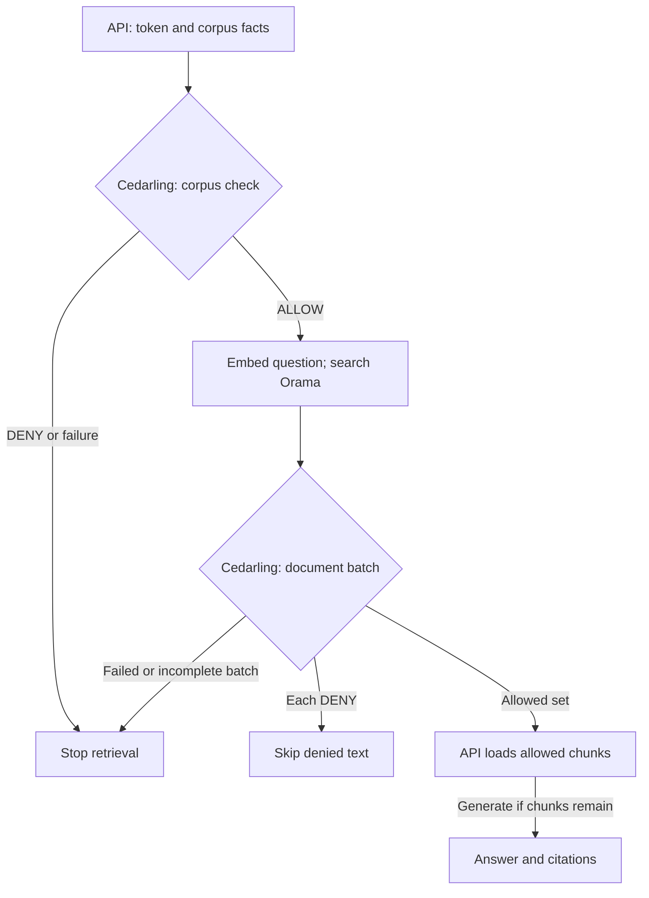

# Prevent Cross-Tenant RAG Leaks with Cedarling

Hi there! We've got a service that searches documents and uses an AI model to
answer questions. It serves people from different tenants, each with their own
documents and access rules. We'll use Cedarling to check which documents each
person may read.

In the starting service, Mallory can ask about Tenant A's support records despite
belonging to Tenant B. Even within Tenant A, Leo can retrieve confidential
documents reserved for Ada.

We'll close both gaps with Cedarling: check the caller's access to the selected
document collection (corpus) before embedding or searching. Then we'll check each
document's tenant, corpus, and permitted readers before loading text. We'll follow Mallory's
request through that change and compare Ada's and Leo's results. By the end,
denied text will stay out of model input and citations, while permitted
documents remain available. The model must never decide access.

## Build the integration or try the finished app

- To build the integration, start with [Run the starting application](#run-the-starting-application), then add policies and retrieval checks.
- To try the finished app, run the [finished project on main](https://github.com/GluuFederation/cedarling-tutorials/tree/main/p2-tenantrag) using its README, then go to [Check which documents each user can retrieve](#check-which-documents-each-user-can-retrieve). This version already uses Cedarling.

If you're building from the starting project, open each **Required step** section
and complete its instructions before continuing. These sections contain the files
and changes we'll need.

<details>
<summary>What you'll need</summary>

- Git, Node.js 24.21+ within 24.x, and pnpm 10.17.1 for the coding steps.
- Docker with Compose is optional for the baseline or finished example; the intermediate coding steps use native Node.js.
- Voyage AI and OpenRouter API keys for live retrieval. Indexing and requests consume provider quota; use fictional data only.
- Familiarity with TypeScript, HTTP APIs, access tokens, and the basics of retrieval-augmented generation.
- New to Cedarling? [Read the short introduction](https://cedarling.dev/learn/what-is-cedarling) when you need it.
- Keep the [Cedar policy syntax](https://docs.cedarpolicy.com/policies/syntax-policy.html) and [Cedar schema syntax](https://docs.cedarpolicy.com/schema/human-readable-schema.html) references handy while editing policies.

</details>

At each copying step, open the linked file on GitHub, choose **Raw**, and copy
its full contents into the stated destination in your baseline checkout. The
short examples explain the parts we'll focus on. Create missing parent
directories first. Paths and commands are relative to
`p2-tenantrag/`; repository-level `shared/` files go one directory above it.

## Meet the service and its users


_Ada can read a confidential document, Leo can use public Tenant A documents, and Mallory belongs to Tenant B._

P2 is a Node.js API that searches fictional PDFs and generates answers.
Voyage turns text into numeric vectors called embeddings. Orama searches those
vectors, and OpenRouter provides the answer model. There is no browser application.

- **Ada** belongs to Tenant A and may read its public documents and the
  confidential document explicitly shared with her.[^1]
- **Leo** belongs to Tenant A but may read only its public documents.
- **Mallory** belongs to Tenant B and must not retrieve Tenant A's documents.

"Public" means public within that tenant, not available to every caller.
The bundled Node.js `oidc-provider` handles sign-in and issues access tokens.
The API verifies a token, then looks up the caller's tenant in its repository;
the document metadata lists who may read confidential content.

Cedarling is the policy decision point (PDP). The retrieval service enforces
its decisions as the policy enforcement point (PEP). It checks both corpus and
document access with the same embedded Cedarling instance.

## Reproduce the leak before adding Cedarling

Let's try Mallory's cross-tenant question before adding those checks. We'll
inspect the citations as well as the answer, because model wording alone
cannot tell us which documents the service used.

### Run the starting application

Use a separate checkout so the exercise does not change your existing data:

```bash
git clone https://github.com/GluuFederation/cedarling-tutorials.git cedarling-p2
cd cedarling-p2
git switch --detach 21b0832be4b31271320df992d04e9d97667d0e38
cd p2-tenantrag
```

Put `P2_VOYAGE_API_KEY` and `P2_OPENROUTER_API_KEY` in the ignored project `.env`.
Keep their values out of source control and recordings.

For Docker, start the API and its IdP together:

```bash
docker compose up --build
```

For native baseline startup, use two terminals. In the first:

```bash
pnpm --dir ../shared/identity-provider install --frozen-lockfile
pnpm --dir ../shared/identity-provider build
pnpm install --frozen-lockfile
pnpm run setup
node --env-file=.local/idp/.env ../shared/identity-provider/dist/main.js
```

In the second, from `p2-tenantrag/`, run `pnpm dev`. Use one startup method at a
time. The API is `http://localhost:17002`; the IdP is `http://localhost:18002`.
With Docker, also install the project's host dependencies for the authentication
CLI using `pnpm install --frozen-lockfile`.

`pnpm run setup` builds the Orama corpus index from the fictional PDFs as part
of native setup; the first Docker startup builds it automatically. No separate
`corpus:reset` is needed for a fresh checkout. Preparing the corpus sends PDF
chunks to Voyage, and native setup also checks generation. Retrieval calls
consume provider quota. Use fictional questions: the embedding provider receives
your question, and generation receives
the question and selected evidence. The baseline does not yet filter that evidence
by the caller's permissions.

### Ask for another tenant's evidence

In a free terminal, authenticate as Mallory:

```bash
pnpm auth mallory
```

Open the displayed verification URL. The development IdP usually prefills
`mallory`; enter it if the field is empty. Use any non-empty password, such as
`cedarling-is-awesome`, then approve access. Copy the printed token into your
HTTP client's bearer-token field. We'll use [Postman](https://learning.postman.com/docs/use/send-requests/create-requests/request-basics);
any client that sends HTTP requests works:

```http
POST http://localhost:17002/v1/retrievals
Authorization: Bearer <access-token>
Content-Type: application/json

{
  "corpusId": "tenant-a-support",
  "query": "How should customer retrieval data be isolated?",
  "limit": 3
}
```

The baseline authenticates Mallory but doesn't check whether she may search
Tenant A or read its documents. It can load their text and send it to the model
for her. Inspect the returned citations as well as the answer.

Capture the request and any Tenant A citations. A provider error proves neither
a leak nor a denial; retry a failed generation request. Don't rebuild the corpus
to retry a response: rebuilding consumes Voyage quota. Stop the baseline before
editing. For Docker, use `Ctrl+C`, then `docker compose down` without removing
its volume, and install the native dependencies above for the coding steps.

## Give the server the document permissions it needs

Mallory's request shows why checking sign-in is not enough. To add the missing
permission checks, open the baseline's
[`src/rag/retrieval.ts`](https://github.com/GluuFederation/cedarling-tutorials/blob/21b0832be4b31271320df992d04e9d97667d0e38/p2-tenantrag/src/rag/retrieval.ts).
It looks up the corpus before embedding the question and loads document metadata
before reading text. Those are the two places we'll ask Cedarling for a decision.
The confidential-document rule also needs a list of permitted readers.

We'll first make the document's reader permissions available to retrieval.

<details>
<summary>Required step: Update document metadata and index preparation</summary>

Replace these existing files with their complete linked contents:

- [`src/rag/fixtures.ts`](https://github.com/GluuFederation/cedarling-tutorials/blob/main/p2-tenantrag/src/rag/fixtures.ts) assigns users to tenants and adds confidential readers to documents.
- [`src/rag/types.ts`](https://github.com/GluuFederation/cedarling-tutorials/blob/main/p2-tenantrag/src/rag/types.ts) defines the permission metadata types.
- [`src/rag/pdf.ts`](https://github.com/GluuFederation/cedarling-tutorials/blob/main/p2-tenantrag/src/rag/pdf.ts) carries that metadata through PDF extraction.
- [`src/rag/repository.ts`](https://github.com/GluuFederation/cedarling-tutorials/blob/main/p2-tenantrag/src/rag/repository.ts) resolves current document and caller facts.
- [`src/rag/corpus.ts`](https://github.com/GluuFederation/cedarling-tutorials/blob/main/p2-tenantrag/src/rag/corpus.ts) binds the search index to its text and metadata.
- [`src/rag/setup.ts`](https://github.com/GluuFederation/cedarling-tutorials/blob/main/p2-tenantrag/src/rag/setup.ts) rebuilds and verifies the corpus.

</details>

These files add reader permissions to the index without changing the fictional
PDF content. They map Ada and Leo to Tenant A and Mallory to Tenant B. Only Ada
may read the confidential Aster document:

```ts
// src/rag/fixtures.ts (confidential Aster document)
confidentialReaderSubjects: ["ada"],
```

That permission comes from the server's sample data, never the HTTP request.
It is available before loading document text. We'll rebuild the index once
the integration files are in place so the new metadata reaches retrieval.

## Decide which evidence each caller may use

The server can now supply tenant and reader facts. We'll use them in two rules:
one for searching a corpus, and another for loading each candidate document.

### Create the policy store

Let's create `policy-store/` at the project root, following the
[directory-based policy-store format](https://docs.jans.io/stable/cedarling/reference/cedarling-policy-store/#2-new-directory-based-format):

```text
policy-store/
  metadata.json
  schema.cedarschema
  policies/
    server-access.cedar
  trusted-issuers/
    tutorial-idp.json
```

<details>
<summary>Required step: Create the four policy-store files</summary>

Create these files and copy their complete linked contents:

- [`policy-store/metadata.json`](https://github.com/GluuFederation/cedarling-tutorials/blob/main/p2-tenantrag/policy-store/metadata.json) identifies the store and version.
- [`policy-store/schema.cedarschema`](https://github.com/GluuFederation/cedarling-tutorials/blob/main/p2-tenantrag/policy-store/schema.cedarschema) defines token, corpus, document, and context types.
- [`policy-store/policies/server-access.cedar`](https://github.com/GluuFederation/cedarling-tutorials/blob/main/p2-tenantrag/policy-store/policies/server-access.cedar) contains the corpus and document permission rules.
- [`policy-store/trusted-issuers/tutorial-idp.json`](https://github.com/GluuFederation/cedarling-tutorials/blob/main/p2-tenantrag/policy-store/trusted-issuers/tutorial-idp.json) maps tokens from P2's IdP.

</details>

The metadata identifies this store and version `1.0.0`. The schema defines the
request types. Both rules live in one policy file with distinct `@id`
annotations. Current document facts arrive in requests, so we need no default
entities or templates.

| Design question                        | P2 answer                                                                                       |
| -------------------------------------- | ----------------------------------------------------------------------------------------------- |
| What represents identity?              | Signed access token mapped as `P2TenantRAG::Access_token`                                       |
| Which issuer and audience are trusted? | P2 IdP at `http://localhost:18002`; audience `http://localhost:17002/api`                       |
| What operations exist?                 | `RAG::Action::"SearchCorpus"` and `RAG::Action::"RetrieveDocument"`                             |
| What does search target?               | `RAG::Corpus` with corpus and tenant IDs                                                        |
| What does retrieval target?            | `RAG::Document` with corpus, tenant, classification, and confidential readers                   |
| Which context is required?             | Server boundary, authenticated subject, current user tenant, selected corpus ID                 |
| What permits access?                   | Matching token identity and scope, tenant/corpus match, and document permission                 |
| What must deny?                        | Another tenant, missing scope, wrong token identity, or confidential content without permission |

The schema includes the token and issuer types Cedarling builds during JWT
processing. `RAG::Any` satisfies the action's principal-type declaration; it is
not another application user. Multi-issuer requests carry identity in `tokens`.

The copied `trusted-issuers/tutorial-idp.json` sets `openid_configuration_endpoint` to
`http://localhost:18002/.well-known/openid-configuration`. The trusted
`access_token` mapping uses `entity_type_name: "P2TenantRAG::Access_token"`,
`token_id: "jti"`, and required claims `iss`, `sub`, `aud`, `jti`, `exp`, and
`scope`.

### Check the tenant and document's readers

Let's follow the document rule, where Ada's and Leo's permissions differ.
This policy from `policies/server-access.cedar` checks verified token
claims against current application facts:

```cedar
// policy-store/policies/server-access.cedar
@id("server-retrieve-authorized-document")
permit(
  principal,
  action == RAG::Action::"RetrieveDocument",
  resource is RAG::Document
) when {
  context.boundary == "server" &&
  context has tokens &&
  context.tokens has p2tenantrag_access_token &&
  context.tokens.p2tenantrag_access_token.hasTag("sub") &&
  context.tokens.p2tenantrag_access_token.getTag("sub").contains(context.user.subject) &&
  context.tokens.p2tenantrag_access_token.hasTag("aud") &&
  context.tokens.p2tenantrag_access_token.getTag("aud").contains("http://localhost:17002/api") &&
  context.tokens.p2tenantrag_access_token has scope &&
  (context.tokens.p2tenantrag_access_token.scope == "document.retrieve" ||
   context.tokens.p2tenantrag_access_token.scope like "document.retrieve *" ||
   context.tokens.p2tenantrag_access_token.scope like "* document.retrieve" ||
   context.tokens.p2tenantrag_access_token.scope like "* document.retrieve *") &&
  context.selected_corpus_id == resource.corpus_id &&
  context.user.tenant_id == resource.tenant_id &&
  (resource.classification == "public" ||
    (resource.classification == "confidential" &&
      resource.confidential_reader_subjects.contains(context.user.subject)))
};
```

Ada and Leo have valid P2 tokens and belong to Tenant A. For `a-confidential`,
the tenant matches both users, but only Ada's subject appears in
`confidential_reader_subjects`. Leo fails that last condition. Mallory's Tenant
B account fails the tenant comparison even with a valid token.

Cedarling generates the context key `p2tenantrag_access_token`. Dynamic `sub`
and `aud` claims use tags; `scope` is a list of names separated by spaces. The rule looks
for the complete scope name `document.retrieve`, so a different name such as
`document.retrieve.extra` does not grant retrieval.

The other policy, `server-search-tenant-corpus`, requires `corpus.search` with
the same token checks and matching corpus/tenant. It does not grant access to every
document in that corpus. No matching permit gives DENY; evaluation errors are
handled as failures.

### Choose an action and resource for each check

| Capability          | Identity            | Action                                                                                                                                                                                 | Resource                       | Context                                        | Effect waiting for ALLOW               |
| ------------------- | ------------------- | -------------------------------------------------------------------------------------------------------------------------------------------------------------------------------------- | ------------------------------ | ---------------------------------------------- | -------------------------------------- |
| `corpus.search`     | Caller access token | [`SearchCorpus`](https://github.com/GluuFederation/cedarling-tutorials/blob/main/p2-tenantrag/policy-store/policies/server-access.cedar#L2 "server-search-tenant-corpus")              | Resolved corpus                | Current user, selected corpus, server boundary | Query embedding and vector search      |
| `document.retrieve` | Same token          | [`RetrieveDocument`](https://github.com/GluuFederation/cedarling-tutorials/blob/main/p2-tenantrag/policy-store/policies/server-access.cedar#L25 "server-retrieve-authorized-document") | Each unique candidate document | Same trusted context                           | Load text for generation and citations |

The route chooses actions; the repository supplies tenants, classification, and
reader permissions. Neither the question nor model output supplies trusted facts.
Look up search results by document ID in the repository before building requests.

## Put Cedarling in the retrieval path

We have the rules. Next we'll load Cedarling and make retrieval wait for its
decisions in this order:



### Build the archive and load Cedarling

Install the pinned dependencies from the project directory:

```bash
pnpm add --save-exact @janssenproject/cedarling_wasm@0.0.468 fflate@0.8.3
pnpm add --save-dev --save-exact @cedar-policy/cedar-wasm@4.12.0
```

We'll use a shared builder to validate the policy files and package them for Cedarling.

<details>
<summary>Required step: Create the shared archive builder</summary>

Create these files in the repository-level `shared/` directory and copy their
complete linked contents:

- [`shared/policy-store.mjs`](https://github.com/GluuFederation/cedarling-tutorials/blob/main/shared/policy-store.mjs) validates and packages the policy store.
- [`shared/policy-store.d.mts`](https://github.com/GluuFederation/cedarling-tutorials/blob/main/shared/policy-store.d.mts) provides its TypeScript declarations.

</details>

Run the shared builder to create the archive:

```bash
node ../shared/policy-store.mjs
```

The command must finish without validation errors and create `.local/policy-store.cjar`.
Docker builds an archive from the same source files.

The complete `src/authorization.ts` in the next step initializes one
[Cedarling](https://www.npmjs.com/package/@janssenproject/cedarling_wasm/v/0.0.468)
instance. Here, `policyStorePath` comes from server configuration:

```ts
// src/authorization.ts
import { readFile } from "node:fs/promises";
import { initFromArchiveBytes } from "@janssenproject/cedarling_wasm";

const archive = new Uint8Array(await readFile(policyStorePath));
const cedarling = await initFromArchiveBytes(
  {
    CEDARLING_APPLICATION_NAME: "P2 TenantRAG server",
    CEDARLING_LOG_TYPE: "memory",
    CEDARLING_LOG_TTL: 300,
    CEDARLING_JWT_SIG_VALIDATION: "enabled",
    CEDARLING_JWT_SIGNATURE_ALGORITHMS_SUPPORTED: ["RS256"],
    CEDARLING_STRICT_SCHEMA_VALIDATION: "enabled",
    CEDARLING_TRUSTED_ISSUER_LOADER_TYPE: "SYNC",
  },
  archive,
);
if (cedarling.loadedTrustedIssuersCount() < 1) {
  await cedarling.shutDown();
  throw new Error("P2 trusted issuer did not load");
}
```

The IdP must be running before initialization. The complete module logs the
archive version and SHA-256 at startup and calls `shutDown()` on application
shutdown. `src/runtime.ts` supplies these authorization functions to retrieval.

### Check the corpus before searching

Let's connect the initialized instance to retrieval. Copy these files together;
then we'll trace the corpus check and the document batch through them.

<details>
<summary>Required step: Add authorization and update the retrieval service</summary>

Create [`src/authorization.ts`](https://github.com/GluuFederation/cedarling-tutorials/blob/main/p2-tenantrag/src/authorization.ts)
and copy its full contents to load Cedarling, build requests, and collect decisions.
Replace these existing files with their complete linked contents:

- [`src/runtime.ts`](https://github.com/GluuFederation/cedarling-tutorials/blob/main/p2-tenantrag/src/runtime.ts) connects authorization to retrieval and shutdown.
- [`src/rag/retrieval.ts`](https://github.com/GluuFederation/cedarling-tutorials/blob/main/p2-tenantrag/src/rag/retrieval.ts) enforces corpus and document decisions before loading text.
- [`src/rag/trace.ts`](https://github.com/GluuFederation/cedarling-tutorials/blob/main/p2-tenantrag/src/rag/trace.ts) records retrieval counts without document text.
- [`src/app.ts`](https://github.com/GluuFederation/cedarling-tutorials/blob/main/p2-tenantrag/src/app.ts) handles HTTP requests and bounded errors.
- [`src/main.ts`](https://github.com/GluuFederation/cedarling-tutorials/blob/main/p2-tenantrag/src/main.ts) starts and closes the runtime.
- [`src/config/project-config.ts`](https://github.com/GluuFederation/cedarling-tutorials/blob/main/p2-tenantrag/src/config/project-config.ts) supplies the policy archive location.
- [`src/openapi.ts`](https://github.com/GluuFederation/cedarling-tutorials/blob/main/p2-tenantrag/src/openapi.ts) describes the retrieval responses and errors.
- [`src/auth/cli.ts`](https://github.com/GluuFederation/cedarling-tutorials/blob/main/p2-tenantrag/src/auth/cli.ts) handles CLI sign-in and its diagnostics.
- [`tsconfig.build.json`](https://github.com/GluuFederation/cedarling-tutorials/blob/main/p2-tenantrag/tsconfig.build.json) keeps source-run setup scripts out of the compiled build.

</details>

Inside the corpus authorization function, `principal` is the authenticated
caller, `profile` holds its stored permissions, and `corpus` is the stored record.
This expanded request shows what the completed `tokenSet()` and
`requestContext()` helpers provide:

```ts
// src/authorization.ts
const tokens = [
  { mapping: "P2TenantRAG::Access_token", payload: principal.accessToken },
];
const context = {
  boundary: "server",
  user: { subject: principal.id, tenant_id: profile.tenantId },
  selected_corpus_id: corpus.corpusId,
};
const result = await cedarling.authorizeMultiIssuer(
  JSON.stringify({
    tokens,
    action: 'RAG::Action::"SearchCorpus"',
    resource: {
      cedar_entity_mapping: {
        entity_type: "RAG::Corpus",
        id: corpus.corpusId,
      },
      corpus_id: corpus.corpusId,
      tenant_id: corpus.tenantId,
    },
    context,
  }),
);
for (const log of cedarling.getLogsByRequestId(result.request_id)) {
  console.info(JSON.stringify(log, null, 2));
}
if (result.response.diagnostics.errors.length > 0) {
  throw new Error("Cedarling returned policy evaluation errors");
}
return result.decision;
```

`authorizeMultiIssuer()` receives a JSON string, so `JSON.stringify()` turns
the request object into the format expected by the Cedarling JavaScript API.[^2]
The later `JSON.stringify(log, null, 2)` only formats nested log fields for this
local exercise.

In `src/rag/retrieval.ts`, the corpus check runs before query embedding:

```ts
// src/rag/retrieval.ts
if (
  !(await dependencies.authorization.authorizeCorpus(
    requestId,
    principal,
    profile,
    corpus,
  ))
) {
  throw corpusNotFound();
}
stage = "query.embedding";
const [queryEmbedding] = await dependencies.voyage.embed(
  [request.query],
  "query",
);
```

A false decision throws `corpus_not_found`, the same error as an unknown corpus.
If authorization throws an error, the surrounding handler returns `retrieval_unavailable`.
Neither case reaches `voyage.embed()` or the following `corpusSearch.search()`.

### Check each document before loading its text

An allowed corpus search can still return a document the caller may not read.
The retrieval service removes duplicate documents from the search results. Its document check
reuses the token set and context, submitting one item per document. In
`src/authorization.ts`, the expanded batch request looks like this:

```ts
// src/authorization.ts
const batch = await cedarling.authorizeMultiIssuerBatch(
  JSON.stringify({
    tokens,
    items: documents.map((document) => ({
      action: 'RAG::Action::"RetrieveDocument"',
      resource: {
        cedar_entity_mapping: {
          entity_type: "RAG::Document",
          id: document.documentId,
        },
        corpus_id: document.corpusId,
        tenant_id: document.tenantId,
        classification: document.classification,
        confidential_reader_subjects: document.confidentialReaderSubjects,
      },
      context,
    })),
  }),
);
```

The module checks `item.is_ok` before `item.unwrap()`, rejects diagnostic errors,
and collects decisions in submitted order. It prints Cedarling's logs using each
result's request ID. A successfully evaluated item can still contain DENY.

The service checks that every document received a decision, then loads text only
from the allowed set:

```ts
// src/rag/retrieval.ts
if (decisions.length !== uniqueDocuments.length)
  throw new Error("Cedarling returned an incomplete document batch");
const allowedDocuments = new Set(
  uniqueDocuments
    .filter((_document, index) => decisions[index])
    .map((document) => document.documentId),
);

const selected = candidates
  .filter((candidate) => allowedDocuments.has(candidate.documentId))
  .slice(0, Math.min(request.limit, 3));
stage = "content.load";
const chunks = selected.map((candidate) =>
  dependencies.repository.loadChunkText(candidate.chunkId),
);
```

Generation and citations use those same chunks. Denied documents cannot reach
either; an incomplete batch stops retrieval before any text loads.

Query bounds, the server-selected corpus filter, input validation, and provider
timeouts remain in place. Restart after policy edits; metadata or PDF changes
also require rebuilding the index, as in the next step.

## Rebuild the index and restart the app

The request path now enforces both decisions. Before we retry Mallory's request,
we need the archive in our startup paths and the reader grants in the index.

<details>
<summary>Required step: Update index preparation and startup</summary>

Create these files and copy their complete linked contents:

- [`scripts/prepare.ts`](https://github.com/GluuFederation/cedarling-tutorials/blob/main/p2-tenantrag/scripts/prepare.ts) prepares identity configuration and the policy archive without provider requests.
- [`scripts/preflight.ts`](https://github.com/GluuFederation/cedarling-tutorials/blob/main/p2-tenantrag/scripts/preflight.ts) checks the index before startup.
- [`scripts/dev.mjs`](https://github.com/GluuFederation/cedarling-tutorials/blob/main/p2-tenantrag/scripts/dev.mjs) starts the IdP and API together.

Replace these existing files with their complete linked contents:

- [`scripts/setup.ts`](https://github.com/GluuFederation/cedarling-tutorials/blob/main/p2-tenantrag/scripts/setup.ts) prepares configuration and verifies the live-provider corpus.
- [`Dockerfile`](https://github.com/GluuFederation/cedarling-tutorials/blob/main/p2-tenantrag/Dockerfile) includes the archive in the API image.
- [`compose.yaml`](https://github.com/GluuFederation/cedarling-tutorials/blob/main/p2-tenantrag/compose.yaml) starts the configured services with their readiness checks.
- [`shared/dev-supervisor.mjs`](https://github.com/GluuFederation/cedarling-tutorials/blob/main/shared/dev-supervisor.mjs), at repository root, manages native processes and readiness checks.

</details>

Apply the `build` entry shown below to your existing
[`package.json`](https://github.com/GluuFederation/cedarling-tutorials/blob/main/p2-tenantrag/package.json), keeping
the other dependencies and scripts. Also set `dev` to `node scripts/dev.mjs`.

The build runs the shared archive builder before TypeScript; the copied
Dockerfile includes that archive in the API image:

```json
{
  "scripts": {
    "build": "node ../shared/policy-store.mjs && tsc -p tsconfig.build.json"
  }
}
```

`scripts/prepare.ts` synchronizes the local IdP configuration and builds policies
without using AI quota. `scripts/preflight.ts` refuses startup if the index is
missing. The new `scripts/dev.mjs` starts both the IdP and API without rebuilding
the index, replacing the baseline's two-terminal native startup.

For this baseline checkout, rebuild the index once to include the reader grants:

```bash
pnpm corpus:reset
pnpm build
pnpm dev
```

`corpus:reset` consumes Voyage quota; the baseline index cannot be reused
unchanged. Stop the separate IdP terminal before `pnpm dev`, which now owns both
services. Wait for the API at `http://localhost:17002` before testing.

In a fresh finished checkout, use `pnpm run setup` instead: it builds the corpus
and sends a small request to check the provider. Repeat setup or `pnpm corpus:reset` only
when the PDF/index needs rebuilding.

## Check which documents each user can retrieve

Let's check the two rules separately: Mallory should stop at the corpus check,
while Ada and Leo should reach document checks with different results.

### Retry Mallory's request, then compare Ada and Leo

Authenticate as Mallory again to get a fresh token:

```bash
pnpm auth mallory
```

Complete sign-in and replace the bearer token in your HTTP client. P2 tokens
expire after 30 minutes, so the one from the baseline exercise may now return
`401 authentication_required` before Cedarling evaluates the request.

Repeat Mallory's original request for `tenant-a-support`. Expect **404** with
`error: "corpus_not_found"`, before embedding, search, or generation. An unknown
corpus has the same status and error code, not a guarantee of identical timing.

Now authenticate as Ada, then Leo, and send:

```http
POST http://localhost:17002/v1/retrievals
Authorization: Bearer <access-token>
Content-Type: application/json

{
  "corpusId": "tenant-a-support",
  "query": "What customer steps and internal corrective actions followed Aster's 12 September support-search interruption?",
  "limit": 3
}
```

The PDFs describe Aster in Tenant A and Beacon in Tenant B. Ada may read Aster's
confidential documents; Leo may not. Search results vary, so inspect document
decisions and citations rather than expecting a fixed answer or result order.

If Cedarling denies Leo access to a confidential document, must the whole
request fail? Check where the retrieval code filters documents, then compare
the outcomes below.

| Attempt                                  | Expected outcome                                  |
| ---------------------------------------- | ------------------------------------------------- |
| Mallory searches Tenant A                | Corpus DENY; 404; no remote retrieval work        |
| Ada retrieves candidate `a-confidential` | Document ALLOW                                    |
| Leo retrieves the same candidate         | Document DENY; its chunks never load              |
| Leo retrieves Tenant A public candidates | ALLOW; generation may use those chunks            |
| Leo selects `tenant-b-support`           | Corpus DENY, regardless of the question's wording |

A denied document does not deny the entire question. With no allowed chunks,
expect **200**, `answer: null`, and `citations: []`, without generation.
A **503 `retrieval_unavailable`** is instead a runtime or provider failure.
With the free OpenRouter model router, availability and answer quality vary;
retry a 503 before treating it as an application bug. A short answer such as
`"User Safety: safe"` is not the expected business answer and is not evidence
of authorization. Judge access by Cedarling decisions and citations, not the
model's wording. To try another model, set `P2_OPENROUTER_MODEL` in `.env`.
Paid routing requires both a paid model ID and
`P2_OPENROUTER_ALLOW_PAID=true`; use it only if you intend to spend your
OpenRouter credit. Adding credit alone leaves the configured
`openrouter/free` router unchanged.
Don't rerun `pnpm run setup` to retry generation: it rebuilds the corpus using Voyage quota.

### Read the retrieval and decision logs

To explain those differences, find the response's `requestId` in
`authorization.context`. Its
`cedarlingRequestId` matches Cedarling's `request_id`; document decisions also share
`batch_id`. For Leo's confidential-document attempt, the main Cedarling log fields
look like this:

```json
{
  "log_kind": "Decision",
  "action": "RAG::Action::\"RetrieveDocument\"",
  "resource": "RAG::Document::\"a-confidential\"",
  "decision": "DENY",
  "principal": [],
  "diagnostics": { "reason": [], "errors": [] }
}
```

Identity comes from tokens in these requests, so the principal array
is empty. An empty reason with no errors means no permit matched; it doesn't
list failed conditions. An allowed document names
`server-retrieve-authorized-document` in its reasons.

`retrieval.completed` reports candidates, documents evaluated, chunks loaded,
and model. `documentAuthorizationCount` is not a count of allowed documents.
`retrieval.failed` names the failed stage; provider failures include limited
provider details. Failure at `answer.generate` is not a Cedarling denial.
Capture only fictional data and remove tokens and secrets from recordings.

### Check denied text stays out of the result

We've checked live responses and their decisions. To verify that denied text
never reaches generation, use the automated checks in a separate checkout of the
[finished project on main](https://github.com/GluuFederation/cedarling-tutorials/tree/main/p2-tenantrag), install its locked project and shared IdP dependencies, then run:

```bash
pnpm check
```

This runs formatting, lint, types, tests, and build without provider keys.
The checks evaluate real Cedarling policies with signed test evidence. They
verify decision order, removal of denied text, empty results, and failed
or incomplete decisions using fixed provider responses. These are only for
tests; the application still needs live providers. Unsupported content
types also return `400 invalid_retrieval` before retrieval runs.

In that finished checkout, run setup and start the integrated app before
running `pnpm test:e2e`.
Approve the Ada, Leo, and Mallory sign-ins. This consumes provider quota and
checks document access, not identical model answers. Record Mallory's request
before and after integration, plus one successful authorized search.

<details>
<summary>Warning: Before deploying this application</summary>

Replace local HTTP and the bundled learning IdP with HTTPS and a configured
OIDC/OAuth issuer, such as [Jans Auth](https://docs.jans.io/stable/janssen-server/planning/use-cases/),
Gluu, Auth0, or Okta.

Use trusted user and permission records, review how providers handle data, and
protect logs. Setup sends the fictional corpus for embedding to build the index;
it does not check a caller's access to those documents. Cedarling controls access
to documents, not answer accuracy or prompt injection. A public document
containing instructions is still allowed content.

For a production stack, consider Agama Lab Policy Designer for policy authoring,
Jans Auth for issuing tokens, and Lock Server for centralized decision logs.
See [Cedarling production solutions](https://cedarling.dev/solutions).

These steps were prepared on Ubuntu 24.04+. Native project checks also run in CI
on macOS and Windows. If a platform-specific step fails,
[open an issue](https://github.com/GluuFederation/cedarling-tutorials/issues).

</details>

## What we've learned

Mallory's cross-tenant request now stops before embedding or search. Within
Tenant A, Ada can use confidential evidence while Leo receives only documents
he may read. We've separated permission to search a collection from permission
to load each document, and used the allowed chunks for both generation and
citations. A model failure remains a different outcome from a denied document.

For your own retrieval service, keep that order: check the collection, search,
check candidate documents against trusted metadata, then load allowed content.
The same checks apply when the destination is a report or another service
instead of an AI model.

In [P3](https://cedarling.dev/learn/govern-mcp-capabilities), we'll protect MCP
operations that let an assistant read information and change incident state.

[^1]: P2's confidential-reader rule uses the current document's `confidential_reader_subjects` set. Ada's subject is listed; Leo's is not. The application supplies this relationship for each authorization request.

[^2]: The pinned [`cedarling_wasm` JavaScript API](https://www.npmjs.com/package/@janssenproject/cedarling_wasm/v/0.0.468) accepts a JSON-string request. `JSON.stringify()` converts the request to JSON.
