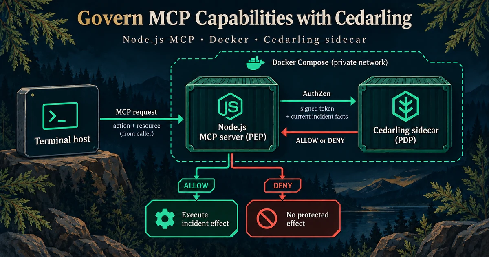
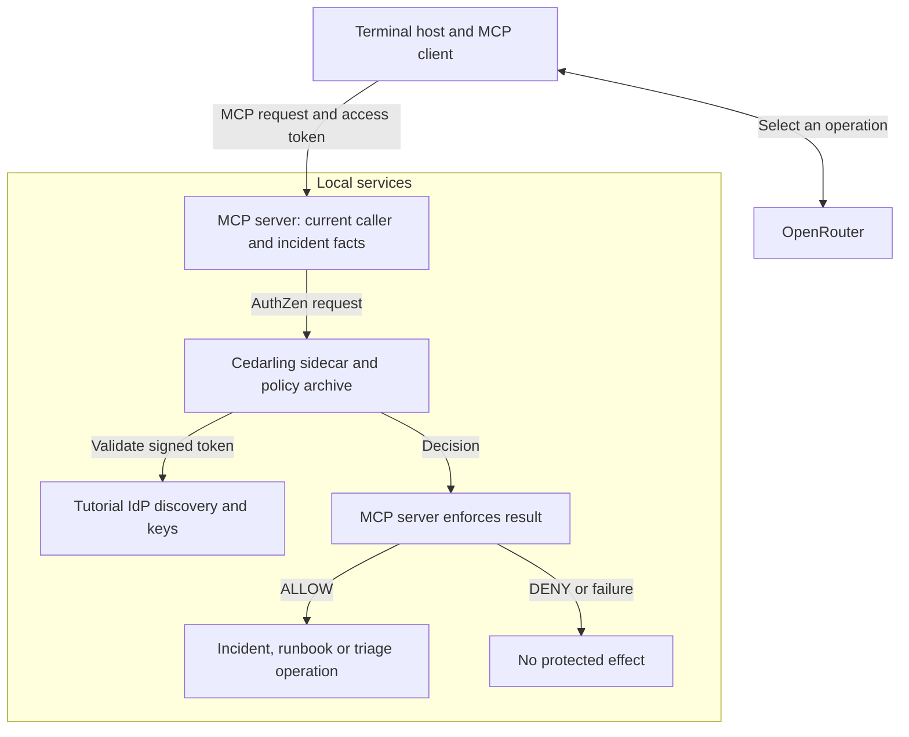

# P3 - Authorizing MCP Incident Operations with Cedarling



P3 is a terminal assistant for searching incidents, reading a runbook, preparing
triage, and updating incident status through MCP. The MCP server asks Cedarling
for permission before a tool, resource, or prompt returns content or changes
an incident.

Follow the [tutorial](docs/tutorials.md) to secure the [starting application](https://github.com/GluuFederation/cedarling-tutorials/tree/21b0832be4b31271320df992d04e9d97667d0e38/p3-mcp-capability-governance) with a [private Cedarling sidecar](https://docs.jans.io/stable/cedarling/developer/sidecar/cedarling-sidecar-overview/).

## Architecture



The server verifies the token and `mcp.access` scope, then sends signed identity
evidence and current account/incident facts to the sidecar. The model receives
neither the token nor control over those facts. Discovery and direct calls each
require permission; see the [enforcement walkthrough](docs/tutorials.md#check-permission-before-each-mcp-operation).

Compose builds `policy-store/` into `.local/policy-store.cjar` and mounts it
read-only in the sidecar. Only the MCP and IdP ports are published on host
loopback. These services share a network namespace for local learning.

## Prerequisites

- Node.js 24.21 or newer within 24.x and pnpm 10 on Ubuntu, macOS, or Windows.
- Docker Engine with Compose v2, or Docker Desktop. The pinned sidecar is
  `linux/amd64`; ARM Docker Desktop needs amd64 emulation.
- An OpenRouter API key in `P3_OPENROUTER_API_KEY` for interactive chat.

P3 starts its own tutorial IdP at `http://localhost:18003` and MCP service at
`http://localhost:17003/mcp`.

## Run

From this project directory, start the services:

```bash
docker compose up --build
```

Wait for the identity provider and Cedarling sidecar to be healthy. In another
terminal, prepare the host client:

```bash
pnpm install --frozen-lockfile
pnpm run setup
```

Set `P3_OPENROUTER_API_KEY` in the generated `.env`, then start a conversation:

```bash
pnpm chat dana
```

Chat defaults to `liquid/lfm-2.5-2.6b:free`. Set `P3_OPENROUTER_MODEL` to
another tool-calling model if needed. Paid routing requires
`P3_OPENROUTER_ALLOW_PAID=true`; otherwise the client keeps its zero-price cap
and has no paid fallback. Provider availability can vary.
The provider may retain prompts and responses for training; use only fictional
incident data.

Open the displayed verification URL, sign in as the chosen persona, and approve
access. The MCP endpoint is `http://localhost:17003/mcp`. Leave the service
terminal open while using chat.

## Exercise

- Dana (`dana`) is a supervisor who can operate on every incident.
- Amir (`amir`) is an analyst who can operate on assigned incidents.
- Eve (`eve`) can sign in but has no incident operations.

In `pnpm chat amir`, enter these prompts separately:

```text
Find incident INC-1001.
Read the incident response runbook.
Prepare triage for INC-1001.
Advance INC-1001 from open to investigating.
```

Confirm the status change with `y`; declining leaves the incident unchanged.
P3 advances one incident per request, not a bulk "resolve all" operation.

- **Dana:** `Find incident INC-2001.` returns the unassigned audit incident.
- **Amir:** `Find incident INC-2001.` returns no matching incident;
  `Prepare triage for INC-2001.` returns `authorization_denied`.
- **Eve:** `Find incident INC-1001.` reports no available operations without calling the model.

The model must return a valid operation selection before MCP can execute it.
Chat reports provider, quota, timeout, and invalid-response failures separately
from authorization denials.

The MCP server prints JSON `authorization.decision` or `authorization.failed`
records. The sidecar prints native Cedarling decisions with policy reasons and
separate request IDs. The [log guide](docs/tutorials.md#read-the-server-and-sidecar-logs)
explains how to read both streams.

Incident statuses advance through `open` → `investigating` → `mitigated` → `resolved`. A sidecar failure denies access without changing incidents.

Stop and restart the stack with `docker compose down`, then
`docker compose up --build`, to restore incident fixtures. This also rebuilds
the archive after policy edits.

## Commands

| Command               | Purpose                                                      |
| --------------------- | ------------------------------------------------------------ |
| `pnpm run setup`      | Prepare host chat configuration                              |
| `pnpm dev`            | Build and start the Compose service stack                    |
| `pnpm chat <persona>` | Start the terminal conversation                              |
| `pnpm build`          | Package policies and compile the MCP server and client       |
| `pnpm start`          | Start the Compose stack using existing images                |
| `pnpm test:e2e`       | Verify the real isolated Compose stack with a scripted model |
| `pnpm check`          | Run formatting, lint, types, tests, and build                |

## Verify

```bash
pnpm check
pnpm test:e2e
pnpm audit --audit-level low
```

The end-to-end check uses real signed tokens and the pinned sidecar. It verifies
allowed and denied operations, direct-call bypass attempts, sidecar outage and
recovery, and unchanged protected state. It needs no OpenRouter key and removes
only its own temporary containers and volumes.
