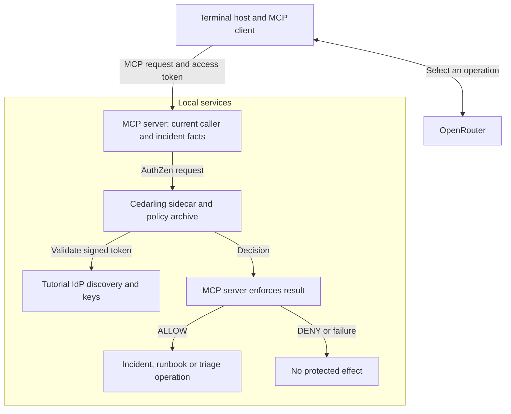

# Govern MCP Capabilities with Cedarling

Thanks for joining us! We'll use an incident assistant to see how Cedarling
checks what a team member may do. Dana supervises the team's incidents, while
Amir works on those assigned to him.

Amir types `y` to confirm an incident update. The assistant carries it out,
although nobody assigned that incident to him. Confirmation tells us what Amir
wants to do; the starting MCP server still needs to check whether he may do it.

We'll add server checks using a private Cedarling sidecar. Supervisors and
analysts may discover operations, search, and read the runbook. Reading,
updating, or preparing triage for an incident also requires a supervisor role
or the analyst's current assignment. Eve has no incident permissions and must
not reach these operations. We'll retry Amir's update, then check his assigned
work still succeeds, including calls without the chat interface.

## Build the integration or try the finished app

- To build the integration, start with [Run the starting application](#run-the-starting-application), then add the policies and sidecar calls.
- To try the finished app, run the [complete tagged project](https://github.com/GluuFederation/cedarling-tutorials/tree/p3-mcp-capability-governance-v1.0.1/p3-mcp-capability-governance) using its README, then go to [Check assigned and unassigned incidents](#check-assigned-and-unassigned-incidents). This version already uses Cedarling.

<details>
<summary>What you'll need</summary>

- Git, Node.js 24.21+ within 24.x, and pnpm 10.17.1.
- Docker with Compose is required: the completed PDP runs in a containerized Flask sidecar.[^1] The pinned image is `linux/amd64`; ARM Docker Desktop needs amd64 emulation.
- An OpenRouter API key for live chat. Keep paid routing disabled unless you choose to pay for requests.
- Familiarity with TypeScript, HTTP APIs, and access tokens.
- New to Cedarling? [Read the short introduction](https://cedarling.dev/learn/what-is-cedarling) when you need it.
- Keep the [Cedar policy syntax](https://docs.cedarpolicy.com/policies/syntax-policy.html) and [Cedar schema syntax](https://docs.cedarpolicy.com/schema/human-readable-schema.html) references handy while editing policies.

</details>

Copy whole files from GitHub's raw-file view into your baseline checkout; don't
switch to the finished tag. The short examples aren't complete replacements.
Create missing parent directories. Paths and commands are relative to
`p3-mcp-capability-governance/`; repository-level `shared/` files go one directory above it.

## Meet the incident assistant and its users


_Role and current assignment determine which MCP operations Dana, Amir, and Eve may use._

P3 is a terminal assistant backed by a Node.js MCP server.[^2] It searches incidents,
reads a runbook, prepares triage prompts, and advances incident status. We'll
use Cedarling to protect MCP tools, resources, and prompts.

- **Dana** is a supervisor who may work on every incident.
- **Amir** is an analyst who may work only on assigned incidents.
- **Eve** can sign in but has no permission to work on incidents.

`INC-1001` is an open payment incident assigned to Amir. `INC-2001` is an
unassigned audit incident in the mitigated state. Amir should not resolve the
second incident just because the model selected its update tool.

The bundled Node.js `oidc-provider` authenticates these users and issues their
access tokens. The MCP server looks up roles in its account map and assignments
in the incident repository; neither comes from the model.



The host and model request work. The MCP server controls data access and changes.
Cedarling supplies decisions; it does not call tools or update incidents.

## Try updating an unassigned incident


_The baseline validates the request but does not yet enforce the assignment rule._

### Run the starting application

Use a separate checkout with its own sample incidents:

```bash
git clone https://github.com/GluuFederation/cedarling-tutorials.git cedarling-p3
cd cedarling-p3
git switch --detach 21b0832be4b31271320df992d04e9d97667d0e38
cd p3-mcp-capability-governance
pnpm install --frozen-lockfile
pnpm run setup
```

Start the baseline server and its IdP with Docker Compose:

```bash
docker compose up --build
```

The MCP endpoint is `http://localhost:17003/mcp`; the IdP is
`http://localhost:18003`. Set `P3_OPENROUTER_API_KEY` in the host project's ignored
`.env` for interactive chat. In another terminal:

```bash
pnpm chat amir
```

Open the displayed verification URL. The development IdP usually prefills
`amir`; enter it if the field is empty. Use any non-empty password such as
`cedarling-is-awesome`, then approve access. Enter these
requests separately:

```text
Find incident INC-2001.
Advance INC-2001 from mitigated to resolved.
```

Confirm with `y` when asked. The baseline lets Amir find and change
this unassigned incident. It validates identity, input, confirmation, and the
state transition, but does not enforce the assignment rule.

A free provider may fail before making an MCP call. Retry or choose another
model; a provider failure does not prove authorization works. Answers and tool
choices vary, so check the incident state. Capture Amir's unauthorized update,
then stop the baseline with `docker compose down`. Restarting restores the sample incidents.

## Where should we check permission?

Open the baseline's
[`src/mcp/server.ts`](https://github.com/GluuFederation/cedarling-tutorials/blob/21b0832be4b31271320df992d04e9d97667d0e38/p3-mcp-capability-governance/src/mcp/server.ts)
and find the `update_incident_status` handler. After authentication and input
validation, it logs an ALLOW without checking permission, then calls the repository:

```ts
// src/mcp/server.ts (starting checkpoint)
const incident = services.incidents.updateStatus({
  incidentId,
  expectedStatus,
  nextStatus,
  idempotencyKey,
});
```

We'll ask the sidecar for permission before this call. Keep the terminal's
confirmation prompt. Also keep the status-change checks and retry protection
(idempotency) in
[`src/incidents/repository.ts`](https://github.com/GluuFederation/cedarling-tutorials/blob/21b0832be4b31271320df992d04e9d97667d0e38/p3-mcp-capability-governance/src/incidents/repository.ts).
Idempotency prevents the same change being applied twice. The server also needs
decisions before returning discovery, search results, runbook text, and triage prompts.

## Decide which MCP operations each user may perform


_The decision combines trusted identity with facts about the current incident._

### Choose an action and resource for each operation

Each action links to its policy. Requests use the signed caller token; roles and
assignments come from the server.

| Capability     | Identity            | Action                                                                                                                                                                                                                  | Resource                        | Trusted context                     | Protected effect                            |
| -------------- | ------------------- | ----------------------------------------------------------------------------------------------------------------------------------------------------------------------------------------------------------------------- | ------------------------------- | ----------------------------------- | ------------------------------------------- |
| Discover       | Signed caller token | [`Discover`](https://github.com/GluuFederation/cedarling-tutorials/blob/p3-mcp-capability-governance-v1.0.1/p3-mcp-capability-governance/policy-store/policies/incident-operations.cedar#L16 "operations-surface")      | `Service::"incident-assistant"` | Current caller subject and role     | Make MCP operations available to the caller |
| Search         | Same token          | [`Search`](https://github.com/GluuFederation/cedarling-tutorials/blob/p3-mcp-capability-governance-v1.0.1/p3-mcp-capability-governance/policy-store/policies/incident-operations.cedar#L16 "operations-surface")        | Same service                    | Same caller                         | Begin incident search                       |
| Read result    | Same token          | [`Read`](https://github.com/GluuFederation/cedarling-tutorials/blob/p3-mcp-capability-governance-v1.0.1/p3-mcp-capability-governance/policy-store/policies/incident-operations.cedar#L26 "incident-assignment")         | Each candidate `Incident`       | Same caller; assignment on resource | Return a matching incident summary          |
| Read runbook   | Same token          | [`ReadRunbook`](https://github.com/GluuFederation/cedarling-tutorials/blob/p3-mcp-capability-governance-v1.0.1/p3-mcp-capability-governance/policy-store/policies/incident-operations.cedar#L16 "operations-surface")   | `Runbook::"core"`               | Same caller                         | Return runbook content                      |
| Prepare triage | Same token          | [`Triage`](https://github.com/GluuFederation/cedarling-tutorials/blob/p3-mcp-capability-governance-v1.0.1/p3-mcp-capability-governance/policy-store/policies/incident-operations.cedar#L26 "incident-assignment")       | Current `Incident`              | Same caller; assignment on resource | Return an incident-specific prompt          |
| Update status  | Same token          | [`UpdateStatus`](https://github.com/GluuFederation/cedarling-tutorials/blob/p3-mcp-capability-governance-v1.0.1/p3-mcp-capability-governance/policy-store/policies/incident-operations.cedar#L26 "incident-assignment") | Current `Incident`              | Same caller; assignment on resource | Commit one valid transition                 |

All types and actions use namespace `P3IncidentAssistant`. The model can suggest
an incident ID; the server loads its assignment and the caller's role. Neither
comes from the model or caller JSON. The app still checks status changes and retries.

### Create the policy store

Create the [directory-based policy store](https://docs.jans.io/stable/cedarling/reference/cedarling-policy-store/#2-new-directory-based-format):

```text
policy-store/
  metadata.json
  schema.cedarschema
  policies/
    incident-operations.cedar
  trusted-issuers/
    tutorial-idp.json
```

Create the complete policy-store files from the pinned version:

- [`policy-store/metadata.json`](https://github.com/GluuFederation/cedarling-tutorials/blob/p3-mcp-capability-governance-v1.0.1/p3-mcp-capability-governance/policy-store/metadata.json)
- [`policy-store/schema.cedarschema`](https://github.com/GluuFederation/cedarling-tutorials/blob/p3-mcp-capability-governance-v1.0.1/p3-mcp-capability-governance/policy-store/schema.cedarschema)
- [`policy-store/policies/incident-operations.cedar`](https://github.com/GluuFederation/cedarling-tutorials/blob/p3-mcp-capability-governance-v1.0.1/p3-mcp-capability-governance/policy-store/policies/incident-operations.cedar)
- [`policy-store/trusted-issuers/tutorial-idp.json`](https://github.com/GluuFederation/cedarling-tutorials/blob/p3-mcp-capability-governance-v1.0.1/p3-mcp-capability-governance/policy-store/trusted-issuers/tutorial-idp.json)

Use the integration's metadata with policy version `1.0.0`. The schema defines
`Service`, `Runbook`, and `Incident`; only the incident needs an optional
`assigned_to` attribute. It also defines `Access_token`, `TrustedIssuer`, the
issuer URL shape, and context containing `caller` and optional generated tokens.
The actions use the token type as their principal type; the sidecar
request supplies a signed token rather than another user entity.

No default entities, templates, or custom issuers are needed. Current account and
incident facts are supplied by the MCP server.

For the pinned sidecar, `policy-store/trusted-issuers/tutorial-idp.json` uses
this exact shape:

```json
{
  "name": "P3IncidentAssistant",
  "description": "Shared Cedarling tutorial identity provider",
  "configuration_endpoint": "http://localhost:18003/.well-known/openid-configuration",
  "token_metadata": {
    "access_token": {
      "trusted": true,
      "entity_type_name": "P3IncidentAssistant::Access_token",
      "token_id": "jti",
      "required_claims": [
        "iss",
        "sub",
        "aud",
        "jti",
        "exp",
        "scope",
        "client_id"
      ]
    }
  }
}
```

Keep `configuration_endpoint` for discovery with this pinned sidecar. The MCP middleware verifies
the JWT and general `mcp.access` scope. Policies also check that the token's
subject, API audience, and client ID match this caller and application.

### Check the token, then the role and assignment

In `policies/incident-operations.cedar`, a forbid protects every operation if
required token evidence is missing or does not match:

```cedar
// policy-store/policies/incident-operations.cedar
@id("require-p3-access-token")
forbid(principal, action, resource) unless {
  context has tokens &&
  context.tokens has p3incidentassistant_access_token &&
  context.tokens.p3incidentassistant_access_token.hasTag("sub") &&
  context.tokens.p3incidentassistant_access_token.getTag("sub").contains(context.caller.subject) &&
  context.tokens.p3incidentassistant_access_token.hasTag("aud") &&
  context.tokens.p3incidentassistant_access_token.getTag("aud").contains("http://localhost:17003/mcp") &&
  context.tokens.p3incidentassistant_access_token.hasTag("client_id") &&
  context.tokens.p3incidentassistant_access_token.getTag("client_id").contains("p3-mcp-capability-governance-cli")
};
```

Then allow incident operations based on role and assignment:

```cedar
// policy-store/policies/incident-operations.cedar
@id("incident-assignment")
permit(principal, action in [
  P3IncidentAssistant::Action::"Read",
  P3IncidentAssistant::Action::"UpdateStatus",
  P3IncidentAssistant::Action::"Triage"
], resource is P3IncidentAssistant::Incident) when {
  context.caller.role == "supervisor" ||
  (context.caller.role == "analyst" && resource has assigned_to &&
    resource.assigned_to == context.caller.subject)
};
```

For Amir reading `INC-1001`, `context.caller.role` is `analyst` and
`resource.assigned_to` matches his subject, `amir`. The permit matches.
`INC-2001` has no assignment, so the analyst condition cannot permit access to it.
Both decisions still require the token's subject, audience, and client ID to
pass the identity rule above.

The remaining `operations-surface` permit covers `Discover`, `Search`, and
`ReadRunbook` for supervisor or analyst roles. Eve's `observer` role matches no
permit. Under [Cedar's policy rules](https://docs.cedarpolicy.com/policies/syntax-policy.html),
a matching forbid overrides any permit, and no matching permit gives DENY.

## Connect the MCP server to Cedarling


_The MCP server is the enforcement point; the sidecar returns authorization decisions._

### Prepare the private sidecar

The Node.js app calls the sidecar's AuthZEN-style HTTP endpoint.[^3]
Cedarling decides in Flask; the MCP server enforces the result.
Compose pins this Docker image:

```text
ghcr.io/janssenproject/jans/cedarling-flask-sidecar:2.4.1-1@sha256:501d5bc88e8a0b67cbab314b31c787f94b6c4ad9f16a77ec81d0e183b2645f0b
```

Save the repository-level archive builder and its declaration:

- [`shared/policy-store.mjs`](https://github.com/GluuFederation/cedarling-tutorials/blob/p3-mcp-capability-governance-v1.0.1/shared/policy-store.mjs)
- [`shared/policy-store.d.mts`](https://github.com/GluuFederation/cedarling-tutorials/blob/p3-mcp-capability-governance-v1.0.1/shared/policy-store.d.mts)

Install its build dependencies from P3:

```bash
pnpm add --save-dev --save-exact fflate@0.8.3 @cedar-policy/cedar-wasm@4.12.0
node ../shared/policy-store.mjs
```

The builder and Dockerfile create the same `.local/policy-store.cjar` archive.
Compose's `policy-store` service runs once to put it in a
volume mounted read-only by Cedarling. Keep the readable source in Git and the
generated local `.cjar` ignored.

`sidecar-bootstrap.json` selects `/policy-store/policy-store.cjar`, enables JWT
signature and strict schema validation, accepts RS256, and loads trusted issuers
before accepting requests. Cedarling's logs go to standard output. The bootstrap sets
`CEDARLING_TOKEN_CACHE_MAX_TTL` to `1800`, matching the thirty-minute tutorial
tokens. Compose sets `SIDECAR_DEBUG_RESPONSE=False`.

In the integrated `compose.yaml`, the MCP server and Cedarling join the
IdP's network namespace. The sidecar binds `127.0.0.1:5000` there. Only application
port 17003 and IdP port 18003 are published on host loopback. The sidecar is not
published. Compose waits for the IdP and archive before starting Cedarling,
then waits for Cedarling readiness before starting the MCP server.

JWT validation establishes the request subject; it does not authenticate every
service that can reach the sidecar. This local trust boundary includes the IdP.

### Send current facts to the Cedarling sidecar

Save these complete files together to connect the permission checks:

- [`src/mcp/authorization.ts`](https://github.com/GluuFederation/cedarling-tutorials/blob/p3-mcp-capability-governance-v1.0.1/p3-mcp-capability-governance/src/mcp/authorization.ts)
- [`src/mcp/server.ts`](https://github.com/GluuFederation/cedarling-tutorials/blob/p3-mcp-capability-governance-v1.0.1/p3-mcp-capability-governance/src/mcp/server.ts)
- [`src/mcp/availability.ts`](https://github.com/GluuFederation/cedarling-tutorials/blob/p3-mcp-capability-governance-v1.0.1/p3-mcp-capability-governance/src/mcp/availability.ts)
- [`src/auth/token-verifier.ts`](https://github.com/GluuFederation/cedarling-tutorials/blob/p3-mcp-capability-governance-v1.0.1/p3-mcp-capability-governance/src/auth/token-verifier.ts)
- [`src/incidents/types.ts`](https://github.com/GluuFederation/cedarling-tutorials/blob/p3-mcp-capability-governance-v1.0.1/p3-mcp-capability-governance/src/incidents/types.ts)
- [`src/incidents/repository.ts`](https://github.com/GluuFederation/cedarling-tutorials/blob/p3-mcp-capability-governance-v1.0.1/p3-mcp-capability-governance/src/incidents/repository.ts)
- [`src/mcp/schemas.ts`](https://github.com/GluuFederation/cedarling-tutorials/blob/p3-mcp-capability-governance-v1.0.1/p3-mcp-capability-governance/src/mcp/schemas.ts)
- [`src/app.ts`](https://github.com/GluuFederation/cedarling-tutorials/blob/p3-mcp-capability-governance-v1.0.1/p3-mcp-capability-governance/src/app.ts)
- [`src/main.ts`](https://github.com/GluuFederation/cedarling-tutorials/blob/p3-mcp-capability-governance-v1.0.1/p3-mcp-capability-governance/src/main.ts)
- [`src/config/project-config.ts`](https://github.com/GluuFederation/cedarling-tutorials/blob/p3-mcp-capability-governance-v1.0.1/p3-mcp-capability-governance/src/config/project-config.ts)
- [`tsconfig.build.json`](https://github.com/GluuFederation/cedarling-tutorials/blob/p3-mcp-capability-governance-v1.0.1/p3-mcp-capability-governance/tsconfig.build.json)

Remove `src/mcp/trace.ts`; the completed handlers no longer use it.

An AuthZEN-style decision request has a subject, action, resource, and context,
and the response contains a boolean decision.[^3] In this Cedarling sidecar
integration, the subject also carries a signed access token with a named token
mapping, and the resource carries `cedar_entity_mapping` plus current incident
facts. Those mapping properties and the `/cedarling/evaluation` path are
Cedarling-specific; do not treat them as generic AuthZEN fields. A valid true
decision allows the MCP server to continue; DENY or an unavailable response
must stop the operation before it returns data or changes an incident.

In the copied `src/mcp/authorization.ts`, `auth` is verified MCP authentication,
`subject` identifies the signed-in user, `roles` is the server account map, and `resource`
was loaded by the operation. `action` is a server-selected action name. The
expanded HTTP call is:

```ts
// src/mcp/authorization.ts
const response = await fetch("http://127.0.0.1:5000/cedarling/evaluation", {
  method: "POST",
  headers: { "content-type": "application/json" },
  redirect: "error",
  signal: AbortSignal.timeout(2_000),
  body: JSON.stringify({
    subject: {
      type: "JWT",
      id: subject,
      properties: {
        tokens: [
          { mapping: "P3IncidentAssistant::Access_token", payload: auth.token },
        ],
      },
    },
    action: { name: `P3IncidentAssistant::Action::"${action}"` },
    resource: {
      type: resource.type,
      id: resource.id,
      properties: {
        cedar_entity_mapping: {
          entity_type: `P3IncidentAssistant::${resource.type}`,
          id: resource.id,
        },
        ...(resource.type === "Incident" && resource.assignedTo !== null
          ? { assigned_to: resource.assignedTo }
          : {}),
      },
    },
    context: { caller: { subject, role: roles[subject] } },
  }),
});
```

`JSON.stringify()` supplies the HTTP request body as JSON here.[^4]

The module rejects HTTP errors and timeouts, and requires a boolean `decision`
and object `context` in the response. This pinned sidecar can
report runtime failure in an HTTP 200 body with `context.id === "-1"`; the module
treats that as `authorization_unavailable`, not a policy denial. Only a valid
true decision permits the operation. For an unassigned incident, the request omits
the optional assignment instead of sending `null` to a string field.

### Check permission before each MCP operation

`src/mcp/server.ts` evaluates `Discover` before registering the caller's
operations. A denied caller receives an empty list of operations. Registering a tool
is not permission to use it against every resource.

- Search requires `Search`, then checks `Read` for each candidate incident before
  returning it. The result limit applies after authorization filtering.
- Runbook reads require `ReadRunbook` before returning text.
- Triage requires `Triage` on the incident loaded by the server before producing its prompt.
- Status updates require `UpdateStatus` before changing the stored incident.

The update handler waits for permission before calling the repository:

```ts
// src/mcp/server.ts
const current = currentIncident(incidentId);
await requireAllowed("UpdateStatus", {
  type: "Incident",
  id: current.id,
  assignedTo: current.assignedTo,
});
const incident = services.incidents.updateStatus({
  incidentId,
  expectedStatus,
  nextStatus,
  idempotencyKey,
});
```

`requireAllowed` throws on DENY; unavailable decisions also stop execution.
Before changing an incident, the repository still checks its current status,
one-step transitions, and repeated requests. An earlier ALLOW cannot make an
outdated state valid.

The terminal host owns confirmation and its idempotency key. A model-provided
`confirmed` value cannot replace the user's confirmation. OAuth credentials never
enter model messages.

## Finish setup and start the integrated stack

Save the runtime preparation and packaging files:

- [`src/chat/host.ts`](https://github.com/GluuFederation/cedarling-tutorials/blob/p3-mcp-capability-governance-v1.0.1/p3-mcp-capability-governance/src/chat/host.ts)
- [`scripts/setup.mjs`](https://github.com/GluuFederation/cedarling-tutorials/blob/p3-mcp-capability-governance-v1.0.1/p3-mcp-capability-governance/scripts/setup.mjs)
- [`Dockerfile`](https://github.com/GluuFederation/cedarling-tutorials/blob/p3-mcp-capability-governance-v1.0.1/p3-mcp-capability-governance/Dockerfile)
- [`compose.yaml`](https://github.com/GluuFederation/cedarling-tutorials/blob/p3-mcp-capability-governance-v1.0.1/p3-mcp-capability-governance/compose.yaml)
- [`sidecar-bootstrap.json`](https://github.com/GluuFederation/cedarling-tutorials/blob/p3-mcp-capability-governance-v1.0.1/p3-mcp-capability-governance/sidecar-bootstrap.json)

Remove `scripts/dev.mjs`. In `package.json`, set `dev` to
`docker compose up --build` and `start` to `docker compose up`, then apply the
`build` entry below. Keep the other dependencies and scripts; the
[tagged manifest](https://github.com/GluuFederation/cedarling-tutorials/blob/p3-mcp-capability-governance-v1.0.1/p3-mcp-capability-governance/package.json)
shows the completed configuration:

```json
{
  "scripts": {
    "build": "node ../shared/policy-store.mjs && tsc -p tsconfig.build.json"
  }
}
```

The host `scripts/setup.mjs` prepares chat configuration; Compose's configure
service prepares the container IdP configuration. Host setup must not rewrite
that container's issuer. `pnpm dev` runs Compose; `pnpm chat amir` remains a host
command. Greetings can return a short help response without an MCP operation.

Run `pnpm build`, then `pnpm run setup` and `pnpm dev` from the host.
Wait for the IdP, archive service, sidecar, and MCP server to become ready.
Then run `pnpm chat amir` to check assigned and unassigned incidents.

## Check assigned and unassigned incidents


_An assigned incident and an unassigned incident produce different decisions for Amir._

### Complete Amir's assigned work

The client defaults to `liquid/lfm-2.5-2.6b:free` with free routing.
To try another free tool-calling model, set `P3_OPENROUTER_MODEL` in
`.env`. A paid model requires both a paid model ID and
`P3_OPENROUTER_ALLOW_PAID=true`; do this only if you intend to use your paid
credit. Model answers and tool choices can differ even when the authorization
result is the same. The provider may retain prompts for training; use only
fictional incident data.

With fresh sample incidents, enter separately:

```text
Find incident INC-1001.
Read the incident response runbook.
Prepare triage for INC-1001.
Advance INC-1001 from open to investigating.
```

Confirm only the intended update with `y`. Find the incident again to verify its
new status. Declining confirmation must leave it unchanged.

Now repeat Amir's baseline attempt on `INC-2001`. Search returns no matching
incident. Triage or update attempts are denied; its mitigated state is unchanged.

Dana has no assignment to `INC-2001` either. Can she advance it? Check the
supervisor condition in the policy before trying the cases below:

| Caller and attempt                            | Expected outcome                                |
| --------------------------------------------- | ----------------------------------------------- |
| Dana reads or advances `INC-2001`             | ALLOW, subject to its current valid transition  |
| Amir reads or advances assigned `INC-1001`    | ALLOW, subject to confirmation and state checks |
| Amir triages or updates unassigned `INC-2001` | DENY                                            |
| Eve discovers operations                      | Empty surface; host does not call the model     |
| Direct unauthorized MCP invocation            | No incident data returned or changed            |
| Sidecar timeout or malformed decision         | Unavailable; operation stopped                  |

### Read the server and sidecar logs

The MCP server prints formatted `authorization.decision` records with
`requestId`, `actorId`, action, resource, and ALLOW or DENY. One application
request can perform both discovery and an operation, producing several decisions.
Discovery repeats because the server handles each request independently.

Cedarling's own sidecar records contain the policy-store ID and
`diagnostics.reason`. An allowed assigned-incident action cites
`incident-assignment`. An unassigned analyst can receive DENY with no
matching permit and an empty reason. If token identity checks fail, the forbid
can appear as the policy that determined the denial.

Application and sidecar request IDs are separate in this integration.
Do not match their logs by ID. For a recording, run one operation at a time and
compare the user, action, resource, request order, and policy reasons.
Check the returned incident state too: an ALLOW does not prove it changed.
`authorization.failed` separates connection or runtime failures from policy denials
without printing tokens or raw sidecar errors.

### Try direct calls and a sidecar outage

Keep a before-and-after capture of Amir's attempt to resolve unassigned
`INC-2001`, plus a successful update to assigned `INC-1001`. A denial matters
only when the incident remains unchanged. An MCP client with a valid Amir token
must not be able to bypass this by calling `update_incident_status` directly
with `incidentId: "INC-2001"`, `expectedStatus: "mitigated"`, and
`nextStatus: "resolved"`; the same server-side gate handles direct and
model-selected calls.

To try a sidecar outage, stop only the sidecar with
`docker compose stop cedarling`, then attempt an otherwise permitted operation.
The server must report authorization unavailable and leave the incident
unchanged. Restore it with `docker compose start cedarling`. Restart the stack
between exercises to restore sample incidents; a resolved incident cannot be
resolved again.

## Protect other agent tools at the server


_Protect MCP discovery and execution at the server boundary, not in the model._

The component returning data or making a change must check permission, even when an
agent selected the operation and the user confirmed it. Cover discovery,
resources, and prompts as well as tools that change data.

Trace `src/mcp/authorization.ts`, `src/mcp/server.ts`,
`src/incidents/repository.ts`, `policy-store/`, and `compose.yaml` in the
[completed P3 project](https://github.com/GluuFederation/cedarling-tutorials/tree/p3-mcp-capability-governance-v1.0.1/p3-mcp-capability-governance).

For a production stack, consider Agama Lab Policy Designer for policy authoring,
Jans Auth for issuing tokens, and Lock Server for centralized decision logs.
See [Cedarling production solutions](https://cedarling.dev/solutions).

Next, P4 asks a related question about human workflows: may a publisher still
rely on an approval after the content or reviewer's authority has changed?

<details>
<summary>Warning: This setup is for local practice</summary>

- Local HTTP and the bundled IdP are for learning only. Production requires HTTPS and a configured OIDC/OAuth issuer, such as [Jans Auth](https://docs.jans.io/stable/janssen-server/planning/use-cases/), Gluu, Auth0, or Okta.
- Production needs a database that keeps incidents after restarts, managed user permissions, protected credentials, and stored audit logs. The lab keeps a fixed account map and incidents in memory; free-model chat may be unavailable.
- Across hosts, restrict the sidecar network and authenticate service connections with mTLS through a service mesh[^5] or reverse proxy. JWT validation alone does not establish which service is calling the sidecar.
- These steps were prepared on Ubuntu 24.04+. Native project checks also run in CI on macOS and Windows. If a platform-specific step fails, [open an issue](https://github.com/GluuFederation/cedarling-tutorials/issues).

</details>

[^1]: A [Cedarling sidecar](https://docs.jans.io/stable/cedarling/developer/sidecar/cedarling-sidecar-overview/) is a separate service that exposes Cedarling decisions to the application over HTTP. In P3, Docker Compose runs that service beside the MCP server.

[^2]: [MCP (Model Context Protocol)](https://modelcontextprotocol.io/specification/2026-07-28/) lets a client find and call server tools and access resources or prompts. P3 authorizes the server-controlled operation, not the model's wording.

[^3]: The [OpenID AuthZEN Authorization API](https://openid.net/specs/authorization-api-1_0-final.html) defines the decision request's subject, action, resource, and context and the response's decision. P3 uses the Cedarling sidecar's own endpoint and token/entity mapping fields to implement this pattern.

[^4]: Here `JSON.stringify()` creates the JSON body for an HTTP POST to the Cedarling sidecar. P3 uses the sidecar's AuthZen endpoint, not the `cedarling_wasm` JavaScript authorization method.

[^5]: [Mutual TLS (mTLS)](https://istio.io/latest/docs/concepts/security/#mutual-tls-authentication) authenticates both ends of a service connection. A service mesh can manage that transport between application and policy decision service; the local tutorial uses a private shared network namespace instead.
