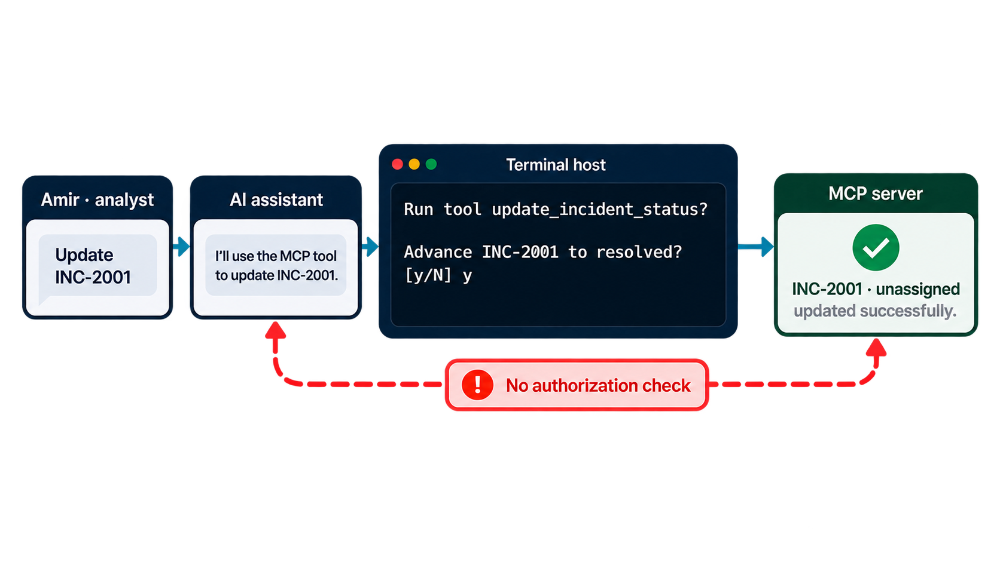
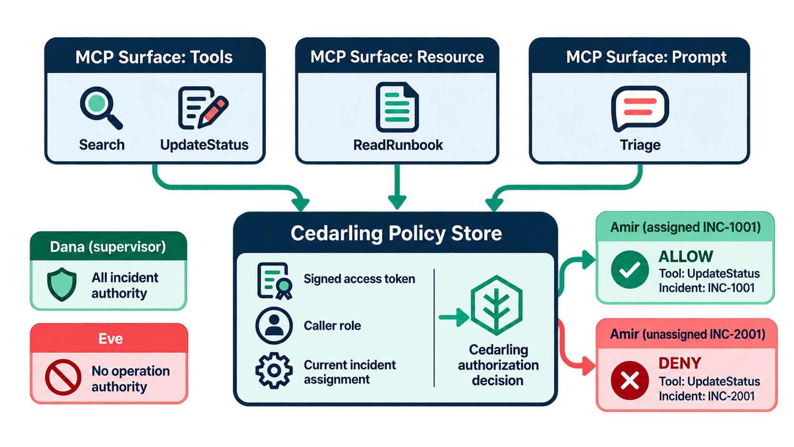
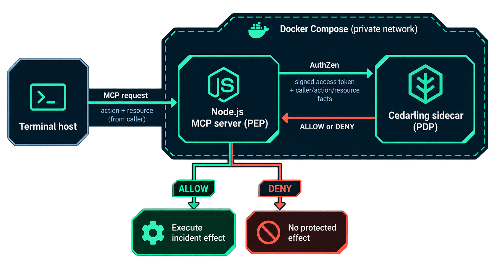
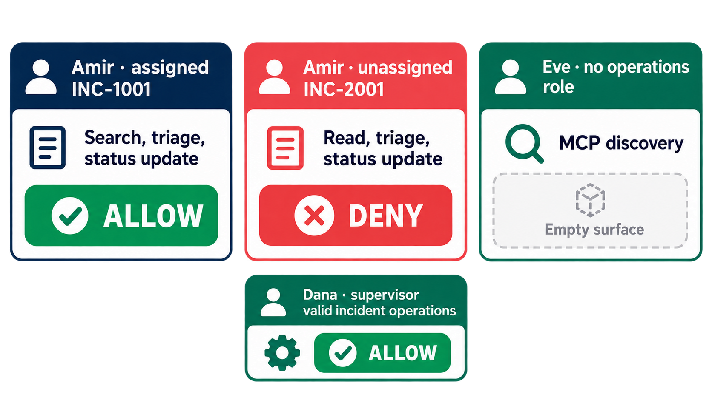
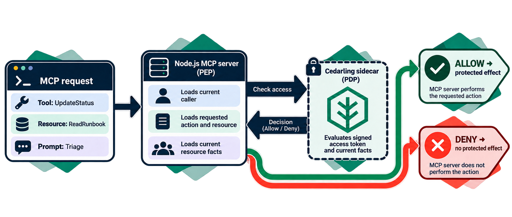

# Govern MCP Capabilities with Cedarling

<details>
<summary>Project source and prerequisites</summary>

- [Complete P3 project](https://github.com/GluuFederation/cedarling-tutorials/tree/p3-mcp-capability-governance-v1.0.0/p3-mcp-capability-governance) and [starting checkpoint](https://github.com/GluuFederation/cedarling-tutorials/tree/21b0832be4b31271320df992d04e9d97667d0e38/p3-mcp-capability-governance).
- Install Node.js 24.21+ within 24.x, pnpm 10.17.1, and Docker with Compose. Docker is required for the completed P3 stack because Cedarling runs in a containerized Flask sidecar.[^3] Live chat needs an OpenRouter API key. The pinned sidecar is `linux/amd64`, so ARM Docker Desktop needs amd64 emulation.
- Local HTTP and the bundled IdP are for learning only. Production requires HTTPS and a configured OIDC/OAuth issuer, such as [Jans Auth](https://docs.jans.io/stable/janssen-server/planning/use-cases/), Gluu, Auth0, or Okta.
- I prepared these steps on Ubuntu 24.04+. Native project checks also run in CI on macOS and Windows. If a platform-specific step fails, [open an issue](https://github.com/GluuFederation/cedarling-tutorials/issues).
- New to Cedarling? [Read the short introduction](https://cedarling.dev/learn/what-is-cedarling) when you need it.
- Keep the official [Cedar policy syntax](https://docs.cedarpolicy.com/policies/syntax-policy.html) and [Cedar schema syntax](https://docs.cedarpolicy.com/schema/human-readable-schema.html) references handy for the policy-store steps.

</details>

Paths are relative to `p3-mcp-capability-governance/` unless stated otherwise.
Interactive model availability, tool selection, and wording can vary. A free
provider may be temporarily unavailable; retry the request or choose another
free tool-calling model. If you already have paid OpenRouter credit, you may
explicitly opt in to a paid model. Neither choice changes the MCP server's
authorization rules or makes model output evidence of permission.

## What may an incident assistant do for its caller?


_Dana, Amir, and Eve illustrate how role and current assignment affect each MCP operation._

An assistant can choose a valid tool and still request an operation its caller
must not perform. Asking “Are you sure?” does not solve that problem. Confirmation
expresses intent; authorization establishes permission.

I'll use an incident assistant to show the gap, then protect the operation at
the MCP server where it actually takes effect.

P3 is a terminal assistant backed by a Node.js MCP server.[^1] It searches incidents,
reads a runbook, prepares triage prompts, and advances incident status. We will
use Cedarling to protect all three MCP surfaces: tools, resources, and prompts.

- **Dana** is a supervisor who may operate on every incident.
- **Amir** is an analyst who may operate only on assigned incidents.
- **Eve** can authenticate but has no incident-operation authority.

`INC-1001` is an open payment incident assigned to Amir. `INC-2001` is an
unassigned audit incident in the mitigated state. Amir should not resolve the
second incident merely because the model selected its update tool.

```text
Operator --> terminal host --> OpenRouter selects an operation
                   |
             MCP client + access token
                   |
   local Compose trust boundary
   +---------------------------------------------------------+
   | Node.js MCP server (PEP) --> Cedarling sidecar (PDP)      |
   |       |                       ^                         |
   |       | current caller,       | policy archive          |
   |       | action, resource      | signed token validation |
   |       |                                                 |
   |       +-- ALLOW --> incident / runbook / triage effect    |
   |       +-- DENY or failure --> no protected effect        |
   |                                                         |
   | Tutorial IdP shares this network namespace               |
   +---------------------------------------------------------+
```

The host and model request work. The MCP server controls the data and effects.
Cedarling supplies decisions; it does not invoke tools or update incidents.

## Show why authentication and confirmation are insufficient



_The baseline validates the request but does not yet enforce the assignment rule._

### Run the starting application

Use a separate checkout with disposable incident state:

```bash
git clone https://github.com/GluuFederation/cedarling-tutorials.git cedarling-p3
cd cedarling-p3
git switch --detach 21b0832be4b31271320df992d04e9d97667d0e38
cd p3-mcp-capability-governance
pnpm install --frozen-lockfile
pnpm run setup
```

Host commands require Node.js 24.21 or newer within 24.x and pnpm 10.17.1.
Start the baseline server and its IdP with Docker Compose:

```bash
docker compose up --build
```

The MCP endpoint is `http://localhost:17003/mcp`; the IdP is
`http://localhost:18003`. Set `P3_OPENROUTER_API_KEY` in the host project's ignored
`.env` for interactive chat. In another terminal:

```bash
pnpm chat amir
```

Open the displayed verification URL. The development IdP usually prefills
`amir`; enter it if the field is empty. Use any non-empty password such as
`cedarling-is-awesome`, then approve access. Enter these
requests separately:

```text
Find incident INC-2001.
Advance INC-2001 from mitigated to resolved.
```

Confirm with `y` when asked. The permissive baseline lets Amir find and change
this unassigned incident. It validates identity, input, confirmation, and the
state transition, but does not enforce the assignment rule.

A free provider may fail before producing an MCP call. Retry or choose another
model; that failure does not show authorization protection. Capture the
unauthorized incident change and note its business impact: an analyst changed
an incident he does not own. Stop
the baseline before running the integrated stack. `docker compose down` followed
by a fresh start restores P3's in-memory incident fixtures.

## Prepare the MCP server for a decision

No separate incident feature needs adding before Cedarling. The baseline already
authenticates the MCP caller, validates tool input, asks the terminal user to
confirm a status change, and enforces the incident's state transition and
idempotency key. In the update handler, a permissive trace sits immediately
before the existing mutation:[^6]

```ts
// src/mcp/server.ts (starting checkpoint)
const incident = services.incidents.updateStatus({
  incidentId,
  expectedStatus,
  nextStatus,
  idempotencyKey,
});
```

Keep those application checks. Do not put permission in the chat model or its
confirmation prompt. The MCP server will load the current incident and ask the
sidecar before this call; discovery, search results, runbook text, and triage
prompts need their own gates too.

## Define authority for each MCP boundary

We have now seen the authenticated but permissive starting point. From here,
we will add Cedarling: first the authority model, then a decision at every MCP
boundary, and finally the same unassigned-incident attempt as a comparison.



_The decision combines trusted identity with facts about the current incident._

### Model real resources, not model intentions

The business rule is small: operations staff can discover the service, search,
and read guidance; supervisors cover all incidents, while analysts cover only
their assignments. Eve receives no operations.

| Capability     | Identity            | Action         | Resource                        | Trusted context                     | Protected effect                   |
| -------------- | ------------------- | -------------- | ------------------------------- | ----------------------------------- | ---------------------------------- |
| Discover       | Signed caller token | `Discover`     | `Service::"incident-assistant"` | Current caller subject and role     | Register the caller's MCP surface  |
| Search         | Same token          | `Search`       | Same service                    | Same caller                         | Begin incident search              |
| Read result    | Same token          | `Read`         | Each candidate `Incident`       | Same caller; assignment on resource | Return a matching incident summary |
| Read runbook   | Same token          | `ReadRunbook`  | `Runbook::"core"`               | Same caller                         | Return runbook content             |
| Prepare triage | Same token          | `Triage`       | Current `Incident`              | Same caller; assignment on resource | Return an incident-specific prompt |
| Update status  | Same token          | `UpdateStatus` | Current `Incident`              | Same caller; assignment on resource | Commit one valid transition        |

All types and actions use namespace `P3IncidentAssistant`. The model can nominate
an incident ID; the server loads the incident and its assignment. Role comes from
the server's account profile, not the model or a caller-provided JSON field.
State-transition and idempotency checks remain application responsibilities.
The policy combines a role check with the current incident-to-analyst assignment;
the model's choice of tool or incident is never itself a grant.

### Build the policy store

Create the [directory-based policy store](https://docs.jans.io/stable/cedarling/reference/cedarling-policy-store/#2-new-directory-based-format):

```text
policy-store/
  metadata.json
  schema.cedarschema
  policies/
    incident-operations.cedar
  trusted-issuers/
    tutorial-idp.json
```

Create these four files from the completed policy store.[^7]
Use the integration's metadata with policy version `1.0.0`. The schema defines
`Service`, `Runbook`, and `Incident`; only the incident needs an optional
`assigned_to` attribute. It also defines `Access_token`, `TrustedIssuer`, the
issuer URL shape, and context containing `caller` and optional generated tokens.
The actions declare the token type in their principal vocabulary; the sidecar
request supplies signed evidence rather than constructing another user entity.

No default entities, templates, or custom issuers are needed. Current account and
incident facts are supplied by the MCP server.

For the pinned sidecar, `policy-store/trusted-issuers/tutorial-idp.json` uses
this exact shape:

```json
{
  "name": "P3IncidentAssistant",
  "description": "Shared Cedarling tutorial identity provider",
  "configuration_endpoint": "http://localhost:18003/.well-known/openid-configuration",
  "token_metadata": {
    "access_token": {
      "trusted": true,
      "entity_type_name": "P3IncidentAssistant::Access_token",
      "token_id": "jti",
      "required_claims": [
        "iss",
        "sub",
        "aud",
        "jti",
        "exp",
        "scope",
        "client_id"
      ]
    }
  }
}
```

Keep `configuration_endpoint` as used by this pinned sidecar, rather than copying
another runtime's issuer property name. The MCP authentication middleware verifies
JWT evidence and the coarse `mcp.access` scope. Policies additionally bind token
subject, API audience, and client ID to this caller and application.

### Require identity evidence as well as a business permit

In `policies/incident-operations.cedar`, a forbid protects every operation if
required signed evidence is missing or mismatched:

```cedar
// policy-store/policies/incident-operations.cedar
@id("require-p3-access-token")
forbid(principal, action, resource) unless {
  context has tokens &&
  context.tokens has p3incidentassistant_access_token &&
  context.tokens.p3incidentassistant_access_token.hasTag("sub") &&
  context.tokens.p3incidentassistant_access_token.getTag("sub").contains(context.caller.subject) &&
  context.tokens.p3incidentassistant_access_token.hasTag("aud") &&
  context.tokens.p3incidentassistant_access_token.getTag("aud").contains("http://localhost:17003/mcp") &&
  context.tokens.p3incidentassistant_access_token.hasTag("client_id") &&
  context.tokens.p3incidentassistant_access_token.getTag("client_id").contains("p3-mcp-capability-governance-cli")
};
```

Then grant incident operations only to the appropriate caller:

```cedar
// policy-store/policies/incident-operations.cedar
@id("incident-assignment")
permit(principal, action in [
  P3IncidentAssistant::Action::"Read",
  P3IncidentAssistant::Action::"UpdateStatus",
  P3IncidentAssistant::Action::"Triage"
], resource is P3IncidentAssistant::Incident) when {
  context.caller.role == "supervisor" ||
  (context.caller.role == "analyst" && resource has assigned_to &&
    resource.assigned_to == context.caller.subject)
};
```

The remaining `operations-surface` permit covers `Discover`, `Search`, and
`ReadRunbook` for supervisor or analyst roles. A permit cannot override a matching
forbid, and no matching permit gives DENY. These are
[Cedar policy semantics](https://docs.cedarpolicy.com/policies/syntax-policy.html),
not role checks in the chat model.

## Enforce the rules at the MCP server



_The MCP server is the enforcement point; the sidecar returns authorization decisions._

### Run the private sidecar

The Node.js application calls the sidecar's AuthZEN-style HTTP endpoint.[^4]
The policy decision point runs in the Dockerized Flask sidecar, not inside the
MCP server; the MCP server remains the enforcement point. Pin the Docker image:

```text
ghcr.io/janssenproject/jans/cedarling-flask-sidecar:2.4.1-1@sha256:501d5bc88e8a0b67cbab314b31c787f94b6c4ad9f16a77ec81d0e183b2645f0b
```

This image is `linux/amd64`; ARM Docker Desktop requires amd64 emulation. Add the
integration's shared `policy-store.mjs` builder and declaration at repository
level, and install its build dependencies from P3:

```bash
pnpm add --save-dev --save-exact fflate@0.8.3 @cedar-policy/cedar-wasm@4.12.0
node ../shared/policy-store.mjs
```

Run the builder before TypeScript compilation. In `Dockerfile`, use the build
artifact in the policy-store stage; Compose's one-shot `policy-store` service
places it in a volume mounted read-only by Cedarling. Keep the readable source
in Git and the generated local `.cjar` ignored.

`sidecar-bootstrap.json` selects `/policy-store/policy-store.cjar`, enables JWT
signature and strict schema validation, accepts RS256, and loads issuers
synchronously. Native logs go to standard output. Set
`CEDARLING_TOKEN_CACHE_MAX_TTL` to `1800`, matching the thirty-minute tutorial
tokens. Set `SIDECAR_DEBUG_RESPONSE=False` in Compose.

Use the integrated `compose.yaml` topology: the MCP server and Cedarling join the
IdP's network namespace. The sidecar binds `127.0.0.1:5000` there. Only application
port 17003 and IdP port 18003 are published on host loopback. The sidecar is not
published. Wait for the IdP and archive before starting Cedarling, then wait for
Cedarling readiness before starting the MCP server.

JWT validation establishes the request subject; it does not authenticate every
service that can reach the sidecar. This local trust boundary includes the IdP.
A multi-host production deployment needs authenticated service transport, such as
mTLS through a service mesh[^5] or reverse proxy, as well as network restrictions.

### Send current facts directly to the Cedarling sidecar instance

An AuthZEN-style decision request has a subject, action, resource, and context,
and the response contains a boolean decision.[^4] In this Cedarling sidecar
integration, the subject also carries a signed access token with a named token
mapping, and the resource carries `cedar_entity_mapping` plus current incident
facts. Those mapping properties and the `/cedarling/evaluation` path are
Cedarling-specific; do not treat them as generic AuthZEN fields. A valid true
decision allows the MCP server to continue; DENY or an unavailable response
must leave the protected effect untouched.

Place the HTTP call in `src/mcp/authorization.ts`. The following excerpt belongs
inside the authorization function: `auth` is verified MCP authentication,
`subject` is the mapped persona, `roles` is the server account map, and `resource`
was loaded by the operation. `action` is a server-selected action name.

```ts
// src/mcp/authorization.ts
const response = await fetch("http://127.0.0.1:5000/cedarling/evaluation", {
  method: "POST",
  headers: { "content-type": "application/json" },
  redirect: "error",
  signal: AbortSignal.timeout(2_000),
  body: JSON.stringify({
    subject: {
      type: "JWT",
      id: subject,
      properties: {
        tokens: [
          { mapping: "P3IncidentAssistant::Access_token", payload: auth.token },
        ],
      },
    },
    action: { name: `P3IncidentAssistant::Action::"${action}"` },
    resource: {
      type: resource.type,
      id: resource.id,
      properties: {
        cedar_entity_mapping: {
          entity_type: `P3IncidentAssistant::${resource.type}`,
          id: resource.id,
        },
        ...(resource.type === "Incident" && resource.assignedTo !== null
          ? { assigned_to: resource.assignedTo }
          : {}),
      },
    },
    context: { caller: { subject, role: roles[subject] } },
  }),
});
```

`JSON.stringify()` supplies the HTTP request body as JSON here.[^2]

Reject unsuccessful HTTP responses, malformed bodies, and timeouts. Validate a
boolean `decision` and object `context`; this pinned sidecar can report runtime
failure in an HTTP 200 body with `context.id === "-1"`. Treat that as
`authorization_unavailable`, not an ordinary policy denial. Only a valid true
decision permits the effect. Omit an absent optional assignment rather than
sending `null` to a string field.

### Gate discovery and every operation

In `src/mcp/server.ts`, evaluate `Discover` before registering the caller's
operations. A denied caller receives valid empty discovery. Registering a tool
is not permission to use it against every resource.

- Search requires `Search`, then checks `Read` for each candidate incident before
  returning it. Apply the requested result limit after authorization filtering.
- Runbook reads require `ReadRunbook` before returning text.
- Triage requires `Triage` on the resolved incident before producing its prompt.
- Status updates require `UpdateStatus` before the repository mutation.

The update boundary looks like this inside its existing handler:

```ts
// src/mcp/server.ts
const current = currentIncident(incidentId);
await requireAllowed("UpdateStatus", {
  type: "Incident",
  id: current.id,
  assignedTo: current.assignedTo,
});
const incident = services.incidents.updateStatus({
  incidentId,
  expectedStatus,
  nextStatus,
  idempotencyKey,
});
```

`requireAllowed` throws on DENY; unavailable decisions also stop execution.
The repository still enforces one-step transitions, current status, and
idempotency synchronously at the effect. A stale state is not made valid by
an earlier ALLOW.

The terminal host owns confirmation and its idempotency key. A model-provided
`confirmed` value cannot replace the user's confirmation. OAuth credentials never
enter model messages. Model interpretation is not an authorization guarantee.[^8]

## Finish the runnable MCP stack

Package the policy archive before TypeScript compilation and make the Docker
policy-store stage supply that archive to the private sidecar. The Compose
services and readiness order above are part of the completed runtime, not a
second authorization path.[^9]

```json
{
  "scripts": {
    "build": "node ../shared/policy-store.mjs && tsc -p tsconfig.build.json"
  }
}
```

The host `scripts/setup.mjs` prepares chat configuration; Compose's configure
service prepares the container IdP configuration. Do not make host setup rewrite
that container's issuer. `pnpm dev` now runs `docker compose up --build`, while
`pnpm chat amir` remains a host command. For unrelated greetings, the completed
host asks the model for no operation and returns bounded help without calling
the MCP server. This improves the exercise but is not an authorization rule.[^10]

## Prove allowed work and blocked bypasses



_An assigned incident and an unassigned incident produce different decisions for Amir._

### Exercise the completed stack

Start the integrated services with `docker compose up --build`. On the host,
run `pnpm install --frozen-lockfile` and `pnpm run setup`, then set
`P3_OPENROUTER_API_KEY` in `.env` and run `pnpm chat amir`.

The completed client defaults to `liquid/lfm-2.5-2.6b:free` with zero-price
routing. To try another free tool-calling model, set `P3_OPENROUTER_MODEL` in
`.env`. A paid model requires both a paid model ID and
`P3_OPENROUTER_ALLOW_PAID=true`; do this only if you intend to use your paid
credit. Model answers and tool choices can differ even when the authorization
result is the same. The provider may retain prompts for training; use only
fictional incident data.

On fresh fixtures, enter separately:

```text
Find incident INC-1001.
Read the incident response runbook.
Prepare triage for INC-1001.
Advance INC-1001 from open to investigating.
```

Confirm only the intended update with `y`. Find the incident again to verify its
new status. Declining confirmation must leave it unchanged.

Now repeat Amir's baseline attempt on `INC-2001`. Search returns no matching
incident. Triage or update attempts are denied; its mitigated state is unchanged.
Use the following controls:

| Caller and attempt                            | Expected outcome                                |
| --------------------------------------------- | ----------------------------------------------- |
| Dana reads or advances `INC-2001`             | ALLOW, subject to its current valid transition  |
| Amir reads or advances assigned `INC-1001`    | ALLOW, subject to confirmation and state checks |
| Amir triages or updates unassigned `INC-2001` | DENY                                            |
| Eve discovers operations                      | Empty surface; host does not call the model     |
| Direct unauthorized MCP invocation            | No protected content or mutation                |
| Sidecar timeout or malformed decision         | Unavailable; no protected effect                |

A free-model error before tool selection is not a policy denial. Retry or use
another model; never change access policy to compensate for a generation failure.

### Explain the two kinds of decision logs

The MCP server prints formatted `authorization.decision` records with
`requestId`, `actorId`, action, resource, and ALLOW or DENY. One application
request can perform both discovery and an operation, producing several decisions.
Repeated discovery is expected for this stateless MCP surface.

Cedarling's native sidecar records contain policy-store identity and
`diagnostics.reason`. An allowed assigned-incident action cites
`incident-assignment`. An unauthorized assignment can produce DENY with no
matching permit and an empty reason; an identity-binding forbid can instead
appear as a determining policy.

Application IDs and native sidecar request IDs are separate in this integration.
Do not present them as an exact join. For a teaching capture, run one operation
at a time and compare actor/action/resource, sequence, and policy reasons.
Verify the returned incident state as well: an ALLOW is not proof of a mutation.
`authorization.failed` distinguishes transport/runtime failure from policy denial
without printing tokens or raw upstream error bodies.

### Check the protected effect, not the assistant's wording

Keep a before-and-after capture of Amir's attempt to resolve unassigned
`INC-2001`, plus a successful update to assigned `INC-1001`. A denial matters
only when the incident remains unchanged. An MCP client with a valid Amir token
must not be able to bypass this by calling `update_incident_status` directly
with `incidentId: "INC-2001"`, `expectedStatus: "mitigated"`, and
`nextStatus: "resolved"`; the same server-side gate handles direct and
model-selected calls.

For an unavailable-decision exercise, stop only the tutorial sidecar with
`docker compose stop cedarling`, then attempt an otherwise permitted operation.
The server must report authorization unavailable and leave the incident
unchanged. Restore it with `docker compose start cedarling`. Restart the learner
stack to restore fixtures between runs; do not treat a resolved incident as a
fresh mitigated fixture.

## Apply the same rule to other agent tools



_Protect MCP discovery and execution at the server boundary, not in the model._

The component controlling the protected effect must authorize it, even when an
agent selected the operation and the user confirmed it. Cover discovery,
resources, and prompts as well as mutation tools.

Trace `src/mcp/authorization.ts`, `src/mcp/server.ts`,
`src/incidents/repository.ts`, `policy-store/`, and `compose.yaml` in the
[completed P3 project](https://github.com/GluuFederation/cedarling-tutorials/tree/p3-mcp-capability-governance-v1.0.0/p3-mcp-capability-governance).

Production needs persistent incident storage, real account authority, secure
service transport, protected credentials, and appropriate log retention. This
lab has a development IdP, static account assignments, in-memory incidents, and
an optional free-provider chat experience; none is a production availability
promise.

For a production stack, consider Agama Lab Policy Designer for policy authoring,
Jans Auth for token issuance, and Lock Server for centralized decision logs.
See [Cedarling production solutions](https://cedarling.dev/solutions).

Next, P4 asks a related question about human workflows: may a publisher still
rely on an approval after the content or reviewer's authority has changed?

---

[^1]: [MCP (Model Context Protocol)](https://modelcontextprotocol.io/specification/2026-07-28/) lets a client discover and invoke server tools and access resources or prompts. P3 authorizes the server-controlled operation, not the model's wording.

[^2]: Here `JSON.stringify()` creates the JSON body for an HTTP POST to the Cedarling sidecar. P3 uses the sidecar's AuthZen endpoint, not the `cedarling_wasm` JavaScript authorization method.

[^3]: A [Cedarling sidecar](https://docs.jans.io/stable/cedarling/developer/sidecar/cedarling-sidecar-overview/) is a separate service that exposes Cedarling decisions to the application over HTTP. In P3, Docker Compose runs that service beside the MCP server.

[^4]: The [OpenID AuthZEN Authorization API](https://openid.net/specs/authorization-api-1_0-final.html) defines the decision request's subject, action, resource, and context and the response's decision. P3 uses the Cedarling sidecar's own endpoint and token/entity mapping fields to implement this pattern.

[^5]: [Mutual TLS (mTLS)](https://istio.io/latest/docs/concepts/security/#mutual-tls-authentication) authenticates both ends of a service connection. A service mesh can manage that transport between application and policy decision service; the local tutorial uses a private shared network namespace instead.

[^6]: Starting-checkpoint source: [`src/mcp/server.ts`](https://github.com/GluuFederation/cedarling-tutorials/blob/21b0832be4b31271320df992d04e9d97667d0e38/p3-mcp-capability-governance/src/mcp/server.ts) reloads the incident, prints a permissive trace, then calls `updateStatus()`; [`src/incidents/repository.ts`](https://github.com/GluuFederation/cedarling-tutorials/blob/21b0832be4b31271320df992d04e9d97667d0e38/p3-mcp-capability-governance/src/incidents/repository.ts) owns the transition and idempotency checks.

[^7]: Complete tagged store: [`metadata.json`](https://github.com/GluuFederation/cedarling-tutorials/blob/p3-mcp-capability-governance-v1.0.0/p3-mcp-capability-governance/policy-store/metadata.json), [`schema.cedarschema`](https://github.com/GluuFederation/cedarling-tutorials/blob/p3-mcp-capability-governance-v1.0.0/p3-mcp-capability-governance/policy-store/schema.cedarschema), [`incident-operations.cedar`](https://github.com/GluuFederation/cedarling-tutorials/blob/p3-mcp-capability-governance-v1.0.0/p3-mcp-capability-governance/policy-store/policies/incident-operations.cedar), and [`tutorial-idp.json`](https://github.com/GluuFederation/cedarling-tutorials/blob/p3-mcp-capability-governance-v1.0.0/p3-mcp-capability-governance/policy-store/trusted-issuers/tutorial-idp.json).

[^8]: Complete MCP enforcement: [`src/mcp/authorization.ts`](https://github.com/GluuFederation/cedarling-tutorials/blob/p3-mcp-capability-governance-v1.0.0/p3-mcp-capability-governance/src/mcp/authorization.ts), [`src/mcp/server.ts`](https://github.com/GluuFederation/cedarling-tutorials/blob/p3-mcp-capability-governance-v1.0.0/p3-mcp-capability-governance/src/mcp/server.ts), and [`src/incidents/repository.ts`](https://github.com/GluuFederation/cedarling-tutorials/blob/p3-mcp-capability-governance-v1.0.0/p3-mcp-capability-governance/src/incidents/repository.ts).

[^9]: Archive and private sidecar packaging: [`shared/policy-store.mjs`](https://github.com/GluuFederation/cedarling-tutorials/blob/p3-mcp-capability-governance-v1.0.0/shared/policy-store.mjs), [`package.json`](https://github.com/GluuFederation/cedarling-tutorials/blob/p3-mcp-capability-governance-v1.0.0/p3-mcp-capability-governance/package.json), [`Dockerfile`](https://github.com/GluuFederation/cedarling-tutorials/blob/p3-mcp-capability-governance-v1.0.0/p3-mcp-capability-governance/Dockerfile), [`compose.yaml`](https://github.com/GluuFederation/cedarling-tutorials/blob/p3-mcp-capability-governance-v1.0.0/p3-mcp-capability-governance/compose.yaml), and [`sidecar-bootstrap.json`](https://github.com/GluuFederation/cedarling-tutorials/blob/p3-mcp-capability-governance-v1.0.0/p3-mcp-capability-governance/sidecar-bootstrap.json).

[^10]: Host-only setup and no-operation handling: [`scripts/setup.mjs`](https://github.com/GluuFederation/cedarling-tutorials/blob/p3-mcp-capability-governance-v1.0.0/p3-mcp-capability-governance/scripts/setup.mjs), [`src/chat/host.ts`](https://github.com/GluuFederation/cedarling-tutorials/blob/p3-mcp-capability-governance-v1.0.0/p3-mcp-capability-governance/src/chat/host.ts), and [`src/config/project-config.ts`](https://github.com/GluuFederation/cedarling-tutorials/blob/p3-mcp-capability-governance-v1.0.0/p3-mcp-capability-governance/src/config/project-config.ts).
