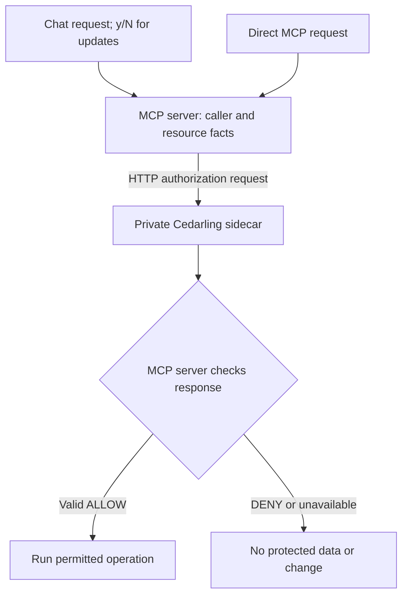

# Govern MCP Capabilities with Cedarling

Thanks for joining us! We'll use an incident assistant to see how Cedarling
checks what a team member may do. Dana supervises the team's incidents, while
Amir works on those assigned to him.

Amir types `y` to confirm an incident update. The assistant carries it out,
although nobody assigned that incident to him. Confirmation tells us what Amir
wants to do; the starting MCP server still needs to check whether he may do it.

We'll add server checks using a private Cedarling sidecar. Supervisors and
analysts may discover operations, search, and read the runbook. Reading,
updating, or preparing triage for an incident also requires a supervisor role
or the analyst's current assignment. Eve has no incident permissions and must
not reach these operations. We'll retry Amir's update, then check his assigned
work still succeeds, including calls without the chat interface.

## Add MCP permissions or run the finished assistant

- To build the integration, start with [Run the starting application](#run-the-starting-application), then add the policies and sidecar calls.
- To try the finished app, run the [finished project on main](https://github.com/GluuFederation/cedarling-tutorials/tree/main/p3-mcp-capability-governance) using its README, then go to [Check assigned and unassigned incidents](#check-assigned-and-unassigned-incidents). This version already uses Cedarling.

If you're building from the starting project, open each **Required step** section
and complete its instructions before continuing. These sections contain the files
and changes we'll need.

<details>
<summary>Before you start</summary>

- Git, Node.js 24.21+ within 24.x, and pnpm 10.17.1.
- Docker with Compose is required: the completed PDP runs in a containerized Flask sidecar.[^1] The pinned image is `linux/amd64`; ARM Docker Desktop needs amd64 emulation.
- An OpenRouter API key for live chat. Keep paid routing disabled unless you choose to pay for requests.
- Familiarity with TypeScript, HTTP APIs, and access tokens.
- New to Cedarling? [Read the short introduction](https://cedarling.dev/learn/what-is-cedarling) when you need it.
- Keep the [Cedar policy syntax](https://docs.cedarpolicy.com/policies/syntax-policy.html) and [Cedar schema syntax](https://docs.cedarpolicy.com/schema/human-readable-schema.html) references handy while editing policies.

These steps were prepared on Ubuntu 24.04+. Native project checks also run in CI
on macOS and Windows. If a platform-specific step fails,
[open an issue](https://github.com/GluuFederation/cedarling-tutorials/issues).

</details>

Run the commands from `p3-mcp-capability-governance/`. Paths under `shared/` are relative to
the repository root.

## Meet the incident assistant and its users


_Role and current assignment determine which MCP operations Dana, Amir, and Eve may use._

P3 is a terminal assistant backed by a Node.js MCP server.[^2] It searches incidents,
reads a runbook, prepares triage prompts, and advances incident status. We'll
use Cedarling to protect MCP tools, resources, and prompts.

- **Dana** is a supervisor who may work on every incident.
- **Amir** is an analyst who may work only on assigned incidents.
- **Eve** can sign in but has no permission to work on incidents.

`INC-1001` is an open payment incident assigned to Amir. `INC-2001` is an
unassigned audit incident in the mitigated state. Amir should not resolve the
second incident just because the model selected its update tool.

The bundled Node.js `oidc-provider` authenticates these users and issues their
access tokens. Cedarling uses Token-Based Access Control (TBAC): policies evaluate
signed tokens from trusted issuers together with the request's facts.[^6]
In P3, the token identifies the caller. The MCP server looks up roles in its
account map and assignments in the incident repository.

The host and model request work. The MCP server controls data access and changes.
Cedarling supplies decisions; it does not call tools or update incidents.

## Try updating an unassigned incident

Let's see why confirmation alone is not enough. We'll sign in as Amir and
confirm an update to the incident that nobody assigned to him.

### Run the starting application

Use a separate checkout for P3, including if you've already followed another
project. This keeps shared files and sample incidents separate:

```bash
git clone https://github.com/GluuFederation/cedarling-tutorials.git cedarling-p3
cd cedarling-p3
git switch --detach 21b0832be4b31271320df992d04e9d97667d0e38
cd p3-mcp-capability-governance

# Prepare the tutorial steps.
git restore --source=858d9a43cd47925d612ba292d0d35ba6b288952e --worktree -- ../shared/tools/step
node ../shared/tools/step/run.mjs p3 init --source 858d9a43cd47925d612ba292d0d35ba6b288952e
pnpm install --frozen-lockfile
pnpm run setup
```

<details>
<summary>Required step: Add the direct MCP exercise</summary>

```bash
node ../shared/tools/step/run.mjs p3 mcp-client
```

[`scripts/mcp-request.ts`](https://github.com/GluuFederation/cedarling-tutorials/blob/main/p3-mcp-capability-governance/scripts/mcp-request.ts) signs in through the same
Device Flow and calls the MCP server without a model. It supports search and
confirmed updates, keeps tokens in memory, and works before and after integration.
We'll use it to check direct access and to continue if the chat provider fails.

</details>

Start the baseline server and its IdP with Docker Compose:

```bash
docker compose up --build
```

The MCP endpoint is `http://localhost:17003/mcp`; the IdP is
`http://localhost:18003`. Set `P3_OPENROUTER_API_KEY` in the host project's ignored
`.env` for interactive chat. In another terminal:

```bash
pnpm chat amir
```

Open the displayed verification URL. The development IdP usually prefills
`amir`; enter it if the field is empty. Use any non-empty password such as
`cedarling-is-awesome`, then approve access. Enter these
requests separately:

```text
Find incident INC-2001.
Advance INC-2001 from mitigated to resolved.
```

Confirm with `y` when asked. The baseline lets Amir find and change
this unassigned incident. It validates identity, input, confirmation, and the
state transition, but does not enforce the assignment rule.

Find the incident again to confirm it is `resolved`, version `2`.

<details>
<summary>If chat is unavailable</summary>

The client defaults to `liquid/lfm-2.5-2.6b:free`. Free providers can return
quota, timeout, or unavailable errors before making an MCP call. Retry later
or set `P3_OPENROUTER_MODEL` in `.env` to another free tool-calling model.
A paid model requires both a paid model ID and `P3_OPENROUTER_ALLOW_PAID=true`;
enable this only if you intend to spend your paid credit.

A provider failure proves no authorization result. To continue without a
provider key, run these commands separately from another terminal:

```bash
pnpm exec tsx scripts/mcp-request.ts amir search INC-2001
pnpm exec tsx scripts/mcp-request.ts amir update INC-2001 mitigated resolved
pnpm exec tsx scripts/mcp-request.ts amir search INC-2001
```

Each command opens the same sign-in flow. Confirm the update with `y`.
If the first search already shows `resolved`, the earlier chat request succeeded;
skip the update. Otherwise, expect `mitigated`, version `1`, before the update
and `resolved`, version `2`, afterward.

</details>

Model answers and tool choices vary, so use incident state as evidence.
The provider may retain prompts and responses for training; use only fictional
incident data. After capturing Amir's unauthorized update, stop the baseline:

```bash
docker compose down
```

The next startup restores the in-memory sample incidents. Configuration volumes
remain in place.

## Where should we check permission?

Once you've observed Amir resolve the unassigned incident, follow that change
to the server. Open the baseline's
[`src/mcp/server.ts`](https://github.com/GluuFederation/cedarling-tutorials/blob/21b0832be4b31271320df992d04e9d97667d0e38/p3-mcp-capability-governance/src/mcp/server.ts)
and find the `update_incident_status` handler. After authentication and input
validation, it logs an ALLOW without checking permission, then calls the repository:

```ts
// src/mcp/server.ts (baseline), inside update_incident_status's callback > try
// ... validate input, load the incident, and log the baseline ALLOW.
const incident = services.incidents.updateStatus({
  incidentId,
  expectedStatus,
  nextStatus,
  idempotencyKey,
});
```

We'll ask the sidecar for permission before this call. Keep the terminal's
confirmation prompt. Also keep the status-change checks and retry protection
(idempotency) in
[`src/incidents/repository.ts`](https://github.com/GluuFederation/cedarling-tutorials/blob/21b0832be4b31271320df992d04e9d97667d0e38/p3-mcp-capability-governance/src/incidents/repository.ts).
Idempotency prevents the same change being applied twice. The server also needs
decisions before returning discovery, search results, runbook text, and triage prompts.

## Decide which MCP operations each user may perform

We'll now add Cedarling to the starting application. First, let's define which
operations each role may use and when an incident assignment is required.

### Choose an action and resource for each operation

Each action links to its policy. Requests use the signed caller token; roles and
assignments come from the server.

| Capability     | Action                                                                                                                                                                                   | Resource                        | Trusted context                     | Protected effect                            |
| -------------- | ---------------------------------------------------------------------------------------------------------------------------------------------------------------------------------------- | ------------------------------- | ----------------------------------- | ------------------------------------------- |
| Discover       | [`Discover`](https://github.com/GluuFederation/cedarling-tutorials/blob/main/p3-mcp-capability-governance/policy-store/policies/incident-operations.cedar#L16 "operations-surface")      | `Service::"incident-assistant"` | Current caller subject and role     | Make MCP operations available to the caller |
| Search         | [`Search`](https://github.com/GluuFederation/cedarling-tutorials/blob/main/p3-mcp-capability-governance/policy-store/policies/incident-operations.cedar#L16 "operations-surface")        | Same service                    | Same caller                         | Begin incident search                       |
| Read result    | [`Read`](https://github.com/GluuFederation/cedarling-tutorials/blob/main/p3-mcp-capability-governance/policy-store/policies/incident-operations.cedar#L26 "incident-assignment")         | Each candidate `Incident`       | Same caller; assignment on resource | Return a matching incident summary          |
| Read runbook   | [`ReadRunbook`](https://github.com/GluuFederation/cedarling-tutorials/blob/main/p3-mcp-capability-governance/policy-store/policies/incident-operations.cedar#L16 "operations-surface")   | `Runbook::"core"`               | Same caller                         | Return runbook content                      |
| Prepare triage | [`Triage`](https://github.com/GluuFederation/cedarling-tutorials/blob/main/p3-mcp-capability-governance/policy-store/policies/incident-operations.cedar#L26 "incident-assignment")       | Current `Incident`              | Same caller; assignment on resource | Return an incident-specific prompt          |
| Update status  | [`UpdateStatus`](https://github.com/GluuFederation/cedarling-tutorials/blob/main/p3-mcp-capability-governance/policy-store/policies/incident-operations.cedar#L26 "incident-assignment") | Current `Incident`              | Same caller; assignment on resource | Commit one valid transition                 |

All types and actions use namespace `P3IncidentAssistant`.

### Create the policy store

Let's create `policy-store/` at the project root, following the
[directory-based format](https://docs.jans.io/stable/cedarling/reference/cedarling-policy-store/#2-new-directory-based-format):

```text
policy-store/
  metadata.json
  schema.cedarschema
  policies/
    incident-operations.cedar
  trusted-issuers/
    tutorial-idp.json
```

<details>
<summary>Required step: Create the four policy-store files</summary>

```bash
node ../shared/tools/step/run.mjs p3 policy-store
```

New files:

- [`policy-store/metadata.json`](https://github.com/GluuFederation/cedarling-tutorials/blob/main/p3-mcp-capability-governance/policy-store/metadata.json) identifies the store and version.
- [`policy-store/schema.cedarschema`](https://github.com/GluuFederation/cedarling-tutorials/blob/main/p3-mcp-capability-governance/policy-store/schema.cedarschema) defines the operations, resources, and token context.
- [`policy-store/policies/incident-operations.cedar`](https://github.com/GluuFederation/cedarling-tutorials/blob/main/p3-mcp-capability-governance/policy-store/policies/incident-operations.cedar) checks token identity, role, and assignment.
- [`policy-store/trusted-issuers/tutorial-idp.json`](https://github.com/GluuFederation/cedarling-tutorials/blob/main/p3-mcp-capability-governance/policy-store/trusted-issuers/tutorial-idp.json) maps tokens from P3's IdP.

</details>

Use the integration's metadata with policy version `1.0.0`. The schema defines
`Service`, `Runbook`, and `Incident`; only the incident needs an optional
`assigned_to` attribute. It also defines `Access_token`, `TrustedIssuer`, the
issuer URL shape, and context containing `caller` and optional generated tokens.
The actions use the token type as their principal type; the sidecar
request supplies the caller's signed token.

The MCP server supplies current account and incident facts with each request.

For the pinned sidecar, `policy-store/trusted-issuers/tutorial-idp.json` uses
this exact shape:

```json
{
  "name": "P3IncidentAssistant",
  "description": "Shared Cedarling tutorial identity provider",
  "configuration_endpoint": "http://localhost:18003/.well-known/openid-configuration",
  "token_metadata": {
    "access_token": {
      "trusted": true,
      "entity_type_name": "P3IncidentAssistant::Access_token",
      "token_id": "jti",
      "required_claims": [
        "iss",
        "sub",
        "aud",
        "jti",
        "exp",
        "scope",
        "client_id"
      ]
    }
  }
}
```

Keep `configuration_endpoint` for discovery with this pinned sidecar. The MCP middleware verifies
the JWT and general `mcp.access` scope. Policies also check that the token's
subject, API audience, and client ID match this caller and application.

### Check the token, then the role and assignment

With the token mapping in place, let's read the rules in
`policies/incident-operations.cedar`. A forbid protects every operation if
required token evidence is missing or does not match:

```cedar
// policy-store/policies/incident-operations.cedar
@id("require-p3-access-token")
forbid(principal, action, resource) unless {
  context has tokens &&
  context.tokens has p3incidentassistant_access_token &&
  context.tokens.p3incidentassistant_access_token.hasTag("sub") &&
  context.tokens.p3incidentassistant_access_token.getTag("sub").contains(context.caller.subject) &&
  context.tokens.p3incidentassistant_access_token.hasTag("aud") &&
  context.tokens.p3incidentassistant_access_token.getTag("aud").contains("http://localhost:17003/mcp") &&
  context.tokens.p3incidentassistant_access_token.hasTag("client_id") &&
  context.tokens.p3incidentassistant_access_token.getTag("client_id").contains("p3-mcp-capability-governance-cli")
};
```

Then allow incident operations based on role and assignment:

```cedar
// policy-store/policies/incident-operations.cedar
@id("incident-assignment")
permit(principal, action in [
  P3IncidentAssistant::Action::"Read",
  P3IncidentAssistant::Action::"UpdateStatus",
  P3IncidentAssistant::Action::"Triage"
], resource is P3IncidentAssistant::Incident) when {
  context.caller.role == "supervisor" ||
  (context.caller.role == "analyst" && resource has assigned_to &&
    resource.assigned_to == context.caller.subject)
};
```

For Amir reading `INC-1001`, `context.caller.role` is `analyst` and
`resource.assigned_to` matches his subject, `amir`. The permit matches.
`INC-2001` has no assignment, so the analyst condition cannot permit access to it.
Both decisions still require the token's subject, audience, and client ID to
pass the identity rule above.

The remaining `operations-surface` permit covers `Discover`, `Search`, and
`ReadRunbook` for supervisor or analyst roles. Eve's `observer` role matches no
permit. Under [Cedar's policy rules](https://docs.cedarpolicy.com/policies/syntax-policy.html),
a matching forbid overrides any permit, and no matching permit gives DENY.

## Connect the MCP server to Cedarling

The policies describe what Amir, Dana, and Eve may do. Next we'll load them in
the sidecar and make the MCP server wait for a decision before each operation.



### Prepare the private sidecar

The Node.js app calls the sidecar's AuthZEN-style HTTP endpoint.[^3]
Cedarling decides in Flask; the MCP server enforces the result.
Compose pins this Docker image:

```text
ghcr.io/janssenproject/jans/cedarling-flask-sidecar:2.4.1-1@sha256:501d5bc88e8a0b67cbab314b31c787f94b6c4ad9f16a77ec81d0e183b2645f0b
```

The sidecar needs a policy archive. We'll use a shared builder to validate and
package our policy files.

<details>
<summary>Required step: Create the shared archive builder</summary>

```bash
node ../shared/tools/step/run.mjs p3 archive-builder
```

The shared builder files are:

- [`shared/policy-store.mjs`](https://github.com/GluuFederation/cedarling-tutorials/blob/main/shared/policy-store.mjs) validates and packages the policy store.
- [`shared/policy-store.d.mts`](https://github.com/GluuFederation/cedarling-tutorials/blob/main/shared/policy-store.d.mts) supplies its TypeScript declarations.

</details>

From P3, install the build dependencies and update the MCP client to match the completed app:

```bash
pnpm add --save-exact @modelcontextprotocol/client@2.2.0
pnpm add --save-dev --save-exact fflate@0.8.3 @cedar-policy/cedar-wasm@4.12.0 @types/node@24.19.0
node ../shared/policy-store.mjs
```

The builder and Dockerfile create the same `.local/policy-store.cjar` archive.
Compose's `policy-store` service runs once to put it in a
volume mounted read-only by Cedarling. Keep the readable source in Git and the
generated local `.cjar` ignored.

`sidecar-bootstrap.json` selects `/policy-store/policy-store.cjar`, enables JWT
signature and strict schema validation, accepts RS256, and loads trusted issuers
before accepting requests. Cedarling's logs go to standard output. The bootstrap sets
`CEDARLING_TOKEN_CACHE_MAX_TTL` to `1800`, matching the thirty-minute tutorial
tokens. Compose sets `SIDECAR_DEBUG_RESPONSE=False`.

In the integrated `compose.yaml`, the MCP server and Cedarling join the
IdP's network namespace. The sidecar binds `127.0.0.1:5000` there. Only application
port 17003 and IdP port 18003 are published on host loopback. The sidecar is not
published. Compose waits for the IdP and archive before starting Cedarling,
then waits for Cedarling readiness before starting the MCP server.

JWT validation establishes the request subject; it does not authenticate every
service that can reach the sidecar. This local trust boundary includes the IdP.
Across hosts, service connections also need authenticated transport, such as
mTLS through a service mesh or reverse proxy.[^5]

### Send current facts to the Cedarling sidecar

Now we'll build the sidecar request from facts the MCP server trusts. Add the
client and handlers, then follow the HTTP request below.

<details>
<summary>Required step: Add the sidecar client and update MCP handlers</summary>

```bash
node ../shared/tools/step/run.mjs p3 server
```

The new [`src/mcp/authorization.ts`](https://github.com/GluuFederation/cedarling-tutorials/blob/main/p3-mcp-capability-governance/src/mcp/authorization.ts)
provides the sidecar client and decision logging.

Updated files:

- [`src/mcp/server.ts`](https://github.com/GluuFederation/cedarling-tutorials/blob/main/p3-mcp-capability-governance/src/mcp/server.ts) enforces discovery and operation decisions.
- [`src/mcp/availability.ts`](https://github.com/GluuFederation/cedarling-tutorials/blob/main/p3-mcp-capability-governance/src/mcp/availability.ts) checks that the expected MCP server is available before chat connects.
- [`src/auth/token-verifier.ts`](https://github.com/GluuFederation/cedarling-tutorials/blob/main/p3-mcp-capability-governance/src/auth/token-verifier.ts) verifies caller tokens without exposing them in diagnostics.
- [`src/incidents/types.ts`](https://github.com/GluuFederation/cedarling-tutorials/blob/main/p3-mcp-capability-governance/src/incidents/types.ts) defines incidents, lifecycle states, and sample account names.
- [`src/incidents/repository.ts`](https://github.com/GluuFederation/cedarling-tutorials/blob/main/p3-mcp-capability-governance/src/incidents/repository.ts) supplies current incidents and validates state changes.
- [`src/mcp/schemas.ts`](https://github.com/GluuFederation/cedarling-tutorials/blob/main/p3-mcp-capability-governance/src/mcp/schemas.ts) validates MCP operation inputs.
- [`src/app.ts`](https://github.com/GluuFederation/cedarling-tutorials/blob/main/p3-mcp-capability-governance/src/app.ts) connects authentication and MCP request handling.
- [`src/main.ts`](https://github.com/GluuFederation/cedarling-tutorials/blob/main/p3-mcp-capability-governance/src/main.ts) starts the configured MCP server.
- [`src/config/project-config.ts`](https://github.com/GluuFederation/cedarling-tutorials/blob/main/p3-mcp-capability-governance/src/config/project-config.ts) supplies application, identity, and model-provider settings.
- [`tsconfig.build.json`](https://github.com/GluuFederation/cedarling-tutorials/blob/main/p3-mcp-capability-governance/tsconfig.build.json) selects the server and CLI files for compilation.

The step removes `src/mcp/trace.ts`; authorization now records the actual decisions.

</details>

An AuthZEN-style decision request has a subject, action, resource, and context,
and the response contains a boolean decision.[^3] In this Cedarling sidecar
integration, the subject also carries a signed access token with a named token
mapping, and the resource carries `cedar_entity_mapping` plus current incident
facts. Those mapping properties and the `/cedarling/evaluation` path are
Cedarling-specific; do not treat them as generic AuthZEN fields. A valid true
decision allows the MCP server to continue; DENY or an unavailable response
must stop the operation before it returns data or changes an incident.

In the copied `src/mcp/authorization.ts`, `authorize()` receives verified MCP
authentication as `auth`. Within the function,
`subject` identifies the signed-in user, `roles` is the server account map, and `resource`
was loaded by the operation. `action` is a server-selected action name.
The `request` parameter defaults to `fetch`. Logging is omitted from this excerpt:

```ts
// src/mcp/authorization.ts
export async function authorize(
  auth: AuthInfo,
  action: Action,
  resource: Resource,
  requestId: string,
  request: typeof fetch = fetch,
): Promise<boolean> {
  const subject = parsePersona(
    typeof auth.extra?.subject === "string" ? auth.extra.subject : undefined,
  );
  let decision: boolean;
  // ... prepare request details and HTTP status for logging.
  try {
    const response = await request(
      "http://127.0.0.1:5000/cedarling/evaluation",
      {
        method: "POST",
        headers: { "content-type": "application/json" },
        redirect: "error",
        signal: AbortSignal.timeout(2_000),
        body: JSON.stringify({
          subject: {
            type: "JWT",
            id: subject,
            properties: {
              tokens: [
                {
                  mapping: "P3IncidentAssistant::Access_token",
                  payload: auth.token,
                },
              ],
            },
          },
          action: { name: `P3IncidentAssistant::Action::"${action}"` },
          resource: {
            type: resource.type,
            id: resource.id,
            properties: {
              cedar_entity_mapping: {
                entity_type: `P3IncidentAssistant::${resource.type}`,
                id: resource.id,
              },
              ...(resource.type === "Incident" && resource.assignedTo !== null
                ? { assigned_to: resource.assignedTo }
                : {}),
            },
          },
          context: { caller: { subject, role: roles[subject] } },
        }),
      },
    );
    // ... capture the HTTP status for logging.
    if (!response.ok) throw new Error("Sidecar HTTP failure");
    const result = decisionResponse.parse(await response.json());
    if (result.context.id === "-1")
      throw new Error("Sidecar evaluation failed");
    decision = result.decision;
  } catch {
    // ... log authorization.failed with bounded fields.
    throw new AuthorizationError("authorization_unavailable");
  }
  // ... log authorization.decision.
  return decision;
}
```

`JSON.stringify()` supplies the HTTP request body as JSON here.[^4]

The module rejects HTTP errors and timeouts, and requires a boolean `decision`
and object `context` in the response. This pinned sidecar can
report runtime failure in an HTTP 200 body with `context.id === "-1"`; the module
treats that as `authorization_unavailable`, not a policy denial.
For an unassigned incident, the request omits
the optional assignment instead of sending `null` to a string field.

### Check permission before each MCP operation

With that decision response checked, we can use it in the MCP handlers.
`src/mcp/server.ts` evaluates `Discover` before registering the caller's
operations. A denied caller receives an empty list of operations. Registering a tool
is not permission to use it against every resource.

- Search requires `Search`, then checks `Read` for each candidate incident before
  returning it. The result limit applies after authorization filtering.
- Runbook reads require `ReadRunbook` before returning text.
- Triage requires `Triage` on the incident loaded by the server before producing its prompt.
- Status updates require `UpdateStatus` before changing the stored incident.

Inside `createIncidentMcpServer()`, the `update_incident_status` callback waits for
permission before calling the repository:

```ts
// src/mcp/server.ts
// Inside createIncidentMcpServer():
server.registerTool(
  "update_incident_status",
  {
    title: "Update incident status",
    description: "Advance one incident through one confirmed lifecycle step.",
    inputSchema: updateIncidentInput,
  },
  async ({ incidentId, expectedStatus, nextStatus, idempotencyKey }) => {
    try {
      const current = currentIncident(incidentId);
      await requireAllowed("UpdateStatus", {
        type: "Incident",
        id: current.id,
        assignedTo: current.assignedTo,
      });
      const incident = services.incidents.updateStatus({
        incidentId,
        expectedStatus,
        nextStatus,
        idempotencyKey,
      });
      // ... return the incident ID, status, version, and request ID.
    } catch (error) {
      return safeToolError(error);
    }
  },
);
```

`requireAllowed` throws on DENY; unavailable decisions also stop execution.
Before changing an incident, the repository still checks its current status,
one-step transitions, and repeated requests. An earlier ALLOW cannot make an
outdated state valid.

The terminal host owns confirmation and its idempotency key. A model-provided
`confirmed` value cannot replace the user's confirmation. OAuth credentials never
enter model messages.

## Finish setup and start the integrated stack

The handlers now wait for Cedarling. Let's finish the Compose configuration
so the archive and sidecar are ready before the MCP server starts.

<details>
<summary>Required step: Configure the sidecar and update stack startup</summary>

```bash
node ../shared/tools/step/run.mjs p3 startup
```

The new [`sidecar-bootstrap.json`](https://github.com/GluuFederation/cedarling-tutorials/blob/main/p3-mcp-capability-governance/sidecar-bootstrap.json)
configures the archive, token validation, and logs.

Updated files:

- [`src/chat/host.ts`](https://github.com/GluuFederation/cedarling-tutorials/blob/main/p3-mcp-capability-governance/src/chat/host.ts) uses discovered capabilities and handles denied or unavailable operations.
- [`scripts/setup.mjs`](https://github.com/GluuFederation/cedarling-tutorials/blob/main/p3-mcp-capability-governance/scripts/setup.mjs) prepares host chat configuration.
- [`Dockerfile`](https://github.com/GluuFederation/cedarling-tutorials/blob/main/p3-mcp-capability-governance/Dockerfile) builds the app and policy archive.
- [`compose.yaml`](https://github.com/GluuFederation/cedarling-tutorials/blob/main/p3-mcp-capability-governance/compose.yaml) starts the private sidecar and dependent services.

The step removes `scripts/dev.mjs`; Compose will manage these services.

The step also updates `build` to package policies and `dev`/`start` to use Compose.

</details>

The host `scripts/setup.mjs` prepares chat configuration; Compose's configure
service prepares the container IdP configuration. `pnpm dev` runs Compose;
`pnpm chat amir` remains a host command.

Run `pnpm build`, then `pnpm run setup` and `pnpm dev` from the host.
Wait for the IdP, archive service, sidecar, and MCP server to become ready.
Then run `pnpm chat amir` to check assigned and unassigned incidents.

## Check assigned and unassigned incidents

The integrated stack is ready. We'll first complete Amir's assigned work,
then repeat the unassigned update that succeeded before Cedarling.

### Complete Amir's assigned work

With fresh sample incidents, enter separately:

```text
Find incident INC-1001.
Read the incident response runbook.
Prepare triage for INC-1001.
Advance INC-1001 from open to investigating.
```

Confirm only the intended update with `y`. Find the incident again to verify its
new status. Declining confirmation must leave it unchanged.

Now search for `INC-2001` as Amir. Expect no matching incident; triage or update
attempts must be denied. We'll verify its state as Dana in the direct exercise
below, since Amir cannot read it. Save Dana's update for that exercise.
Why can she update it without an assignment? Check the supervisor condition:

| Caller and attempt                            | Expected outcome                                |
| --------------------------------------------- | ----------------------------------------------- |
| Dana reads or advances `INC-2001`             | ALLOW, subject to its current valid transition  |
| Amir reads or advances assigned `INC-1001`    | ALLOW, subject to confirmation and state checks |
| Amir triages or updates unassigned `INC-2001` | DENY                                            |
| Eve discovers operations                      | Empty surface; host does not call the model     |
| Direct unauthorized MCP invocation            | No incident data returned or changed            |
| Sidecar timeout or malformed decision         | Unavailable; operation stopped                  |

### Read the server and sidecar logs

Let's connect those outcomes to the decisions. The MCP server prints formatted
`authorization.decision` records with
`requestId`, `actorId`, action, resource, and ALLOW or DENY. One application
request can perform both discovery and an operation, producing several decisions.
Discovery repeats because the server handles each request independently.

Cedarling's own sidecar records contain the policy-store ID and
`diagnostics.reason`. An allowed assigned-incident action cites
`incident-assignment`. An unassigned analyst can receive DENY with no
matching permit and an empty reason. If token identity checks fail, the forbid
can appear as the policy that determined the denial.

Application and sidecar request IDs are separate in this integration.
Do not match their logs by ID. For a recording, run one operation at a time and
compare the user, action, resource, request order, and policy reasons.
Check the returned incident state too: an ALLOW does not prove it changed.
`authorization.failed` separates connection or runtime failures from policy denials
without printing tokens or raw sidecar errors.

### Try direct calls and a sidecar outage

We'll use `scripts/mcp-request.ts` to send requests without a model. If chat
failed, use the provider note in [the starting exercise](#run-the-starting-application)
for model settings; these direct commands need no OpenRouter key.

First reset the in-memory incidents, leaving configuration volumes intact:

```bash
docker compose restart incident-assistant
```

Wait for the MCP server's listening message in the service terminal. Run the
following commands separately, signing in as the account named in each one.
Dana's first search should show `INC-2001` as `mitigated`, version `1`:

```bash
pnpm exec tsx scripts/mcp-request.ts dana search INC-2001
pnpm exec tsx scripts/mcp-request.ts amir search INC-2001
pnpm exec tsx scripts/mcp-request.ts amir update INC-2001 mitigated resolved
pnpm exec tsx scripts/mcp-request.ts dana search INC-2001
```

Amir's search returns an empty list. Confirm his update with `y`: expect
`authorization_denied` and a nonzero command exit status. Dana's second search
must still show `mitigated`, version `1`. An input-validation error would not
prove this authorization check.

Now confirm a permitted update for each caller:

```bash
pnpm exec tsx scripts/mcp-request.ts amir update INC-1001 open investigating
pnpm exec tsx scripts/mcp-request.ts amir search INC-1001
pnpm exec tsx scripts/mcp-request.ts dana update INC-2001 mitigated resolved
pnpm exec tsx scripts/mcp-request.ts dana search INC-2001
```

Both incidents should reach version `2`, with the requested status. The helper
sends `confirmed: true` only after `y` and generates an idempotency key for each
invocation. To repeat this sequence, restart `incident-assistant` first; a
resolved incident cannot be resolved again.

For the outage check, use `INC-1002`, which is still `investigating`, version `1`:

```bash
pnpm exec tsx scripts/mcp-request.ts amir search INC-1002
docker compose stop cedarling
pnpm exec tsx scripts/mcp-request.ts amir update INC-1002 investigating mitigated
docker compose logs --tail 30 incident-assistant
docker compose start cedarling
```

The direct command exits unsuccessfully with a safe failure message. It may fail
to connect before reaching confirmation. An existing chat can report a generic
MCP failure; a fresh MCP client can fail during protocol negotiation. In the
server logs, look for `authorization.failed`, action `Discover`, and code
`authorization_unavailable`. This is an unavailable decision service, not a
policy denial.

Wait until `docker compose ps cedarling` shows it is healthy, then search again:

```bash
pnpm exec tsx scripts/mcp-request.ts amir search INC-1002
```

The incident must remain `investigating`, version `1`. Keep this evidence with
the denied update and the successful assigned update.

### Run the matching project checks

We've observed the real decisions. Let's add the checks for the integrated app
to this same checkout so its test suite exercises the rules we've just added.

<details>
<summary>Required step: Add the matching tests and check configuration</summary>

```bash
node ../shared/tools/step/run.mjs p3 checks
```

Updated files:

- [`eslint.config.js`](https://github.com/GluuFederation/cedarling-tutorials/blob/main/p3-mcp-capability-governance/eslint.config.js) configures linting for the project scripts and tests.
- [`test/config.test.ts`](https://github.com/GluuFederation/cedarling-tutorials/blob/main/p3-mcp-capability-governance/test/config.test.ts) checks application, issuer, and provider settings.
- [`test/helpers.ts`](https://github.com/GluuFederation/cedarling-tutorials/blob/main/p3-mcp-capability-governance/test/helpers.ts) supplies authenticated test callers and controlled decision dependencies.
- [`test/protocol.test.ts`](https://github.com/GluuFederation/cedarling-tutorials/blob/main/p3-mcp-capability-governance/test/protocol.test.ts) checks MCP discovery and operation responses.
- [`test/scenario.test.ts`](https://github.com/GluuFederation/cedarling-tutorials/blob/main/p3-mcp-capability-governance/test/scenario.test.ts) exercises role and assignment restrictions through the chat host.
- [`test/setup.test.ts`](https://github.com/GluuFederation/cedarling-tutorials/blob/main/p3-mcp-capability-governance/test/setup.test.ts) checks host configuration setup.

New files:

- [`test/authorization.test.ts`](https://github.com/GluuFederation/cedarling-tutorials/blob/main/p3-mcp-capability-governance/test/authorization.test.ts) checks sidecar requests, response validation, and failure handling with controlled HTTP responses.
- [`test/policy-store.test.ts`](https://github.com/GluuFederation/cedarling-tutorials/blob/main/p3-mcp-capability-governance/test/policy-store.test.ts) checks archive contents, reproducibility, and issuer discovery configuration.
- [`test/mcp-request.test.ts`](https://github.com/GluuFederation/cedarling-tutorials/blob/main/p3-mcp-capability-governance/test/mcp-request.test.ts) checks direct-client arguments, confirmation, errors, and cleanup.
- [`scripts/test-e2e.ts`](https://github.com/GluuFederation/cedarling-tutorials/blob/main/p3-mcp-capability-governance/scripts/test-e2e.ts) starts and cleans up an isolated Docker stack for verification.
- [`scripts/verify-stack.ts`](https://github.com/GluuFederation/cedarling-tutorials/blob/main/p3-mcp-capability-governance/scripts/verify-stack.ts) exercises real signed tokens and sidecar decisions, including outage and recovery.

The step also updates `test:e2e` to run the isolated stack checks.
The other baseline tests and the existing `check` script stay in place.

</details>

From this checkout's P3 directory, run:

```bash
pnpm format
pnpm check
pnpm test:e2e
```

`pnpm check` runs formatting, lint, types, tests, and build. The separate
`test:e2e` command uses real Device Flow tokens and the pinned sidecar, with
scripted model selections instead of OpenRouter. It verifies role and assignment
rules, denied direct calls, confirmation, and unavailable decisions. It uses
its own containers and configuration volumes and removes them afterward;
your exercise stack stays running. Neither command needs a provider key.

<details>
<summary>Warning: Learning project only</summary>

This project is for learning only and is not intended for production use.
Adapting it requires a separate review of local HTTP and the development IdP,
fixed account permissions, in-memory incidents, sidecar access, provider data
handling, and audit logging.

Optional components include Jans Auth for identity, Agama Lab Policy Designer
for policy authoring, and Lock Server for decision logs. See
[Cedarling production solutions](https://cedarling.dev/solutions).

</details>

## Recap: permissions for MCP operations

Amir could confirm an update to an unassigned incident in the starting app.
We've now blocked that operation at the MCP server while keeping his assigned
work available. Dana's supervisor role permits broader access, and Eve receives
no incident capabilities. Those differences come from the signed identity and
current server facts, not from the model's choice or the user's confirmation.

For another agent application, place the check where a tool, resource, or prompt
returns data or changes state. The server must wait for a valid allowed
decision, including on direct calls. Moving Cedarling into a sidecar changes
how we request that decision; enforcement still belongs to the application.

In [P4](https://cedarling.dev/learn/secure-editorial-publishing), we'll check
whether an editorial approval remains valid after the content or reviewer's
permission changes.

[^1]: A [Cedarling sidecar](https://docs.jans.io/stable/cedarling/developer/sidecar/cedarling-sidecar-overview/) is a separate service that exposes Cedarling decisions to the application over HTTP. In P3, Docker Compose runs that service beside the MCP server.

[^2]: [MCP (Model Context Protocol)](https://modelcontextprotocol.io/specification/2026-07-28/) lets a client find and call server tools and access resources or prompts. P3 authorizes the server-controlled operation, not the model's wording.

[^3]: The [OpenID AuthZEN Authorization API](https://openid.net/specs/authorization-api-1_0-final.html) defines the decision request's subject, action, resource, and context and the response's decision. P3 uses the Cedarling sidecar's own endpoint and token/entity mapping fields to implement this pattern.

[^4]: Here `JSON.stringify()` creates the JSON body for an HTTP POST to the Cedarling sidecar. P3 uses the sidecar's AuthZen endpoint, not the `cedarling_wasm` JavaScript authorization method.

[^5]: [Mutual TLS (mTLS)](https://istio.io/latest/docs/concepts/security/#mutual-tls-authentication) authenticates both ends of a service connection. A service mesh can manage that transport between application and policy decision service; the local tutorial uses a private shared network namespace instead.

[^6]: [Token-Based Access Control (TBAC)](https://docs.jans.io/stable/cedarling/#proof-based-authorization-token-based-access-control-tbac) uses tokens from trusted issuers as evidence in an authorization decision. P3 supplies current account roles and incident assignments alongside that evidence.
