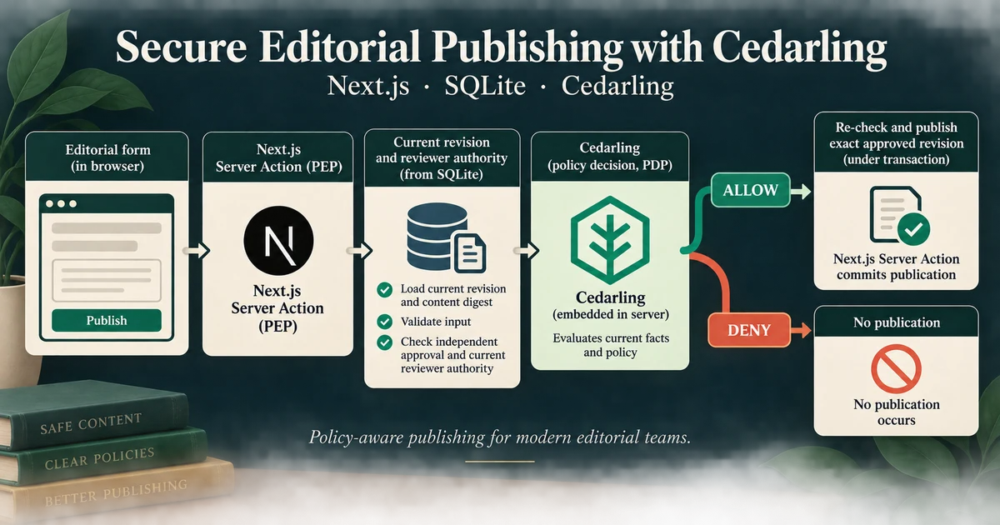

# P4 - Securing Editorial Publishing with Cedarling



CedarPress is a focused editorial workspace where authors create articles and submit immutable
revisions, editors review exact content, and publishers release a revision only
while its approval evidence and reviewer authority remain current.

Cedarling authorizes each read and mutation on the server using the signed-in
user and current database facts. Its policies prevent self-review, approval
reuse across revisions, and publication after reviewer authority is revoked.

## Architecture

```text
Riley / Ana / Omar ── sign in ──→ Tutorial IdP
         │
         └── article and revision forms ──→ Next.js App Router
                                                   │
                                      Server Component / Action
                                                   │
                                                   ▼
                                        Cedarling PDP
                                              │        │
                                            DENY     ALLOW
                                                       │
                                                       ▼
                                          conditional SQLite effect
```

## Prerequisites

- Docker Desktop or Docker Engine with Compose, or
- Node.js 24.21 or newer within 24.x, pnpm 10, and the project-local tutorial identity provider.

The commands work from PowerShell, macOS terminals, and Ubuntu shells.

## Run

Start the application and its own IdP:

```bash
docker compose up --build
```

Open <http://localhost:17004>. The issuer is <http://localhost:18004>. Stop the stack with `Ctrl+C`, then `docker compose down`.

For native development, run from this project directory:

```bash
pnpm --dir ../shared/identity-provider install --frozen-lockfile
pnpm --dir ../shared/identity-provider build
pnpm install --frozen-lockfile
pnpm run setup
pnpm dev
```

`pnpm dev` starts this project’s IdP and application together.
Setup synchronizes the application listen port with its registered URL and
preserves your editorial data.

`pnpm build` followed by `pnpm start` runs the compiled application stack and its project IdP.

Use `pnpm dev -- --reset` only when you want to restore the tutorial fixtures.

## Exercise

The workflow demonstrates why an earlier editorial decision is not standing
authority for later publication:

- **Riley** — Author who drafts and submits articles but has no review authority.
- **Ana** — Editor and publisher for the valid review and publication path.
- **Omar** — Editor whose seeded authority can be revoked after approval.

- As Riley, choose **New article**, enter a title and body, then submit it.
  Approval and rejection are disabled for its author. Sign in as Ana to approve
  and publish that exact revision.
- Approve **Customer migration guide** revision 1 as Ana. As Riley, create and
  submit revision 2. As Ana, publication is disabled until revision 2 receives
  its own approval.
- Approve **Partner announcement** as Omar, revoke his authority, then try to
  publish as Ana: publication is disabled because the approval is no longer valid.

All three identities can create articles in their own tenant and edit their own
drafts. Editor and publisher grants remain separate: no author can review their
own content. Unavailable actions remain visible with a short explanation.
Direct requests that bypass disabled buttons are still checked on the server.

Revoke Omar's authority with:

```bash
pnpm admin revoke-omar
```

For Docker, run the equivalent command against the running application:

```bash
docker compose exec cedarpress node --env-file=/run/config/app.env scripts/admin.ts revoke-omar
```

For the valid control, approve and publish **Editorial handbook** as Ana.
Use `pnpm reset` to restore the fixtures, then sign in again. With Docker, run
`docker compose exec cedarpress node --env-file=/run/config/app.env scripts/reset.ts`.
Reset clears editorial records, sessions, and pending sign-ins without replacing
the database file or stopping the application.

## Authorization

Readable schema and policies live in `policy-store/`. Setup, build, and tests
use the shared builder to validate them and generate the ignored
`.local/policy-store.cjar` archive. The server logs its version and SHA-256
when loading it.

`src/server/authorization.ts` calls Cedarling's `authorizeUnsigned()` directly.
The application authenticates the user through OIDC; it constructs Cedarling
principals, resources, and context from trusted server data, not form fields.
Server Components and Actions enforce the decisions. Before writing, SQLite
checks that the authorized revision and authority evidence have not changed.
`CreateArticle` targets the authenticated user's `Tenant`, before an article
exists. The server supplies its tenant and author and atomically saves the
article and first draft. Page-render decisions guide controls; each mutation
reloads facts and requests a fresh decision.

`authorization.context` links the application `requestId`, actor, capability,
and `preview` or `enforcement` phase to `cedarlingRequestId`. The following
Cedarling JSON decision includes the full `diagnostics.reason` and `errors`.
An empty reason on DENY means no permit matched, not necessarily an engine error.
`editorial.action.completed` records a committed effect; `editorial.action.failed`
records a controlled failure category. An ALLOW alone does not prove a write.
Browser messages show readable outcomes without correlation IDs or policy diagnostics.
Cedarling memory logs expire after
five minutes; they are not a durable audit store. P4 uses the standard Next.js
lifecycle, which does not guarantee an awaited Cedarling shutdown hook.

Riley can also choose **New article** to create a tenant-scoped draft, then
submit it through the same review workflow. Cedarling checks `CreateArticle`
against the signed-in user's tenant before insertion; the Server Action also
checks the session, CSRF token, and draft input.

## Commands

| Command                  | Purpose                                                       |
| ------------------------ | ------------------------------------------------------------- |
| `pnpm run setup`         | Prepare project identity configuration and SQLite fixtures    |
| `pnpm dev`               | Prepare and supervise the IdP and Next.js development server  |
| `pnpm start`             | Prepare and supervise the IdP and production build            |
| `pnpm reset`             | Restore deterministic editorial fixtures                      |
| `pnpm admin revoke-omar` | Revoke Omar's seeded editor authority                         |
| `pnpm test:e2e`          | Exercise the real browser and IdP workflow                    |
| `pnpm check`             | Run formatting, lint, types, tests, build, and browser checks |

## Verify

```bash
pnpm exec playwright install chromium
pnpm check
pnpm audit --audit-level low
```

On Linux, use `pnpm exec playwright install --with-deps chromium` if browser
system libraries are missing. Browser checks build the app and use temporary
credentials and data; stop this project's running instances first so its ports
are free. Your normal editorial database and IdP configuration are untouched.
