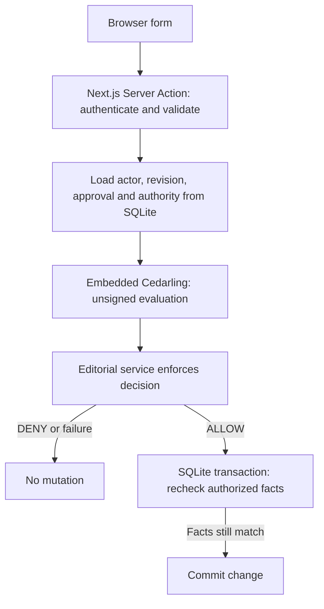

# P4 - Securing Editorial Publishing with Cedarling


P4 lets authors submit article revisions for review and publishers release
approved content. Server-side Cedarling checks prevent self-review, reuse of
approval across revisions, and publication after a reviewer's authority is revoked.

Follow the [tutorial](docs/tutorials.md) to add these checks to the [starting
application](https://github.com/GluuFederation/cedarling-tutorials/tree/21b0832be4b31271320df992d04e9d97667d0e38/p4-editorial-publishing).

The tutorial uses a [step helper](../shared/tools/step/README.md)
to copy the required files from a pinned commit.

## Architecture



## Prerequisites

- To run with Docker: Docker Desktop or Docker Engine with Compose.
- For native development and checks: Node.js 24.21 or newer within 24.x and pnpm 10.

Both startup paths include the project's tutorial identity provider.

The commands work from PowerShell, macOS terminals, and Ubuntu shells.

## Run

From `p4-editorial-publishing/`, start the application and its own IdP:

```bash
docker compose up --build
```

Open <http://localhost:17004>. The issuer is <http://localhost:18004>. Stop the stack with `Ctrl+C`, then `docker compose down`.

For native development, run from this project directory:

```bash
pnpm --dir ../shared/identity-provider install --frozen-lockfile
pnpm install --frozen-lockfile
pnpm dev
```

`pnpm dev` prepares configuration, builds the IdP, and starts it alongside the app.
Setup keeps the application port consistent with its registered URL and
preserves your editorial data.

`pnpm build` followed by `pnpm start` runs the compiled application stack and its project IdP.

Use `pnpm dev -- --reset` only when you want to restore the tutorial fixtures.

## Exercise

Choose an account below. Use the prefilled username, or enter its lowercase name,
and any non-empty password, such as `cedarling-is-awesome`. These credentials
are for the local tutorial IdP only.

Riley is an author, Ana can review and publish, and Omar has revocable editor
authority. All three can create articles in their tenant and edit their own
drafts. Try these workflows:

- As Riley, choose **New article**, enter a title and body, then submit it.
  Approval and rejection are disabled for its author. Sign in as Ana to approve
  and publish that exact revision.
- Approve **Customer migration guide** revision 1 as Ana. As Riley, create and
  submit revision 2. As Ana, publication is disabled until revision 2 receives
  its own approval.
- Approve **Partner announcement** as Omar, revoke his authority, then try to
  publish as Ana: publication is disabled because the approval is no longer valid.

Unavailable actions stay visible but disabled, with a short explanation.
The server also checks direct requests that bypass the buttons.

Revoke Omar's authority with:

```bash
pnpm admin revoke-omar
```

For Docker, run the equivalent command against the running application:

```bash
docker compose exec cedarpress node --env-file=/run/config/app.env scripts/admin.ts revoke-omar
```

For the valid control, approve and publish **Editorial handbook** as Ana.
Use `pnpm reset` to restore the fixtures, then sign in again. With Docker, run
`docker compose exec cedarpress node --env-file=/run/config/app.env scripts/reset.ts`.
Reset clears editorial records, sessions, and pending sign-ins without replacing
the database file or stopping the application.

## Authorization

Readable schema and policies live in `policy-store/`. Setup, build, and tests
use the shared builder to validate them and generate the ignored `.local/policy-store.cjar` archive. The server logs its version and SHA-256 when loading it.

[`src/server/authorization.ts`](src/server/authorization.ts) evaluates current
database facts with `authorizeUnsigned()` after OIDC authentication. Server
Components and Actions enforce the results. Each mutation gets a fresh decision,
then SQLite rechecks the authorized facts before committing. See the
[server integration](docs/tutorials.md#add-cedarling-to-the-server) for request
construction and transaction checks.

Server logs distinguish permission decisions from committed changes; browser
messages show the outcome without policy diagnostics. The
[log guide](docs/tutorials.md#read-the-decision-and-publication-logs) explains
request correlation. Cedarling's five-minute memory logs are not a durable audit store.

## Commands

| Command                  | Purpose                                                       |
| ------------------------ | ------------------------------------------------------------- |
| `pnpm run setup`         | Prepare project identity configuration and SQLite fixtures    |
| `pnpm dev`               | Prepare and supervise the IdP and Next.js development server  |
| `pnpm start`             | Prepare and supervise the IdP and production build            |
| `pnpm reset`             | Restore deterministic editorial fixtures                      |
| `pnpm admin revoke-omar` | Revoke Omar's seeded editor authority                         |
| `pnpm test:e2e`          | Exercise the real browser and IdP workflow                    |
| `pnpm check`             | Run formatting, lint, types, tests, build, and browser checks |

## Verify

```bash
pnpm exec playwright install chromium
pnpm check
pnpm audit --audit-level low
```

On Linux, use `pnpm exec playwright install --with-deps chromium` if browser
system libraries are missing. Browser checks build the app and use temporary
credentials and data; stop this project's running instances first so its ports
are free. Your normal editorial database and IdP configuration are untouched.
