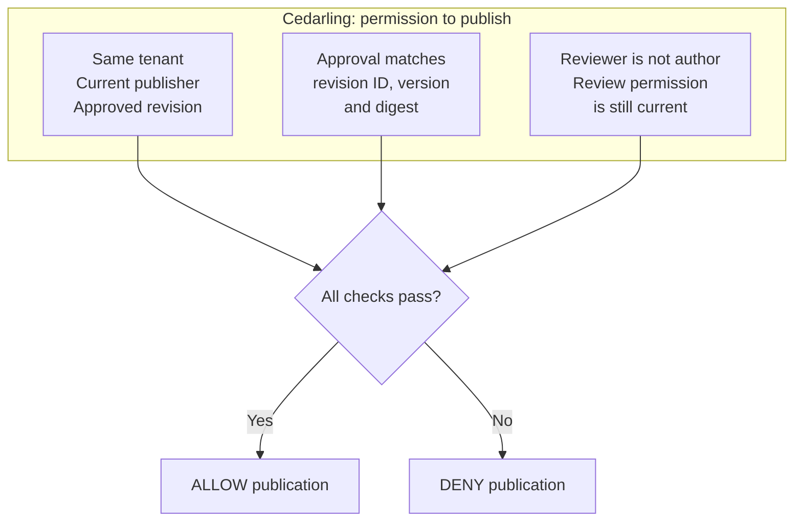
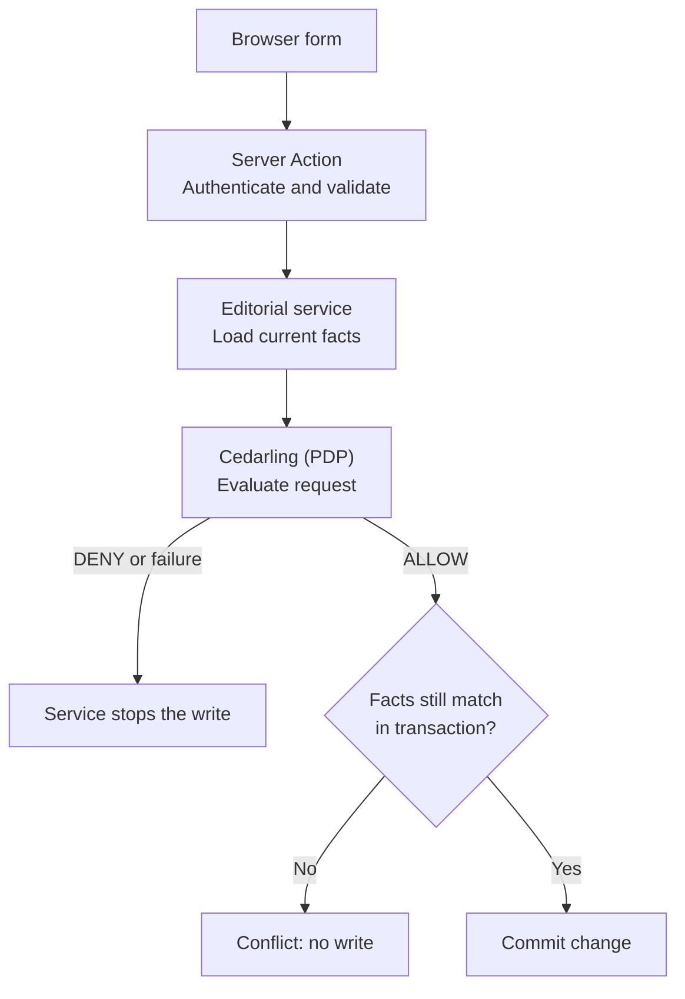

# Secure Editorial Publishing with Cedarling

Welcome! Our example is an editorial app where Riley writes articles and Ana
reviews and publishes them. We'll use Cedarling to check permissions as an
article moves from draft to review and publication.

What does an approval cover when the author changes the article afterward?
Our editorial app accepts the old approval. It also lets an author approve
their own writing and accepts approvals from reviewers whose review permission has since been revoked.

We'll start with self-approval and use Cedarling to close all three gaps:
require a different reviewer, tie approval to the exact revision, and check
that reviewer's current permission before publication. Existing tenant, author,
and publisher restrictions will move into the same policy store. By the end,
Riley and Ana will still be able to publish reviewed work together, with server
checks on article creation, reads, edits, submission, review, and publication.

## Secure the publishing workflow or try the finished app

- To build the integration, start with [Run the starting application](#run-the-starting-application), then add the policies and server checks.
- To try the finished app, run the [finished project on main](https://github.com/GluuFederation/cedarling-tutorials/tree/main/p4-editorial-publishing) using its README, then go to [Check approvals and publication](#check-approvals-and-publication). This version already uses Cedarling.

If you're building from the starting project, open each **Required step** section
and complete its instructions before continuing. These sections contain the files
and changes we'll need.

<details>
<summary>Before you start</summary>

- Git, Node.js 24.21+ within 24.x, and pnpm 10.17.1 for the coding steps. The project supplies its own tutorial identity provider (IdP).
- Docker with Compose is optional for running the starting or finished application. Use native Node.js for the coding steps.
- Familiarity with TypeScript, Next.js Server Actions, sessions, and basic HTTP requests.
- New to Cedarling? [Read the short introduction](https://cedarling.dev/learn/what-is-cedarling) when you need it.
- Keep the [Cedar policy syntax](https://docs.cedarpolicy.com/policies/syntax-policy.html) and [Cedar schema syntax](https://docs.cedarpolicy.com/schema/human-readable-schema.html) references handy while editing policies.
- These steps were prepared on Ubuntu 24.04+. The repository also has native CI checks for macOS and Windows. If a platform-specific step fails, [open an issue](https://github.com/GluuFederation/cedarling-tutorials/issues).

</details>

Run the commands from `p4-editorial-publishing/`. Paths under `shared/` are relative to
the repository root.

## Meet the authors and editors


_Riley writes; Ana reviews and publishes. Omar lets us test what happens when a reviewer loses permission._

P4 is a small Next.js App Router application for creating articles,
reviewing fixed versions of their content, and publishing approved work.

- **Riley** writes and submits articles, but has no permission to review them.
- **Ana** can review other authors' work and publish approved revisions.
- **Omar** can review work until his permission is revoked.

All three can create articles in their tenant. Writing, reviewing, and publishing
require separate permissions. Editors cannot approve their own content.

Cedarling runs on the server using `authorizeUnsigned()`. The bundled Node.js
`oidc-provider` authenticates the user first. The server then loads the current
user, revision, and authority records from SQLite for Cedarling to evaluate.
"Unsigned" describes this authorization request; it does not skip sign-in.
The browser uses the server's decisions to enable or disable controls.

## Try the workflow before adding Cedarling

Before we add those checks, let's see what the starting app allows. We'll keep
the results so we can repeat the same requests after integration.

### Run the starting application

Use a separate checkout for P4, including if you've already followed another
project. This keeps shared files and editorial data separate:

```bash
git clone https://github.com/GluuFederation/cedarling-tutorials.git cedarling-p4
cd cedarling-p4
git switch --detach 21b0832be4b31271320df992d04e9d97667d0e38
cd p4-editorial-publishing

# Prepare the tutorial steps.
git restore --source=5cd80ee94619a262fe30a4300deba0e529ae0c77 --worktree -- ../shared/tools/step
node ../shared/tools/step/run.mjs p4 init --source 5cd80ee94619a262fe30a4300deba0e529ae0c77
```

For the coding path, install the dependencies and start the app from this directory:

```bash
pnpm --dir ../shared/identity-provider install --frozen-lockfile
pnpm --dir ../shared/identity-provider build
pnpm install --frozen-lockfile
pnpm run setup
pnpm dev
```

`pnpm dev` starts the IdP and Next.js together.

<details>
<summary>Optional: Run the starting app with Docker</summary>

From `p4-editorial-publishing/`, run:

```bash
docker compose up --build
```

Run either Docker or the native stack, since both use ports 17004 and 18004.
Native runs store exercise data in `.local`; Docker uses its own volume.
Each method keeps its own exercise history.

</details>

Open `http://localhost:17004`. P4's IdP runs at `http://localhost:18004`.
Select Riley; the development IdP usually prefills `riley`, so enter it only
if the field is empty. Use a non-empty password such as `cedarling-is-awesome`,
and approve access. To switch users during the exercises, open the account menu
and select **Sign out or change account**, then choose the next user.

### Approve your own work, then reuse an old approval

As Riley, open **Launch brief**, select **Submit for review**, then **Approve
revision**. The baseline reports that the exact revision was approved, despite
Riley being its author without permission to review. Sign-in and workflow
checks passed; the app failed to require a different, authorized reviewer.

Two further exercises show why publication needs its own decision:

1. As Ana, approve **Customer migration guide** revision 1. As Riley, change its
   body, choose **Create new draft**, and submit revision 2. As Ana, publish the
   current revision. The baseline lets an earlier approval cover changed content.
2. As Omar, approve **Partner announcement**. Revoke his authority, then publish
   as Ana. The baseline still accepts approval from the revoked editor.

For the second exercise, revoke Omar's permission:

```bash
pnpm admin revoke-omar
```

<details>
<summary>If using Docker: Revoke Omar's permission</summary>

```bash
docker compose exec cedarpress node --env-file=/run/config/app.env scripts/admin.ts revoke-omar
```

</details>

Capture the reviewer, revision details, and publication result. Keep tokens,
cookies, and CSRF values out of screenshots and recordings.
Use a separate sample article for each exercise. Stop the baseline with
`Ctrl+C` before editing.

<details>
<summary>If using Docker: Switch to native development</summary>

Run `docker compose down` to keep its volume, then install the native
dependencies for the coding steps:

```bash
pnpm --dir ../shared/identity-provider install --frozen-lockfile
pnpm --dir ../shared/identity-provider build
pnpm install --frozen-lockfile
```

</details>

## Where should we check permission?

We've seen an approval succeed when it should not. To find where to enforce
the rule, open the baseline's
[`src/server/service.ts`](https://github.com/GluuFederation/cedarling-tutorials/blob/21b0832be4b31271320df992d04e9d97667d0e38/p4-editorial-publishing/src/server/service.ts)
and find `publish()`. It calls the authorization function before writing to the
database. In
[`src/server/authorization.ts`](https://github.com/GluuFederation/cedarling-tutorials/blob/21b0832be4b31271320df992d04e9d97667d0e38/p4-editorial-publishing/src/server/authorization.ts),
that check only asks whether the user may publish and an approval exists:

```ts
// src/server/authorization.ts (starting checkpoint)
export function baselineAllows(request: AuthorizationRequest): boolean {
  const fact = (name: string) => request.facts[name] === true;
  switch (request.capability) {
    // ... other capability cases omitted.
    case "publication.publish":
      return fact("publisherAuthorityCurrent") && fact("approvalPresent");
  }
}
```

We'll replace this check with a Cedarling decision that requires approval of
the current revision by someone who still has review permission. The existing New article
form, authentication, CSRF checks, and database version guards stay in place.

## Decide who can review and publish

We have found the check we'll replace. Now we'll put the editorial rules in a
policy store, starting with who may review and which approval may permit publication.

### Create the policy store

Let's create a `policy-store/` directory at the P4 project root, using Cedarling's
[directory-based format](https://docs.jans.io/stable/cedarling/reference/cedarling-policy-store/#2-new-directory-based-format):

```text
policy-store/
  metadata.json
  schema.cedarschema
  policies/
    editorial.cedar
```

<details>
<summary>Required step: Create the three policy-store files</summary>

```bash
node ../shared/tools/step/run.mjs p4 policy-store
```

New files:

- [`policy-store/metadata.json`](https://github.com/GluuFederation/cedarling-tutorials/blob/main/p4-editorial-publishing/policy-store/metadata.json): identifies the store and its version, `1.0.0`.
- [`policy-store/schema.cedarschema`](https://github.com/GluuFederation/cedarling-tutorials/blob/main/p4-editorial-publishing/policy-store/schema.cedarschema): defines principals, resources, actions, and the facts each request requires.
- [`policy-store/policies/editorial.cedar`](https://github.com/GluuFederation/cedarling-tutorials/blob/main/p4-editorial-publishing/policy-store/policies/editorial.cedar): defines the permissions for reading, writing, reviewing, and publishing.

</details>

These files define how Cedarling evaluates the current user, revision, and
permission records supplied by the server.[^3]

| Design question                         | P4 answer                                                                                         |
| --------------------------------------- | ------------------------------------------------------------------------------------------------- |
| Who acts?                               | `P4EditorialPublishing::Principal`: database user ID and tenant                                   |
| Where does a new article belong?        | `Tenant`, selected from the authenticated user                                                    |
| What may be read?                       | An `Article` in that tenant                                                                       |
| What does review or publication target? | One `Revision`, with its ID, tenant, author, version, digest, and state                           |
| Who may review?                         | A current editor who is not the author                                                            |
| Who may publish?                        | A current publisher with exact approval from a different reviewer who still has review permission |
| Which facts change per request?         | Revision state, approval evidence, and current authority                                          |
| What remains outside policy?            | Input limits, CSRF, valid state changes, fixed content, and all-or-nothing writes                 |

The digest[^1] is a content fingerprint: it lets us compare what was reviewed
with what is being published. Permission is checked separately.
Keep article version and revision version separate. The article version stops
outdated writes; the revision version identifies the approved content.

### Choose an action and resource for each operation

With those types in place, we can map each operation to an action such as
`P4EditorialPublishing::Action::"CreateArticle"` and the resource it protects.

| Capability            | Action                                                                                                                                                                                   | Resource                 | Additional context                                | Effect waiting for ALLOW              |
| --------------------- | ---------------------------------------------------------------------------------------------------------------------------------------------------------------------------------------- | ------------------------ | ------------------------------------------------- | ------------------------------------- |
| `article.create`      | [`CreateArticle`](https://github.com/GluuFederation/cedarling-tutorials/blob/main/p4-editorial-publishing/policy-store/policies/editorial.cedar#L51 "create-tenant-article")             | Authenticated tenant     | Empty                                             | Insert article and first draft        |
| `article.read`        | [`ReadArticle`](https://github.com/GluuFederation/cedarling-tutorials/blob/main/p4-editorial-publishing/policy-store/policies/editorial.cedar#L2 "read-tenant-article")                  | Current article          | Empty                                             | Return article and revision evidence  |
| `revision.edit`       | [`EditRevision`](https://github.com/GluuFederation/cedarling-tutorials/blob/main/p4-editorial-publishing/policy-store/policies/editorial.cedar#L10 "author-revision")                    | Current revision         | Empty                                             | Save owned draft or create next draft |
| `revision.submit`     | [`SubmitRevision`](https://github.com/GluuFederation/cedarling-tutorials/blob/main/p4-editorial-publishing/policy-store/policies/editorial.cedar#L10 "author-revision")                  | Current revision         | Empty                                             | Submit owned content for review       |
| `revision.approve`    | [`ApproveRevision`](https://github.com/GluuFederation/cedarling-tutorials/blob/main/p4-editorial-publishing/policy-store/policies/editorial.cedar#L21 "independent-review")              | Exact submitted revision | Current editor authority                          | Record independent approval           |
| `revision.reject`     | [`RejectRevision`](https://github.com/GluuFederation/cedarling-tutorials/blob/main/p4-editorial-publishing/policy-store/policies/editorial.cedar#L21 "independent-review")               | Exact submitted revision | Current editor authority                          | Record independent rejection          |
| `publication.publish` | [`PublishRevision`](https://github.com/GluuFederation/cedarling-tutorials/blob/main/p4-editorial-publishing/policy-store/policies/editorial.cedar#L34 "publish-exact-approved-revision") | Exact current revision   | Current publisher authority and approval evidence | Publish that revision                 |

Creating an article targets the tenant because the article does not yet exist.
Its author and tenant are set by the server, not accepted from the form.

### Require an independent reviewer and approval of the current revision

Review and publication are separate actions because approval may become invalid
before we use it. In `policy-store/policies/editorial.cedar`, the review rule
requires a permitted reviewer who is not the author:

```cedar
// policy-store/policies/editorial.cedar
@id("independent-review")
permit (
  principal is P4EditorialPublishing::Principal,
  action in [P4EditorialPublishing::Action::"ApproveRevision", P4EditorialPublishing::Action::"RejectRevision"],
  resource is P4EditorialPublishing::Revision
) when {
  principal.tenant_id == resource.tenant_id &&
  context.editor_authority_current &&
  principal.id != resource.author_id &&
  resource.state == "submitted"
};
```

For Riley's submitted article, Riley fails two conditions: there is no current
permission to review, and `principal.id` equals `resource.author_id`. Ana belongs to
the same tenant, has permission to review, and is not the author, so she can review
that submitted revision.

When Ana later publishes the revision, we need to check the approval again:

```cedar
// policy-store/policies/editorial.cedar
@id("publish-exact-approved-revision")
permit (
  principal is P4EditorialPublishing::Principal,
  action == P4EditorialPublishing::Action::"PublishRevision",
  resource is P4EditorialPublishing::Revision
) when {
  principal.tenant_id == resource.tenant_id &&
  context.publisher_authority_current &&
  resource.state == "approved" &&
  context has approval &&
  context.approval.revision_id == resource.revision_id &&
  context.approval.revision_version == resource.version &&
  context.approval.digest == resource.digest &&
  context.approval.reviewer_id != resource.author_id &&
  context.approval.reviewer_authority_current
};
```

If Ana publishes content approved by Omar, the approval must match the current
revision's ID, version, and digest. Revoking Omar's editor authority makes
`context.approval.reviewer_authority_current` false even when the content hasn't
changed. That approval can no longer permit publication.

Publication requires all three groups of checks below to pass:



The same file contains `read-tenant-article`, `author-revision`, and
`create-tenant-article`: tenant members read their articles, authors edit/submit
their own revisions, and tenant members create articles in their tenant.
No matching permit means DENY. SQLite still checks workflow state and guards
against conflicting writes after authorization succeeds.

## Add Cedarling to the server

The policy now describes when an operation is allowed. We'll connect it to the
editorial service so each change waits for that decision and for a final
database check:



### Build the archive and load Cedarling

From the P4 directory, let's install Cedarling and the tools that package and
validate our policy store, along with the Next.js security update:

```bash
pnpm add --save-exact @janssenproject/cedarling_wasm@0.0.468 fflate@0.8.3 next@16.3.8
pnpm add --save-dev --save-exact @cedar-policy/cedar-wasm@4.12.0 @types/node@24.19.0
```

We'll use a shared builder to validate the policy files and package them for Cedarling.

<details>
<summary>Required step: Create the shared archive-builder files</summary>

```bash
node ../shared/tools/step/run.mjs p4 archive-builder
```

The builder files go in the repository's `shared/` directory, one level above P4:

- [`shared/policy-store.mjs`](https://github.com/GluuFederation/cedarling-tutorials/blob/main/shared/policy-store.mjs): validates and packages the readable policy store into a Cedar archive.
- [`shared/policy-store.d.mts`](https://github.com/GluuFederation/cedarling-tutorials/blob/main/shared/policy-store.d.mts): provides TypeScript declarations for the builder.

</details>

Run the shared builder to create the archive:

```bash
node ../shared/policy-store.mjs
```

The command must finish without validation errors and create `.local/policy-store.cjar`.
Keep the readable source directory in Git.

We'll replace `src/server/authorization.ts` using the complete file in the next
step. The server runtime calls `createEditorialAuthorization()` once to load
[Cedarling](https://www.npmjs.com/package/@janssenproject/cedarling_wasm/v/0.0.468).
Its default `archivePath` resolves to `.local/policy-store.cjar` in the project
directory:

```ts
// src/server/authorization.ts
import { readFile } from "node:fs/promises";
import { resolve } from "node:path";
import { initFromArchiveBytes } from "@janssenproject/cedarling_wasm";

// ... other imports and types omitted.
export async function createEditorialAuthorization(
  archivePath = resolve(".local/policy-store.cjar"),
) {
  const archive = new Uint8Array(await readFile(archivePath));
  // ... validate metadata and log the policy version and archive digest.
  const cedarling = await initFromArchiveBytes(
    {
      CEDARLING_APPLICATION_NAME: "P4 Editorial Publishing",
      CEDARLING_LOG_TYPE: "memory",
      CEDARLING_LOG_TTL: 300,
      CEDARLING_STRICT_SCHEMA_VALIDATION: "enabled",
    },
    archive,
  );
  // ... define the authorize callback shown below.
  return { authorize, close: () => cedarling.shutDown() };
}
```

The complete module logs the store version and SHA-256 at startup. It
also returns `close: () => cedarling.shutDown()` for callers, such as tests,
that explicitly stop the runtime.

### Pass the current revision and approval to Cedarling

With the archive ready, we can replace the baseline's authorization check and
connect it to the service and forms, then follow the publication request through
them.

<details>
<summary>Required step: Add the server integration and form files</summary>

```bash
node ../shared/tools/step/run.mjs p4 server
```

Updated files:

- [`src/server/authorization.ts`](https://github.com/GluuFederation/cedarling-tutorials/blob/main/p4-editorial-publishing/src/server/authorization.ts): loads Cedarling, maps each capability to a request, and records its decision.
- [`src/server/models.ts`](https://github.com/GluuFederation/cedarling-tutorials/blob/main/p4-editorial-publishing/src/server/models.ts): defines the revision, approval, and authority evidence passed between server modules.
- [`src/server/errors.ts`](https://github.com/GluuFederation/cedarling-tutorials/blob/main/p4-editorial-publishing/src/server/errors.ts): distinguishes denied, conflicting, and unavailable operations.
- [`src/server/database.ts`](https://github.com/GluuFederation/cedarling-tutorials/blob/main/p4-editorial-publishing/src/server/database.ts): rechecks approval and authority evidence inside write transactions.
- [`src/server/service.ts`](https://github.com/GluuFederation/cedarling-tutorials/blob/main/p4-editorial-publishing/src/server/service.ts): loads trusted facts and requires permission before each protected operation.
- [`src/server/runtime.ts`](https://github.com/GluuFederation/cedarling-tutorials/blob/main/p4-editorial-publishing/src/server/runtime.ts): creates the shared server runtime with Cedarling authorization.
- [`app/actions.ts`](https://github.com/GluuFederation/cedarling-tutorials/blob/main/p4-editorial-publishing/app/actions.ts): verifies each form request, calls the service, and reports the outcome.
- [`app/articles/[articleId]/page.tsx`](https://github.com/GluuFederation/cedarling-tutorials/blob/main/p4-editorial-publishing/app/articles/[articleId]/page.tsx): uses server permission previews to show available actions and feedback.
- [`next.config.ts`](https://github.com/GluuFederation/cedarling-tutorials/blob/main/p4-editorial-publishing/next.config.ts): keeps the Cedarling package external to the Next.js server bundle.

[`app/action-button.tsx`](https://github.com/GluuFederation/cedarling-tutorials/blob/main/p4-editorial-publishing/app/action-button.tsx) displays pending and disabled action buttons
with an explanation when the action is unavailable.

</details>

`src/server/service.ts` validates form input and loads the current article,
revision, latest approval, and publisher permission. Inside
`createEditorialAuthorization()`, the `authorize` callback maps these facts to
`resource` and `context` for the selected capability, then calls Cedarling:

```ts
// src/server/authorization.ts, inside createEditorialAuthorization()
const authorize: AuthorizeEditorial = async (request) => {
  const { principal, capability, requestId } = request;
  // ... map request.article (or tenant) to resource, and authority to context.
  try {
    const result = await cedarling.authorizeUnsigned(
      JSON.stringify({
        principal: {
          cedar_entity_mapping: {
            entity_type: "P4EditorialPublishing::Principal",
            id: principal.id,
          },
          id: principal.id,
          tenant_id: principal.tenantId,
        },
        action: `P4EditorialPublishing::Action::"${actions[capability]}"`,
        resource,
        context,
      }),
    );
    // ... log authorization.context with the application and Cedarling IDs.
    for (const log of cedarling.getLogsByRequestId(result.request_id)) {
      console.info(JSON.stringify(log, null, 2));
    }
    if (result.response.diagnostics.errors.length > 0) throw unavailable();
    return result.decision === true;
  } catch {
    // ... log authorization.failed with bounded fields.
    throw unavailable();
  }
};
```

For `publication.publish`, `resource` describes the current revision: its ID,
tenant, author, version, digest, and state. `context` carries
`publisher_authority_current` and, when present, an `approval` with its revision
ID/version, digest, reviewer ID, and current reviewer authority. These are the
fields the publication policy checks above.

`authorizeUnsigned()` expects a JSON string; `JSON.stringify()` converts the
current principal, resource, and context to that format.[^2] The
formatted log call makes nested reasons readable in this local exercise.

`unavailable()` is the existing application error from `src/server/errors.ts`.
The catch handler maps Cedarling failures to that error without printing raw
request data. A false decision becomes `FORBIDDEN` in the service.

The other capabilities use the resources and context in the request table.

### Check permission before saving the publication

We have a Cedarling result; now the service must act on it. In `publish()`,
`this.allow()` must succeed before `this.database.publish()` runs:

```ts
// src/server/service.ts
export class EditorialService {
  // ... constructor and other methods omitted.
  async publish(
    session: Session,
    form: FormData,
    requestId: string,
  ): Promise<void> {
    const articleId = this.parseId(form.get("articleId"));
    const version = this.parseVersion(form.get("expectedVersion"));
    const article = this.current(session, articleId, version);
    const approval = this.database.latestApproval(articleId);
    const publisher = this.database.authority(
      session.principal.id,
      article.tenantId,
      "publisher",
    );
    await this.allow({
      requestId,
      capability: "publication.publish",
      principal: session.principal,
      article,
      publisherAuthorityCurrent: publisher.current,
      approval,
    });
    this.database.publish(
      articleId,
      article.tenantId,
      session.principal.id,
      version,
      { publisher, approval },
    );
  }
}
```

`this.allow()` throws `forbidden()` when authorization returns false. A failed
evaluation also throws, so neither outcome reaches the database write.

Here `article` has already been loaded at the expected article version.
Inside the write transaction, the database rechecks the article, approval, and
permission records. A change while waiting for Cedarling causes `STATE_CONFLICT`
instead of an outdated write. Draft, submit, and review operations also check
whether another request changed the records.

The Server Actions in `app/actions.ts` keep authentication, same-origin and
CSRF verification. `"use server"` does not restrict who may call an action;
these functions are reachable by network requests.

Page rendering uses server permission previews to disable denied controls with
a short explanation. Each submitted action reloads facts and authorizes again.
OAuth tokens and raw policy diagnostics stay on the server; successful forms
show readable outcomes without internal request IDs.

## Finish setup and restart the app

We've connected the decisions to the workflow. Before restarting, we'll finish
the startup and error handling, then add checks for our completed integration.

<details>
<summary>Required step: Replace the setup, packaging, and feedback files</summary>

```bash
node ../shared/tools/step/run.mjs p4 startup
```

Updated files:

- [`scripts/setup.ts`](https://github.com/GluuFederation/cedarling-tutorials/blob/main/p4-editorial-publishing/scripts/setup.ts): packages the policy store during development setup.
- [`Dockerfile`](https://github.com/GluuFederation/cedarling-tutorials/blob/main/p4-editorial-publishing/Dockerfile): builds and includes the archive in the runtime image.
- [`app/auth/callback/route.ts`](https://github.com/GluuFederation/cedarling-tutorials/blob/main/p4-editorial-publishing/app/auth/callback/route.ts): handles login failures with bounded responses and logs.
- [`app/error.tsx`](https://github.com/GluuFederation/cedarling-tutorials/blob/main/p4-editorial-publishing/app/error.tsx): gives the user a recovery option when the workspace is unavailable.
- [`app/styles.css`](https://github.com/GluuFederation/cedarling-tutorials/blob/main/p4-editorial-publishing/app/styles.css): styles action feedback and disabled controls in the editorial workspace.

The step also updates `build` to package policies before the Next.js build.

</details>

<details>
<summary>Required step: Add the checks for the completed integration</summary>

```bash
node ../shared/tools/step/run.mjs p4 checks
```

Add these checks before building: TypeScript checks them alongside the application.
We'll run the full suite after the browser exercises.

Updated files:

- [`test/authorization.test.ts`](https://github.com/GluuFederation/cedarling-tutorials/blob/main/p4-editorial-publishing/test/authorization.test.ts): checks real Cedarling decisions and safe decision logs.
- [`test/database.test.ts`](https://github.com/GluuFederation/cedarling-tutorials/blob/main/p4-editorial-publishing/test/database.test.ts): checks revision, approval, and transaction invariants.
- [`test/service.test.ts`](https://github.com/GluuFederation/cedarling-tutorials/blob/main/p4-editorial-publishing/test/service.test.ts): checks service enforcement, concurrent changes, and unavailable decisions.
- [`test/support.ts`](https://github.com/GluuFederation/cedarling-tutorials/blob/main/p4-editorial-publishing/test/support.ts): supplies isolated databases and sessions for tests.
- [`playwright.config.ts`](https://github.com/GluuFederation/cedarling-tutorials/blob/main/p4-editorial-publishing/playwright.config.ts): connects the browser checks to their temporary application stack.
- Repository-level [`shared/dev-supervisor.mjs`](https://github.com/GluuFederation/cedarling-tutorials/blob/main/shared/dev-supervisor.mjs): starts and stops the application and IdP processes used by that stack.

New files:

- [`test/config.test.ts`](https://github.com/GluuFederation/cedarling-tutorials/blob/main/p4-editorial-publishing/test/config.test.ts): checks server configuration validation.
- [`e2e/editorial-authorization.e2e.ts`](https://github.com/GluuFederation/cedarling-tutorials/blob/main/p4-editorial-publishing/e2e/editorial-authorization.e2e.ts): exercises denied and permitted workflows through the real IdP and browser.
- Repository-level [`shared/browser-test-stack.mjs`](https://github.com/GluuFederation/cedarling-tutorials/blob/main/shared/browser-test-stack.mjs): builds the application and starts the browser test stack with disposable data.

The step removes `e2e/editorial-gaps.e2e.ts` and updates `test` and `check`
for the integrated suite. The other tests and `tsconfig.json` stay in place.

</details>

Setup, builds, and policy tests now package the archive before using it. The
Dockerfile includes it in the application image. In `next.config.ts`,
`serverExternalPackages` leaves the Cedarling package outside Next.js's server
bundle so Node.js can load it. P4 evaluates authorization in its server service.

Stop the baseline development stack completely before restarting; the
server runtime is cached and must not keep its old authorization implementation.
Run:

```bash
pnpm run setup
pnpm build
pnpm dev
```

The app is available at `http://localhost:17004`.

## Check approvals and publication

The app is running with Cedarling. Let's repeat our original self-approval
attempt, then check that Ana can publish only while the approval is valid.

Reset the exercise database first: restarting does not undo the article changes
or restore Omar's revoked permission. Reset clears editorial records, sessions,
and pending sign-ins, then restores the sample articles and Omar's review
permission. Do not reset data you want to keep.

In another terminal, from `p4-editorial-publishing/`, run:

```bash
pnpm reset
```

<details>
<summary>If using Docker: Reset the sample data</summary>

This clears the Docker stack's editorial records, sessions, and pending sign-ins,
then restores the sample articles and Omar's permission. Keep any data you need
before running:

```bash
docker compose exec cedarpress node --env-file=/run/config/app.env scripts/reset.ts
```

</details>

Sign in again as Riley before continuing.

### Try self-approval without the button restriction

We'll start with a fresh article. As Riley, create an article, submit its
draft for review, and confirm that its current revision says **submitted**.
The **Approve revision** button is disabled. To check the server also denies approval,
open developer tools on that article's local page and run:

```js
(() => {
  const actionLabel = "Approve revision";
  const button = [...document.querySelectorAll('button[type="submit"]')].find(
    (element) => element.textContent?.trim() === actionLabel,
  );
  if (!button)
    throw new Error(`Open the article with the ${actionLabel} action`);
  button.removeAttribute("disabled");
  button.click();
})();
```

Expect “This action is not allowed.” Reload: the revision remains submitted
and no approval was recorded. This modifies only the local control and submits
the real framework form; it does not grant authority.

For a direct HTTP check, capture that Server Action POST in the Network
panel and replay it using the same authenticated local session. Preserve its
current action header, body, and CSRF value. Do not invent or hard-code a Next.js
action ID, and do not publish the captured credentials. The response can return
HTTP 200 with an `x-action-redirect` containing `error-forbidden`; judge the
application outcome and unchanged record, not the HTTP status alone.

### Publish reviewed work, then change its content or authority

Self-approval is now blocked at the server. Next, we'll check the valid
Riley-to-Ana flow and the two ways an earlier approval can become unusable.
If Omar's authority is revoked after approval but the content stays unchanged,
can Ana still publish it? Check the publication policy, then compare your
answer with the revocation row below.

| Exercise                                                         | Expected integrated outcome                                  |
| ---------------------------------------------------------------- | ------------------------------------------------------------ |
| Riley creates a new article and submits it                       | ALLOW; author and tenant are server-assigned                 |
| Riley approves or rejects their own revision                     | DENY; no review evidence created                             |
| Ana approves Riley's exact submitted revision, then publishes it | ALLOW; one publication effect                                |
| Riley submits a new revision after an earlier approval           | Publication denied until that new revision receives approval |
| Omar approves, then loses editor authority                       | Ana cannot publish using that approval                       |
| Content or authority changes while a decision is pending         | Conflict; no stale authorized write                          |

Repeat the **Customer migration guide** and **Partner announcement** exercises
from before integration. On each article's page, Ana now sees a disabled
**Publish current revision** button. To send the request anyway, rerun the
console snippet above with `actionLabel` set to `"Publish current revision"`.
Expect “This action is not allowed.” in both cases. Reload and check:

- The migration guide's new revision remains **submitted** and unpublished.
- The partner announcement remains **approved** and unpublished, with Omar's
  reviewer authority shown as **Revoked**.

Then use **Editorial handbook** to check Ana can approve and publish, or finish
the article Riley created during this exercise. Ana can also approve the migration
guide's new revision and publish it once that revision has its own approval.

### Read the decision and publication logs

To connect what we see in the app with the decision that produced it, find the
matching server logs. `authorization.context` links the application `requestId`, actor, capability,
and `preview` or `enforcement` phase to the Cedarling request ID in `cedarlingRequestId`. Cedarling's JSON
prints all policy reasons and errors. An allowed publication cites
`publish-exact-approved-revision`.

A self-approval DENY can have empty `diagnostics.reason` and `errors` because no
permit matched. Use the author and editor facts to explain the denial. A preview
ALLOW may be followed by enforcement DENY after revocation; the preview was
guidance for an earlier state.

`editorial.action.completed` appears after the change is saved.
`editorial.action.failed` records a handled failure. Compare these logs with the
revision details; an ALLOW alone does not prove publication.
Logs kept in memory expire after five minutes, so they are not a lasting audit record.

### Check concurrent changes and unavailable decisions

We've checked the workflow and its logs. The test files we copied also exercise
concurrent changes and unavailable authorization. Run them in the same checkout
where you built the integration. Stop your development stack to free ports
17004 and 18004, then run from `p4-editorial-publishing/`:

```bash
pnpm exec playwright install chromium
pnpm format
pnpm check
```

On Linux, use `pnpm exec playwright install --with-deps chromium` if browser
libraries are missing. The check includes formatting, lint, types, tests, and
a production build/browser workflow with disposable data.

The checks evaluate real policies and verify that self-review, stale approvals,
revoked authority, and unavailable Cedarling cannot change protected records.
They also change facts while decisions are pending and repeat button tampering
and direct Server Action requests through the real IdP and browser.

<details>
<summary>Warning: Learning project only</summary>

This project is for learning only and is not intended for production use.
A production application needs HTTPS and a production OIDC provider in place
of the local HTTP/IdP setup, plus a review of permission administration,
session and storage controls, and durable audit logging.

For those components, consider Agama Lab Policy Designer for policy authoring,
Jans Auth for identity, and Lock Server for centralized decision logs:
[Cedarling production solutions](https://cedarling.dev/solutions).

</details>

## Recap: approval and publication

We started with an app that accepted self-approval and reused approvals after
the content or reviewer permissions changed. We've now required an independent
reviewer, bound the approval to an exact revision, and checked current authority
before publication. The valid Riley-to-Ana workflow still succeeds. We also
checked the server directly, so a disabled button is not our only protection.

For another approval workflow, identify the content version being approved and
the permission that makes its reviewer eligible. Load those facts before the
protected action, and save the change only if they still match when it commits.

In [P5](https://cedarling.dev/learn/protect-sensitive-data-exports), we'll check
access to individual fields, aggregates, and CSV exports
instead of granting it to everyone who can open a page.

[^1]: A digest is a reproducible fingerprint of the normalized revision content. P4 compares it with the approval's digest, while current reviewer authority and revision state remain separate requirements.

[^2]: The pinned [`cedarling_wasm` JavaScript API](https://www.npmjs.com/package/@janssenproject/cedarling_wasm/v/0.0.468) accepts a JSON-string request. Converting to JSON does not verify the values; P4 loads them from its trusted server state.

[^3]: P4 authenticates the user before calling `authorizeUnsigned()`. It builds the principal and current revision and authority facts from server records. The [policy-store format](https://docs.jans.io/stable/cedarling/reference/cedarling-policy-store/) also supports trusted-issuer mappings for applications that send tokens to Cedarling.
