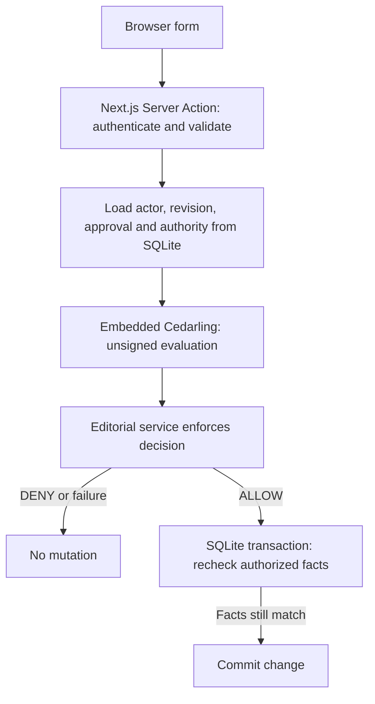
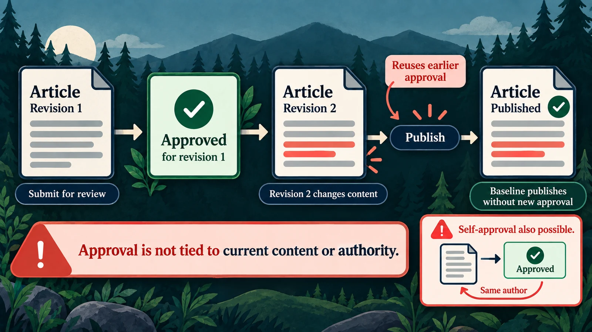
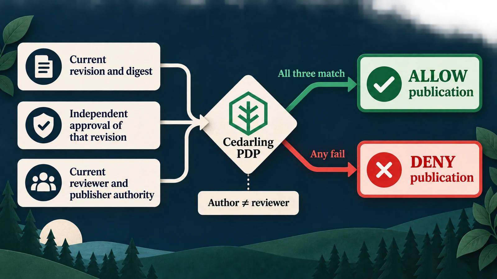
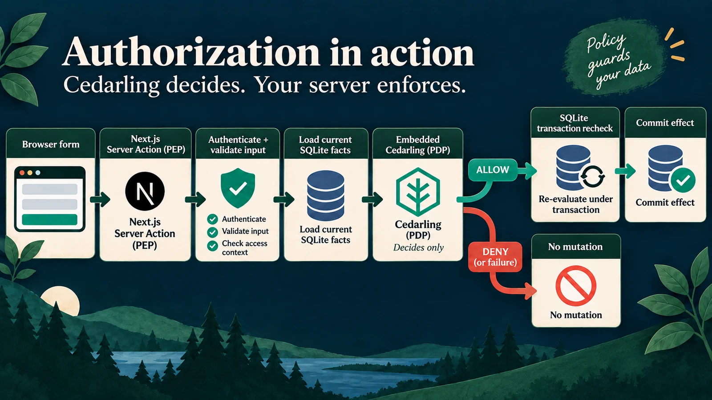
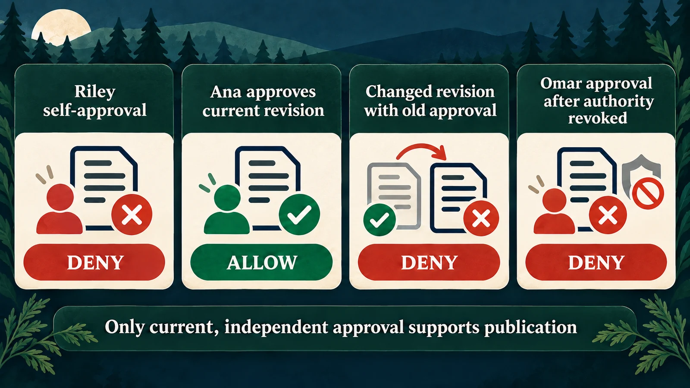
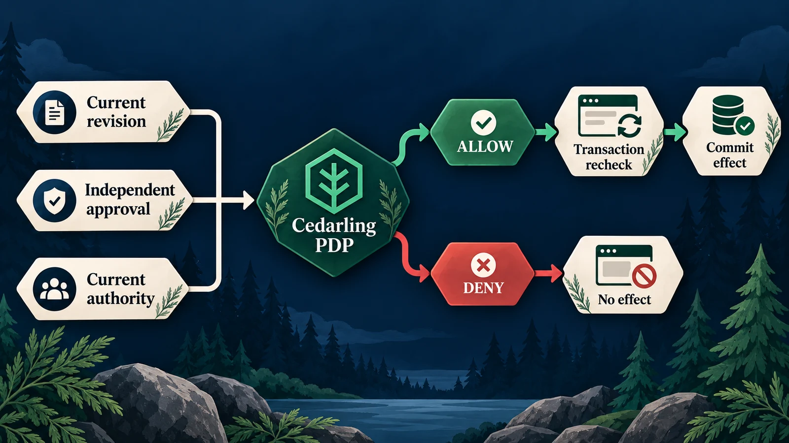

# Secure Editorial Publishing with Cedarling

Welcome! Our example is an editorial app where Riley writes articles and Ana
reviews and publishes them. We'll use Cedarling to check permissions as an
article moves from draft to review and publication.

What does an approval cover when the author changes the article afterward?
Our editorial app accepts the old approval. It also lets an editor approve
their own writing and accepts approvals from reviewers whose review permission has since been revoked.

We'll start with self-approval and use Cedarling to close all three gaps:
require a different reviewer, tie approval to the exact revision, and check
that reviewer's current permission before publication. Existing tenant, author,
and publisher restrictions will move into the same policy store. By the end,
Riley and Ana will still be able to publish reviewed work together, with server
checks on article creation, reads, edits, submission, review, and publication.

## Build the integration or try the finished app

- To build the integration, start with [Run the starting application](#run-the-starting-application), then add the policies and server checks.
- To try the finished app, run the [complete tagged project](https://github.com/GluuFederation/cedarling-tutorials/tree/p4-editorial-publishing-v1.0.1/p4-editorial-publishing) using its README, then go to [Check approvals and publication](#check-approvals-and-publication). This version already uses Cedarling.

<details>
<summary>What you'll need</summary>

- Git, Node.js 24.21+ within 24.x, and pnpm 10.17.1 for the coding steps. The project supplies its own tutorial identity provider (IdP).
- Docker with Compose is optional for running the starting or finished application. Use native Node.js for the coding steps.
- Familiarity with TypeScript, Next.js Server Actions, sessions, and basic HTTP requests.
- New to Cedarling? [Read the short introduction](https://cedarling.dev/learn/what-is-cedarling) when you need it.
- Keep the [Cedar policy syntax](https://docs.cedarpolicy.com/policies/syntax-policy.html) and [Cedar schema syntax](https://docs.cedarpolicy.com/schema/human-readable-schema.html) references handy while editing policies.

</details>

Copy whole files from GitHub's raw-file view into your baseline checkout; don't
switch to the finished tag. The short examples aren't complete replacements.
Create missing parent directories. Paths and commands are relative to
`p4-editorial-publishing/`; repository-level `shared/` files go one directory above it.

## Meet the authors and editors


_Riley writes; Ana reviews and publishes. Omar lets us test what happens when a reviewer loses permission._

P4 is a small Next.js App Router application for creating articles,
reviewing fixed versions of their content, and publishing approved work.

- **Riley** writes and submits articles, but has no permission to review them.
- **Ana** can review other authors' work and publish approved revisions.
- **Omar** can review work until his permission is revoked.

All three can create articles in their tenant. Writing, reviewing, and publishing
require separate permissions. Editors cannot approve their own content.



Cedarling runs on the server using `authorizeUnsigned()`. The bundled Node.js
`oidc-provider` authenticates the user first. The server then loads the current
user, revision, and authority records from SQLite for Cedarling to evaluate.
"Unsigned" describes this authorization request; it does not skip sign-in.
The browser uses the server's decisions to enable or disable controls.

## Try the workflow before adding Cedarling



_The starting app does not require a different person to approve the current revision._

### Run the starting application

Start from a separate checkout so the examples and resets affect only tutorial
data:

```bash
git clone https://github.com/GluuFederation/cedarling-tutorials.git cedarling-p4
cd cedarling-p4
git switch --detach 21b0832be4b31271320df992d04e9d97667d0e38
cd p4-editorial-publishing
docker compose up --build
```

Open `http://localhost:17004`. P4's IdP runs at `http://localhost:18004`.
Select Riley; the development IdP usually prefills `riley`, so enter it only
if the field is empty. Use a non-empty password such as `cedarling-is-awesome` on the
development IdP, and approve access.

For native startup, run these commands from the project directory:

```bash
pnpm --dir ../shared/identity-provider install --frozen-lockfile
pnpm --dir ../shared/identity-provider build
pnpm install --frozen-lockfile
pnpm run setup
pnpm dev
```

This starts the IdP and Next.js together. Do not run native and Docker instances
on the same ports.

### Approve your own work, then reuse an old approval

As Riley, open **Launch brief**, select **Submit for review**, then **Approve
revision**. The baseline reports that the exact revision was approved, despite
Riley being its author without permission to review. Sign-in and workflow
checks passed; the app failed to require a different, authorized reviewer.

Two further exercises show why publication needs its own decision:

1. As Ana, approve **Customer migration guide** revision 1. As Riley, change its
   body, choose **Create new draft**, and submit revision 2. As Ana, publish the
   current revision. The baseline lets an earlier approval cover changed content.
2. As Omar, approve **Partner announcement**. Revoke his authority, then publish
   as Ana. The baseline still accepts approval from the revoked editor.

For the second exercise, use the command matching your startup method:

```bash
# Native
pnpm admin revoke-omar
```

```bash
# Docker
docker compose exec cedarpress node --env-file=/run/config/app.env scripts/admin.ts revoke-omar
```

Capture the reviewer, revision details, and publication result.
Use a separate sample article for each exercise. Stop the baseline
with `Ctrl+C` before editing; for Docker, also run `docker compose down` without
removing its volume. If you started with Docker, install the native dependencies
using the commands above before the coding steps.

## Where should we check permission?

Open the baseline's
[`src/server/service.ts`](https://github.com/GluuFederation/cedarling-tutorials/blob/21b0832be4b31271320df992d04e9d97667d0e38/p4-editorial-publishing/src/server/service.ts)
and find `publish()`. It calls the authorization function before writing to the
database. In
[`src/server/authorization.ts`](https://github.com/GluuFederation/cedarling-tutorials/blob/21b0832be4b31271320df992d04e9d97667d0e38/p4-editorial-publishing/src/server/authorization.ts),
that check only asks whether the user may publish and an approval exists:

```ts
// src/server/authorization.ts (starting checkpoint)
case "publication.publish":
  return fact("publisherAuthorityCurrent") && fact("approvalPresent");
```

Nothing here checks which revision was approved or whether its reviewer still
has permission to review. We'll replace this check with Cedarling. The existing New article
form, authentication, CSRF checks, and database version guards stay in place.

## Decide who can review and publish



_The current revision needs approval from a different person who still has review permission._

### Create the policy store

Create the readable [directory-based store](https://docs.jans.io/stable/cedarling/reference/cedarling-policy-store/#2-new-directory-based-format):

```text
policy-store/
  metadata.json
  schema.cedarschema
  policies/
    editorial.cedar
```

Create the complete policy-store files from the pinned version:

- [`policy-store/metadata.json`](https://github.com/GluuFederation/cedarling-tutorials/blob/p4-editorial-publishing-v1.0.1/p4-editorial-publishing/policy-store/metadata.json)
- [`policy-store/schema.cedarschema`](https://github.com/GluuFederation/cedarling-tutorials/blob/p4-editorial-publishing-v1.0.1/p4-editorial-publishing/policy-store/schema.cedarschema)
- [`policy-store/policies/editorial.cedar`](https://github.com/GluuFederation/cedarling-tutorials/blob/p4-editorial-publishing-v1.0.1/p4-editorial-publishing/policy-store/policies/editorial.cedar)

Use the store's metadata and version `1.0.0`. Identity comes from the application's
verified OIDC session and current database user, so Cedarling needs no
trusted-issuer mapping for these unsigned requests. Principal, revision, and
permission records arrive with each request; no default entities,
templates, or custom issuers are needed.

| Design question                         | P4 answer                                                                                         |
| --------------------------------------- | ------------------------------------------------------------------------------------------------- |
| Who acts?                               | `P4EditorialPublishing::Principal`: database user ID and tenant                                   |
| Where does a new article belong?        | `Tenant`, selected from the authenticated user                                                    |
| What may be read?                       | An `Article` in that tenant                                                                       |
| What does review or publication target? | One `Revision`, with its ID, tenant, author, version, digest, and state                           |
| Who may review?                         | A current editor who is not the author                                                            |
| Who may publish?                        | A current publisher with exact approval from a different reviewer who still has review permission |
| Which facts change per request?         | Revision state, approval evidence, and current authority                                          |
| What remains outside policy?            | Input limits, CSRF, valid state changes, fixed content, and all-or-nothing writes                 |

The digest[^1] is a content fingerprint: it lets us compare what was reviewed
with what is being published. Permission is checked separately.
Keep article version and revision version separate. The article version stops
outdated writes; the revision version identifies the approved content.

### Choose an action and resource for each operation

Each request uses the current user loaded by the server and an action
such as `P4EditorialPublishing::Action::"CreateArticle"`.

| Capability            | Action                                                                                                                                                                                                             | Resource                 | Additional context                                | Effect waiting for ALLOW              |
| --------------------- | ------------------------------------------------------------------------------------------------------------------------------------------------------------------------------------------------------------------ | ------------------------ | ------------------------------------------------- | ------------------------------------- |
| `article.create`      | [`CreateArticle`](https://github.com/GluuFederation/cedarling-tutorials/blob/p4-editorial-publishing-v1.0.1/p4-editorial-publishing/policy-store/policies/editorial.cedar#L51 "create-tenant-article")             | Authenticated tenant     | Empty                                             | Insert article and first draft        |
| `article.read`        | [`ReadArticle`](https://github.com/GluuFederation/cedarling-tutorials/blob/p4-editorial-publishing-v1.0.1/p4-editorial-publishing/policy-store/policies/editorial.cedar#L2 "read-tenant-article")                  | Current article          | Empty                                             | Return article and revision evidence  |
| `revision.edit`       | [`EditRevision`](https://github.com/GluuFederation/cedarling-tutorials/blob/p4-editorial-publishing-v1.0.1/p4-editorial-publishing/policy-store/policies/editorial.cedar#L10 "author-revision")                    | Current revision         | Empty                                             | Save owned draft or create next draft |
| `revision.submit`     | [`SubmitRevision`](https://github.com/GluuFederation/cedarling-tutorials/blob/p4-editorial-publishing-v1.0.1/p4-editorial-publishing/policy-store/policies/editorial.cedar#L10 "author-revision")                  | Current revision         | Empty                                             | Submit owned content for review       |
| `revision.approve`    | [`ApproveRevision`](https://github.com/GluuFederation/cedarling-tutorials/blob/p4-editorial-publishing-v1.0.1/p4-editorial-publishing/policy-store/policies/editorial.cedar#L21 "independent-review")              | Exact submitted revision | Current editor authority                          | Record independent approval           |
| `revision.reject`     | [`RejectRevision`](https://github.com/GluuFederation/cedarling-tutorials/blob/p4-editorial-publishing-v1.0.1/p4-editorial-publishing/policy-store/policies/editorial.cedar#L21 "independent-review")               | Exact submitted revision | Current editor authority                          | Record independent rejection          |
| `publication.publish` | [`PublishRevision`](https://github.com/GluuFederation/cedarling-tutorials/blob/p4-editorial-publishing-v1.0.1/p4-editorial-publishing/policy-store/policies/editorial.cedar#L34 "publish-exact-approved-revision") | Exact current revision   | Current publisher authority and approval evidence | Publish that revision                 |

Creating an article targets the tenant because the article does not yet exist.
Its author and tenant are set by the server, not accepted from the form.

### Require an independent reviewer and approval of the current revision

In `policies/editorial.cedar`, a reviewer must have permission and must not be
the author:

```cedar
// policy-store/policies/editorial.cedar
@id("independent-review")
permit (
  principal is P4EditorialPublishing::Principal,
  action in [P4EditorialPublishing::Action::"ApproveRevision", P4EditorialPublishing::Action::"RejectRevision"],
  resource is P4EditorialPublishing::Revision
) when {
  principal.tenant_id == resource.tenant_id &&
  context.editor_authority_current &&
  principal.id != resource.author_id &&
  resource.state == "submitted"
};
```

For Riley's submitted article, Riley fails two conditions: there is no current
permission to review, and `principal.id` equals `resource.author_id`. Ana belongs to
the same tenant, has permission to review, and is not the author, so she can review
that submitted revision.

Publication needs another rule:

```cedar
// policy-store/policies/editorial.cedar
@id("publish-exact-approved-revision")
permit (
  principal is P4EditorialPublishing::Principal,
  action == P4EditorialPublishing::Action::"PublishRevision",
  resource is P4EditorialPublishing::Revision
) when {
  principal.tenant_id == resource.tenant_id &&
  context.publisher_authority_current &&
  resource.state == "approved" &&
  context has approval &&
  context.approval.revision_id == resource.revision_id &&
  context.approval.revision_version == resource.version &&
  context.approval.digest == resource.digest &&
  context.approval.reviewer_id != resource.author_id &&
  context.approval.reviewer_authority_current
};
```

If Ana publishes content approved by Omar, the approval must match the current
revision's ID, version, and digest. Revoking Omar's editor authority makes
`context.approval.reviewer_authority_current` false even when the content hasn't
changed. That approval can no longer permit publication.

The same file contains `read-tenant-article`, `author-revision`, and
`create-tenant-article`: tenant members read their articles, authors edit/submit
their own revisions, and tenant members create articles in their tenant.
No matching permit means DENY. SQLite still checks workflow state and guards
against conflicting writes after authorization succeeds.

## Add Cedarling to the server



_The server checks permission, then checks that the facts still match before saving a change._

### Build the archive and load Cedarling

From P4, install exact versions:

```bash
pnpm add --save-exact @janssenproject/cedarling_wasm@0.0.468 fflate@0.8.3
pnpm add --save-dev --save-exact @cedar-policy/cedar-wasm@4.12.0
```

Save the repository-level archive builder and its declaration:

- [`shared/policy-store.mjs`](https://github.com/GluuFederation/cedarling-tutorials/blob/p4-editorial-publishing-v1.0.1/shared/policy-store.mjs)
- [`shared/policy-store.d.mts`](https://github.com/GluuFederation/cedarling-tutorials/blob/p4-editorial-publishing-v1.0.1/shared/policy-store.d.mts)

Run the shared builder to create the archive:

```bash
node ../shared/policy-store.mjs
```

The command must finish without validation errors and create `.local/policy-store.cjar`.
Keep the readable source directory in Git; we'll include the generated archive
in the Docker image later.

We'll replace `src/server/authorization.ts` using the complete file in the next
step. It initializes [Cedarling](https://www.npmjs.com/package/@janssenproject/cedarling_wasm/v/0.0.468)
once through the server runtime. Here, `archivePath` resolves to the generated
`.local/policy-store.cjar`:

```ts
// src/server/authorization.ts
import { readFile } from "node:fs/promises";
import { initFromArchiveBytes } from "@janssenproject/cedarling_wasm";

const archive = new Uint8Array(await readFile(archivePath));
const cedarling = await initFromArchiveBytes(
  {
    CEDARLING_APPLICATION_NAME: "P4 Editorial Publishing",
    CEDARLING_LOG_TYPE: "memory",
    CEDARLING_LOG_TTL: 300,
    CEDARLING_STRICT_SCHEMA_VALIDATION: "enabled",
  },
  archive,
);
```

The complete module logs the store version and SHA-256 at startup. It
also returns `close: () => cedarling.shutDown()` for callers, such as tests,
that explicitly stop the runtime.

### Pass the current revision and approval to Cedarling

Save these complete files together to connect the permission checks:

- [`src/server/authorization.ts`](https://github.com/GluuFederation/cedarling-tutorials/blob/p4-editorial-publishing-v1.0.1/p4-editorial-publishing/src/server/authorization.ts)
- [`src/server/models.ts`](https://github.com/GluuFederation/cedarling-tutorials/blob/p4-editorial-publishing-v1.0.1/p4-editorial-publishing/src/server/models.ts)
- [`src/server/errors.ts`](https://github.com/GluuFederation/cedarling-tutorials/blob/p4-editorial-publishing-v1.0.1/p4-editorial-publishing/src/server/errors.ts)
- [`src/server/database.ts`](https://github.com/GluuFederation/cedarling-tutorials/blob/p4-editorial-publishing-v1.0.1/p4-editorial-publishing/src/server/database.ts)
- [`src/server/service.ts`](https://github.com/GluuFederation/cedarling-tutorials/blob/p4-editorial-publishing-v1.0.1/p4-editorial-publishing/src/server/service.ts)
- [`src/server/runtime.ts`](https://github.com/GluuFederation/cedarling-tutorials/blob/p4-editorial-publishing-v1.0.1/p4-editorial-publishing/src/server/runtime.ts)
- [`app/actions.ts`](https://github.com/GluuFederation/cedarling-tutorials/blob/p4-editorial-publishing-v1.0.1/p4-editorial-publishing/app/actions.ts)
- [`app/action-button.tsx`](https://github.com/GluuFederation/cedarling-tutorials/blob/p4-editorial-publishing-v1.0.1/p4-editorial-publishing/app/action-button.tsx)
- [`app/articles/[articleId]/page.tsx`](https://github.com/GluuFederation/cedarling-tutorials/blob/p4-editorial-publishing-v1.0.1/p4-editorial-publishing/app/articles/[articleId]/page.tsx)
- [`next.config.ts`](https://github.com/GluuFederation/cedarling-tutorials/blob/p4-editorial-publishing-v1.0.1/p4-editorial-publishing/next.config.ts)

`src/server/service.ts` validates form input and loads the current article,
revision, latest approval, and publisher permission. The authorization module
turns these into a Cedarling request using `principal`, `article`, `approval`, and
`publisherAuthorityCurrent`. The full file shares this mapping across operations
and handles failures:

```ts
// src/server/authorization.ts
const result = await cedarling.authorizeUnsigned(
  JSON.stringify({
    principal: {
      cedar_entity_mapping: {
        entity_type: "P4EditorialPublishing::Principal",
        id: principal.id,
      },
      id: principal.id,
      tenant_id: principal.tenantId,
    },
    action: 'P4EditorialPublishing::Action::"PublishRevision"',
    resource: {
      cedar_entity_mapping: {
        entity_type: "P4EditorialPublishing::Revision",
        id: article.revision.id,
      },
      revision_id: article.revision.id,
      tenant_id: article.tenantId,
      author_id: article.revision.authorId,
      version: article.revision.version,
      digest: article.revision.digest,
      state: article.revision.state,
    },
    context: {
      publisher_authority_current: publisherAuthorityCurrent,
      ...(approval
        ? {
            approval: {
              revision_id: approval.revisionId,
              revision_version: approval.revisionVersion,
              digest: approval.digest,
              reviewer_id: approval.reviewerId,
              reviewer_authority_current: approval.authorityCurrent,
            },
          }
        : {}),
    },
  }),
);
for (const log of cedarling.getLogsByRequestId(result.request_id)) {
  console.info(JSON.stringify(log, null, 2));
}
if (result.response.diagnostics.errors.length > 0) throw unavailable();
return result.decision === true;
```

`authorizeUnsigned()` expects a JSON string; `JSON.stringify()` converts the
current principal, resource, and context to that format.[^2] The
formatted log call makes nested reasons readable in this local exercise.

`unavailable()` is the existing application error from `src/server/errors.ts`.
The catch handler maps Cedarling failures to that error without printing raw
request data. A false decision becomes `FORBIDDEN` in the service.

The other capabilities use the resources and context in the request table.
Permission always comes from the database, never a form field claiming that an
editor or approval is still valid.

### Check permission before saving the publication

In `publish()`, `this.allow()` must succeed before `this.database.publish()` runs:

```ts
// src/server/service.ts
const approval = this.database.latestApproval(articleId);
const publisher = this.database.authority(
  session.principal.id,
  article.tenantId,
  "publisher",
);
await this.allow({
  requestId,
  capability: "publication.publish",
  principal: session.principal,
  article,
  publisherAuthorityCurrent: publisher.current,
  approval,
});
this.database.publish(
  articleId,
  article.tenantId,
  session.principal.id,
  version,
  { publisher, approval },
);
```

`this.allow()` throws `forbidden()` when authorization returns false. A failed
evaluation also throws, so neither outcome reaches the database write.

Here `article` has already been loaded at the expected article version.
Inside the write transaction, the database rechecks the article, approval, and
permission records. A change while waiting for Cedarling causes `STATE_CONFLICT`
instead of an outdated write. Draft, submit, and review operations also check
whether another request changed the records.

The Server Actions in `app/actions.ts` keep authentication, same-origin and
CSRF verification. `"use server"` does not restrict who may call an action;
these functions are reachable by network requests.

Page rendering uses server permission previews to disable denied controls with
a short explanation. Each submitted action reloads facts and authorizes again.
OAuth tokens and raw policy diagnostics stay on the server; successful forms
show readable outcomes without internal request IDs.

## Finish setup and restart the app

Save the runtime preparation and packaging files:

- [`scripts/setup.ts`](https://github.com/GluuFederation/cedarling-tutorials/blob/p4-editorial-publishing-v1.0.1/p4-editorial-publishing/scripts/setup.ts)
- [`Dockerfile`](https://github.com/GluuFederation/cedarling-tutorials/blob/p4-editorial-publishing-v1.0.1/p4-editorial-publishing/Dockerfile)
- [`app/auth/callback/route.ts`](https://github.com/GluuFederation/cedarling-tutorials/blob/p4-editorial-publishing-v1.0.1/p4-editorial-publishing/app/auth/callback/route.ts)
- [`app/error.tsx`](https://github.com/GluuFederation/cedarling-tutorials/blob/p4-editorial-publishing-v1.0.1/p4-editorial-publishing/app/error.tsx)
- [`app/styles.css`](https://github.com/GluuFederation/cedarling-tutorials/blob/p4-editorial-publishing-v1.0.1/p4-editorial-publishing/app/styles.css)

Apply the `build` entry shown below to your existing
[`package.json`](https://github.com/GluuFederation/cedarling-tutorials/blob/p4-editorial-publishing-v1.0.1/p4-editorial-publishing/package.json), keeping
the other dependencies and scripts.

Replace the `exclude` list in `tsconfig.json` with the following. The baseline's
test files still reference the authorization gateway we replaced, so exclude
them from this runtime build while keeping application type checking enabled.
We'll use the finished checkout for the current test suite:

```json
{
  "exclude": ["node_modules", "test", "e2e"]
}
```

`scripts/setup.ts` builds the archive for development. The build script runs
the shared builder before Next.js compilation, and the Dockerfile includes
the archive in the application image:

```json
{
  "scripts": {
    "build": "node ../shared/policy-store.mjs && next build"
  }
}
```

The `next.config.ts` copied earlier sets `serverExternalPackages` for
`@janssenproject/cedarling_wasm`. This keeps the WASM dependency on the server;
P4 does not run Cedarling in the browser.

Stop the baseline development stack completely before restarting; the
server runtime is cached and must not keep its old authorization implementation.
Run:

```bash
pnpm run setup
pnpm build
pnpm dev
```

The app is available at `http://localhost:17004`. We'll check
that Riley cannot self-approve and Ana can still review and publish his work.

## Check approvals and publication



_Changing an article's revision or its reviewer's permission can block publication._

Reset the exercise database first: restarting does not undo the article changes
or restore Omar's revoked permission. Reset clears editorial records, sessions,
and pending sign-ins, then restores the sample articles and Omar's review
permission. Do not reset data you want to keep.

In another terminal, from `p4-editorial-publishing/`, run the command matching
your startup method:

```bash
# Native
pnpm reset
```

```bash
# Docker
docker compose exec cedarpress node --env-file=/run/config/app.env scripts/reset.ts
```

Sign in again as Riley before continuing.

### Try self-approval without the button restriction

Use a fresh article for this exercise. As Riley, create an article, submit its
draft for review, and confirm that its current revision says **submitted**.
The **Approve revision** button is disabled. To check the server also denies approval,
open developer tools on that article's local page and run:

```js
const button = [...document.querySelectorAll('button[type="submit"]')].find(
  (element) => element.textContent?.trim() === "Approve revision",
);
if (!button) throw new Error("Submit this article's current draft first");
button.removeAttribute("disabled");
button.click();
```

Expect “This action is not allowed.” Reload: the revision remains submitted
and no approval was recorded. This modifies only the local control and submits
the real framework form; it does not grant authority.

For a direct HTTP check, capture that Server Action POST in the Network
panel and replay it using the same authenticated local session. Preserve its
current action header, body, and CSRF value. Do not invent or hard-code a Next.js
action ID, and do not publish the captured credentials. The response can return
HTTP 200 with an `x-action-redirect` containing `error-forbidden`; judge the
application outcome and unchanged record, not the HTTP status alone.

### Publish reviewed work, then change its content or authority

If Omar's authority is revoked after approval but the content stays unchanged,
can Ana still publish it? Check the publication policy, then compare your
answer with the revocation row below.

| Exercise                                                         | Expected integrated outcome                                  |
| ---------------------------------------------------------------- | ------------------------------------------------------------ |
| Riley creates a new article and submits it                       | ALLOW; author and tenant are server-assigned                 |
| Riley approves or rejects their own revision                     | DENY; no review evidence created                             |
| Ana approves Riley's exact submitted revision, then publishes it | ALLOW; one publication effect                                |
| Riley submits a new revision after an earlier approval           | Publication denied until that new revision receives approval |
| Omar approves, then loses editor authority                       | Ana cannot publish using that approval                       |
| Content or authority changes while a decision is pending         | Conflict; no stale authorized write                          |

Use **Customer migration guide** for the new-revision scenario and **Partner
announcement** for revocation, following the same steps as before integration.
Use **Editorial handbook** to check Ana can approve and publish, or finish
the article Riley created during this exercise.

### Read the decision and publication logs

`authorization.context` links the application `requestId`, actor, capability,
and `preview` or `enforcement` phase to the Cedarling request ID in `cedarlingRequestId`. Cedarling's JSON
prints all policy reasons and errors. An allowed publication cites
`publish-exact-approved-revision`.

A self-approval DENY can have empty `diagnostics.reason` and `errors` because no
permit matched. Use the author and editor facts to explain the denial. A preview
ALLOW may be followed by enforcement DENY after revocation; the preview was
guidance for an earlier state.

`editorial.action.completed` appears after the change is saved.
`editorial.action.failed` records a handled failure. Compare these logs with the
revision details; an ALLOW alone does not prove publication.
Logs kept in memory expire after five minutes, so they are not a lasting audit record.

### Check concurrent changes and unavailable decisions

The coding steps update runtime files, not the baseline's historical tests.
For the full automated checks, use a separate checkout of the [finished tag](https://github.com/GluuFederation/cedarling-tutorials/tree/p4-editorial-publishing-v1.0.1/p4-editorial-publishing) and install its locked project and shared IdP dependencies.
Stop your learner stack to free ports 17004 and 18004, then run:

```bash
pnpm exec playwright install chromium
pnpm check
```

On Linux, use `pnpm exec playwright install --with-deps chromium` if browser
libraries are missing. The check includes formatting, lint, types, tests, and
a production build/browser workflow with disposable data.

The checks evaluate real policies and verify that self-review, stale approvals,
revoked authority, and unavailable Cedarling cannot change protected records.
They also change facts while decisions are pending and repeat button tampering
and direct Server Action requests through the real IdP and browser.

Record the same self-approval attempt before and after integration: it succeeds
in the baseline and is denied afterward. Also record an allowed publication
of the exact approved revision. Keep tokens, cookies, and CSRF values out of
recordings.

## Use the same checks in your own approval workflow



_Bind approval to the exact content being published, then enforce the current decision._

Treat approval as a record for a specific version of the content. Before using
it, check that it still matches and that the reviewer still has permission.
Save the change only if the facts checked by Cedarling remain current.

Follow `src/server/authorization.ts`, `src/server/service.ts`,
`src/server/database.ts`, `app/actions.ts`, `policy-store/`, and the tests in the
[completed P4 project](https://github.com/GluuFederation/cedarling-tutorials/tree/p4-editorial-publishing-v1.0.1/p4-editorial-publishing).

For a production stack, consider Agama Lab Policy Designer for policy authoring,
Jans Auth for issuing tokens, and Lock Server for centralized decision logs.
See [Cedarling production solutions](https://cedarling.dev/solutions).

In P5, we'll check access to individual fields, aggregates, and CSV exports
instead of granting it to everyone who can open a page.

<details>
<summary>Warning: This setup is for local practice</summary>

- Local HTTP and the bundled IdP are for learning only. Production requires HTTPS and a configured OIDC/OAuth issuer, such as [Jans Auth](https://docs.jans.io/stable/janssen-server/planning/use-cases/), Gluu, Auth0, or Okta.
- Control who can change editorial permissions, protect sessions, and store audit logs. Keep database transaction and content-version checks alongside policy decisions.
- These steps were prepared on Ubuntu 24.04+. Native project checks also run in CI on macOS and Windows. If a platform-specific step fails, [open an issue](https://github.com/GluuFederation/cedarling-tutorials/issues).

</details>

[^1]: A digest is a reproducible fingerprint of the normalized revision content. P4 compares it with the approval's digest, while current reviewer authority and revision state remain separate requirements.

[^2]: The pinned [`cedarling_wasm` JavaScript API](https://www.npmjs.com/package/@janssenproject/cedarling_wasm/v/0.0.468) accepts a JSON-string request. Converting to JSON does not verify the values; P4 loads them from its trusted server state.
