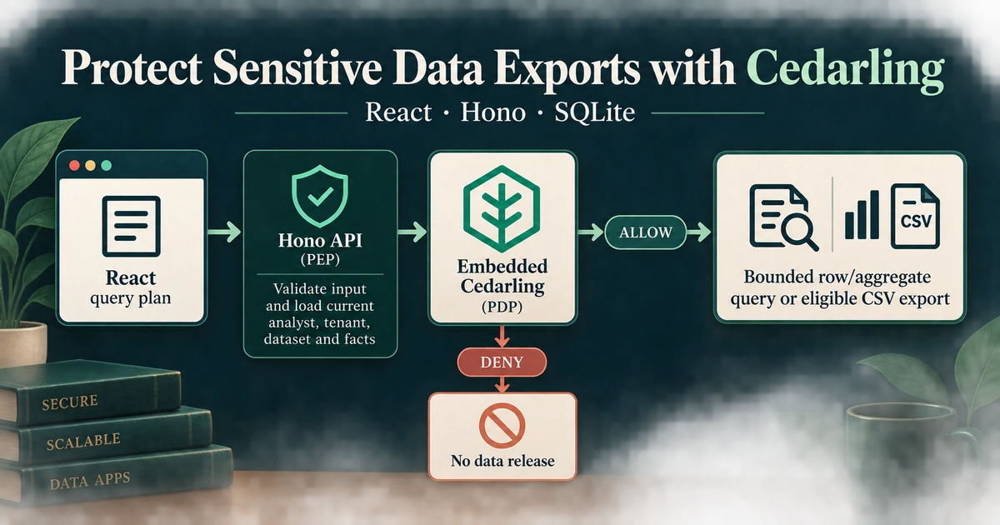

# P5 - Protecting Sensitive Fields and Data Exports with Cedarling



P5 is a workforce analytics application that compiles a bounded query plan to
parameterized SQLite and creates expiring CSV exports. It shows how Cedarling
centralizes independent authorization for rows, fields, aggregates, export
creation, and downloads.

Cedarling authorizes each field, query, aggregate, and export operation on the
server. Authentication identifies the analyst; policies decide which data and
effects that analyst may access.

## Architecture

```text
Amina / Leah / Theo ── sign in ──→ Tutorial IdP
         │
         └── data request ──→ React UI → Node.js + Hono API (PEP)
                                            │ principal + query/export facts
                                            ▼
                                       Cedarling PDP
                                        │        │
                                      DENY     ALLOW → query compiler → SQLite / CSV
```

## Prerequisites

- Docker Desktop or Docker Engine with Compose, or
- Node.js 24.21 or newer within 24.x, pnpm 10, and the project-local tutorial identity provider.

## Run

Start the application and its own IdP:

```bash
docker compose up --build
```

Open <http://localhost:17005>. The issuer is <http://localhost:18005>. Stop the stack with `Ctrl+C`, then `docker compose down`.

For native development, run from this project directory:

```bash
pnpm --dir ../shared/identity-provider install --frozen-lockfile
pnpm --dir ../shared/identity-provider build
pnpm install --frozen-lockfile
pnpm dev
```

`pnpm dev` starts this project’s IdP and application together.
Setup synchronizes the application listen port with its registered URL and
preserves your workforce data and exports.

For a fresh `pnpm build` followed by `pnpm start`, run `pnpm run setup` first.
Start `node --env-file=.local/idp/.env ../shared/identity-provider/dist/main.js`
in another terminal in this project directory and keep it running.

Use `pnpm dev -- --reset` only when you want to restore the tutorial fixtures.

## Exercise

The business workflow explores workforce analytics and exports:

- **Amina** — Tenant A operational fields and tenant ID for `support`; no personal
  or compensation fields and no exports.
- **Leah** — All Tenant A fields for `finance-review`; creates and manages only
  her own exports.
- **Theo** — Tenant B counts for `external-audit`, grouped by operational
  attributes or tenant ID; no employee IDs, personal/compensation fields, rows,
  or exports.

Every plan must explicitly filter `tenantId` with `eq` and the analyst's tenant.
Every released aggregate group must contain at least five records, including
aggregate exports.

The browser exposes a tenant-equality filter and starts aggregates with No grouping.
Keep your tenant selected and choose your account's purpose before running a plan.
Changing or omitting the tenant constraint demonstrates denial; the API still
validates its bounded plan grammar and never silently adds a tenant filter.

The server previews permissions for the exact selected plan. Denied actions
remain visible but disabled with an explanation; no result rows or CSV files
are produced by a preview. Every actual request is authorized again.

1. As Amina, run the default Tenant A support query: allowed. Change the tenant
   to `tenant-b`: Run query becomes disabled. Salary, bonus, names, and emails are absent from her
   field choices; direct API requests for them also deny. Restore `tenant-a`, select
   Aggregate and Count with No grouping: the result is 10. Exports remain disabled.
2. As Theo, select `external-audit`. Rows remain disabled. Select Aggregate, Count, and
   No grouping: the Tenant B count is 8. Group by Department: disabled
   because some groups contain fewer than five records. Set Limit to 1: the
   first group, Finance, contains exactly five records and is allowed.
3. As Leah, select `finance-review`, include Salary and Bonus, run the query,
   then create and download an export. Amina and Theo cannot download or revoke
   it, even with its reference or ID. Leah can revoke it; revoked and expired
   exports cannot be downloaded.
4. Still as Leah with `finance-review` and `tenant-a`, select Aggregate and
   No grouping. Count returns 10; Average Salary returns 5,270,000 and Average
   Bonus returns 338,250. Create, download, and revoke an aggregate export.
   Department grouping is denied because some groups contain fewer than five
   records. Restore No grouping to allow the request again.

These values describe fresh fixtures. Exports expire ten minutes after creation;
an expired download is rejected even when the browser still holds its reference.

Editing a plan does not replace an already displayed result. Export controls
remain bound to the last completed query, not the next plan under construction.

`pnpm dev` prepares and supervises the IdP and application. For compiled
production, run `pnpm build`, keep the IdP running separately, and run
`pnpm start`. Reset with `pnpm reset`, then sign in again. For Docker:

```bash
docker compose exec dataguard node --env-file=/run/config/app.env scripts/reset.ts
```

## Authorization

The readable `policy-store/` uses namespace `P5DataGuard`. The shared builder
validates and packages it into ignored `.local/policy-store.cjar` during setup,
build, and tests. The server logs its version and SHA-256 at startup.

`src/server/authorization.ts` calls `authorizeUnsigned()` directly, using the
current SQLite analyst and validated plan. Field inspection uses
`authorizeUnsignedBatch()`. OAuth tokens stay server-side; React receives only
authorized field metadata and bounded results.

`POST /api/authorization` returns only UI action availability, using the same
policy requests and bounded cardinality checks as execution. React discards
outdated preview responses and disables controls while checking or unavailable.
No browser-side role rules or preview decision can authorize a protected effect.

Before an aggregate decision, SQLite computes group counts using the requested
grouping column; the application receives only cardinalities, not column values.
Protected result values are returned only after ALLOW. After ALLOW,
the server rechecks current facts in the transaction that performs the effect.
A changed entitlement, group size, or export produces a conflict, not a reused
decision. Policy errors fail closed.

Server logs are formatted JSON. `authorization.context` links the application
request, actor, capability, and preview/enforcement phase to the Cedarling request
ID. The native decision follows with full `diagnostics.reason` and `errors`,
including each allowed or denied field-inspection decision. An empty reason on
DENY means no permit matched; it is not by itself an engine failure.

`data.query.completed`, `data.aggregate.completed`, `export.created`, and
`export.revoked` record completed work, separately from ALLOW. `export.download.prepared`
means the server prepared the response, not that the browser saved a file.
`request.failed` records a bounded error category and HTTP status. Browser console
objects carry the operation, status, and request ID; Cedarling runs only on the
server. Logs exclude tokens, download references, and workforce values.

Cancelled requests stop before protected effects. Export revocation and expiry
commit before CSV cleanup; a cleanup failure never restores download access.
Lifecycle requests, startup, and reset retry orphan cleanup without deleting
referenced exports or unrelated files.

The five-record rule illustrates one disclosure constraint, not comprehensive
protection against statistical inference. Cedarling memory logs expire after
five minutes and are not a durable audit store.

## Commands

| Command          | Purpose                                                       |
| ---------------- | ------------------------------------------------------------- |
| `pnpm run setup` | Validate configuration and initialize fixtures                |
| `pnpm dev`       | Build and watch the complete local Node stack                 |
| `pnpm start`     | Run the application                                           |
| `pnpm reset`     | Restore synthetic data                                        |
| `pnpm test:e2e`  | Exercise data and export boundaries                           |
| `pnpm check`     | Run formatting, lint, types, tests, build, and browser checks |

## Verify

```bash
pnpm exec playwright install chromium
pnpm check
pnpm audit --audit-level low
```

On Linux, use `pnpm exec playwright install --with-deps chromium` if browser
system libraries are missing. Browser checks build the app and use temporary
credentials, data, and exports; stop this project's running instances first so
its ports are free. Your normal database and IdP configuration are untouched.
