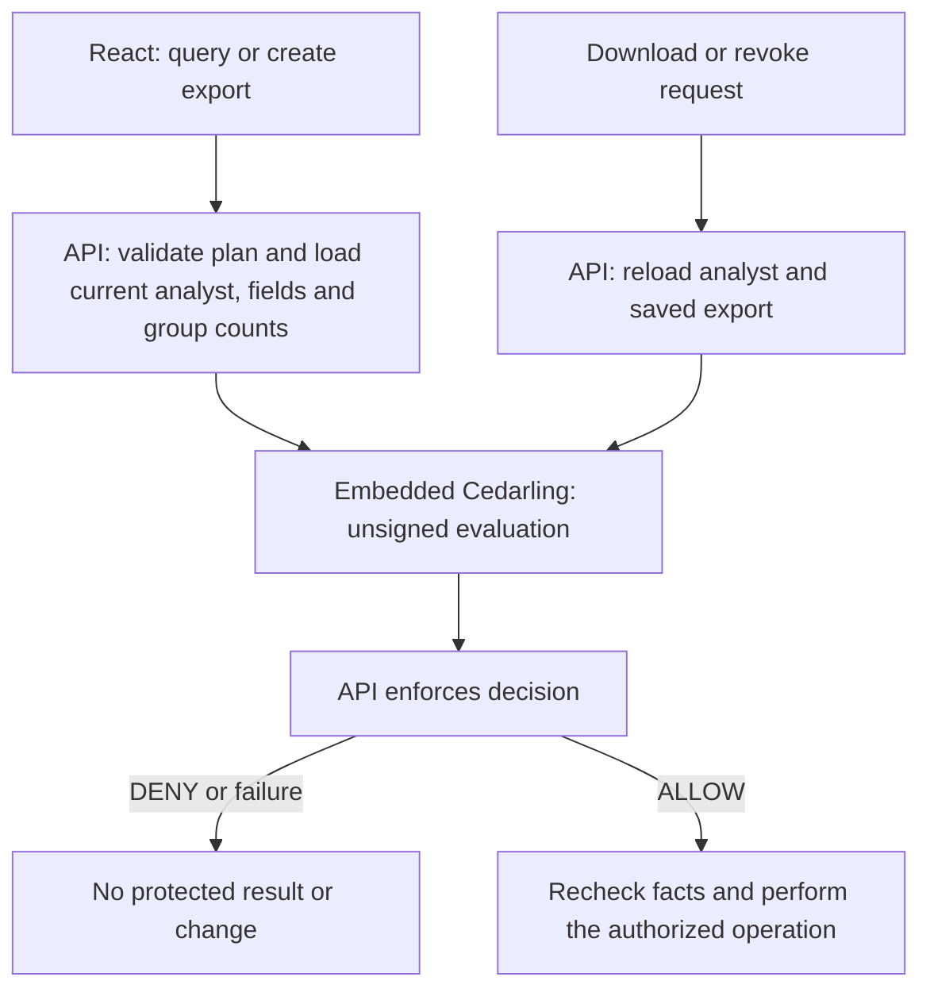

# P5 - Protecting Sensitive Fields and Data Exports with Cedarling


P5 is a workforce analytics application. It compiles bounded query plans to
parameterized SQLite queries and creates expiring CSV exports. Cedarling checks
permission separately for fields, rows, aggregates, export creation, downloads,
and revocation.

The server authenticates the analyst and enforces those decisions before
releasing data. Follow the [tutorial](docs/tutorials.md) to add the checks to
the [starting application](https://github.com/GluuFederation/cedarling-tutorials/tree/21b0832be4b31271320df992d04e9d97667d0e38/p5-dataguard).

The tutorial uses a [step helper](../shared/tools/step/README.md)
to copy the required files from a pinned commit.

## Architecture



## Prerequisites

- To run with Docker: Docker Desktop or Docker Engine with Compose.
- For native development and checks: Node.js 24.21 or newer within 24.x and pnpm 10.

Both startup paths include the project's tutorial identity provider.

## Run

From `p5-dataguard/`, start the application and its own IdP:

```bash
docker compose up --build
```

Open <http://localhost:17005>. The issuer is <http://localhost:18005>. Stop the stack with `Ctrl+C`, then `docker compose down`.

For native development, run from this project directory:

```bash
pnpm --dir ../shared/identity-provider install --frozen-lockfile
pnpm install --frozen-lockfile
pnpm dev
```

`pnpm dev` builds the IdP, prepares configuration, and builds and watches the app.
Setup keeps the application port consistent with its registered URL and
preserves your workforce data and exports.

For compiled startup, run `pnpm run setup`,
`pnpm --dir ../shared/identity-provider build`, and `pnpm build` before `pnpm start`.
Start `node --env-file=.local/idp/.env ../shared/identity-provider/dist/main.js`
in another terminal in this project directory and keep it running.

Use `pnpm dev -- --reset` only when you want to restore the tutorial fixtures.

## Exercise

Choose an account below. Use the prefilled username, or enter its lowercase name,
and any non-empty password, such as `cedarling-is-awesome`. These credentials
are for the local tutorial IdP only.

Each account has a different reason to use the data:

- Amina uses Tenant A operational fields and tenant ID for `support`. She has
  no personal or compensation fields and cannot export data.
- Leah uses all Tenant A fields for `finance-review`. She creates and manages
  only her own exports.
- Theo uses Tenant B counts for `external-audit`, grouped by operational
  attributes or tenant ID. He has no employee IDs, personal or compensation
  fields, rows, or exports.

Every plan must explicitly filter `tenantId` with `eq` and the analyst's tenant.
Every released aggregate group must contain at least five records, including
aggregate exports.

Choose your account's purpose and keep its tenant filter before running a plan.
The server previews the selected plan without returning rows or creating CSV
files. Denied actions stay disabled with an explanation; each execution still
requires a fresh decision. The API never silently adds a tenant filter.

1. As Amina, run the default Tenant A support query: allowed. Change the tenant
   to `tenant-b`: Run query becomes disabled. Salary, bonus, names, and emails are absent from her
   field choices; direct API requests for them also deny. Restore `tenant-a`, select
   Aggregate and Count with No grouping: the result is 10. Exports remain disabled.
2. As Theo, select `external-audit`. Rows remain disabled. Select Aggregate, Count, and
   No grouping: the Tenant B count is 8. Group by Department: disabled
   because some groups contain fewer than five records. Set Limit to 1: the
   first group, Finance, contains exactly five records and is allowed.
3. As Leah, select `finance-review`, include Salary and Bonus, run the query,
   then create and download an export. Amina and Theo cannot download or revoke
   it, even with its reference or ID. Leah can revoke it; revoked and expired
   exports cannot be downloaded.
4. Still as Leah with `finance-review` and `tenant-a`, select Aggregate and
   No grouping. Count returns 10; Average Salary returns 5,270,000 and Average
   Bonus returns 338,250. Create, download, and revoke an aggregate export.
   Department grouping is denied because some groups contain fewer than five
   records. Restore No grouping to allow the request again.

These values describe fresh fixtures. Exports expire ten minutes after creation;
an expired download is rejected even when the browser still holds its reference.

Editing a plan does not replace an already displayed result. Export controls
remain bound to the last completed query, not the next plan under construction.

Reset the sample data with `pnpm reset`, then sign in again. For Docker:

```bash
docker compose exec dataguard node --env-file=/run/config/app.env scripts/reset.ts
```

## Authorization

The readable `policy-store/` uses namespace `P5DataGuard`. The shared builder
validates and packages it into ignored `.local/policy-store.cjar` during setup,
build, and tests. The server logs its version and SHA-256 at startup.

[`src/server/authorization.ts`](src/server/authorization.ts) uses server-side
unsigned evaluation with the current SQLite analyst and validated plan; field
inspection uses a batch. React receives authorized field metadata and results,
never OAuth tokens. Permission previews cannot authorize an actual request.

Aggregate decisions use current group counts without releasing column values.
The server rechecks authorized facts in the transaction that performs the effect;
changed facts produce a conflict and policy errors fail closed. See the
[API integration](docs/tutorials.md#add-cedarling-to-the-api) for each enforcement point.

JSON logs separate Cedarling decisions from completed operations. A prepared
download response does not prove the browser saved the file. The
[log guide](docs/tutorials.md#read-the-query-and-export-logs) covers correlation
and failure categories. Tokens, download references, and workforce values stay
out of logs.

Revocation and expiry prevent downloads even if CSV cleanup fails. Cleanup
retries preserve referenced exports and unrelated files; cancelled requests
stop before protected effects.

The five-record rule illustrates one disclosure constraint, not comprehensive
protection against statistical inference. Cedarling memory logs expire after
five minutes and are not a durable audit store.

## Commands

| Command          | Purpose                                                       |
| ---------------- | ------------------------------------------------------------- |
| `pnpm run setup` | Validate configuration and initialize fixtures                |
| `pnpm dev`       | Build and watch the complete local Node stack                 |
| `pnpm start`     | Run the application                                           |
| `pnpm reset`     | Restore synthetic data                                        |
| `pnpm test:e2e`  | Exercise data and export boundaries                           |
| `pnpm check`     | Run formatting, lint, types, tests, build, and browser checks |

## Verify

```bash
pnpm exec playwright install chromium
pnpm check
pnpm audit --audit-level low
```

On Linux, use `pnpm exec playwright install --with-deps chromium` if browser
system libraries are missing. Browser checks build the app and use temporary
credentials, data, and exports; stop this project's running instances first so
its ports are free. Your normal database and IdP configuration are untouched.
