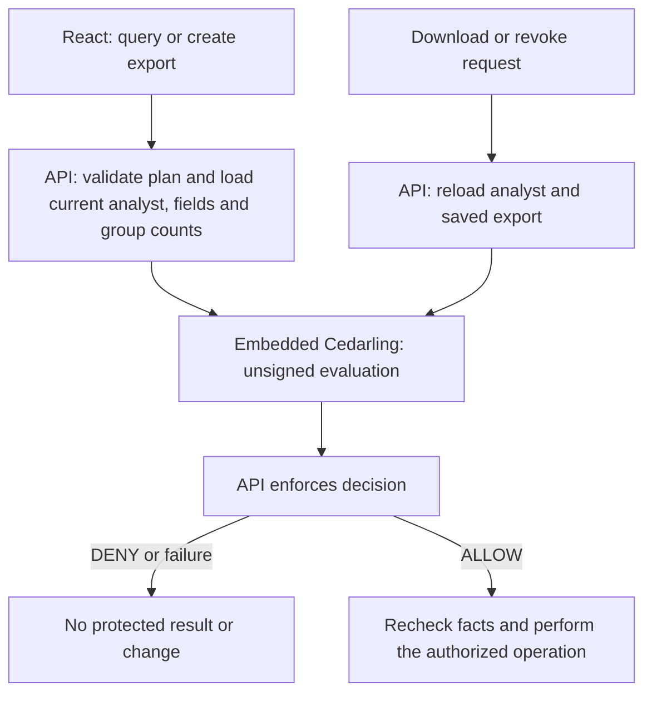
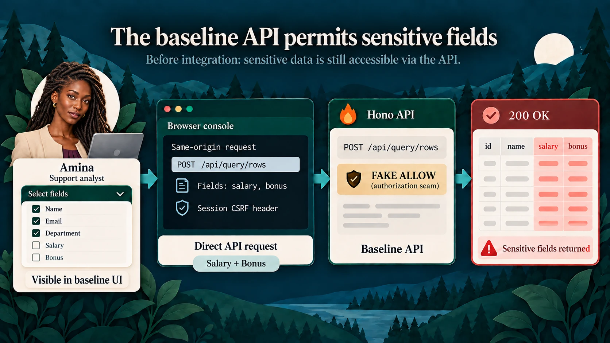
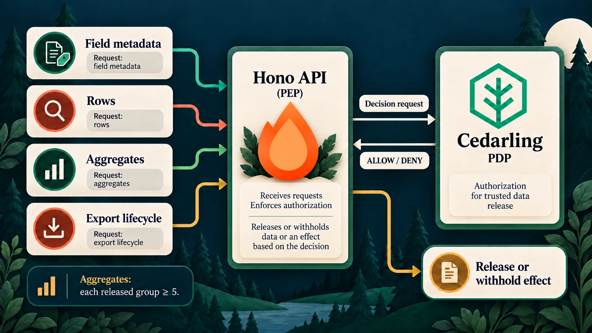
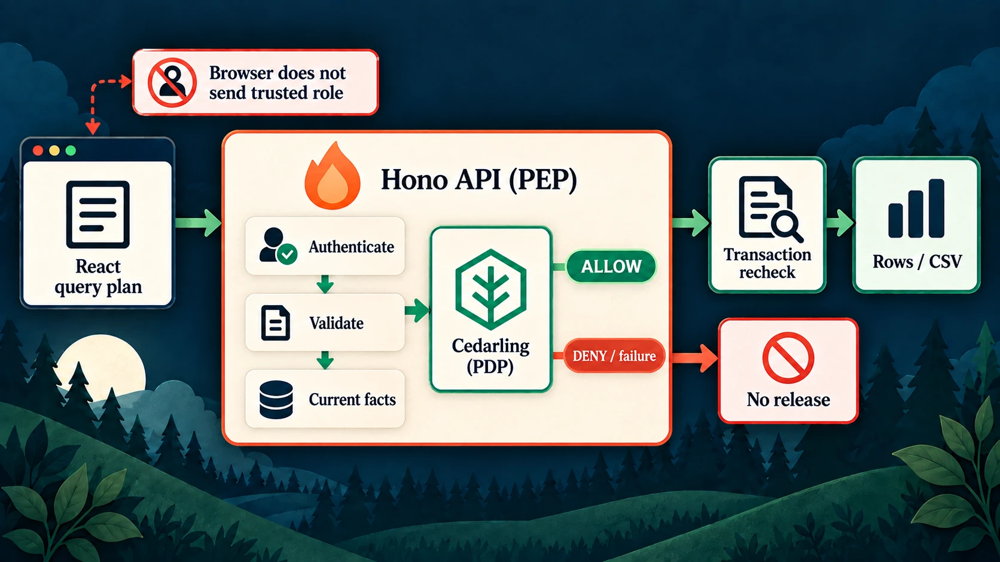
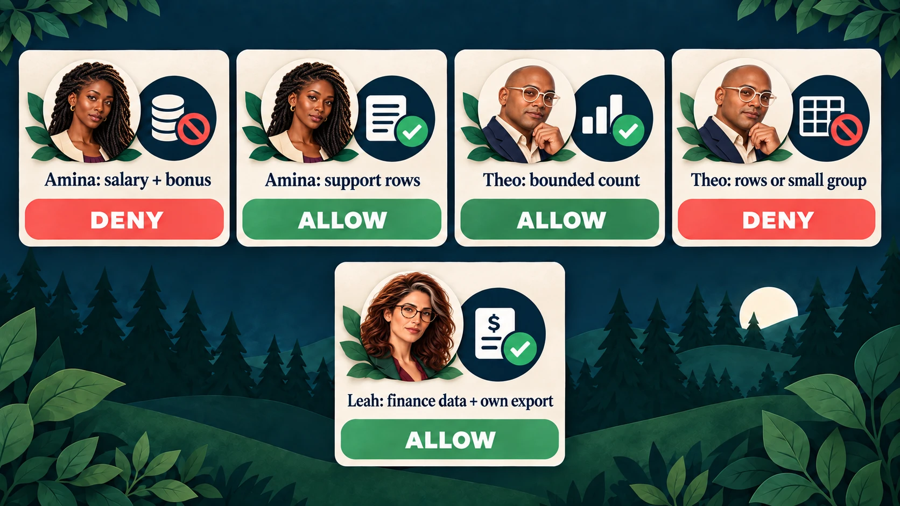
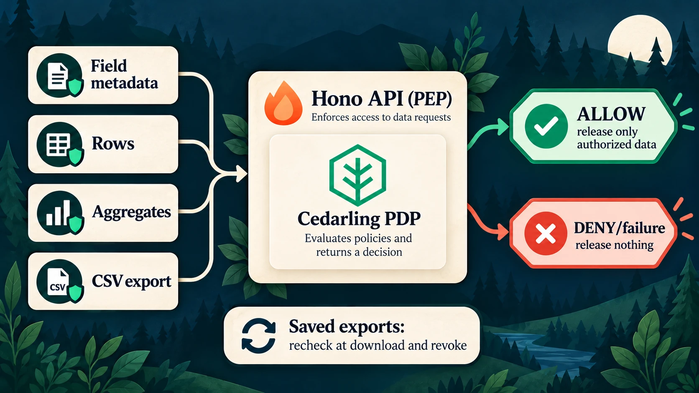

# Protect Sensitive Data Exports with Cedarling

Good to have you here! We're working with a reporting app used by support staff,
finance staff, and external reviewers. They need different views of the data,
so we'll use Cedarling to check what each person may query or export.

Amina needs operational records for support, but the starting API also returns
salary and bonus data when she requests it. We'll use her salary request as our
first example, while keeping her ordinary support queries available.

We'll also check which field names users may see and which fields they may query,
filter, or group by. Queries must use the caller's tenant and a purpose allowed
for their role. External reviewers may only receive aggregates, with at least
five records per returned group. Creating an export needs a separate decision;
downloading or revoking it requires its owner to still have the finance role.
Leah's allowed finance reports and exports should keep working.

## Build the integration or try the finished app

- To build the integration, start with [Run the starting application](#run-the-starting-application), then add the policies and server checks.
- To try the finished app, run the [complete tagged project](https://github.com/GluuFederation/cedarling-tutorials/tree/p5-dataguard-v1.0.1/p5-dataguard) using its README, then go to [Check queries and exports for each user](#check-queries-and-exports-for-each-user). This version already uses Cedarling.

<details>
<summary>What you'll need</summary>

- Git, Node.js 24.21+ within 24.x, and pnpm 10.17.1 for the coding steps. The project supplies its own tutorial identity provider (IdP).
- Docker with Compose is optional for the baseline or finished example. Use native Node.js for the coding steps.
- Familiarity with TypeScript, HTTP requests, sessions, and basic SQL.
- New to Cedarling? [Read the short introduction](https://cedarling.dev/learn/what-is-cedarling) when you need it.
- Keep the [Cedar policy syntax](https://docs.cedarpolicy.com/policies/syntax-policy.html) and [Cedar schema syntax](https://docs.cedarpolicy.com/schema/human-readable-schema.html) references handy while editing policies.

</details>

Copy whole files from GitHub's raw-file view into your baseline checkout; don't
switch to the finished tag. The short examples aren't complete replacements.
Create missing parent directories. Paths and commands are relative to
`p5-dataguard/`; repository-level `shared/` files go one directory above it.

## Who should see which data?


_Amina, Leah, and Theo may see different parts of the same dataset._

P5 is a React application with a Hono Node.js API and SQLite. The browser
submits a query plan with limits on what it can request, not SQL. It can request
rows or aggregates[^1], such as a count of employees by department.

- **Amina**, Tenant A support analyst: operational fields and tenant ID for
  `support`; no personal or compensation fields and no exports.
- **Leah**, Tenant A finance lead: all fields for `finance-review`, including
  salary and bonus; creates and manages her own exports.
- **Theo**, Tenant B external reviewer: permitted count aggregates for
  `external-audit`; no rows, employee IDs, personal/compensation fields, or exports.

An aggregate must include at least five records in every returned group.
This minimum applies even when the purpose and role are allowed.



Cedarling runs only on the server, using `authorizeUnsigned()`. The bundled
Node.js `oidc-provider` authenticates the user first; SQLite supplies the
current analyst's role and tenant. "Unsigned" describes the authorization
request built from those facts. The browser cannot supply its own identity or
permissions.

## Request salary data as a support analyst



_The starting app lists Salary and Bonus; a direct API request checks access without using the field picker._

### Run the starting application

Use a new checkout with its own sample data:

```bash
git clone https://github.com/GluuFederation/cedarling-tutorials.git cedarling-p5
cd cedarling-p5
git switch --detach 21b0832be4b31271320df992d04e9d97667d0e38
cd p5-dataguard
docker compose up --build
```

Open `http://localhost:17005`. The development IdP is at
`http://localhost:18005`. Select Amina. The development IdP usually prefills
`amina`; enter it if the field is empty. Use a non-empty password such as
`cedarling-is-awesome`, and approve access.

For native startup, run these commands from the project directory:

```bash
pnpm --dir ../shared/identity-provider install --frozen-lockfile
pnpm --dir ../shared/identity-provider build
pnpm install --frozen-lockfile
pnpm dev
```

Use only one startup method on these ports.

### Request salary without using the field picker

On the authenticated application page, open developer tools and run:

```js
const session = await fetch("/api/session").then((response) => response.json());
const response = await fetch("/api/query/rows", {
  method: "POST",
  headers: {
    "content-type": "application/json",
    "x-csrf-token": session.csrfToken,
  },
  body: JSON.stringify({
    kind: "rows",
    fields: ["employeeId", "salary", "bonus"],
    filter: { field: "tenantId", operator: "eq", value: "tenant-a" },
    purpose: "support",
    limit: 10,
  }),
});
console.log(response.status, await response.json());
```

The baseline returns **200** with salary and bonus columns. This uses Amina's
real session and a valid same-origin request. Parameterized SQL keeps input values
separate from SQL instructions, but does not decide whether Amina may see salary.

The baseline also permits cross-tenant queries, small-group aggregates, and
access to another user's exports. Keep this request to repeat after integration.

Capture the response using fictional data only. Stop the baseline before
integrating; for Docker use `Ctrl+C`, then `docker compose down` without deleting
the volume. If you started with Docker, install the native dependencies using
the commands above before the coding steps.

## Where should we check permission?

Open the baseline's
[`src/server/app.ts`](https://github.com/GluuFederation/cedarling-tutorials/blob/21b0832be4b31271320df992d04e9d97667d0e38/p5-dataguard/src/server/app.ts)
and find `evaluatePlan()`. After authentication, CSRF, and input validation,
it executes the query here:

```ts
// src/server/app.ts (starting checkpoint)
const evaluation = database.evaluate(compiled, compileCardinalityQuery(plan));
```

The log printed afterward has not checked whether Amina may read
those fields. We'll ask Cedarling before this query reads protected values,
while keeping input validation, parameterized SQL, and export expiry and
revocation checks.

Aggregates need one query first: a count of the records in each group, within the
plan's limits. Those counts supply policy facts. The requested results must still
wait for `ALLOW`.

## Decide which queries and exports to allow



_Queries and exports need separate decisions, even when they use the same data._

### Create the policy store

Use the [directory-based policy-store format](https://docs.jans.io/stable/cedarling/reference/cedarling-policy-store/#2-new-directory-based-format):

```text
policy-store/
  metadata.json
  schema.cedarschema
  policies/
    fields.cedar
    plans.cedar
    exports.cedar
```

Create the complete policy-store files from the pinned version:

- [`policy-store/metadata.json`](https://github.com/GluuFederation/cedarling-tutorials/blob/p5-dataguard-v1.0.1/p5-dataguard/policy-store/metadata.json)
- [`policy-store/schema.cedarschema`](https://github.com/GluuFederation/cedarling-tutorials/blob/p5-dataguard-v1.0.1/p5-dataguard/policy-store/schema.cedarschema)
- [`policy-store/policies/fields.cedar`](https://github.com/GluuFederation/cedarling-tutorials/blob/p5-dataguard-v1.0.1/p5-dataguard/policy-store/policies/fields.cedar)
- [`policy-store/policies/plans.cedar`](https://github.com/GluuFederation/cedarling-tutorials/blob/p5-dataguard-v1.0.1/p5-dataguard/policy-store/policies/plans.cedar)
- [`policy-store/policies/exports.cedar`](https://github.com/GluuFederation/cedarling-tutorials/blob/p5-dataguard-v1.0.1/p5-dataguard/policy-store/policies/exports.cedar)

Use the store's metadata and version `1.0.0`. Namespace `P5DataGuard` contains
four entity types: `Analyst`, `Dataset`, `Field`, and `Export`. OIDC and SQLite
supply identity and current facts, so this store needs no trusted issuers,
default entities, templates, or custom issuers.

| Design question                                  | P5 answer                                                                                  |
| ------------------------------------------------ | ------------------------------------------------------------------------------------------ |
| Who acts?                                        | `Analyst`: current database ID, tenant, and role                                           |
| Which fields may be discovered?                  | A `Field` with its server-owned name and classification                                    |
| What do plans target?                            | `Dataset::"workforce"`                                                                     |
| What does a saved download or revocation target? | `Export` with current owner, tenant, and purpose                                           |
| What does the request ask for?                   | Plan kind, purpose, tenant constraint, fields, and classifications                         |
| Which additional fact protects aggregates?       | Current minimum count among released groups                                                |
| What protects saved exports?                     | Current finance role, same tenant, ownership, plus application checks for expiry and state |

Field classifications come from the server's fixed catalog, not from the browser.
Include fields used for filters and grouping as well as returned columns.
Filtering or grouping by a hidden field can still reveal information about it.

The plan must explicitly contain `tenantId eq <current tenant>`. The server does
not silently add or repair that filter. A different field, operator, or omitted
filter does not meet the tenant requirement.

### Choose an action and resource for each operation

All requests use the current database analyst as principal. Actions below use
the `P5DataGuard::Action` namespace.

| Capability        | Action                                                                                                                                                                             | Resource             | Context                                               | Effect waiting for ALLOW                |
| ----------------- | ---------------------------------------------------------------------------------------------------------------------------------------------------------------------------------- | -------------------- | ----------------------------------------------------- | --------------------------------------- |
| `dataset.inspect` | [`InspectDataset`](https://github.com/GluuFederation/cedarling-tutorials/blob/p5-dataguard-v1.0.1/p5-dataguard/policy-store/policies/fields.cedar#L2 "inspect-fields")             | Each candidate field | Empty                                                 | Return field metadata to React          |
| `data.query`      | [`Query`](https://github.com/GluuFederation/cedarling-tutorials/blob/p5-dataguard-v1.0.1/p5-dataguard/policy-store/policies/plans.cedar#L2 "authorized-plan")                      | Workforce dataset    | Validated row-plan facts                              | Return rows within the plan's limit     |
| `data.aggregate`  | [`Aggregate`](https://github.com/GluuFederation/cedarling-tutorials/blob/p5-dataguard-v1.0.1/p5-dataguard/policy-store/policies/plans.cedar#L2 "authorized-plan")                  | Workforce dataset    | Plan facts and current minimum group size             | Return aggregate values                 |
| `data.export`     | [`CreateExport`](https://github.com/GluuFederation/cedarling-tutorials/blob/p5-dataguard-v1.0.1/p5-dataguard/policy-store/policies/plans.cedar#L2 "authorized-plan")               | Workforce dataset    | Saved candidate plan facts; group size for aggregates | Create CSV within the plan's limits     |
| `export.download` | [`DownloadExport`](https://github.com/GluuFederation/cedarling-tutorials/blob/p5-dataguard-v1.0.1/p5-dataguard/policy-store/policies/exports.cedar#L2 "manage-own-finance-export") | Current saved export | Empty                                                 | Prepare CSV response                    |
| `export.revoke`   | [`RevokeExport`](https://github.com/GluuFederation/cedarling-tutorials/blob/p5-dataguard-v1.0.1/p5-dataguard/policy-store/policies/exports.cedar#L2 "manage-own-finance-export")   | Current saved export | Empty                                                 | Commit revocation and clean up its file |

### Check the plan when querying or exporting

The rule in `policies/plans.cedar` checks tenant, fields, purpose, and group size
for exports as well as queries:

```cedar
// policy-store/policies/plans.cedar
@id("authorized-plan")
permit (
  principal is P5DataGuard::Analyst,
  action in [P5DataGuard::Action::"Query", P5DataGuard::Action::"Aggregate", P5DataGuard::Action::"CreateExport"],
  resource == P5DataGuard::Dataset::"workforce"
)
when {
  context has tenant_id && context.tenant_id == principal.tenant_id &&
  ((action == P5DataGuard::Action::"Query" && context.kind == "rows") ||
   (action == P5DataGuard::Action::"Aggregate" && context.kind == "aggregate") ||
   (action == P5DataGuard::Action::"CreateExport" && ["rows", "aggregate"].contains(context.kind))) &&
  (context.kind == "rows" ||
    (context has minimum_group_size && context.minimum_group_size >= 5)) &&
  (
    (principal.role == "Finance lead" && context.purpose == "finance-review") ||
    (principal.role == "Support analyst" && context.purpose == "support" &&
      action != P5DataGuard::Action::"CreateExport" &&
      ["operational", "tenant"].containsAll(context.classifications)) ||
    (principal.role == "External reviewer" && context.purpose == "external-audit" &&
      action == P5DataGuard::Action::"Aggregate" &&
      ["operational", "tenant"].containsAll(context.classifications) &&
      !context.field_names.contains("employeeId"))
  )
};
```

For Amina's salary request, the tenant matches, her role is `Support analyst`,
and the purpose is `support`. But `salary` and `bonus` belong to the
`compensation` classification. The support rule only accepts `operational` and
`tenant`, so it denies the request.

Leah's `Finance lead` role with `finance-review` permits compensation fields.
She must still request her own tenant, and any aggregate she requests must
meet the five-record minimum. The role conditions do not bypass those
shared conditions.

The `inspect-fields` policy limits field metadata by role and classification.
This guides the field picker; each submitted query still needs its own check.

For saved exports, `policies/exports.cedar` requires ownership and a current
finance role:

```cedar
// policy-store/policies/exports.cedar
@id("manage-own-finance-export")
permit (
  principal is P5DataGuard::Analyst,
  action in [P5DataGuard::Action::"DownloadExport", P5DataGuard::Action::"RevokeExport"],
  resource is P5DataGuard::Export
)
when {
  principal.role == "Finance lead" &&
  resource.owner_id == principal.id &&
  resource.tenant_id == principal.tenant_id &&
  resource.purpose == "finance-review"
};
```

Knowing an export's download reference does not satisfy its ownership and finance
conditions. The application also checks expiry, reference validity, file
integrity, and whether the export is still active. No matching permit gives DENY.

## Add Cedarling to the API



_The API enforces the decision; browser controls are guidance, not authority._

### Build the archive and load Cedarling

Install pinned dependencies from P5:

```bash
pnpm add --save-exact @janssenproject/cedarling_wasm@0.0.468 fflate@0.8.3
pnpm add --save-dev --save-exact @cedar-policy/cedar-wasm@4.12.0
```

Save the repository-level archive builder and its declaration:

- [`shared/policy-store.mjs`](https://github.com/GluuFederation/cedarling-tutorials/blob/p5-dataguard-v1.0.1/shared/policy-store.mjs)
- [`shared/policy-store.d.mts`](https://github.com/GluuFederation/cedarling-tutorials/blob/p5-dataguard-v1.0.1/shared/policy-store.d.mts)

Run the builder to create the archive:

```bash
node ../shared/policy-store.mjs
```

The command must finish without validation errors and create
`.local/policy-store.cjar`. Keep the readable policy source in Git and the
generated archive ignored. The complete `src/server/authorization.ts` in the
next step initializes one [Cedarling](https://www.npmjs.com/package/@janssenproject/cedarling_wasm/v/0.0.468)
instance:

```ts
// src/server/authorization.ts
import { readFile } from "node:fs/promises";
import { initFromArchiveBytes } from "@janssenproject/cedarling_wasm";

const archive = new Uint8Array(await readFile(archivePath));
const cedarling = await initFromArchiveBytes(
  {
    CEDARLING_APPLICATION_NAME: "P5 DataGuard",
    CEDARLING_LOG_TYPE: "memory",
    CEDARLING_LOG_TTL: 300,
    CEDARLING_STRICT_SCHEMA_VALIDATION: "enabled",
  },
  archive,
);
```

`archivePath` defaults to `.local/policy-store.cjar` on the server. The module
logs its version and SHA-256. `src/server/main.ts` creates the authorization
functions, passes them to `buildApp()`, and calls `shutDown()` when shutting down.

### Pass the analyst and query facts to Cedarling

Save these complete files together to connect the permission checks:

- [`src/server/authorization.ts`](https://github.com/GluuFederation/cedarling-tutorials/blob/p5-dataguard-v1.0.1/p5-dataguard/src/server/authorization.ts)
- [`src/server/errors.ts`](https://github.com/GluuFederation/cedarling-tutorials/blob/p5-dataguard-v1.0.1/p5-dataguard/src/server/errors.ts)
- [`src/server/app.ts`](https://github.com/GluuFederation/cedarling-tutorials/blob/p5-dataguard-v1.0.1/p5-dataguard/src/server/app.ts)
- [`src/server/database.ts`](https://github.com/GluuFederation/cedarling-tutorials/blob/p5-dataguard-v1.0.1/p5-dataguard/src/server/database.ts)
- [`src/server/query.ts`](https://github.com/GluuFederation/cedarling-tutorials/blob/p5-dataguard-v1.0.1/p5-dataguard/src/server/query.ts)
- [`src/server/export-service.ts`](https://github.com/GluuFederation/cedarling-tutorials/blob/p5-dataguard-v1.0.1/p5-dataguard/src/server/export-service.ts)
- [`src/server/main.ts`](https://github.com/GluuFederation/cedarling-tutorials/blob/p5-dataguard-v1.0.1/p5-dataguard/src/server/main.ts)
- [`src/server/config.ts`](https://github.com/GluuFederation/cedarling-tutorials/blob/p5-dataguard-v1.0.1/p5-dataguard/src/server/config.ts)
- [`src/shared/contracts.ts`](https://github.com/GluuFederation/cedarling-tutorials/blob/p5-dataguard-v1.0.1/p5-dataguard/src/shared/contracts.ts)

Remove `src/server/permissive-trace.ts`; the completed handlers no longer use it.

Before authorization, the server checks that the plan uses only supported forms.
It collects fields used in selected columns, calculations, grouping, and filters.
It gets their classifications from the server catalog and includes
`tenant_id` only when the submitted filter is an exact tenant equality.

In this call, `analyst` comes from the current database session; `action`,
`resource`, and `context` follow the request table. The full file builds the
principal with `principal(analyst)` and logs
decisions through `logDecision()`:

```ts
// src/server/authorization.ts
const result = await cedarling.authorizeUnsigned(
  JSON.stringify({
    principal: {
      cedar_entity_mapping: {
        entity_type: "P5DataGuard::Analyst",
        id: analyst.id,
      },
      id: analyst.id,
      tenant_id: analyst.tenantId,
      role: analyst.role,
    },
    action,
    resource,
    context,
  }),
);
for (const log of cedarling.getLogsByRequestId(result.request_id)) {
  console.info(JSON.stringify(log, null, 2));
}
if (result.response.diagnostics.errors.length > 0) {
  throw new AuthorizationError(503, "authorization_unavailable");
}
return result.decision === true;
```

`authorizeUnsigned()` expects a JSON string, so `JSON.stringify()` converts
the server-validated request to that format.[^2] The log formatting
call prints nested reasons for this local exercise.

`AuthorizationError` comes from `src/server/errors.ts`, copied above. The catch
handler maps Cedarling failures to `503 authorization_unavailable`. A valid
false decision becomes `403 authorization_denied` at the protected route.

For Amina's salary request, the resource is `Dataset::"workforce"` and the
context has this shape:

```json
{
  "kind": "rows",
  "purpose": "support",
  "tenant_id": "tenant-a",
  "field_names": ["employeeId", "salary", "bonus", "tenantId"],
  "classifications": ["operational", "compensation", "tenant"]
}
```

Set order is not significant. For an aggregate, the context also contains
`minimum_group_size`, computed by the server rather than accepted from the
browser.

Dataset inspection uses `authorizeUnsignedBatch()` with this principal and
one `InspectDataset` item per catalog field. The module checks that every item
returned a result, checks `item.is_ok` and diagnostic errors, and returns only
allowed metadata. It logs both allowed and denied items; a failed batch returns
no unchecked fields.

### Check permission before running the query

Row queries, aggregates, and export creation use `executePlan()` in
`src/server/app.ts`. It requires permission before `database.execute()`:

```ts
// src/server/app.ts
requireActiveRequest(context);
const { cardinality, minimumGroupSize } = planFacts(plan);
if (
  !(await authorization.authorize({
    requestId,
    analyst: session.user,
    capability,
    plan,
    ...(minimumGroupSize !== undefined ? { minimumGroupSize } : {}),
  }))
)
  throw new AuthorizationError(403, "authorization_denied");
return database.withCurrentSession(
  getCookie(context, sessionCookie) ?? "",
  config,
  session,
  () => {
    // Only the bounded cardinality probe precedes ALLOW; protected values do not.
    requireActiveRequest(context);
    if (
      cardinality &&
      database.minimumGroupSize(cardinality) !== minimumGroupSize
    )
      throw new AuthorizationError(409, "authorization_state_changed");
    const compiled = compileQuery(plan);
    return effect(compiled.outputColumns, database.execute(compiled));
  },
);
```

`planFacts()` supplies the counts needed to check an aggregate. If authorization
denies or throws, execution stops before the protected query. After `ALLOW`,
`withCurrentSession()` checks the session and analyst's current permissions
inside the transaction. The count is checked again there too. If the session or
access token expired while waiting for the decision, or the analyst or count
changed, it throws `409 authorization_state_changed` without running the query.

`effect` uses the allowed rows to build the response or create the CSV.
The SQL compiler continues to use fixed identifiers and bound values in
[`src/server/query.ts`](https://github.com/GluuFederation/cedarling-tutorials/blob/p5-dataguard-v1.0.1/p5-dataguard/src/server/query.ts).

Download and revoke routes reload the saved export and authorize it separately,
using its stored owner. They recheck expiry, state, and current facts before
sending the file or revoking access. Revocation stays saved even if deleting the
CSV file then fails; failed cleanup must not restore access.

### Show which actions are available

Save the matching React controls and API client:

- [`src/web/App.tsx`](https://github.com/GluuFederation/cedarling-tutorials/blob/p5-dataguard-v1.0.1/p5-dataguard/src/web/App.tsx)
- [`src/web/api.ts`](https://github.com/GluuFederation/cedarling-tutorials/blob/p5-dataguard-v1.0.1/p5-dataguard/src/web/api.ts)
- [`src/web/Icon.tsx`](https://github.com/GluuFederation/cedarling-tutorials/blob/p5-dataguard-v1.0.1/p5-dataguard/src/web/Icon.tsx)
- [`src/web/styles.css`](https://github.com/GluuFederation/cedarling-tutorials/blob/p5-dataguard-v1.0.1/p5-dataguard/src/web/styles.css)

`POST /api/authorization` previews the exact selected plan and export operations.
It returns which actions are allowed, not rows or a CSV. React ignores outdated preview
responses and disables controls while checking or when decisions are unavailable.
Each actual query/export request still authorizes again.

Export controls use the last completed query, so editing the form does not
silently change the result being exported. These controls use server previews;
there is no browser Cedarling instance or separate client permission table.

## Finish setup and restart the app

Save the runtime preparation and packaging files:

- [`scripts/setup.ts`](https://github.com/GluuFederation/cedarling-tutorials/blob/p5-dataguard-v1.0.1/p5-dataguard/scripts/setup.ts)
- [`scripts/reset.ts`](https://github.com/GluuFederation/cedarling-tutorials/blob/p5-dataguard-v1.0.1/p5-dataguard/scripts/reset.ts)
- [`Dockerfile`](https://github.com/GluuFederation/cedarling-tutorials/blob/p5-dataguard-v1.0.1/p5-dataguard/Dockerfile)

Apply the `build` entry shown below to your existing
[`package.json`](https://github.com/GluuFederation/cedarling-tutorials/blob/p5-dataguard-v1.0.1/p5-dataguard/package.json), keeping
the other dependencies and scripts.

The setup script builds the archive; the production build must too. The existing
[`scripts/dev.mjs`](https://github.com/GluuFederation/cedarling-tutorials/blob/p5-dataguard-v1.0.1/p5-dataguard/scripts/dev.mjs)
runs both steps before starting the IdP and API, so `pnpm dev` needs no further
change:

```json
{
  "scripts": {
    "build": "node ../shared/policy-store.mjs && vite build && tsc -p tsconfig.server.json"
  }
}
```

The copied Dockerfile includes `.local/policy-store.cjar` in the runtime image.
For compiled native startup, run `pnpm run setup` and `pnpm build`, keep
`node --env-file=.local/idp/.env ../shared/identity-provider/dist/main.js`
running in another terminal, and run `pnpm start`. Docker remains
`docker compose up --build`.

Stop the baseline development stack before restarting it. Run:

```bash
pnpm run setup
pnpm build
pnpm dev
```

Open `http://localhost:17005` and sign in again as Amina after the IdP restart.
We'll retry her salary request, then check the allowed queries and exports.

## Check queries and exports for each user



_The allowed response depends on the requested fields, result type, and caller._

### Retry Amina's salary request

As Amina, repeat the compensation request from the baseline section. Expect
**403** with `error: "authorization_denied"` and a request ID, without result
rows. Salary and bonus are also absent from her field picker; the direct request
proves that the server enforces this restriction too.

Change the fields to `employeeId`, `department`, and `tenantId`, retaining the
Tenant A filter and `support` purpose. This is allowed support work and
returns **200**. Changing the tenant to `tenant-b` or removing the tenant filter
must deny again.

### Try counts and finance exports

Amina can run an allowed support query. Can she export that same result?
Check the `CreateExport` condition in the plan policy before trying the cases
below.

Use fresh sample data and select the purpose matching each account:

| Account and plan                                               | Expected result                                               |
| -------------------------------------------------------------- | ------------------------------------------------------------- |
| Amina: Tenant A support rows with operational fields           | ALLOW                                                         |
| Amina: Count, No grouping, Tenant A, support                   | Count 10; no export                                           |
| Theo: Rows, Tenant B, external-audit                           | DENY                                                          |
| Theo: Count, No grouping, Tenant B, external-audit             | Count 8                                                       |
| Theo: Count grouped by Department, default limit               | DENY: at least one released group has fewer than five records |
| Theo: Same Department grouping with Limit 1                    | Finance group count 5; ALLOW                                  |
| Leah: Tenant A rows including Salary and Bonus, finance-review | ALLOW; export permitted                                       |
| Leah: No grouping, Average Salary / Average Bonus              | 5,270,000 / 338,250                                           |
| Leah: Department-grouped aggregates releasing small groups     | DENY, including export                                        |

The grouping/limit example relies on the sample data's fixed order. It checks
returned group sizes; it does not prevent users from learning private facts by
combining query results.

To exercise a direct aggregate request, use the authenticated browser session's
CSRF header as in the first example and POST this body to
`http://localhost:17005/api/query/aggregate` as Theo:

```json
{
  "kind": "aggregate",
  "operation": "count",
  "filter": { "field": "tenantId", "operator": "eq", "value": "tenant-b" },
  "purpose": "external-audit",
  "limit": 10
}
```

For the export lifecycle, sign in as Leah, run an allowed finance plan, and create
an export. Download it, inspect the fictional data, then revoke it. Download
must fail afterward. Exports also expire ten minutes after creation.

Amina and Theo must not download or revoke Leah's export even with its reference
or ID. Use separate sessions or the automated test to distinguish a role denial
from a missing reference. The routes are
`POST /api/exports/download` with `{ "downloadRef": "<reference>" }` and
`POST /api/exports/<id>/revoke`. Both require that session's CSRF header and
same-origin request. Never publish actual session or download credentials.

### Read the query and export logs

`authorization.context` connects the application request, actor, capability,
and preview/enforcement phase with a Cedarling request ID. Cedarling's decision
JSON includes full `diagnostics.reason` and `errors`. Field inspection has one
decision per field; seeing both ALLOW and DENY in that batch is normal.

Amina's salary request can produce DENY with an empty reason and no errors:
no permit matched. An allowed query or aggregate cites `authorized-plan`; an
allowed owned download cites `manage-own-finance-export`.

`data.query.completed` and `data.aggregate.completed` describe completed reads.
`export.created` and `export.revoked` describe completed export changes.
`export.download.prepared` means the server prepared a response, not that the
browser saved a file. Match the request ID and check the result;
Cedarling ALLOW alone is not proof of success.

`request.failed` records limited error details. Browser console objects contain the
operation, status, and request ID, not browser-side Cedarling decisions. Server
logs exclude raw workforce values, tokens, and download references. Logs kept in
memory expire after five minutes, so they are not a lasting audit record.

### Check changed permissions and unavailable decisions

The coding steps update runtime files, not the baseline's historical tests.
For the full automated checks, use a separate checkout of the [finished tag](https://github.com/GluuFederation/cedarling-tutorials/tree/p5-dataguard-v1.0.1/p5-dataguard) and install its locked project and shared IdP dependencies.
Stop your learner stack to free ports 17005 and 18005, then run:

```bash
pnpm exec playwright install chromium
pnpm check
```

On Linux, use `pnpm exec playwright install --with-deps chromium` if browser
libraries are missing. The check includes formatting, lint, types, tests, and
a production build/browser workflow with disposable data and exports.

The checks use real policies, field batches, direct API
requests, and attempts to access another user's export. They verify each
returned group's minimum size, change permissions or counts while authorization
is pending, and confirm that unavailable Cedarling releases no protected results
or files. Browser checks use real sign-in and bypass the UI to call the API.

For a fresh exercise, `pnpm reset` clears the sample
records, exports, and sessions; sign in again. In Docker use
`docker compose exec dataguard node --env-file=/run/config/app.env scripts/reset.ts`.
Do not reset a database you want to keep. Capture the identical unauthorized
compensation request before and after, and Leah's allowed finance export.

## Protect data in your own application



_Authorization remains necessary when a generated export is downloaded later._

Opening a dashboard, seeing a field name, reading a row, releasing an aggregate,
and downloading a generated file are different capabilities. Check each one
where the server releases the data, using current trusted facts.

The same approach can protect a GraphQL API: authorize each sensitive field,
row set, aggregate, or export at the resolver or service boundary that releases
it, not just at the query entry point. P5 itself uses Hono, not GraphQL;
see [GraphQL's authorization guidance](https://graphql.org/learn/authorization/).

Follow `src/server/authorization.ts`, `src/server/app.ts`, `src/server/query.ts`,
`src/server/export-service.ts`, `policy-store/`, and the tests in the
[completed P5 project](https://github.com/GluuFederation/cedarling-tutorials/tree/p5-dataguard-v1.0.1/p5-dataguard).

For a production stack, consider Agama Lab Policy Designer for policy authoring,
Jans Auth for issuing tokens, and Lock Server for centralized decision logs.
See [Cedarling production solutions](https://cedarling.dev/solutions).

Next, P6 moves to field-inspection workflows and authorization over submitted
work rather than query results.

<details>
<summary>Warning: This setup is for local practice</summary>

- Local HTTP and the bundled IdP are for learning only. Production requires HTTPS and a configured OIDC/OAuth issuer, such as [Jans Auth](https://docs.jans.io/stable/janssen-server/planning/use-cases/), Gluu, Auth0, or Okta.
- Control permission changes, secure stored data, and store audit logs. Keep parameterized SQL, transactions, expiry, and file cleanup alongside authorization.
- A five-record minimum is a teaching example. Users can still learn sensitive facts through repeated queries; this rule alone cannot prevent that.
- These steps were prepared on Ubuntu 24.04+. Native project checks also run in CI on macOS and Windows. If a platform-specific step fails, [open an issue](https://github.com/GluuFederation/cedarling-tutorials/issues).

</details>

[^1]: An aggregate reports a calculation over multiple records, such as a count by department, without returning the individual rows. Small groups and repeated queries can still reveal sensitive facts, so P5 treats aggregate release as its own authorization boundary.

[^2]: The pinned [`cedarling_wasm` JavaScript API](https://www.npmjs.com/package/@janssenproject/cedarling_wasm/v/0.0.468) accepts a JSON-string request. Converting to JSON does not validate the query plan; the server must do that before calling Cedarling.
