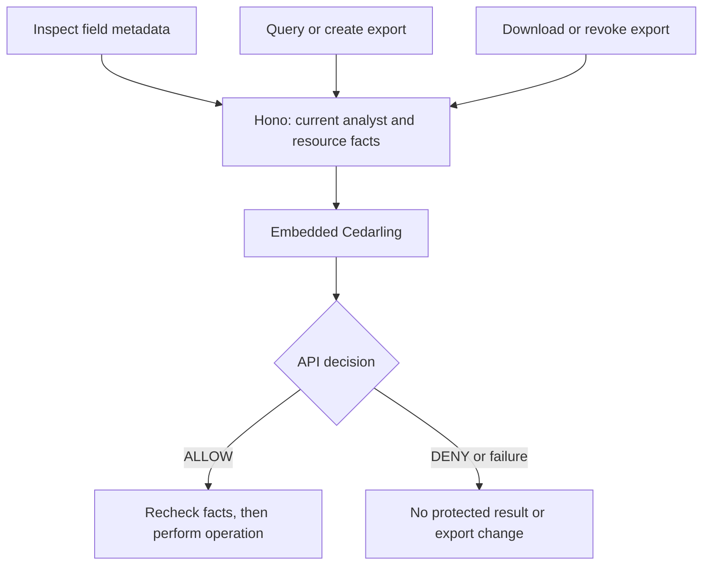

# Protect Sensitive Data Exports with Cedarling

Good to have you here! We're working with a reporting app used by support staff,
finance staff, and external reviewers. They need different views of the data,
so we'll use Cedarling to check what each person may query or export.

Amina needs operational records for support, but the starting API also returns
salary and bonus data when she requests it. We'll use her salary request as our
first example, while keeping her ordinary support queries available.

We'll also check which field names users may see and which fields they may query,
filter, or group by. Queries must use the caller's tenant and a purpose allowed
for their role. External reviewers may only receive aggregates, with at least
five records per returned group. Creating an export needs a separate decision;
downloading or revoking it requires its owner to still have the finance role.
Leah's allowed finance reports and exports should keep working.

## Build the data-access checks or run the complete example

- To build the integration, start with [Run the starting application](#run-the-starting-application), then add the policies and server checks.
- To try the finished app, run the [finished project on main](https://github.com/GluuFederation/cedarling-tutorials/tree/main/p5-dataguard) using its README, then go to [Check queries and exports for each user](#check-queries-and-exports-for-each-user). This version already uses Cedarling.

If you're building from the starting project, open each **Required step** section
and complete its instructions before continuing. These sections contain the files
and changes we'll need.

<details>
<summary>Before you start</summary>

- Git, Node.js 24.21+ within 24.x, and pnpm 10.17.1 for the coding steps. The project supplies its own tutorial identity provider (IdP).
- Docker with Compose is optional for the baseline or finished example. Use native Node.js for the coding steps.
- Familiarity with TypeScript, HTTP requests, sessions, and basic SQL.
- New to Cedarling? [Read the short introduction](https://cedarling.dev/learn/what-is-cedarling) when you need it.
- Keep the [Cedar policy syntax](https://docs.cedarpolicy.com/policies/syntax-policy.html) and [Cedar schema syntax](https://docs.cedarpolicy.com/schema/human-readable-schema.html) references handy while editing policies.

</details>

Run the commands from `p5-dataguard/`. Paths under `shared/` are relative to
the repository root.

## Who should see which data?


_Amina, Leah, and Theo may see different parts of the same dataset._

P5 is a React application with a Hono Node.js API and SQLite. The browser
submits a query plan with limits on what it can request, not SQL. A plan can
request individual rows or an aggregate: a calculation over several records,
such as a count of employees by department.[^1]

- **Amina**, Tenant A support analyst: operational fields and tenant ID for
  `support`; no personal or compensation fields and no exports.
- **Leah**, Tenant A finance lead: all fields for `finance-review`, including
  salary and bonus; creates and manages her own exports.
- **Theo**, Tenant B external reviewer: permitted count aggregates for
  `external-audit`; no rows, employee IDs, personal/compensation fields, or exports.

An aggregate must include at least five records in every returned group.
This minimum applies even when the purpose and role are allowed.

Cedarling runs only on the server, using `authorizeUnsigned()`. The bundled
Node.js `oidc-provider` authenticates the user first; SQLite supplies the
current analyst's role and tenant. "Unsigned" describes the authorization
request built from those facts. The browser cannot supply its own identity or
permissions.

## Request salary data as a support analyst

Let's use Amina's session to request compensation fields directly. This lets
us check the API without relying on which fields the interface offers.

### Run the starting application

Use a separate checkout for P5, including if you've already followed another
project. This keeps shared files and sample data separate:

```bash
git clone https://github.com/GluuFederation/cedarling-tutorials.git cedarling-p5
cd cedarling-p5
git switch --detach 21b0832be4b31271320df992d04e9d97667d0e38
cd p5-dataguard

# Prepare the tutorial steps.
git restore --source=858d9a43cd47925d612ba292d0d35ba6b288952e --worktree -- ../shared/tools/step
node ../shared/tools/step/run.mjs p5 init --source 858d9a43cd47925d612ba292d0d35ba6b288952e
```

For the build-along, install the dependencies and start the native development
stack from this project directory:

```bash
pnpm --dir ../shared/identity-provider install --frozen-lockfile
pnpm --dir ../shared/identity-provider build
pnpm install --frozen-lockfile
pnpm dev
```

`pnpm dev` prepares the sample data, builds the application, and starts the IdP
and API together. Keep that terminal running while using the app.

<details>
<summary>Optional: Run the starting app with Docker</summary>

Instead of the native commands above, run:

```bash
docker compose up --build
```

Native and Docker execution use the same ports; run only one at a time. Before
the coding steps, stop Docker with `Ctrl+C`, then `docker compose down`, keeping
its volume. Install the native dependencies with the first three commands above;
wait until the server checkpoint to run `pnpm dev` again. Native execution uses
its own sample database.

</details>

Open `http://localhost:17005`. The development IdP is at
`http://localhost:18005`. Select Amina. The development IdP usually prefills
`amina`; enter it if the field is empty. Use a non-empty password such as
`cedarling-is-awesome`, and approve access.

### Request salary without using the field picker

On the authenticated application page, open developer tools and run:

```js
const session = await fetch("/api/session").then((response) => response.json());
const response = await fetch("/api/query/rows", {
  method: "POST",
  headers: {
    "content-type": "application/json",
    "x-csrf-token": session.csrfToken,
  },
  body: JSON.stringify({
    kind: "rows",
    fields: ["employeeId", "salary", "bonus"],
    filter: { field: "tenantId", operator: "eq", value: "tenant-a" },
    purpose: "support",
    limit: 10,
  }),
});
console.log(response.status, await response.json());
```

The baseline returns **200** with salary and bonus columns. This uses Amina's
real session and a valid same-origin request. Parameterized SQL keeps input values
separate from SQL instructions, but does not decide whether Amina may see salary.

The baseline also permits cross-tenant queries, small-group aggregates, and
access to another user's exports. Keep this request to repeat after integration.

Capture the response using fictional data only. Stop the native stack with
`Ctrl+C` before editing. If you chose Docker, follow its stop and native-install
instructions above.

## Where should we check permission?

Amina received protected values. To stop that disclosure, we need a check before
the query runs. Open the baseline's
[`src/server/app.ts`](https://github.com/GluuFederation/cedarling-tutorials/blob/21b0832be4b31271320df992d04e9d97667d0e38/p5-dataguard/src/server/app.ts)
and find `evaluatePlan()`. After authentication, CSRF, and input validation,
it executes the query here:

```ts
// src/server/app.ts (starting checkpoint)
// Inside buildApp() > evaluatePlan():
const compiled = compileQuery(plan);
const evaluation = database.evaluate(compiled, compileCardinalityQuery(plan));
// ... log the baseline ALLOW and return the evaluated result.
```

The log printed afterward has not checked whether Amina may read
those fields. We'll ask Cedarling before this query reads protected values,
while keeping input validation, parameterized SQL, and export expiry and
revocation checks.

Aggregates need one query first: a count of the records in each group, within the
plan's limits. Those counts supply policy facts. The requested results must still
wait for `ALLOW`.

## Decide which queries and exports to allow

We'll start by expressing which fields Amina may use, then apply the same plan
rules to queries, aggregates, and export creation. Saved exports will have their
own ownership rule when someone downloads or revokes them.

### Create the policy store

Let's create `policy-store/` at the project root, following the
[directory-based policy-store format](https://docs.jans.io/stable/cedarling/reference/cedarling-policy-store/#2-new-directory-based-format):

```text
policy-store/
  metadata.json
  schema.cedarschema
  policies/
    fields.cedar
    plans.cedar
    exports.cedar
```

<details>
<summary>Required step: Create the five policy-store files</summary>

```bash
node ../shared/tools/step/run.mjs p5 policy-store
```

New files:

- [`policy-store/metadata.json`](https://github.com/GluuFederation/cedarling-tutorials/blob/main/p5-dataguard/policy-store/metadata.json) identifies the store and version.
- [`policy-store/schema.cedarschema`](https://github.com/GluuFederation/cedarling-tutorials/blob/main/p5-dataguard/policy-store/schema.cedarschema) defines analysts, fields, datasets, exports, and request context.
- [`policy-store/policies/fields.cedar`](https://github.com/GluuFederation/cedarling-tutorials/blob/main/p5-dataguard/policy-store/policies/fields.cedar) controls field metadata visibility.
- [`policy-store/policies/plans.cedar`](https://github.com/GluuFederation/cedarling-tutorials/blob/main/p5-dataguard/policy-store/policies/plans.cedar) checks queries, aggregates, and export creation.
- [`policy-store/policies/exports.cedar`](https://github.com/GluuFederation/cedarling-tutorials/blob/main/p5-dataguard/policy-store/policies/exports.cedar) checks downloads and revocation of saved exports.

</details>

Use the store's metadata and version `1.0.0`. Namespace `P5DataGuard` contains
four entity types: `Analyst`, `Dataset`, `Field`, and `Export`. The server
authenticates the user through OIDC and loads the current analyst from SQLite.
Each unsigned request carries that analyst and the facts needed for its operation.

| Design question                                  | P5 answer                                                                                  |
| ------------------------------------------------ | ------------------------------------------------------------------------------------------ |
| Who acts?                                        | `Analyst`: current database ID, tenant, and role                                           |
| Which fields may be discovered?                  | A `Field` with its server-owned name and classification                                    |
| What do plans target?                            | `Dataset::"workforce"`                                                                     |
| What does a saved download or revocation target? | `Export` with current owner, tenant, and purpose                                           |
| What does the request ask for?                   | Plan kind, purpose, tenant constraint, fields, and classifications                         |
| Which additional fact protects aggregates?       | Current minimum count among released groups                                                |
| What protects saved exports?                     | Current finance role, same tenant, ownership, plus application checks for expiry and state |

Field classifications come from the server's fixed catalog, not from the browser.
Include fields used for filters and grouping as well as returned columns.
Filtering or grouping by a hidden field can still reveal information about it.

The plan must explicitly contain `tenantId eq <current tenant>`. The server does
not silently add or repair that filter. A different field, operator, or omitted
filter does not meet the tenant requirement.

### Choose an action and resource for each operation

All requests use the current database analyst as principal. Actions below use
the `P5DataGuard::Action` namespace.

| Capability        | Action                                                                                                                                                              | Resource             | Context                                               | Effect waiting for ALLOW                |
| ----------------- | ------------------------------------------------------------------------------------------------------------------------------------------------------------------- | -------------------- | ----------------------------------------------------- | --------------------------------------- |
| `dataset.inspect` | [`InspectDataset`](https://github.com/GluuFederation/cedarling-tutorials/blob/main/p5-dataguard/policy-store/policies/fields.cedar#L2 "inspect-fields")             | Each candidate field | Empty                                                 | Return field metadata to React          |
| `data.query`      | [`Query`](https://github.com/GluuFederation/cedarling-tutorials/blob/main/p5-dataguard/policy-store/policies/plans.cedar#L2 "authorized-plan")                      | Workforce dataset    | Validated row-plan facts                              | Return rows within the plan's limit     |
| `data.aggregate`  | [`Aggregate`](https://github.com/GluuFederation/cedarling-tutorials/blob/main/p5-dataguard/policy-store/policies/plans.cedar#L2 "authorized-plan")                  | Workforce dataset    | Plan facts and current minimum group size             | Return aggregate values                 |
| `data.export`     | [`CreateExport`](https://github.com/GluuFederation/cedarling-tutorials/blob/main/p5-dataguard/policy-store/policies/plans.cedar#L2 "authorized-plan")               | Workforce dataset    | Saved candidate plan facts; group size for aggregates | Create CSV within the plan's limits     |
| `export.download` | [`DownloadExport`](https://github.com/GluuFederation/cedarling-tutorials/blob/main/p5-dataguard/policy-store/policies/exports.cedar#L2 "manage-own-finance-export") | Current saved export | Empty                                                 | Prepare CSV response                    |
| `export.revoke`   | [`RevokeExport`](https://github.com/GluuFederation/cedarling-tutorials/blob/main/p5-dataguard/policy-store/policies/exports.cedar#L2 "manage-own-finance-export")   | Current saved export | Empty                                                 | Commit revocation and clean up its file |

### Check the plan when querying or exporting

Let's trace Amina's request through the plan rule. In `policies/plans.cedar`,
it checks tenant, fields, purpose, and group size
for exports as well as queries:

```cedar
// policy-store/policies/plans.cedar
@id("authorized-plan")
permit (
  principal is P5DataGuard::Analyst,
  action in [P5DataGuard::Action::"Query", P5DataGuard::Action::"Aggregate", P5DataGuard::Action::"CreateExport"],
  resource == P5DataGuard::Dataset::"workforce"
)
when {
  context has tenant_id && context.tenant_id == principal.tenant_id &&
  ((action == P5DataGuard::Action::"Query" && context.kind == "rows") ||
   (action == P5DataGuard::Action::"Aggregate" && context.kind == "aggregate") ||
   (action == P5DataGuard::Action::"CreateExport" && ["rows", "aggregate"].contains(context.kind))) &&
  (context.kind == "rows" ||
    (context has minimum_group_size && context.minimum_group_size >= 5)) &&
  (
    (principal.role == "Finance lead" && context.purpose == "finance-review") ||
    (principal.role == "Support analyst" && context.purpose == "support" &&
      action != P5DataGuard::Action::"CreateExport" &&
      ["operational", "tenant"].containsAll(context.classifications)) ||
    (principal.role == "External reviewer" && context.purpose == "external-audit" &&
      action == P5DataGuard::Action::"Aggregate" &&
      ["operational", "tenant"].containsAll(context.classifications) &&
      !context.field_names.contains("employeeId"))
  )
};
```

For Amina's salary request, the tenant matches, her role is `Support analyst`,
and the purpose is `support`. But `salary` and `bonus` belong to the
`compensation` classification. The support rule only accepts `operational` and
`tenant`, so it denies the request.

Leah's `Finance lead` role with `finance-review` permits compensation fields.
She must still request her own tenant, and any aggregate she requests must
meet the five-record minimum. The role conditions do not bypass those
shared conditions.

The `inspect-fields` policy limits field metadata by role and classification.
This guides the field picker; each submitted query still needs its own check.

For saved exports, `policies/exports.cedar` requires ownership and a current
finance role:

```cedar
// policy-store/policies/exports.cedar
@id("manage-own-finance-export")
permit (
  principal is P5DataGuard::Analyst,
  action in [P5DataGuard::Action::"DownloadExport", P5DataGuard::Action::"RevokeExport"],
  resource is P5DataGuard::Export
)
when {
  principal.role == "Finance lead" &&
  resource.owner_id == principal.id &&
  resource.tenant_id == principal.tenant_id &&
  resource.purpose == "finance-review"
};
```

Knowing an export's download reference does not satisfy its ownership and finance
conditions. The application also checks expiry, reference validity, and whether
the export is still active. No matching permit gives DENY.

## Add Cedarling to the API

Field metadata, query plans, and saved exports reach different API routes.
Each route supplies current facts to Cedarling, then rechecks those facts before
releasing data or changing an export:



### Build the archive and load Cedarling

From P5, install Cedarling and match the completed app's dependencies:

```bash
pnpm add --save-exact @janssenproject/cedarling_wasm@0.0.468 fflate@0.8.3 hono@4.13.7
pnpm add --save-dev --save-exact @cedar-policy/cedar-wasm@4.12.0 @types/node@24.19.0
```

We'll use a shared builder to validate the policy files and package them for Cedarling.

<details>
<summary>Required step: Create the shared archive builder</summary>

```bash
node ../shared/tools/step/run.mjs p5 archive-builder
```

The shared builder files are:

- [`shared/policy-store.mjs`](https://github.com/GluuFederation/cedarling-tutorials/blob/main/shared/policy-store.mjs) validates and packages the policy store.
- [`shared/policy-store.d.mts`](https://github.com/GluuFederation/cedarling-tutorials/blob/main/shared/policy-store.d.mts) provides its TypeScript declarations.

</details>

Run the builder to create the archive:

```bash
node ../shared/policy-store.mjs
```

The command must finish without validation errors and create
`.local/policy-store.cjar`. Keep the readable policy source in Git and the
generated archive ignored. The complete `src/server/authorization.ts` in the
next step initializes one [Cedarling](https://www.npmjs.com/package/@janssenproject/cedarling_wasm/v/0.0.468)
instance in `createDataAuthorization()`. Its `archivePath` defaults to the
`.local/policy-store.cjar` we just built in the project directory:

```ts
// src/server/authorization.ts
import { readFile } from "node:fs/promises";
import { resolve } from "node:path";
import { initFromArchiveBytes } from "@janssenproject/cedarling_wasm";

// ... other imports and types omitted.
export async function createDataAuthorization(
  archivePath = resolve(".local/policy-store.cjar"),
): Promise<DataAuthorization> {
  const archive = new Uint8Array(await readFile(archivePath));
  // ... validate metadata and log the policy version and archive digest.
  const cedarling = await initFromArchiveBytes(
    {
      CEDARLING_APPLICATION_NAME: "P5 DataGuard",
      CEDARLING_LOG_TYPE: "memory",
      CEDARLING_LOG_TTL: 300,
      CEDARLING_STRICT_SCHEMA_VALIDATION: "enabled",
    },
    archive,
  );
  // ... define log helpers and return inspect(), authorize(), and close().
}
```

The module logs the archive's version and SHA-256. `src/server/main.ts` creates
the authorization functions, passes them to `buildApp()`, and calls `shutDown()`
when shutting down.

### Pass the analyst and query facts to Cedarling

With the archive ready, let's connect Cedarling to the query and export routes.
We'll add the server files, then follow how they build a request for Amina.

<details>
<summary>Required step: Add authorization and update the query and export service</summary>

```bash
node ../shared/tools/step/run.mjs p5 server
```

New files:

- [`src/server/authorization.ts`](https://github.com/GluuFederation/cedarling-tutorials/blob/main/p5-dataguard/src/server/authorization.ts) builds Cedarling requests and records decisions.
- [`src/server/errors.ts`](https://github.com/GluuFederation/cedarling-tutorials/blob/main/p5-dataguard/src/server/errors.ts) defines bounded errors for denied or unavailable authorization.

Updated files:

- [`src/server/app.ts`](https://github.com/GluuFederation/cedarling-tutorials/blob/main/p5-dataguard/src/server/app.ts) checks permission at each API boundary.
- [`src/server/database.ts`](https://github.com/GluuFederation/cedarling-tutorials/blob/main/p5-dataguard/src/server/database.ts) rechecks current sessions and query facts within transactions.
- [`src/server/query.ts`](https://github.com/GluuFederation/cedarling-tutorials/blob/main/p5-dataguard/src/server/query.ts) validates plans and compiles bounded SQL.
- [`src/server/export-service.ts`](https://github.com/GluuFederation/cedarling-tutorials/blob/main/p5-dataguard/src/server/export-service.ts) creates, reads, and removes CSV files. The API and database look up their references.
- [`src/server/main.ts`](https://github.com/GluuFederation/cedarling-tutorials/blob/main/p5-dataguard/src/server/main.ts) starts and closes Cedarling with the API.
- [`src/server/config.ts`](https://github.com/GluuFederation/cedarling-tutorials/blob/main/p5-dataguard/src/server/config.ts) supplies API, storage, identity, and session settings.
- [`src/shared/contracts.ts`](https://github.com/GluuFederation/cedarling-tutorials/blob/main/p5-dataguard/src/shared/contracts.ts) defines query, export, and permission-preview types.
- [`scripts/setup.ts`](https://github.com/GluuFederation/cedarling-tutorials/blob/main/p5-dataguard/scripts/setup.ts) prepares configuration and sample data using the updated server modules, and builds the policy archive.

The step removes `src/server/permissive-trace.ts`; authorization now records the actual decisions.

</details>

Before authorization, the server checks that the plan uses only supported forms.
It collects fields used in selected columns, calculations, grouping, and filters.
It gets their classifications from the server catalog and includes
`tenant_id` only when the submitted filter is an exact tenant equality.

`createDataAuthorization()` returns an `authorize()` method. It receives
the current database analyst and either a query plan or a saved export.
The method builds `resource` and `context` for that operation, then evaluates
the request:

```ts
// src/server/authorization.ts
// Returned object inside createDataAuthorization():
return {
  // ... inspect() omitted.
  async authorize(request) {
    const { analyst, capability, requestId } = request;
    // ... build resource and context from the plan or saved export.
    try {
      const result = await cedarling.authorizeUnsigned(
        JSON.stringify({
          principal: principal(analyst),
          action: `P5DataGuard::Action::"${actions[capability]}"`,
          resource,
          context,
        }),
      );
      logDecision(
        requestId,
        analyst.id,
        capability,
        request.phase ?? "enforcement",
        resource.cedar_entity_mapping,
        result.request_id,
      );
      if (result.response.diagnostics.errors.length)
        throw new Error("Policy evaluation failed");
      return result.decision === true;
    } catch {
      logFailure(
        requestId,
        analyst.id,
        capability,
        request.phase ?? "enforcement",
      );
      throw new AuthorizationError(503, "authorization_unavailable");
    }
  },
  close: () => cedarling.shutDown(),
};
```

The file's `principal(analyst)` helper maps the database user to
`P5DataGuard::Analyst`, including `id`, `tenant_id`, and `role`.
`logDecision()` links the application request to Cedarling's request ID and
prints the matching Cedarling records with `JSON.stringify(log, null, 2)`.

`authorizeUnsigned()` expects a JSON string, so `JSON.stringify()` converts
the server-validated request to that format.[^2] The separate log formatting
call makes nested reasons readable in this local exercise.

`AuthorizationError` comes from `src/server/errors.ts`, copied above. The catch
handler maps Cedarling failures to `503 authorization_unavailable`. A valid
false decision becomes `403 authorization_denied` at the protected route.

For Amina's salary request, the resource is `Dataset::"workforce"` and the
context has this shape:

```json
{
  "kind": "rows",
  "purpose": "support",
  "tenant_id": "tenant-a",
  "field_names": ["employeeId", "salary", "bonus", "tenantId"],
  "classifications": ["operational", "compensation", "tenant"]
}
```

Set order is not significant. For an aggregate, the context also contains
`minimum_group_size`, computed by the server rather than accepted from the
browser.

Dataset inspection uses `authorizeUnsignedBatch()` with this principal and
one `InspectDataset` item per catalog field. The module checks that every item
returned a result, checks `item.is_ok` and diagnostic errors, and returns only
allowed metadata. It logs both allowed and denied items; a failed batch returns
no unchecked fields.

### Check permission before running the query

Row queries, aggregates, and export creation share `executePlan()` in
`src/server/app.ts`. We'll trace where it requires permission before
`database.execute()`:

```ts
// src/server/app.ts
// Inside buildApp():
async function executePlan<T>(
  context: Context,
  plan: QueryPlan,
  capability: "data.query" | "data.aggregate" | "data.export",
  session: Session,
  requestId: string,
  effect: (columns: string[], rows: QueryResponse["rows"]) => T,
): Promise<T> {
  requireActiveRequest(context);
  const { cardinality, minimumGroupSize } = planFacts(plan);
  if (
    !(await authorization.authorize({
      requestId,
      analyst: session.user,
      capability,
      plan,
      ...(minimumGroupSize !== undefined ? { minimumGroupSize } : {}),
    }))
  )
    throw new AuthorizationError(403, "authorization_denied");
  return database.withCurrentSession(
    getCookie(context, sessionCookie) ?? "",
    config,
    session,
    () => {
      // Only the bounded cardinality probe precedes ALLOW; protected values do not.
      requireActiveRequest(context);
      if (
        cardinality &&
        database.minimumGroupSize(cardinality) !== minimumGroupSize
      )
        throw new AuthorizationError(409, "authorization_state_changed");
      const compiled = compileQuery(plan);
      return effect(compiled.outputColumns, database.execute(compiled));
    },
  );
}
```

`planFacts()` supplies the counts needed to check an aggregate. If authorization
denies or throws, execution stops before the protected query. After `ALLOW`,
`withCurrentSession()` checks the session and analyst's current permissions
inside the transaction and checks the minimum group size again. If the session
or access token expired while waiting for the decision, or the analyst or minimum
group size changed, it throws `409 authorization_state_changed` without running
the query.

`effect` uses the allowed rows to build the response or create the CSV.
The SQL compiler continues to use fixed identifiers and bound values in
[`src/server/query.ts`](https://github.com/GluuFederation/cedarling-tutorials/blob/main/p5-dataguard/src/server/query.ts).

Download and revoke routes reload the saved export and authorize it separately,
using its stored owner. They recheck expiry, state, and current facts before
sending the file or revoking access. Revocation stays saved even if deleting the
CSV file then fails; failed cleanup must not restore access.

### Try the server check before updating the controls

Start the app with the new server files and the existing browser interface:

```bash
pnpm dev
```

The setup file copied above builds the archive before startup. Sign in again as
Amina and repeat the [salary request](#request-salary-without-using-the-field-picker)
in the browser console. Expect **403**, `error: "authorization_denied"`, a
request ID, and no rows. The API now blocks the same disclosure that returned
200 in the baseline.

Stop the stack with `Ctrl+C` before continuing with the browser files.

### Show which actions are available

We've denied the direct request. Now let's make the query and export controls
reflect the server's decisions.

<details>
<summary>Required step: Update the query form and export controls</summary>

```bash
node ../shared/tools/step/run.mjs p5 browser
```

Updated files:

- [`src/web/App.tsx`](https://github.com/GluuFederation/cedarling-tutorials/blob/main/p5-dataguard/src/web/App.tsx) applies permission previews to the form and export actions.
- [`src/web/api.ts`](https://github.com/GluuFederation/cedarling-tutorials/blob/main/p5-dataguard/src/web/api.ts) requests previews and handles bounded API errors.
- [`src/web/Icon.tsx`](https://github.com/GluuFederation/cedarling-tutorials/blob/main/p5-dataguard/src/web/Icon.tsx) supplies icons used by those controls.
- [`src/web/styles.css`](https://github.com/GluuFederation/cedarling-tutorials/blob/main/p5-dataguard/src/web/styles.css) lays out controls, results, and permission messages.

</details>

`POST /api/authorization` previews the exact selected plan and export operations.
It returns which actions are allowed, not rows or a CSV. React ignores outdated
preview responses and disables controls while checking or when decisions are
unavailable. Each actual query/export request still authorizes again.

Export creation submits the last successful query plan for a new authorization
check and query. Editing the form does not change that plan until the user runs
it. React uses the server's previews for these controls.

## Finish setup and restart the app

The development setup already builds the archive. Let's include it in standalone
builds and Docker, and update the reset command for the new server files.

<details>
<summary>Required step: Update reset and Docker packaging</summary>

```bash
node ../shared/tools/step/run.mjs p5 startup
```

Updated files:

- [`scripts/reset.ts`](https://github.com/GluuFederation/cedarling-tutorials/blob/main/p5-dataguard/scripts/reset.ts) restores sample data and clears sessions and exports.
- [`Dockerfile`](https://github.com/GluuFederation/cedarling-tutorials/blob/main/p5-dataguard/Dockerfile) includes the archive in the runtime image.

The step also updates `build` to package policies before building the browser and server.

</details>

The existing
[`scripts/dev.mjs`](https://github.com/GluuFederation/cedarling-tutorials/blob/main/p5-dataguard/scripts/dev.mjs)
runs setup and build before starting the IdP and API. It stays unchanged.

Restart the development stack:

```bash
pnpm dev
```

<details>
<summary>Optional: Run the compiled app</summary>

Stop the development stack first. For compiled native execution, run
`pnpm run setup` and `pnpm build`. Keep
`node --env-file=.local/idp/.env ../shared/identity-provider/dist/main.js`
running in one terminal, then run `pnpm start` in another.

</details>

<details>
<summary>Optional: Run the integrated app with Docker</summary>

Stop the native stack first, then run:

```bash
docker compose up --build
```

Docker uses its own data volume. The copied Dockerfile includes
`.local/policy-store.cjar` in its runtime image.

</details>

## Check queries and exports for each user

Open `http://localhost:17005` and sign in as Amina. We'll check the updated
controls and direct requests, then try Theo's aggregates and Leah's exports.

To change users, choose **Open account menu**, then **Change account**. Ordinary
tabs share the app's session. Use separate browser profiles for simultaneous
users, and fetch a fresh `/api/session` response for the CSRF token in each
profile after signing in.

<details>
<summary>If needed: Reset the native sample data</summary>

For native execution, run `pnpm reset` from this checkout's `p5-dataguard/`.
Reset restores the sample records and clears sessions and exports. Sign in again
afterward. Do not reset data you want to keep, or reset between creating an export
and checking access to it.

</details>

<details>
<summary>If using Docker: Reset the sample data</summary>

This restores the Docker stack's sample records and clears sessions and exports.
Do not reset data you want to keep, or reset between creating an export and
checking access to it. Run:

```bash
docker compose exec dataguard node --env-file=/run/config/app.env scripts/reset.ts
```

Sign in again afterward.

</details>

### Retry Amina's salary request

As Amina, repeat the compensation request from the baseline section. Expect
**403** with `error: "authorization_denied"` and a request ID, without result
rows. Salary and bonus are also absent from her field picker; the direct request
proves that the server enforces this restriction too.

Change the fields to `employeeId`, `department`, and `tenantId`, retaining the
Tenant A filter and `support` purpose. This is allowed support work and
returns **200**. Changing the tenant to `tenant-b` or removing the tenant filter
must deny again.

### Try counts and finance exports

Amina can run an allowed support query. Can she export that same result?
Check the `CreateExport` condition in the plan policy before trying the cases
below.

Use fresh sample data and select the purpose matching each account:

| Account and plan                                               | Expected result                                               |
| -------------------------------------------------------------- | ------------------------------------------------------------- |
| Amina: Tenant A support rows with operational fields           | ALLOW                                                         |
| Amina: Count, No grouping, Tenant A, support                   | Count 10; no export                                           |
| Theo: Rows, Tenant B, external-audit                           | DENY                                                          |
| Theo: Count, No grouping, Tenant B, external-audit             | Count 8                                                       |
| Theo: Count grouped by Department, default limit               | DENY: at least one released group has fewer than five records |
| Theo: Same Department grouping with Limit 1                    | Finance group count 5; ALLOW                                  |
| Leah: Tenant A rows including Salary and Bonus, finance-review | ALLOW; export permitted                                       |
| Leah: No grouping, Average Salary / Average Bonus              | 5,270,000 / 338,250                                           |
| Leah: Department-grouped aggregates releasing small groups     | DENY, including export                                        |

The grouping/limit example relies on the sample data's fixed order. It checks
returned group sizes; it does not prevent users from learning private facts by
combining query results.

To exercise a direct aggregate request, use the authenticated browser session's
CSRF header as in the first example and POST this body to
`http://localhost:17005/api/query/aggregate` as Theo:

```json
{
  "kind": "aggregate",
  "operation": "count",
  "filter": { "field": "tenantId", "operator": "eq", "value": "tenant-b" },
  "purpose": "external-audit",
  "limit": 10
}
```

### Check access to a ready export, then revoke it

Sign in as Leah, run an allowed finance plan, and create an export. Download it
and inspect the fictional data. Keep it ready while testing other users;
exports expire ten minutes after creation.

<details>
<summary>Required step: Try Leah's ready export as another user</summary>

In Leah's browser Network panel, find the `POST /api/exports` response and note
its `export.id` and `downloadRef` privately. Keep Leah's profile signed in.
In separate browser profiles, sign in as Amina and Theo at
`http://localhost:17005`. Run this in each authenticated app page's console,
using Leah's export values when prompted:

```js
await (async () => {
  const exportId = window.prompt("Leah's ready export ID");
  const downloadRef = window.prompt("Leah's ready export reference");
  if (!exportId || !downloadRef) return;
  const session = await fetch("/api/session").then((response) =>
    response.json(),
  );
  for (const [url, body] of [
    ["/api/exports/download", { downloadRef }],
    [`/api/exports/${encodeURIComponent(exportId)}/revoke`, undefined],
  ]) {
    const response = await fetch(url, {
      method: "POST",
      headers: {
        "content-type": "application/json",
        "x-csrf-token": session.csrfToken,
      },
      ...(body ? { body: JSON.stringify(body) } : {}),
    });
    const result = await response.json();
    console.log(response.status, result.error, result.requestId);
  }
})();
```

Both requests should return **403** with `authorization_denied`. The script
prints only status, error, and request ID. Never publish the reference, cookies,
or session credentials. If the download returns `410 export_expired` or
`410 export_revoked`, create another export as Leah and retry while it is ready;
that lifecycle response has not tested the other user's permission. A `404`
means the reference or ID was not found.

</details>

Return to Leah's profile. Download the same export again to confirm the denied
attempts left it available, then revoke it. A further download request should
return **410** with `export_revoked`. To send it directly, use the console block
above in Leah's profile with only its `/api/exports/download` entry. The UI also
disables download after revocation.

### Read the query and export logs

Let's use the logs to distinguish a permission decision from a completed query
or export. `authorization.context` connects the application request, actor,
capability, and preview/enforcement phase with a Cedarling request ID. Cedarling's
decision JSON includes full `diagnostics.reason` and `errors`. Field inspection
has one decision per field; seeing both ALLOW and DENY in that batch is normal.

Amina's salary request can produce DENY with an empty reason and no errors:
no permit matched. An allowed query or aggregate cites `authorized-plan`; an
allowed owned download cites `manage-own-finance-export`.

`data.query.completed` and `data.aggregate.completed` describe completed reads.
`export.created` and `export.revoked` describe completed export changes.
`export.download.prepared` means the server prepared a response, not that the
browser saved a file. Match the request ID and check the result;
Cedarling ALLOW alone is not proof of success.

`request.failed` records limited error details. Browser console objects contain the
operation, status, and request ID, not browser-side Cedarling decisions. Server
logs exclude raw workforce values, tokens, and download references. Logs kept in
memory expire after five minutes, so they are not a lasting audit record.

### Check changed permissions and unavailable decisions

The manual exercises check permissions with stable data. We'll use the matching
integration tests to check changes while Cedarling is evaluating a request, in
the same checkout we've been building.

<details>
<summary>Required step: Add the checks for this integration</summary>

```bash
node ../shared/tools/step/run.mjs p5 checks
```

Updated files:

- [`test/app.test.ts`](https://github.com/GluuFederation/cedarling-tutorials/blob/main/p5-dataguard/test/app.test.ts) checks API decisions, export ownership and lifecycle, stale facts, and failures.
- [`test/harness.ts`](https://github.com/GluuFederation/cedarling-tutorials/blob/main/p5-dataguard/test/harness.ts) supplies disposable data, sessions, and a real Cedarling instance for the tests.
- [`test/query.test.ts`](https://github.com/GluuFederation/cedarling-tutorials/blob/main/p5-dataguard/test/query.test.ts) checks query validation and SQL compilation.
- [`playwright.config.ts`](https://github.com/GluuFederation/cedarling-tutorials/blob/main/p5-dataguard/playwright.config.ts) connects the browser checks to their isolated application stack.
- Repository-level [`shared/dev-supervisor.mjs`](https://github.com/GluuFederation/cedarling-tutorials/blob/main/shared/dev-supervisor.mjs) manages those processes and detects occupied test ports.

New files:

- [`test/authorization.test.ts`](https://github.com/GluuFederation/cedarling-tutorials/blob/main/p5-dataguard/test/authorization.test.ts) exercises real policies and decision logging.
- [`test/config.test.ts`](https://github.com/GluuFederation/cedarling-tutorials/blob/main/p5-dataguard/test/config.test.ts) checks configuration validation.
- [`e2e/sensitive-data-authorization.e2e.ts`](https://github.com/GluuFederation/cedarling-tutorials/blob/main/p5-dataguard/e2e/sensitive-data-authorization.e2e.ts) checks sign-in, controls, and direct API access in a browser.
- Repository-level [`shared/browser-test-stack.mjs`](https://github.com/GluuFederation/cedarling-tutorials/blob/main/shared/browser-test-stack.mjs) builds and starts the disposable app and IdP used by Playwright.

The step removes `e2e/sensitive-data-gaps.e2e.ts` and updates `test`
to build the policy archive before running Vitest.

</details>

Stop the exercise stack to free ports 17005 and 18005, then run from this
checkout's `p5-dataguard/`:

```bash
pnpm exec playwright install chromium
pnpm check
```

On Linux, use `pnpm exec playwright install --with-deps chromium` if browser
libraries are missing. The check includes formatting, lint, types, tests, and
a production build/browser workflow with disposable data and exports.

The checks use real policies, field batches, direct API
requests, and attempts to access another user's export. They verify each
returned group's minimum size, change permissions or counts while authorization
is pending, and confirm that unavailable Cedarling releases no protected results
or files. Browser checks use real sign-in and bypass the UI to call the API.

Keep the before-and-after salary responses and Leah's allowed export as your
exercise evidence. The [finished P5 project](https://github.com/GluuFederation/cedarling-tutorials/tree/main/p5-dataguard)
is available if you need to compare a file or run the complete example separately.

<details>
<summary>Warning: Learning project only</summary>

This project is for learning only and is not intended for production use.
Adapting it requires a separate security and operational review, including HTTPS,
a production OIDC provider, data storage, and audit logging. The five-record
minimum is a teaching rule; it does not prevent sensitive facts from being
inferred across repeated queries.

For components to consider, see [Cedarling production solutions](https://cedarling.dev/solutions):
Agama Lab Policy Designer for policy authoring, Jans Auth for identity, and
Lock Server for centralized decision logs.

These steps were prepared on Ubuntu 24.04+. Native project checks also run in CI
on macOS and Windows. If a platform-specific step fails,
[open an issue](https://github.com/GluuFederation/cedarling-tutorials/issues).

</details>

## Recap: queries and exports

Amina's salary request now fails, while her support queries still work. We've
given Theo bounded aggregates and kept Leah's finance reports and exports
available. Each disclosure has its own check: field metadata, query results,
aggregate values, export creation, and access to a saved export. Current tenant,
role, purpose, and ownership facts decide access; an earlier allowed query
does not grant every later operation.

For your own reporting service, follow the data to each point where it leaves
the server. Check permission there and recheck facts that may have changed
while waiting. We can use the same approach in a GraphQL API by enforcing
field and data permissions in the resolvers or services that release them;
see [GraphQL's authorization guidance](https://graphql.org/learn/authorization/).

[^1]: Small groups and repeated aggregate queries can reveal sensitive facts without returning individual rows. P5 checks aggregate release separately from row access; its minimum group size is not a complete privacy guarantee.

[^2]: The pinned [`cedarling_wasm` JavaScript API](https://www.npmjs.com/package/@janssenproject/cedarling_wasm/v/0.0.468) accepts a JSON-string request. Converting to JSON does not validate the query plan; the server must do that before calling Cedarling.
